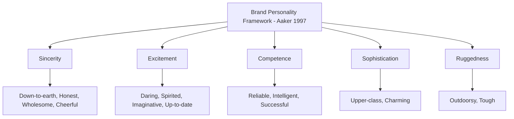

## Brand Personality Frameworks

### Definition and Theoretical Foundation

Brand personality refers to the set of human personality traits that consumers attribute to a brand, allowing brands to be characterized using the same descriptive language used for people (e.g., sincere, exciting, sophisticated, rugged). This concept extends trait theory from individual psychology into branding, based on the premise that consumers relate to brands in ways psychologically similar to how they relate to people, forming brand relationships, preferences, and loyalty partly through perceived personality fit rather than purely functional product evaluation.

The most influential and empirically validated framework in this domain is Jennifer Aaker's **Brand Personality Scale**, developed in 1997 through extensive psychometric research, which identified five core dimensions along which brand personalities can be reliably measured and differentiated.

### Aaker's Five-Dimension Brand Personality Framework

**Sincerity**: Encompasses traits such as being down-to-earth, honest, wholesome, and cheerful. Brands high in sincerity are often perceived as genuine, family-oriented, and trustworthy.

- *Example Brand Association*: Household and family-oriented brands often cultivate strong sincerity dimensions

**Excitement**: Encompasses traits such as being daring, spirited, imaginative, and up-to-date. Brands high in excitement are often perceived as energetic, trendsetting, and youthful.

- *Example Brand Association*: Youth-oriented beverage, entertainment, and technology brands often cultivate strong excitement dimensions

**Competence**: Encompasses traits such as being reliable, intelligent, and successful. Brands high in competence are often perceived as capable, high-performing, and expert in their domain.

- *Example Brand Association*: Financial services, technology, and professional service brands often cultivate strong competence dimensions

**Sophistication**: Encompasses traits such as being upper-class and charming. Brands high in sophistication are often perceived as elegant, prestigious, and refined.

- *Example Brand Association*: Luxury fashion, premium automotive, and high-end lifestyle brands often cultivate strong sophistication dimensions

**Ruggedness**: Encompasses traits such as being outdoorsy and tough. Brands high in ruggedness are often perceived as rugged, masculine-coded (in Aaker's original cultural context), and resilient.

- *Example Brand Association*: Outdoor equipment, off-road vehicle, and workwear brands often cultivate strong ruggedness dimensions

### Key Points

- **Brand Personality Is Consumer-Perceived, Not Solely Brand-Declared**: brand personality is formed through the cumulative effect of all brand touchpoints (advertising tone, product design, spokesperson choice, packaging, customer service interactions, pricing tier, and even the personality traits of typical users associated with the brand), and exists in the consumer's mind as an aggregated perception, not simply as whatever the brand's marketing declares it to be
- **Self-Congruity Theory Connects Brand Personality to Purchase Preference**: a substantial body of consumer research finds that consumers tend to prefer and form stronger attachments to brands whose perceived personality aligns with either their **actual self-concept** (who they currently see themselves as) or their **ideal self-concept** (who they aspire to be), a phenomenon formalized as self-congruity theory
- **Brand Personality Supports Differentiation in Low-Differentiation Categories**: in product categories where functional differences between competing brands are minimal (e.g., many packaged goods, commodity-like services), brand personality often becomes a primary basis for consumer differentiation and preference, since functional/utilitarian comparison offers limited distinguishing power
- **Consistency Across Touchpoints Is Critical to Brand Personality Formation**: because brand personality is formed cumulatively across many interactions, inconsistent tone, positioning, or experience across different touchpoints (advertising, product, service, social media) can dilute or confuse the intended brand personality, weakening its differentiating power
- **Brand Personality Can Evolve, But Slowly and With Risk**: because brand personality is built cumulatively over time through repeated consistent signals, attempts to substantially and rapidly shift an established brand personality carry risk of consumer confusion or perceived inauthenticity, and are generally approached incrementally rather than through abrupt repositioning

### Related and Complementary Frameworks

- **Brand Archetypes (Jungian-Derived Framework)**: A popular applied branding framework, derived loosely from Carl Jung's archetypal psychology, categorizes brands into narrative archetypes (e.g., The Hero, The Caregiver, The Explorer, The Sage, The Rebel, The Jester) as an alternative or complementary lens to Aaker's trait-based dimensions, often used in brand storytelling and creative strategy development [Unverified: while widely used in applied branding and marketing practice, the Jungian archetype framework's application to brand strategy is less rigorously empirically validated through psychometric research compared to Aaker's five-dimension model]
- **Brand-as-Person Metaphor (Foundational Concept)**: The broader conceptual foundation underlying brand personality research, proposing that consumers naturally and spontaneously anthropomorphize brands, attributing human-like characteristics even to inanimate products and corporate entities, a tendency with roots in broader psychological research on anthropomorphism
- **Self-Congruity Theory (Sirgy and others)**: A closely related and extensively researched framework examining the degree of match between a consumer's self-concept (actual, ideal, social, or ideal-social self) and their perception of a brand's image/personality, with higher congruity generally associated with stronger preference, attitude, and loyalty

### Practical Applications in Marketing

- **Brand Positioning and Identity Development**: Brand personality frameworks are widely used in brand strategy development to define a clear, differentiated, and consistent personality profile that guides tone of voice, visual identity, spokesperson selection, and communication style across all brand touchpoints
- **Advertising Creative Direction**: Creative briefs frequently specify target brand personality traits to guide tone, casting, visual style, and messaging approach, ensuring advertising execution reinforces rather than dilutes the intended brand personality
- **Spokesperson and Celebrity Endorsement Selection**: Endorser selection is often guided by matching the celebrity's own perceived personality traits to the brand's target personality dimensions, maximizing perceived fit and minimizing dissonance (related to the broader meaning transfer model in endorsement research)
- **Line Extension and Co-Branding Decisions**: Brand personality consistency is a key consideration in evaluating whether a potential product line extension or co-branding partnership is a good strategic fit, since extensions perceived as personality-incongruent with the parent brand risk diluting brand equity
- **Competitive Differentiation Mapping**: Brands often use personality trait mapping (comparing their own and competitors' brand personality profiles) to identify differentiation opportunities in categories with otherwise similar functional offerings
- **Employer Branding and Internal Culture Alignment**: Brand personality frameworks are increasingly applied beyond consumer-facing marketing to employer branding, helping organizations attract talent whose own values and self-concept align with the organization's cultivated personality

### Example

Two competing athletic apparel brands occupy distinct positions on Aaker's framework despite selling functionally similar products. Brand A cultivates a strong **Excitement** and **Ruggedness** personality profile, using energetic, boundary-pushing advertising, extreme sports sponsorships, and bold visual branding — appealing to consumers whose actual or ideal self-concept aligns with adventurous, daring self-perception. Brand B cultivates a strong **Competence** and **Sincerity** personality profile, emphasizing scientifically-validated performance technology and approachable, down-to-earth messaging — appealing to consumers whose self-concept aligns with reliable, achievement-oriented, unpretentious self-perception. Despite similar core products, each brand attracts a meaningfully different customer base largely driven by perceived personality fit rather than functional product differences alone.

### Measurement Approaches

- **Aaker's Brand Personality Scale**: The original validated 42-item (later variations exist) psychometric instrument measuring the five core brand personality dimensions, developed through rigorous factor-analytic research across multiple product categories, widely used in both academic brand research and applied brand tracking studies
- **Self-Congruity Measurement Scales**: Validated instruments (developed by Sirgy and others) measuring the perceived match between consumer self-concept and brand image, often used alongside brand personality measures to assess the strength of self-congruity-driven preference
- **Brand Tracking Studies**: Many commercial brand health tracking studies incorporate brand personality trait ratings (often adapted or simplified versions of Aaker's dimensions) as recurring KPIs to monitor how consistently and clearly a brand's intended personality is being perceived by its target audience over time

### Critiques and Boundary Conditions

- **Original Framework Development Context**: Aaker's foundational 1997 framework was developed and validated primarily using U.S. consumer samples; subsequent cross-cultural research has found that while the general five-dimension structure shows reasonable replication in some other cultural contexts, some studies have identified culturally-specific additional dimensions or variations in dimension emphasis, suggesting the framework may require adaptation rather than direct, unmodified application in all global markets [Unverified: the precise degree and nature of cross-cultural variation in brand personality dimension structure has been studied in multiple follow-up studies with some divergent findings, and is not fully settled in the literature]
- **Correlational, Not Necessarily Causal, Relationship to Purchase Behavior**: while strong associations between self-congruity/brand personality fit and preference/loyalty are well-documented, isolating brand personality's precise causal contribution to purchase behavior (as distinct from co-occurring functional, price, and availability factors) remains methodologically challenging in real-world market contexts
- **Risk of Superficial or Inconsistent Application**: because brand personality frameworks are intuitive and easy to communicate in strategy documents, there is a practical risk of brands adopting aspirational personality trait labels without the sustained, consistent execution across all touchpoints actually required to build genuine, consumer-perceived personality congruence
- **Ruggedness Dimension's Cultural and Gender Coding**: the ruggedness dimension in particular has been noted in some critical marketing scholarship as reflecting culturally and historically specific (notably gendered) associations from its original development context, warranting thoughtful, context-aware application rather than uncritical universal use

### Related Topics

- Trait theories of personality in consumer research
- Self-congruity theory (actual vs. ideal self)
- Brand archetypes and narrative branding
- Celebrity endorsement and meaning transfer model
- Brand equity measurement frameworks
- Anthropomorphism in brand perception
- Positioning strategy and competitive differentiation
- Employer branding and organizational identity