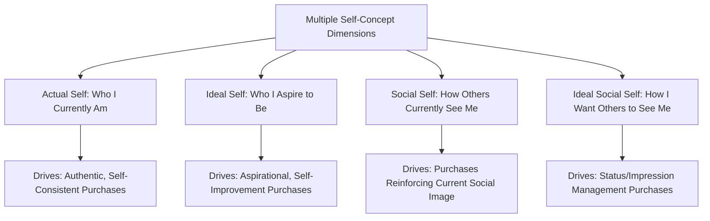

## Actual, Ideal, and Social Self-Concepts

### Definition and Theoretical Foundation

Self-concept theory in consumer research proposes that individuals hold multiple, distinct mental representations of themselves, and that consumption behavior is significantly motivated by the desire to express, maintain, or enhance these self-representations through the products, brands, and experiences one chooses. Rather than a single unified "self," consumer researchers (building on foundational work by Rosenberg, Sirgy, and others) commonly distinguish several self-concept dimensions, each exerting distinct and sometimes competing influence on purchase decisions.

The central premise is that consumers seek **self-congruity** — a match between their self-concept and the perceived image or personality of a brand/product — and that the specific *type* of self-concept most salient in a given purchase context (actual, ideal, social, or ideal-social) determines which products and brand images will be most appealing.

### The Core Self-Concept Dimensions

**Actual Self**: The individual's realistic, current self-perception — who a person genuinely believes themselves to be at present, encompassing their actual traits, abilities, and circumstances.

- *Consumer Relevance*: Purchases driven by actual-self congruity emphasize authenticity and self-consistency — consumers select brands and products that genuinely reflect who they already are, reinforcing a stable, coherent self-identity

**Ideal Self**: The individual's aspirational self-perception — who a person would like to become, encompassing hoped-for traits, achievements, and life circumstances not yet fully realized.

- *Consumer Relevance*: Purchases driven by ideal-self congruity emphasize aspiration and self-improvement — consumers select brands and products that symbolize or facilitate progress toward their aspirational identity, even if that identity does not yet match their current reality

**Social Self**: The individual's perception of how they are currently viewed by others — the self as reflected through the eyes of one's existing social environment.

- *Consumer Relevance*: Purchases driven by social-self congruity emphasize maintaining consistency with others' existing expectations and perceptions, often relevant in contexts where social reputation and consistency are highly valued

**Ideal Social Self**: The individual's aspirational perception of how they would like to be viewed by others — the socially-oriented aspirational identity, distinct from privately-held ideal self-image.

- *Consumer Relevance*: Purchases driven by ideal-social-self congruity emphasize status, impression management, and public image enhancement — consumers select visibly consumed products and brands to project a desired social image to others

### Key Points

- **Different Self-Concept Dimensions Are Salient in Different Purchase Contexts**: the relative influence of actual, ideal, social, and ideal-social self-concepts varies depending on product visibility (publicly consumed versus privately consumed products), purchase occasion (everyday versus special/status occasions), and individual differences in self-monitoring tendency
- **Public vs. Private Consumption Moderates Which Self-Concept Dominates**: research consistently finds that **publicly visible products** (clothing, vehicles, visible accessories) are more strongly influenced by social and ideal-social self-concepts, since these purchases are observed and evaluated by others, while **privately consumed products** (many household or personal-use items not visible to others) are more strongly influenced by actual and ideal self-concepts, since social image management is less relevant to purely private consumption
- **Self-Congruity Predicts Preference, Satisfaction, and Loyalty**: a substantial body of research finds that higher congruity between a consumer's relevant self-concept dimension and a brand's perceived image is associated with stronger brand preference, greater purchase satisfaction, and increased brand loyalty, compared to low-congruity brand relationships
- **Aspirational (Ideal-Self) Marketing Carries Particular Persuasive Power but Also Risk**: marketing that taps into ideal-self aspiration can be highly motivating, but if the perceived gap between actual and ideal self becomes too large or the aspirational image feels unattainable/inauthentic, it can produce disengagement, resentment, or perceived brand inauthenticity rather than purchase motivation [Inference: the precise threshold at which aspirational gap messaging shifts from motivating to alienating varies by individual, category, and cultural context, and is not governed by a single universal rule]
- **Self-Concept Is Multifaceted and Context-Dependent, Not a Single Fixed Construct**: contemporary self-concept theory generally treats these dimensions as dynamically activated depending on context, rather than the individual holding one single, unified self-concept applied uniformly across all situations

### Practical Applications in Marketing

- **Aspirational Advertising (Ideal-Self Appeals)**: Advertising that portrays an idealized version of the consumer's life, achievements, or identity — commonly used in fitness, beauty, luxury, and self-improvement categories — leverages ideal-self congruity to motivate purchase as a step toward the aspirational identity
- **Authenticity-Focused Advertising (Actual-Self Appeals)**: Advertising emphasizing genuine, unpretentious self-expression and "being true to who you are" leverages actual-self congruity, often used by brands positioning against aspirational or status-driven competitors, appealing to consumers who value authentic self-consistency over aspirational image projection
- **Status and Visibility-Driven Positioning (Ideal-Social-Self Appeals)**: Luxury goods, publicly visible status symbols, and prestige positioning strategies leverage ideal-social-self congruity, emphasizing how the product will shape others' perceptions and admiration of the consumer
- **Social Consistency Messaging (Social-Self Appeals)**: Marketing that emphasizes maintaining consistency with an established reputation or role (e.g., professional-image products marketed to reinforce an already-established social identity) leverages social-self congruity
- **Product Visibility Strategy in Positioning**: Marketers calibrate the emphasis on aspirational versus authentic messaging partly based on the product's public visibility — highly visible products often lean more heavily into ideal-social appeals, while private-use products often lean more heavily into actual-self or ideal-self (rather than social) appeals
- **Segment-Specific Self-Concept Targeting**: Different target segments may respond more strongly to different self-concept appeals for the same product category, informing differentiated creative execution across sub-segments (e.g., one campaign emphasizing authentic self-expression, another emphasizing aspirational status, for the same core product)

### Example

A premium watch brand can be marketed through distinctly different self-concept appeals depending on target segment and context. One campaign, targeting established executives, emphasizes how the watch reflects who the wearer already is — understated, successful, discerning — leveraging actual-self and social-self congruity by reinforcing an already-established professional identity and reputation. A different campaign, targeting younger, ambitious professionals earlier in their careers, emphasizes the watch as a symbol of the successful, respected figure the wearer aspires to become — leveraging ideal-self and ideal-social-self congruity by positioning the purchase as a step toward, and visible signal of, future aspirational status, even if the wearer's current actual self and circumstances have not yet fully caught up to that aspiration.

### Measurement Approaches

- **Self-Congruity Scales (Sirgy and others)**: Validated psychometric instruments measuring the perceived similarity between a consumer's self-concept (across actual, ideal, social, and ideal-social dimensions) and their perception of a brand's image, typically using semantic differential or Likert-scale item batteries
- **Direct and Indirect Self-Concept Measures**: Research employs both direct self-report measures (asking consumers to describe their actual and ideal selves) and indirect/projective techniques (inferring self-concept dimensions through brand association tasks or symbolic consumption pattern analysis) [Inference: the relative reliability and validity of indirect/projective self-concept measurement techniques compared to direct self-report varies by specific methodology and has been debated in the consumer research literature]

### Critiques and Boundary Conditions

- **Self-Report Measurement Limitations**: because self-concept dimensions, particularly ideal and ideal-social self, are inherently subjective and can be influenced by social desirability bias, self-report measurement of these constructs carries inherent limitations common to introspective psychological measurement generally
- **Overlapping and Sometimes Difficult-to-Disentangle Dimensions**: in practice, the four self-concept dimensions are not always cleanly separable in consumer decision-making — many purchases are influenced by a blend of multiple self-concept dimensions simultaneously, complicating precise attribution of purchase motivation to a single dimension
- **Cultural Variation in Self-Concept Structure**: some cross-cultural consumer research suggests that the relative salience and even the conceptual structure of individual versus social self-concept dimensions may vary between more individualist and more collectivist cultural contexts, with some collectivist contexts placing comparatively greater emphasis on social/relational self-concept dimensions across a broader range of purchase categories than is typically observed in more individualist contexts [Unverified: the precise nature and consistency of this cross-cultural variation remains an active area of cross-cultural consumer psychology research with some mixed findings across specific studies]
- **Ethical Considerations in Aspirational Gap Marketing**: marketing strategies that deliberately widen the perceived gap between actual and ideal self (to increase motivation to purchase a "solution") raise ethical considerations similar to other insecurity-amplifying marketing techniques, particularly in categories like beauty, body image, and status-signaling products

### Related Topics

- Trait theories of personality in consumer research
- Brand personality frameworks
- Self-congruity theory and brand preference
- Status consumption and conspicuous consumption theory
- Drive theory and need arousal
- Aspirational marketing and self-improvement appeals
- Public versus private consumption behavior
- Materialism and consumer values research