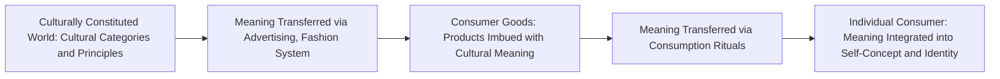

## Symbolic Consumption and Self-Expression

### Definition and Theoretical Foundation

Symbolic consumption theory proposes that consumers purchase and use products not merely for their functional utility, but substantially for their **symbolic meaning** — the ability of products to communicate, construct, and express identity, values, group membership, and social position, both to oneself and to others. This perspective, rooted in the foundational work of Grant McCracken, Russell Belk, Sidney Levy, and others, represents a significant departure from purely functionalist views of consumption, treating goods as a form of communicative language through which meaning is transferred, expressed, and negotiated.

A foundational premise, articulated early by Levy (1959), is that consumers buy products not only for what they *do*, but for what they *mean* — a distinction central to understanding branding, status consumption, and identity-driven purchase decisions across nearly all product categories with any degree of social visibility or personal significance.

### The Meaning Transfer Model (McCracken)

McCracken's influential **Meaning Transfer Model** describes a three-stage process: cultural meaning is first located in the broader culturally constituted world (shared cultural categories, values, and principles), then transferred to consumer goods through the fashion system and advertising, and finally transferred from goods to the individual consumer through consumption rituals (possession rituals, grooming rituals, exchange rituals, divestment rituals).

### Extended Self Theory (Belk)

Russell Belk's foundational **Extended Self** theory proposes that possessions become incorporated into an individual's sense of identity to such a degree that consumers come to regard significant possessions as literal extensions of themselves — losing a meaningful possession can be experienced psychologically similarly to losing part of one's identity, and consumers actively use possessions to define, maintain, and communicate who they are, both to themselves and others.

### Key Points

- **Products Communicate Meaning Beyond Functional Utility**: symbolic consumption theory holds that virtually all products carry some symbolic weight beyond pure functional performance, though the relative proportion of symbolic-to-functional value varies significantly by category, with high-visibility, identity-relevant categories (fashion, vehicles, home décor) typically carrying disproportionately high symbolic weight relative to purely functional necessities
- **Consumption as Identity Construction, Not Just Identity Expression**: contemporary symbolic consumption theory emphasizes that consumers do not merely *express* an already-fixed identity through purchases, but actively *construct and negotiate* their evolving identity through the ongoing process of consumption choices — particularly relevant to understanding identity development during life transitions (e.g., new parenthood, career changes, cultural assimilation)
- **Consumption Rituals Transfer and Reinforce Symbolic Meaning**: McCracken's model identifies specific ritual types through which symbolic meaning is actively integrated into personal identity — **possession rituals** (personalizing/displaying a new purchase), **grooming rituals** (routines transferring meaning from product to self, e.g., beauty routines), **exchange rituals** (gift-giving as meaning transfer between individuals), and **divestment rituals** (deliberately removing prior owners' meaning before reselling or discarding an item)
- **Group Membership and Social Signaling**: symbolic consumption frequently functions to signal membership in, or aspiration toward, particular social groups, subcultures, or lifestyle categories, connecting this theory closely to reference group theory and social identity theory in consumer behavior
- **Symbolic Self-Completion**: related theoretical work (Wicklund and Gollwitzer) proposes that individuals experiencing a perceived deficit in a valued self-identity dimension may compensate through symbolic consumption of identity-relevant products — acquiring symbols associated with a desired identity (e.g., purchasing expert-associated equipment for a skill one has not yet mastered) as a means of psychologically compensating for the incompleteness of that identity

### Practical Applications in Marketing

- **Identity-Based Brand Positioning**: Brands frequently position products explicitly around identity and lifestyle symbolism rather than purely functional attributes, particularly in categories such as fashion, automotive, technology, and beverages, where symbolic differentiation often exceeds functional differentiation between competitors
- **Subculture and Community Marketing**: Brands cultivate association with specific subcultures or lifestyle communities (e.g., motorcycle culture, gaming culture, wellness culture) to imbue products with the symbolic meaning and social identity markers associated with that community, appealing to consumers seeking symbolic affiliation
- **Ritual-Based Marketing and Unboxing Experiences**: Premium product packaging and "unboxing" experiences are often deliberately designed to support possession rituals, enhancing the symbolic meaning-transfer process from product to owner at the moment of first use
- **Gift-Giving and Exchange Ritual Marketing**: Marketing around gift-giving occasions leverages exchange ritual theory, positioning products as vehicles for expressing relationship meaning between giver and recipient, often with premium positioning justified by the symbolic (rather than purely functional) significance of the gift
- **Personalization and Customization Offerings**: Product customization options support consumers' active identity construction process, allowing symbolic meaning to be more precisely tailored to individual identity rather than relying solely on the brand's pre-constructed symbolic associations
- **Heritage and Provenance Storytelling**: Brands emphasizing craftsmanship narratives, cultural heritage, or origin stories leverage the culturally constituted meaning stage of McCracken's model, imbuing products with pre-existing cultural symbolic capital before that meaning is transferred to the individual consumer

### Example

A consumer purchases a specific brand of running shoes not solely for functional cushioning and support, but because the brand carries symbolic association with a broader "dedicated athlete" identity and community (meaning transferred from the culturally constituted world of athletic achievement, reinforced through the brand's advertising and sponsorship of respected athletes). The consumer's subsequent use of the shoes — training consistently, sharing progress on social platforms, displaying the shoes prominently — functions as a possession and grooming ritual, actively integrating the symbolic "dedicated athlete" meaning into their personal identity and self-concept, extending well beyond the shoes' purely functional cushioning benefit.

### Symbolic Consumption in Special Contexts

- **Gift-Giving as Symbolic Exchange**: Gift selection and giving function as a distinct symbolic consumption context, where the chosen gift communicates the giver's perception of the recipient's identity and the nature of their relationship, with gift-giving research constituting a significant sub-domain within symbolic consumption studies
- **Possession and Identity During Life Transitions**: Symbolic consumption plays a particularly significant role during major identity transitions (career changes, relocation, parenthood, cultural assimilation for immigrants), where consumers often use possessions and consumption choices to actively construct and signal a new or evolving identity
- **Digital and Virtual Symbolic Consumption**: Contemporary research has extended symbolic consumption theory to digital contexts, including virtual goods, social media curation, and digital self-presentation, recognizing that identity construction and symbolic consumption increasingly occur in digital as well as physical consumption domains

### Critiques and Boundary Conditions

- **Difficult to Precisely Measure Symbolic Versus Functional Value Proportion**: while the theoretical distinction between symbolic and functional product value is conceptually well-established, precisely quantifying the relative weight of each for a specific purchase decision is methodologically challenging, since consumers themselves may not always be consciously aware of or able to accurately report the symbolic motivations underlying their choices
- **Risk of Overgeneralization Across All Product Categories**: while symbolic consumption theory applies broadly, the relative significance of symbolic value varies substantially by category, and applying identity-focused positioning strategies uniformly across categories with genuinely low symbolic relevance (e.g., commodity utilities) may be less effective than in high-symbolic-relevance categories
- **Cultural Specificity of Symbolic Meaning**: because symbolic meaning is culturally constituted (per McCracken's model), the specific symbolic associations of any given product, color, or brand element can vary substantially across cultural contexts, requiring careful cultural adaptation rather than direct, unmodified symbolic positioning transfer across global markets
- **Ethical Considerations in Identity-Based Marketing**: because symbolic consumption theory suggests consumers may use purchases to compensate for perceived identity deficits (per symbolic self-completion theory), marketing that deliberately targets or amplifies identity insecurity to drive compensatory purchasing raises similar ethical considerations to other insecurity-based persuasion techniques

### Related Topics

- Actual, ideal, and social self-concepts
- Brand personality frameworks
- Status consumption and conspicuous consumption theory
- Reference group theory and social identity theory
- Materialism and consumer values research
- Gift-giving behavior and exchange ritual theory
- Extended self theory and possession attachment
- Subculture and community-based brand marketing