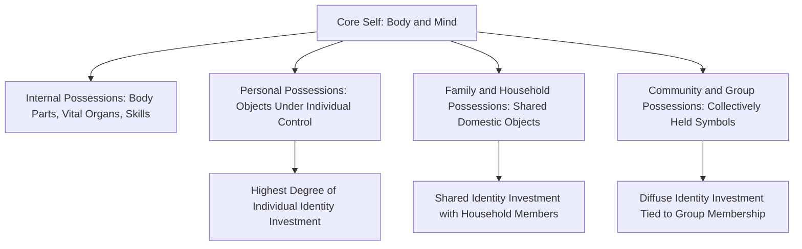

## The Extended Self and Possession Attachment

### Definition and Theoretical Foundation

The Extended Self theory, formalized by Russell Belk in his seminal 1988 work, proposes that possessions become psychologically incorporated into an individual's sense of identity to such a degree that people come to regard significant belongings as literal extensions of who they are, rather than merely external objects they own. Belk's foundational premise, building on earlier work by William James, holds that a person's sense of self is constituted not only by their body and mind, but substantially by their possessions, relationships, and experiences — such that the boundary between "self" and "not-self" is meaningfully mediated by ownership and attachment to material and, increasingly, digital objects.

This theory provides a foundational framework for understanding **possession attachment** — the emotional bond consumers form with specific belongings — and explains phenomena ranging from the disproportionate psychological distress of losing a meaningful possession to the strategic role of products in identity construction, memory preservation, and life narrative continuity.

### Concentric Layers of the Extended Self

Belk's original framework proposed concentric levels of the extended self, ranging from the most intimately identity-linked (body, internal organs, vital body parts) outward through personal possessions, to family/household possessions, to broader community and group-level possessions and symbols — with psychological attachment and identity investment generally, though not always, decreasing as one moves outward through these layers.

### Key Functions of Possessions in Extended Self Formation

- **Identity Construction and Maintenance**: Possessions serve as tangible markers and reminders of who an individual is, has been, and aspires to become, providing psychological continuity and coherence to self-identity over time
- **Memory and Narrative Preservation**: Many meaningful possessions function as physical anchors for personal memory and life narrative, preserving connections to past experiences, relationships, and life stages that might otherwise fade from active memory
- **Mastery and Competence Signaling**: Possessions acquired through skill, effort, or achievement (e.g., tools of a craft, trophies, professional equipment) can function as extensions of self-efficacy and competence, reinforcing a consumer's sense of mastery in a given domain
- **Control Over the Physical/Material Environment**: The ability to control, modify, and personalize possessions contributes to a sense of agency and self-efficacy that becomes psychologically linked to identity
- **Body Extension**: Belk's original framework specifically identified certain possessions (e.g., clothing, vehicles, and increasingly, wearable and implanted technology) as extensions of the physical body itself, blurring the boundary between self and object particularly closely for these categories

### Key Points

- **Loss of Significant Possessions Can Produce Grief-Like Psychological Responses**: because meaningful possessions are psychologically incorporated into self-identity, their loss (through theft, disaster, or even ordinary disposal of deeply meaningful items) can produce distress responses that parallel, in structure if not always intensity, the grief associated with losing a relationship or aspect of one's identity — a finding with significant implications for understanding consumer responses to product loss, damage, or forced disposal
- **Possession Attachment Is Not Uniform Across All Owned Objects**: consumers hold vastly different levels of psychological attachment across their possessions — highly fungible, purely functional items typically carry minimal extended-self investment, while irreplaceable, identity-relevant, or memory-linked items (heirlooms, gifts from significant relationships, achievement-linked objects) carry substantially higher attachment
- **Sacred versus Profane Consumption (related concept)**: Belk, along with Wallendorf and Holbrook, extended this theory to distinguish **sacred consumption** (possessions imbued with special, often ritualistic or transcendent meaning, set apart from ordinary use) from **profane consumption** (ordinary, purely functional, interchangeable goods), noting that sacred objects are particularly resistant to substitution or casual disposal precisely because of their deep extended-self integration
- **Digital Possessions Extend the Framework into Virtual Domains**: contemporary extensions of extended self theory address digital possessions — social media profiles, digital photo archives, virtual goods, gaming achievements, and online identities — as an increasingly significant and theoretically distinct category of extended self, given their unique properties (infinite reproducibility, persistent accessibility, lack of physical decay) compared to traditional material possessions [Inference: while digital extended self is an active and growing area of consumer research, the precise psychological equivalence between digital and physical possession attachment mechanisms is still being empirically clarified and may not be fully identical across all contexts]
- **Divestment Rituals Manage the Psychological Transition of Ownership**: because possessions carry embedded personal meaning, consumers often engage in deliberate divestment rituals (cleaning, personalizing removal, ceremonial disposal, or careful gifting) when parting with meaningful possessions, functioning to psychologically "erase" or transfer the prior owner's identity investment before an item passes to a new owner — directly relevant to resale, secondhand, and circular economy marketing contexts

### Practical Applications in Marketing

- **Personalization and Customization Strategies**: Enabling consumers to personalize or customize products (monogramming, custom configuration, personal photo integration) accelerates and deepens extended-self incorporation, increasing psychological attachment and, correspondingly, brand loyalty and resistance to switching
- **Heirloom and Legacy Positioning**: Premium and durable goods brands sometimes position products explicitly as future heirlooms or legacy items intended for multi-generational ownership, leveraging the deep, sacred-consumption-adjacent attachment potential of items designed for long-term identity and memory integration
- **Memory-Linked Marketing (Photography, Keepsakes, Milestone Products)**: Products explicitly designed to preserve and commemorate significant life moments (photography services, memory books, milestone-linked purchases) directly leverage the memory-preservation function of the extended self
- **Loss Aversion and Ownership-Based Marketing Tactics**: Free trial periods and "try before you buy" strategies can leverage rapid extended-self incorporation — once a consumer begins using and psychologically incorporating a product into daily routines, the prospect of returning it can trigger a loss-aversion response structurally related to extended self attachment, increasing conversion likelihood at the end of a trial period
- **Resale and Secondhand Market Facilitation**: Understanding divestment rituals informs secondhand marketplace design (e.g., features allowing sellers to share an item's personal history or "story" before resale), which can both ease the psychological transition for sellers and add perceived provenance value for buyers
- **Sacred Brand Positioning**: Brands with strong heritage, craftsmanship narratives, or ritual-linked usage occasions can cultivate positioning closer to the "sacred" end of the sacred-profane consumption spectrum, differentiating from more purely functional, easily substitutable competitors

### Example

A consumer's grandfather's watch, though functionally simple and monetarily modest compared to modern alternatives, holds significant extended-self investment due to its connection to family memory, inherited identity, and personal history (illustrating sacred consumption and the memory-preservation function of possessions). In contrast, the same consumer's everyday disposable pen carries essentially no extended-self investment, being fully interchangeable and psychologically unremarkable (illustrating profane consumption). A watch brand seeking to build deep, durable customer attachment might therefore position new products around heirloom potential, craftsmanship, and multi-generational meaning — explicitly inviting the kind of sacred, identity-linked attachment historically associated with genuinely inherited objects — rather than competing purely on functional specifications.

### Extended Self in Digital and Contemporary Contexts

- **Social Media Profiles as Extended Self Expression**: Curated social media presence functions as a significant, actively managed component of contemporary extended self, with consumers investing substantial identity-construction effort in digital self-presentation
- **Digital Photo and Memory Archives**: Cloud-stored photo libraries and digital memory archives function similarly to traditional physical memory-preserving possessions, and their loss (e.g., through data loss or account compromise) can produce psychologically significant distress paralleling physical possession loss
- **Virtual and In-Game Possessions**: Gaming achievements, virtual items, and digital collectibles increasingly function as extended-self objects for many consumers, particularly within gaming and virtual community contexts, representing a growing area of applied consumer psychology research [Speculation: the long-term psychological equivalence and relative durability of attachment to purely virtual/digital possessions compared to physical possessions, particularly across different consumer demographics and generational cohorts, remains an evolving and not yet fully settled area of research]

### Critiques and Boundary Conditions

- **Individual Variation in Materialism and Attachment Tendency**: the degree to which any given individual incorporates possessions into their extended self varies substantially based on individual differences in materialism, attachment style, and cultural values, meaning extended self theory describes a general tendency rather than a uniform psychological process across all consumers
- **Cultural Variation in Self-Possession Boundaries**: some cross-cultural research suggests that the boundary between self and possessions, and the relative emphasis on individual versus communal/shared possession, may vary between more individualist and more collectivist cultural contexts, though the precise nature of this variation remains an area of ongoing cross-cultural consumer research [Unverified: specific cross-cultural comparative findings on extended self boundary variation are drawn from a developing rather than fully conclusive body of research]
- **Risk of Encouraging Unhealthy Materialism**: because extended self theory highlights the genuine psychological significance of possessions, marketing applications that deliberately exploit this attachment mechanism to encourage excessive, financially unsustainable, or psychologically unhealthy acquisitive behavior raise ethical considerations connected to broader concerns about consumerism and materialism's relationship to wellbeing
- **Difficult to Precisely Measure Attachment Intensity**: while qualitative and some quantitative research methods exist for assessing possession attachment, precisely and reliably measuring the depth of extended-self incorporation for a given individual-possession relationship remains methodologically challenging compared to more straightforward behavioral or attitudinal consumer measures

### Related Topics

- Symbolic consumption and self-expression
- Actual, ideal, and social self-concepts
- Sacred versus profane consumption
- Materialism and consumer values research
- Loss aversion and prospect theory
- Nostalgia marketing and memory-based positioning
- Secondhand and circular economy consumer behavior
- Digital identity and social media self-presentation