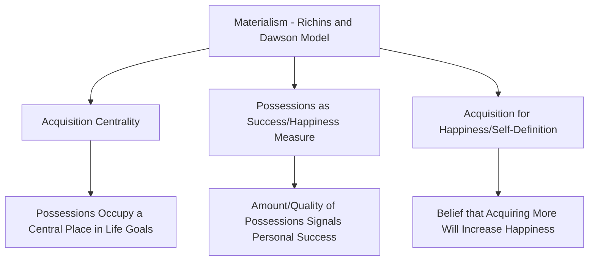

## Materialism and Its Psychological Correlates

### Definition and Theoretical Foundation

Materialism, as studied in consumer psychology, refers to the degree of importance an individual places on the acquisition and possession of material goods as central to their life goals, identity, and perceived happiness. The most influential and widely used conceptualization comes from Marsha Richins and Scott Dawson (1992), who define materialism as a value orientation reflecting the extent to which possessions and their acquisition are placed at the center of a person's life and viewed as sources of satisfaction and dissatisfaction. Materialism is generally treated in consumer research as a relatively stable personal value or trait-like disposition, distinct from the situational tendency to make any specific purchase.

### Richins and Dawson's Three-Dimensional Materialism Model

**Acquisition Centrality**: The degree to which acquiring possessions occupies a central, high-priority place in an individual's overall life goals and daily activities, relative to other pursuits (relationships, experiences, personal growth).

**Possessions as a Measure of Success**: The degree to which an individual judges their own and others' success and worth based on the quantity, quality, and visibility of possessions owned, connecting materialism closely to social comparison processes.

**Acquisition as a Pursuit of Happiness**: The belief that acquiring more or better possessions will produce increased life satisfaction and happiness — the specific dimension most directly tested and generally found wanting in empirical wellbeing research.

### Key Psychological Correlates of Materialism

**Negative Correlates (Well-Documented in Research)**:

- **Lower Subjective Wellbeing and Life Satisfaction**: a substantial and consistent body of research finds that higher materialism scores correlate with lower overall life satisfaction, reduced psychological wellbeing, and lower positive affect, one of the most robust and frequently replicated findings in materialism research
- **Higher Levels of Anxiety and Depression**: materialism has been associated in multiple studies with elevated anxiety and depressive symptoms, though the precise causal direction (whether materialism causes distress, distress increases materialistic coping, or both influence each other reciprocally) remains debated [Inference: while the correlation is well-replicated, definitive causal directionality has not been conclusively established across all study designs, and bidirectional or reciprocal causation is considered plausible by many researchers in the field]
- **Reduced Relationship Satisfaction**: several studies have found associations between higher materialism and lower relationship quality/satisfaction, potentially related to materialism's association with more self-focused, comparison-driven psychological orientations
- **Compulsive Buying Tendency**: materialism shows a well-documented positive association with compulsive buying behavior, though materialism and compulsive buying are considered related but conceptually distinct constructs, with compulsive buying representing a more clinically significant behavioral pattern
- **Lower Self-Esteem in Some Populations, or Self-Esteem as a Contributing Antecedent**: some research frames low self-esteem or insecurity as a potential psychological antecedent driving materialistic value orientation (per symbolic self-completion and compensatory consumption theories), rather than purely as a consequence of materialism

**Contextual and Debated Correlates**:

- **Social Comparison Orientation**: materialism is closely associated with greater tendency toward upward social comparison (comparing oneself to others perceived as having more), which several researchers propose as a key mechanism linking materialism to reduced wellbeing
- **Insecurity and Compensatory Consumption**: a substantial theoretical and empirical literature connects materialism to underlying psychological insecurity, proposing that materialistic acquisition sometimes functions as a compensatory mechanism for unmet psychological needs (belonging, self-esteem, control) — this compensatory consumption framework is related to, but distinct from, Belk's extended self and symbolic self-completion theories

### Key Points

- **Materialism Is Generally Treated as a Value Orientation, Not a Fixed Personality Trait**: unlike broad Big Five personality traits, materialism is more commonly conceptualized as a learned value orientation, shaped substantially by socialization, media exposure, cultural context, and life experience, making it potentially more malleable across the lifespan than core personality traits
- **The Materialism-Wellbeing Negative Relationship Is One of the Most Replicated Findings in Consumer Psychology**: the general finding that higher materialism correlates with lower wellbeing has been replicated across numerous studies, diverse populations, and multiple measurement approaches, making it one of the more robust findings in the consumer psychology and wellbeing literature, though effect sizes vary across studies
- **Materialism May Function as Both Cause and Consequence of Psychological Distress**: rather than a simple one-directional causal relationship, many contemporary researchers propose a reciprocal or cyclical relationship, where underlying insecurity or distress increases materialistic value orientation, materialistic pursuit fails to deliver expected wellbeing gains (per hedonic adaptation), and this failure further reinforces distress, potentially perpetuating a self-reinforcing cycle
- **Cultural and Economic Context Shapes Materialism Levels and Its Psychological Impact**: cross-national research has examined how cultural values (individualism/collectivism) and economic conditions (income inequality, consumer culture prevalence) correlate with population-level materialism and moderate its relationship to wellbeing [Inference: while cross-cultural materialism research is an active field, precise comparative findings on how cultural context moderates the materialism-wellbeing relationship vary across specific studies and are not fully unified into a single consensus model]
- **Materialism Is Distinct From, But Related to, Simple Consumer Spending or Enjoyment of Products**: materialism specifically concerns the *centrality* of possessions to identity and happiness beliefs, not merely the amount spent on or enjoyment derived from products — a consumer can spend significant resources on products they genuinely enjoy without necessarily scoring high on materialism if possessions are not central to their self-worth or happiness beliefs

### Practical and Ethical Considerations in Marketing

- **Marketing's Role in Cultivating or Reinforcing Materialistic Values**: a substantial body of critical marketing and consumer research has examined the degree to which advertising, particularly advertising emphasizing possessions as markers of success or happiness, may contribute to cultivating or reinforcing materialistic value orientations in audiences, particularly among children and adolescents who are still forming stable value systems [Unverified: while there is substantial theoretical and some empirical support for advertising's role in materialism cultivation, particularly regarding child-directed advertising, the precise causal magnitude of this effect relative to other socialization influences, such as family and peer environment, remains debated in the literature]
- **Regulatory and Industry Self-Regulation Responses**: concerns about advertising's potential contribution to childhood materialism have informed various regulatory approaches and industry self-regulation efforts in different jurisdictions regarding advertising directed at children, reflecting the ethical weight given to this research area in policy contexts
- **Compulsive Buying Screening and Responsible Marketing**: given materialism's association with compulsive buying tendency, some responsible marketing and consumer protection frameworks emphasize caution regarding aggressive acquisition-focused marketing tactics, particularly toward populations that may show elevated vulnerability to compulsive buying patterns
- **Experiential Marketing as a Contrasting Strategy**: partly informed by research distinguishing material purchases from experiential purchases (with experiential purchases generally showing stronger and more durable wellbeing benefits in happiness research), some brands and marketing strategies have shifted emphasis toward experience-based positioning, either as a genuine values-based differentiation or as a response to growing "anti-materialism" or minimalism-oriented consumer sentiment in some market segments

### Example

A researcher administering the Richins and Dawson Materialism Scale to two consumers finds markedly different profiles. Consumer A scores high on all three materialism dimensions: they organize significant life goals around acquiring visible, high-status possessions, judge personal and others' success substantially by possession quality, and believe that acquiring more would meaningfully increase their happiness. Consumer B, who spends a comparable amount on discretionary purchases, scores low on materialism: their purchases are driven by functional need or genuine enjoyment without possessions occupying a central role in their identity or happiness beliefs, and they do not use possession comparison as a primary marker of personal or others' success — illustrating that materialism describes a psychological value orientation distinct from spending level or product enjoyment alone.

### Measurement Approaches

- **Richins and Dawson Material Values Scale (MVS)**: The most widely used and validated instrument for measuring materialism, comprising items assessing the three core dimensions (acquisition centrality, success measurement, and happiness pursuit), used extensively in both academic consumer research and cross-cultural comparative studies
- **Belk's Materialism Scale (Earlier Alternative)**: An earlier multidimensional materialism measurement approach (assessing possessiveness, non-generosity, and envy), less widely used in contemporary research compared to the Richins and Dawson scale but historically significant in the development of materialism measurement in consumer psychology

### Critiques and Boundary Conditions

- **Causal Direction Between Materialism and Wellbeing Remains Debated**: while the correlational relationship between materialism and reduced wellbeing is well-replicated, definitively establishing causal direction requires longitudinal or experimental research designs, and the field increasingly favors reciprocal/cyclical models over simple one-directional causal claims
- **Cross-Cultural Measurement Equivalence Is Not Fully Settled**: some cross-cultural researchers have raised questions about whether standard materialism scales, developed primarily in Western contexts, carry fully equivalent meaning and measurement validity across substantially different cultural and economic contexts [Unverified: cross-cultural measurement equivalence for materialism scales is an ongoing methodological concern in the cross-cultural consumer psychology literature without full resolution across all studied populations]
- **Distinguishing Healthy Consumption from Clinically Significant Materialism/Compulsive Buying**: most individuals exhibit some degree of materialistic value orientation without this rising to clinically significant or functionally impairing levels, and researchers caution against conflating normal-range materialism with the more severe and clinically distinct pattern of compulsive buying disorder
- **Individual Differences in Susceptibility to Materialism's Negative Correlates**: not all highly materialistic individuals show equivalent wellbeing deficits, suggesting moderating factors (financial resources, social support, underlying personality factors) may buffer or exacerbate materialism's typical negative psychological correlates in ways not yet fully mapped in the research literature

### Related Topics

- Symbolic consumption and self-expression
- The extended self and possession attachment
- Status consumption and conspicuous consumption theory
- Compulsive buying disorder and consumer psychopathology
- Hedonic versus utilitarian motivation
- Experiential versus material purchases and happiness research
- Advertising effects on children and adolescent development
- Actual, ideal, and social self-concepts