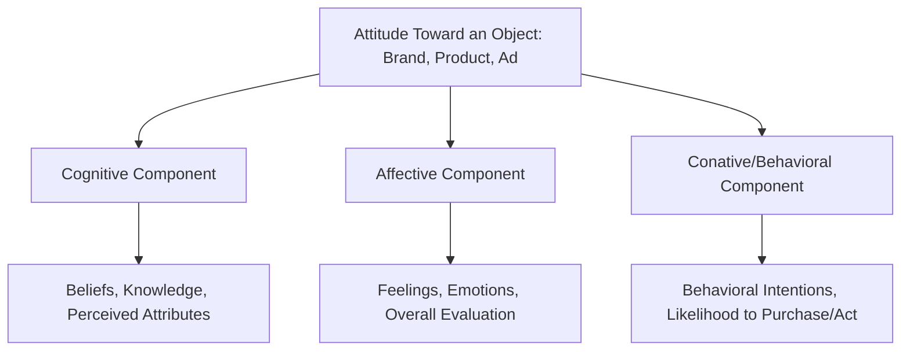

## The Tricomponent Attitude Model

### Definition and Theoretical Foundation

The tricomponent attitude model, a foundational framework in social and consumer psychology, proposes that attitudes toward an object — a brand, product, advertisement, or purchase behavior — consist of three interrelated components: **cognitive**, **affective**, and **conative (behavioral)**. This model, with roots extending back to classic attitude theory in social psychology and extensively applied and refined within consumer behavior research, provides a structural framework for understanding how consumers form, hold, and act upon evaluations of marketing stimuli, and remains one of the most widely taught foundational models in consumer attitude research.

### The Three Components

**Cognitive Component**: Encompasses the knowledge, beliefs, and perceptions a consumer holds about an attitude object — the factual and evaluative beliefs formed through direct experience, information gathering, and related activities (e.g., "This brand's products are durable" or "This brand is more expensive than competitors").

**Affective Component**: Encompasses the consumer's overall feelings, emotions, and evaluative judgment toward the attitude object — the "liking" or "disliking" dimension, which can range from mild preference to strong emotional attachment or aversion, and is not always a direct or logical derivation from cognitive beliefs alone.

**Conative (Behavioral) Component**: Encompasses the consumer's likelihood or intention to act in a particular way toward the attitude object — behavioral intentions such as intent to purchase, intent to recommend, or intent to continue/discontinue use, representing the action-oriented outcome of the attitude structure.

### Key Points

- **The Three Components Are Interrelated but Theoretically Distinct**: while cognitive, affective, and conative components typically show meaningful correlation with one another (consistent beliefs, feelings, and intentions often co-occur), they are conceptually and empirically distinguishable, and inconsistencies between them (e.g., positive beliefs but weak purchase intention) are both theoretically possible and practically significant for marketers to understand
- **Sequence of Component Formation Can Vary by Situation ("Hierarchy of Effects")**: the classical, most commonly taught sequence assumes a "standard learning hierarchy" — cognitive formation precedes affective response, which precedes conative/behavioral action (think → feel → do) — but consumer research recognizes at least two alternative hierarchies depending on involvement level and purchase context:
  - **Standard Learning Hierarchy** (think→feel→do): typical of high-involvement decisions with meaningful functional differentiation, where consumers form beliefs first, then develop feelings, then act
  - **Low-Involvement Hierarchy** (think→do→feel): proposed by Krugman, typical of low-involvement, low-differentiation purchases, where minimal cognitive processing leads directly to trial/purchase behavior, with affective evaluation forming or solidifying only after usage experience
  - **Experiential/Hedonic Hierarchy** (feel→do→think): typical of purchases driven primarily by emotional or sensory appeal (impulse purchases, hedonic products), where affective response precedes and drives behavior, with cognitive rationalization sometimes following after the purchase decision
- **Attitude Consistency Is a Theoretical Tendency, Not a Guarantee**: consumer psychology generally assumes a tendency toward consistency across the three components (per balance theory and cognitive consistency theories more broadly), but real-world attitudes frequently display some degree of inconsistency, particularly under low involvement or when situational constraints (price, availability) override otherwise favorable cognitive/affective evaluations
- **Marketing Interventions Can Target Any of the Three Components Directly**: because the components are distinguishable, marketing strategies can be designed to specifically strengthen cognitive beliefs (informational/comparative advertising), affective response (emotional/experiential advertising), or conative intention (direct calls-to-action, promotional incentives), depending on which component represents the primary barrier to a desired outcome
- **The Model Underlies Standard Attitude Measurement Approaches**: many market research attitude surveys are explicitly structured to separately measure each of the three components (e.g., asking about product beliefs, then overall liking, then purchase intent), reflecting the tricomponent model's continued influence on applied consumer research methodology

### Practical Applications in Marketing

- **Diagnostic Attitude Research**: Marketers use tricomponent-structured research to diagnose exactly where in the attitude structure a problem exists — for example, a brand might have strong cognitive beliefs and positive affect but weak conative intention (perhaps due to price barriers or availability issues), informing a very different intervention than if cognitive beliefs themselves were the weak link
- **Hierarchy-Matched Advertising Strategy**: Advertising execution is often designed to match the presumed hierarchy of effects for a given product category — comparative, information-dense advertising for high-involvement standard-hierarchy categories; simple, repetition-based, trial-encouraging advertising for low-involvement categories; and emotionally evocative, sensory-rich advertising for experiential/hedonic categories
- **Sequential Campaign Design**: Multi-stage marketing campaigns sometimes deliberately sequence messaging to build attitude components in order (e.g., an initial informational phase building cognitive beliefs, followed by an emotionally engaging phase building affective connection, followed by a direct-response phase converting to conative purchase behavior)
- **Trial-Generation Strategies for Low-Involvement Categories**: for categories following the low-involvement hierarchy (think→do→feel), marketers often prioritize sampling, trial offers, and low-barrier first-purchase incentives, recognizing that affective attachment may only solidify after direct usage experience rather than requiring extensive pre-purchase persuasion
- **Post-Purchase Reinforcement**: because affective and cognitive components can continue to develop or solidify after initial behavioral trial (particularly in low-involvement and experiential hierarchies), post-purchase communication (follow-up content, usage tips, community engagement) can play a meaningful role in reinforcing positive attitude formation after the conative/behavioral stage has already occurred

### Example

A consumer considering a home insurance policy (typically high-involvement, standard learning hierarchy) first researches and forms beliefs about coverage options, claims processes, and provider reputation (cognitive stage), develops a sense of trust and comfort with a specific provider based on these beliefs (affective stage), and then purchases a policy from that provider (conative/behavioral stage). In contrast, a consumer trying a new snack brand while grocery shopping (typically low-involvement) may simply pick it up on impulse due to appealing packaging with minimal prior belief formation (behavioral stage occurring early, following the think→do→feel or feel→do sequence), only forming a more developed cognitive and affective evaluation of the brand after actually tasting the product at home.

### Measurement Approaches

- **Multi-Attribute Attitude Models (Fishbein Model, related extension)**: The tricomponent model's cognitive component is often measured in more granular detail using multi-attribute models, which assess beliefs about specific product attributes weighted by the importance of each attribute to the consumer, providing a more decomposed view of the cognitive component specifically
- **Standard Survey-Based Component Measurement**: Applied market research commonly measures the three components through distinct question batteries — belief/perception statements for the cognitive component, liking/preference ratings for the affective component, and purchase intent/likelihood scales for the conative component — often analyzed together to assess overall attitude structure and consistency

### Critiques and Boundary Conditions

- **Distinctness of Components Is Sometimes Contested**: some researchers have questioned whether the three components are as cleanly separable as the classical model suggests, noting that cognitive beliefs and affective responses can be difficult to disentangle in practice, since evaluative judgments often carry inherent affective loading even when framed as seemingly neutral cognitive beliefs
- **Behavioral Intention Does Not Guarantee Actual Behavior**: a well-documented limitation across attitude-behavior research generally (not unique to the tricomponent model specifically) is that conative/intentional measures do not perfectly predict actual subsequent behavior, since situational constraints, competing priorities, and unforeseen circumstances can intervene between stated intention and realized action — a gap extensively studied in the broader attitude-behavior consistency literature
- **Hierarchy of Effects Sequencing Remains an Area of Debate**: while the three alternative hierarchies (standard, low-involvement, experiential) are widely taught and applied, precisely predicting which hierarchy applies to a specific product, category, or individual consumer in a given purchase context is not always straightforward, and real-world consumer attitude formation may not always cleanly follow any single, fixed sequential pattern [Inference: while the three-hierarchy framework is a well-established teaching and strategic heuristic in consumer behavior, the precise boundary conditions determining which hierarchy applies in ambiguous or mixed-involvement categories are not always clearly specified in the underlying research]
- **Simplification of a More Complex Underlying Cognitive-Affective System**: contemporary cognitive and affective psychology research suggests the relationship between belief, feeling, and behavior is often more dynamically interactive and less cleanly linear-sequential than the classical tricomponent model's structure implies, representing a useful simplification for applied marketing purposes rather than a complete account of the underlying psychological process

### Related Topics

- Multi-attribute attitude models (Fishbein Model)
- Theory of Reasoned Action and Theory of Planned Behavior
- Elaboration Likelihood Model (central vs. peripheral persuasion routes)
- Involvement theory: high and low involvement
- Attitude-behavior consistency and the intention-behavior gap
- Cognitive dissonance theory
- Hedonic versus utilitarian motivation
- Low-involvement hierarchy of effects (Krugman)