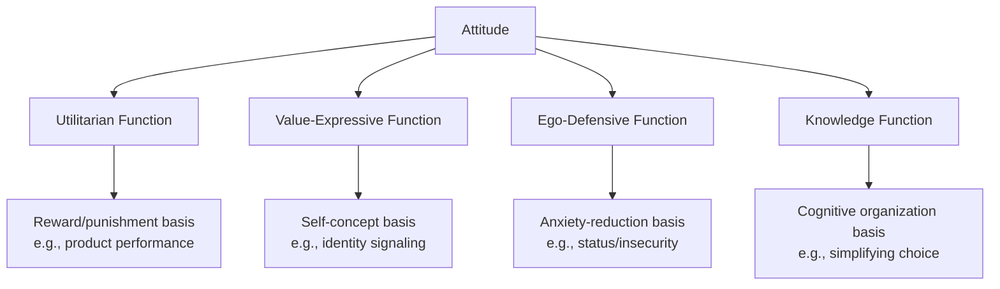

## Functional Theory of Attitudes

### Overview

The functional theory of attitudes, most prominently articulated by Daniel Katz (1960), proposes that attitudes exist because they serve specific psychological functions for the individual. Rather than treating attitudes as static evaluations, this theory asks: *what purpose does this attitude serve for the person holding it?* Two attitudes with identical surface content (e.g., "I love this brand") can be held for entirely different underlying reasons, and understanding that underlying reason is what allows for effective attitude change or reinforcement.

The core premise: attitudes are motivational, not merely evaluative. They help individuals adapt to their environment, and marketing messages succeed or fail based on whether they align with the specific function an attitude serves.

### The Four Functions (Katz's Framework)

**1. Utilitarian (Instrumental/Adjustive) Function**

Attitudes formed based on rewards and punishments — the classic behaviorist link between an object and pleasure/pain avoidance.

- **Key Points**
  - Attitude reflects practical costs and benefits of the object
  - Rooted in operant conditioning principles
  - Most relevant for functional/utilitarian products (detergents, batteries, insurance)
- **Example**: A consumer likes a laundry detergent because it "gets stains out effectively and is affordable." The attitude is a rational, reward-based evaluation.
- Marketing approach: Emphasize product benefits, performance claims, value-for-money, and comparative advantages.

**2. Value-Expressive (Self-Expressive) Function**

Attitudes that allow the individual to express their central values, self-concept, or identity to themselves and others.

- **Key Points**
  - Linked closely to self-concept and ideal self
  - Purchase becomes a statement of "who I am" or "who I want to be"
  - Central to identity-driven categories: fashion, automobiles, lifestyle brands
- **Example**: A consumer buys Patagonia not just for the jacket's function, but because it expresses environmental values and an outdoorsy, ethical self-image.
- Marketing approach: Brand personality, aspirational imagery, values-based storytelling, association with reference groups.

**3. Ego-Defensive Function**

Attitudes that protect the individual from internal conflicts, anxieties, or threats to self-esteem by externalizing or rationalizing insecurities.

- **Key Points**
  - Operates as a psychological defense mechanism (cf. Freudian influence on Katz's original theory)
  - Often unconscious; consumer may not recognize the true motivation
  - Common in categories tied to insecurity: grooming, weight loss, anti-aging, status products
- **Example**: A person buys an expensive luxury watch partly to defend against feelings of professional inadequacy — the purchase bolsters self-image against an underlying anxiety.
- Marketing approach: Reassurance-based messaging, confidence framing, avoid direct exploitation of insecurity (ethical caution warranted), fear-reduction appeals.

**4. Knowledge (Understanding) Function**

Attitudes that provide structure, meaning, and consistency to help the individual understand and organize their world.

- **Key Points**
  - Satisfies the need for a coherent, predictable frame of reference
  - Reduces ambiguity and cognitive load
  - Relevant when consumers face complex or unfamiliar decisions
- **Example**: A consumer forms a strong preference for a particular car brand ("German cars are reliable") which then simplifies future purchase decisions without needing to re-evaluate every option.
- Marketing approach: Educational content, clear comparative frameworks, expert endorsements, simplification of complex choices.

### Diagram: The Four Functions Relative to Motivational Basis

### Theoretical Context and Relation to Other Models

- **Katz (1960)** developed this within a broader interest in attitude change as a function of underlying motive — the central claim being that persuasion is most effective when the message matches the function the attitude serves for that individual (the "matching hypothesis").
- Later work, notably by **Shavitt (1989)**, refined this by distinguishing **social-adjustive** and **value-expressive** functions specifically for image-based products, and by demonstrating that product category itself often predicts which function dominates (e.g., functional products like aspirin skew utilitarian; social products like greeting cards skew value-expressive).
- Contrast with the **Elaboration Likelihood Model (ELM)**: ELM focuses on *how* attitudes are processed (central vs. peripheral route), while functional theory focuses on *why* an attitude is held in the first place. The two are complementary — a value-expressive attitude might still be formed via peripheral cues (e.g., celebrity association).
- Contrast with the **Tripartite (ABC) Model**: The ABC model describes attitude *structure* (affect, behavior, cognition), while functional theory describes attitude *purpose*. [Inference] These models are often used together in applied research to both diagnose which function dominates and to identify which component (affective/behavioral/cognitive) carries most weight.

### The Matching Hypothesis in Practice

The central practical implication: **persuasion effectiveness increases when message content matches the psychological function underlying the target attitude.**

- If a consumer's attitude toward sunscreen is utilitarian (protects skin from UV damage), a message emphasizing SPF efficacy will outperform an identity-based appeal.
- If a consumer's attitude toward a fashion brand is value-expressive, functional/technical messaging ("100% cotton, machine washable") will underperform relative to identity-based imagery.
- [Unverified] Mismatched appeals do not necessarily fail outright but tend to show measurably lower persuasion effects in controlled experiments; the magnitude of this mismatch penalty is study- and context-dependent.

### Diagnostic Approach: Identifying the Dominant Function

Since the same product can serve different functions for different segments, marketers typically use one or more of the following to diagnose function:

- **Means-end / laddering interviews**: probing "why is that important to you?" repeatedly until reaching a terminal value
- **Projective techniques**: indirect methods (e.g., word association, sentence completion) to surface ego-defensive or unconscious motivations that direct questioning would not reveal
- **Segmentation via psychographics**: clustering consumers by underlying motivation rather than demographics alone
- **A/B testing of matched vs. mismatched appeals**: empirically inferring the dominant function from response differentials

### Applied Example: Multi-Function Positioning for a Single Product

Consider a fitness tracker marketed across four different messages, each targeting one function:

| Function | Sample Message | Underlying Consumer Motivation |
| --- | --- | --- |
| Utilitarian | "Track heart rate with 99% clinical accuracy" | Practical health monitoring |
| Value-Expressive | "For those who define their own finish line" | Self-identity as an athlete |
| Ego-Defensive | "Stay ahead, stay in control" | Anxiety about health decline / aging |
| Knowledge | "Understand your body's data in one dashboard" | Need for coherent self-understanding |

[Inference] In practice, a single campaign often blends two or three functions simultaneously, since consumer segments are rarely defined by a single pure motivational type.

### Limitations and Critiques

- **Measurement difficulty**: Ego-defensive functions in particular are hard to measure via self-report since they may be unconscious or subject to social desirability bias.
- **Overlap between functions**: A single attitude can plausibly serve multiple functions at once, making clean classification difficult in applied research.
- **Dated theoretical base**: The ego-defensive function draws on psychodynamic theory, which has less standing in contemporary empirical psychology than when Katz first proposed the model; [Speculation] some contemporary marketing scholars may prefer reframing this function in terms of terror management theory or self-affirmation theory rather than classical Freudian defense mechanisms, though this reframing is not universally adopted in textbooks.
- **Static snapshot**: The theory explains why an attitude is held, but is less equipped to explain the dynamic process of attitude *formation* over time (better addressed by learning theories or the ELM).

### SVG: Function-to-Marketing-Strategy Mapping (svg_diagram)

<svg xmlns="http://www.w3.org/2000/svg" viewBox="0 0 800 460">
<text x="400" y="30" text-anchor="middle" font-size="18" font-weight="bold" font-family="sans-serif">Functional Theory of Attitudes (svg_diagram)</text>

<rect x="30" y="60" width="340" height="150" rx="10" fill="#E8F4FD" stroke="#2C7FB8" stroke-width="2" />
<text x="200" y="85" text-anchor="middle" font-size="15" font-weight="bold" font-family="sans-serif">Utilitarian Function</text>
<text x="200" y="110" text-anchor="middle" font-size="12" font-family="sans-serif">Basis: reward / punishment</text>
<text x="200" y="130" text-anchor="middle" font-size="12" font-family="sans-serif">Example need: product performance</text>
<text x="200" y="150" text-anchor="middle" font-size="12" font-family="sans-serif">Strategy: benefit-focused claims,</text>
<text x="200" y="168" text-anchor="middle" font-size="12" font-family="sans-serif">comparative value messaging</text>

<rect x="430" y="60" width="340" height="150" rx="10" fill="#FDF0E8" stroke="#D9822B" stroke-width="2" />
<text x="600" y="85" text-anchor="middle" font-size="15" font-weight="bold" font-family="sans-serif">Value-Expressive Function</text>
<text x="600" y="110" text-anchor="middle" font-size="12" font-family="sans-serif">Basis: self-concept / identity</text>
<text x="600" y="130" text-anchor="middle" font-size="12" font-family="sans-serif">Example need: identity signaling</text>
<text x="600" y="150" text-anchor="middle" font-size="12" font-family="sans-serif">Strategy: brand personality,</text>
<text x="600" y="168" text-anchor="middle" font-size="12" font-family="sans-serif">aspirational storytelling</text>

<rect x="30" y="250" width="340" height="150" rx="10" fill="#FDE8EC" stroke="#C8375B" stroke-width="2" />
<text x="200" y="275" text-anchor="middle" font-size="15" font-weight="bold" font-family="sans-serif">Ego-Defensive Function</text>
<text x="200" y="300" text-anchor="middle" font-size="12" font-family="sans-serif">Basis: anxiety reduction</text>
<text x="200" y="320" text-anchor="middle" font-size="12" font-family="sans-serif">Example need: status, reassurance</text>
<text x="200" y="340" text-anchor="middle" font-size="12" font-family="sans-serif">Strategy: confidence framing,</text>
<text x="200" y="358" text-anchor="middle" font-size="12" font-family="sans-serif">reassurance-based appeals</text>

<rect x="430" y="250" width="340" height="150" rx="10" fill="#EFFDE8" stroke="#4C9A2A" stroke-width="2" />
<text x="600" y="275" text-anchor="middle" font-size="15" font-weight="bold" font-family="sans-serif">Knowledge Function</text>
<text x="600" y="300" text-anchor="middle" font-size="12" font-family="sans-serif">Basis: cognitive organization</text>
<text x="600" y="320" text-anchor="middle" font-size="12" font-family="sans-serif">Example need: simplify complexity</text>
<text x="600" y="340" text-anchor="middle" font-size="12" font-family="sans-serif">Strategy: educational content,</text>
<text x="600" y="358" text-anchor="middle" font-size="12" font-family="sans-serif">clear comparative frameworks</text>

<text x="400" y="430" text-anchor="middle" font-size="13" font-style="italic" font-family="sans-serif">Matching Hypothesis: persuasion effectiveness rises when message function matches attitude function</text>

</svg>

### Related Topics

- Elaboration Likelihood Model (central vs. peripheral persuasion routes)
- Tripartite (ABC) Model of attitude structure
- Means-end chain theory and laddering technique
- Self-concept congruity theory in consumer behavior
- Cognitive dissonance theory (Festinger) and post-purchase rationalization
- Psychographic segmentation methodologies
- Terror management theory as applied to consumer anxiety appeals
- Shavitt's social-adjustive vs. value-expressive distinction