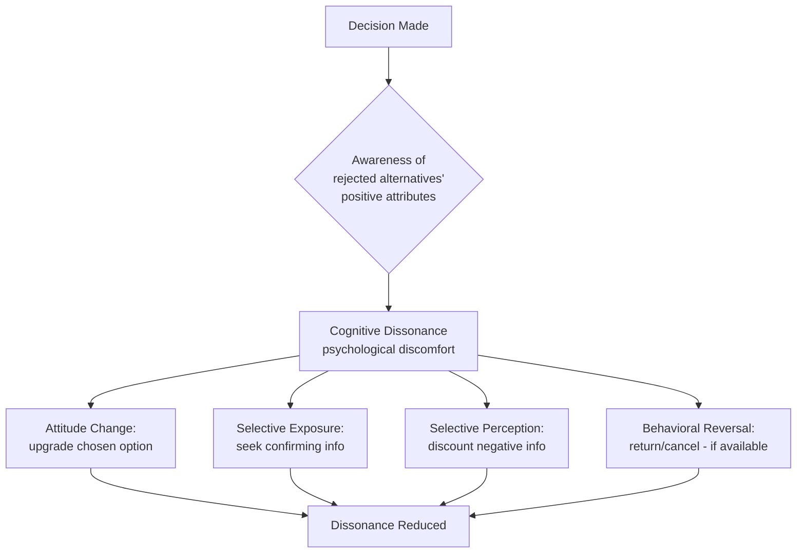

## Cognitive Dissonance and Post-Decision Rationalization

### Overview

Cognitive dissonance theory, developed by **Leon Festinger (1957)**, describes the psychological discomfort that arises when an individual holds two or more contradictory cognitions (beliefs, attitudes, or knowledge of behavior) simultaneously. In consumer contexts, the most applied form of this theory is **post-decision (or post-purchase) dissonance**: the discomfort that follows a choice, driven by awareness of the rejected alternatives' merits and the chosen option's flaws.

The theory's central premise: dissonance is psychologically uncomfortable, so individuals are motivated to reduce it — not necessarily by changing behavior (the purchase is already made), but by adjusting attitudes, beliefs, or perceptions to restore consistency. This makes it one of the most commercially significant psychological theories in marketing, as it explains both **why post-purchase communication matters** and **why consumers rationalize expensive or high-involvement decisions**.

### Core Mechanism

$$\text{Dissonance Magnitude} \propto \frac{\text{Number and importance of dissonant cognitions}}{\text{Number and importance of consonant cognitions}}$$

Festinger proposed that the magnitude of dissonance experienced is a function of:

1. **Importance** of the decision (higher stakes → higher potential dissonance)
2. **Number of attractive alternatives foregone** (more attractive rejected options → higher dissonance)
3. **Degree of similarity** between chosen and rejected alternatives (more similar options → harder justification → higher dissonance)
4. **Irrevocability** of the decision (non-returnable/non-refundable purchases intensify dissonance since behavioral reversal isn't available)

### Diagram: Dissonance Formation and Resolution Cycle

### Three Primary Modes of Dissonance Reduction

**1. Changing the Cognition (Attitude Adjustment)**

The consumer revises their evaluation of the chosen or rejected option to reduce the perceived contradiction.

- **Example**: After buying a more expensive laptop over a cheaper competitor, the buyer convinces themselves the cheaper option "probably had reliability issues anyway."

**2. Adding Consonant Cognitions**

Rather than changing an existing belief, the consumer adds new supportive information that outweighs the dissonant elements.

- **Example**: A car buyer seeks out and reads positive owner reviews of their new vehicle after purchase, deliberately reinforcing the decision.

**3. Reducing the Importance of the Dissonant Element**

The consumer minimizes how much the contradictory information actually matters.

- **Example**: A consumer who bought a phone with a shorter battery life than a competitor decides "battery life isn't that important to me anyway; I charge it overnight."

### Selective Exposure and Selective Perception

Post-decision behavior is frequently characterized by:

- **Selective exposure**: actively seeking information that confirms the wisdom of the choice (e.g., re-reading the product's marketing materials, browsing owner forums)
- **Selective perception/retention**: disproportionately noticing, believing, and remembering information consistent with the decision while discounting or forgetting contradictory information
- [Unverified] The strength of selective exposure effects in real-world (non-laboratory) purchase contexts is debated in the literature; some later meta-analyses (e.g., work following D'Alessandro & Winzar's critiques) found smaller or more context-dependent effects than Festinger's original lab-based demonstrations suggested.

### Post-Purchase Dissonance: The High-Involvement Case

Dissonance is most pronounced under these conditions, all commonly present in **high-involvement purchases**:

| Condition | Low Dissonance Risk | High Dissonance Risk |
| --- | --- | --- |
| Price/stakes | Low-cost, low-risk item | Expensive, high-risk item |
| Alternatives | Few comparable options | Multiple similar, attractive alternatives |
| Reversibility | Returnable/refundable | Final sale, non-refundable |
| Social visibility | Private consumption | Publicly visible purchase (status implications) |
| Frequency | Habitual, repeat purchase | Infrequent, unfamiliar category |

**Example**: A homebuyer, a car buyer, or someone purchasing an expensive piece of furniture typically experiences significantly more post-decision dissonance than someone buying a routine grocery item, due to the combination of high cost, irrevocability, and comparable alternatives.

### Marketing Applications

**1. Post-Purchase Reinforcement Communication**

Firms proactively supply consonant cognitions to reduce dissonance and prevent buyer's remorse, cancellations, or returns.

- **Key Points**
  - "Thank you" emails reinforcing the wisdom of the choice
  - Onboarding content that reframes the purchase as validated ("Welcome to the club" messaging)
  - Testimonials and reviews strategically surfaced *after* purchase, not just before
- **Example**: Automotive companies frequently send post-purchase mailers featuring award citations, expert reviews, or testimonials specifically to owners — content that has zero persuasive function pre-purchase but serves a dissonance-reduction function post-purchase.

**2. Warranty and Return Policy Design**

Generous return/refund policies reduce the *irrevocability* dimension of dissonance, paradoxically often *increasing* purchase confidence and conversion, even though few consumers use the return option.

- [Inference] The confidence effect of a strong guarantee likely operates partly through anticipated dissonance reduction — consumers reason that even if dissonance arises, an exit option exists — though the precise causal weight of this mechanism relative to simple risk-reduction signaling has not been cleanly isolated in most applied marketing studies.

**3. Cognitive Consistency in Loyalty Programs**

Repeated engagement with a brand builds cumulative consonant cognitions, making subsequent dissonance less likely and reinforcing behavioral loyalty as a self-justifying cycle.

**4. Managing Negative Word-of-Mouth Risk**

Unresolved dissonance is a primary driver of negative reviews, complaints, and switching behavior — the consumer resolves discomfort by concluding the product/brand was genuinely flawed rather than adjusting their own belief, especially when consonance-building touchpoints are absent.

### Relationship to Related Constructs

- **Buyer's remorse** is the colloquial/applied term for post-decision dissonance in a purchase context; the terms are often used interchangeably in marketing literature, though "cognitive dissonance" is the formal psychological construct.
- **Self-perception theory (Daryl Bem, 1967)** offers a competing explanation for some dissonance-like findings, proposing that people infer their attitudes from observing their own behavior rather than experiencing genuine internal discomfort. [Inference] Most contemporary treatments regard dissonance and self-perception as complementary rather than mutually exclusive — self-perception may dominate under low-arousal conditions, while genuine dissonance-driven discomfort dominates under high-arousal, high-stakes conditions — though this boundary condition is still an area of active theoretical discussion rather than settled consensus.
- **Confirmation bias** is a closely related but broader cognitive phenomenon; dissonance-driven selective exposure can be viewed as a specific, motivationally-charged instance of the general confirmation bias tendency.
- **Justification of effort**: A related dissonance phenomenon where the more effort/cost invested in obtaining something, the more the individual values it post-hoc (relevant to loyalty programs, membership tiers, and gated/exclusive access mechanisms).

### SVG: Dissonance Intensity by Decision Characteristics (svg_diagram)

<svg xmlns="http://www.w3.org/2000/svg" viewBox="0 0 800 420">
<text x="400" y="30" text-anchor="middle" font-size="18" font-weight="bold" font-family="sans-serif">Post-Decision Dissonance Intensity (svg_diagram)</text>
<line x1="80" y1="360" x2="750" y2="360" stroke="#333" stroke-width="2" />
<line x1="80" y1="360" x2="80" y2="60" stroke="#333" stroke-width="2" />
<text x="400" y="400" text-anchor="middle" font-size="13" font-family="sans-serif">Similarity of Alternatives (Low to High)</text>
<text x="30" y="210" text-anchor="middle" font-size="13" font-family="sans-serif" transform="rotate(-90 30 210)">Dissonance Intensity</text>
<path d="M 100 340 Q 300 300 450 220 T 720 90" stroke="#C8375B" stroke-width="3" fill="none" />
<circle cx="150" cy="330" r="6" fill="#2C7FB8" />
<text x="150" y="315" text-anchor="middle" font-size="11" font-family="sans-serif">Grocery item</text>
<circle cx="400" cy="240" r="6" fill="#D9822B" />
<text x="400" y="225" text-anchor="middle" font-size="11" font-family="sans-serif">Mid-tier electronics</text>
<circle cx="650" cy="110" r="6" fill="#C8375B" />
<text x="650" y="95" text-anchor="middle" font-size="11" font-family="sans-serif">Car / home purchase</text>
</svg>

### Boundary Conditions and Critiques

- Dissonance theory assumes **free choice**: if a consumer feels coerced or lacks perceived alternatives, dissonance effects diminish substantially, since the decision isn't experienced as self-determined.
- **Low-involvement purchases** (routine, low-cost, low-risk) typically generate negligible dissonance, limiting the theory's practical relevance to a subset of the purchase funnel.
- [Speculation] Some scholars argue that in highly saturated digital review ecosystems, consumers may resolve dissonance faster and more externally (via crowd-sourced validation) than Festinger's original internally-focused model anticipated, though this remains an evolving area rather than a well-established finding.
- The theory does not fully specify *which* of the three reduction modes (attitude change, adding cognitions, or reducing importance) a given individual will default to — this is typically treated as dependent on individual differences and situational constraints rather than derivable from the theory itself.

### Related Topics

- Self-perception theory (Bem) as an alternative account of attitude-behavior consistency
- Buyer's remorse and return/refund behavior analytics
- Justification of effort and sunk cost effects in loyalty design
- Confirmation bias and selective information processing
- High- vs. low-involvement purchase decision models
- Post-purchase customer journey and onboarding communication design
- Word-of-mouth and review generation as dissonance-driven behavior