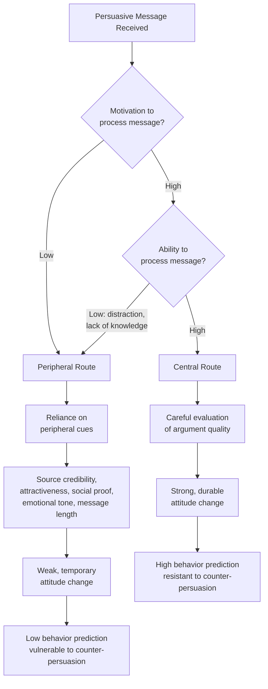

## The Elaboration Likelihood Model

### Overview

The **Elaboration Likelihood Model (ELM)**, developed by **Richard Petty and John Cacioppo (1986)**, is a dual-process theory of persuasion explaining *how* attitude change occurs, contingent on the degree of cognitive effort ("elaboration") a person applies when processing a persuasive message. Unlike single-process models, the ELM proposes two distinct routes to persuasion — **central** and **peripheral** — which differ in the depth of processing, the durability of resulting attitude change, and the predictors of subsequent behavior.

The theory's core premise: **motivation and ability to process a message** determine which route is engaged, and the route taken determines the *quality* and *persistence* of any resulting attitude change.

### The Two Routes

**Central Route**

Persuasion occurs through careful, effortful consideration of message content — the actual arguments, evidence, and logical merit.

- **Key Points**
  - Requires both motivation (personal relevance, involvement) and ability (time, knowledge, absence of distraction) to process
  - Produces attitudes that are more durable, resistant to counter-persuasion, and predictive of behavior
  - Attitude change results from genuine cognitive engagement with argument quality
- **Example**: A consumer researching a $2,000 laptop purchase reads detailed spec comparisons, benchmark reviews, and technical forums before forming a preference.

**Peripheral Route**

Persuasion occurs through simple cues unrelated to the actual argument quality — heuristics, associations, and surface-level signals.

- **Key Points**
  - Engaged when motivation or ability to process is low
  - Produces attitudes that are more temporary, more susceptible to counter-persuasion, and weaker predictors of long-term behavior
  - Relies on heuristic cues: source attractiveness/credibility, number of arguments (regardless of quality), emotional tone, social proof
- **Example**: A shopper picks a snack brand at the checkout aisle because a celebrity endorses it and the packaging looks appealing, without evaluating any actual product claims.

### Diagram: ELM Process Flow

### Determinants of Route: Motivation and Ability

**Motivation factors** (does the person *want* to process the message?):

- **Personal relevance/involvement**: higher relevance drives central processing
- **Need for cognition**: a stable individual-difference trait describing enjoyment of effortful thinking (Cacioppo & Petty, 1982); high-NFC individuals default toward central processing across contexts
- **Multiple source cues**: if a message comes from multiple sources, this can itself increase motivation to elaborate under some conditions [Unverified — effect sizes are argument- and context-dependent across studies]

**Ability factors** (can the person process the message even if motivated?):

- **Distraction**: background noise, multitasking, or busy environments reduce processing capacity
- **Repetition**: moderate repetition can increase ability to process complex arguments; excessive repetition produces wear-out and reactance
- **Prior knowledge**: message complexity relative to consumer expertise affects whether central processing is feasible
- **Time pressure**: constrained decision time pushes toward peripheral processing even among motivated consumers

### The Elaboration Continuum

The ELM does not propose a strict binary but rather a **continuum of elaboration likelihood**, with central and peripheral routes representing endpoints:

$$\text{Elaboration Likelihood} = f(\text{Motivation} \times \text{Ability})$$

[Inference] Most real-world persuasion attempts likely involve some blend of both routes rather than pure central or pure peripheral processing, since motivation and ability vary continuously rather than as discrete on/off states — though the model is typically taught and tested using the two-route simplification for clarity.

### Argument Quality vs. Peripheral Cues: The Interaction Effect

A key empirical finding from Petty and Cacioppo's original research: **argument quality has a much larger effect on attitude under high-elaboration conditions than under low-elaboration conditions**, while peripheral cues (e.g., source attractiveness) have a much larger effect under low-elaboration conditions.

| Condition | Strong Arguments | Weak Arguments |
| --- | --- | --- |
| High elaboration (central route) | Significant positive attitude shift | Significant negative attitude shift (counter-arguing occurs) |
| Low elaboration (peripheral route) | Modest attitude shift, driven by cues not argument content | Modest attitude shift, similarly driven by cues, not argument weakness |

- [Inference] This interaction implies a strategic risk: presenting weak arguments to a highly-engaged, high-elaboration audience can backfire, producing more negative attitudes than presenting no argument at all, because scrutiny exposes the argument's weakness.

### Marketing Applications by Route

**Central Route Strategy (High-Involvement Products/Contexts)**

- Detailed comparison charts, technical specifications, and data-driven claims
- Long-form content: white papers, in-depth reviews, demo videos
- Relevant for: B2B purchasing, financial products, healthcare decisions, major durable goods (cars, homes, appliances)

**Peripheral Route Strategy (Low-Involvement Products/Contexts)**

- Celebrity/influencer endorsements, attractive visuals, emotionally resonant music
- Repetition-based brand familiarity building (mere exposure effect)
- Social proof cues: "#1 best-seller," star ratings, follower counts
- Relevant for: FMCG (fast-moving consumer goods), impulse purchases, low-cost routine items

**Example — Same Product, Two Routes**: A skincare brand might run a peripheral-route social media ad (attractive influencer, aesthetically pleasing visuals, minimal text) targeting casual browsers, while simultaneously publishing a central-route landing page with clinical trial data and ingredient science for consumers actively researching before purchase.

### Multiple Roles of a Single Variable

A distinctive feature of the ELM is that **the same variable can function differently depending on elaboration level**. Source attractiveness, for example:

- Under **low elaboration**: functions as a peripheral cue directly influencing attitude ("attractive source = good product")
- Under **high elaboration**: may function as a biasing factor on the interpretation of arguments, or may be entirely dismissed as irrelevant to argument merit, or may even serve as an argument itself in certain contexts (e.g., in advertising for beauty products, attractiveness is directly relevant evidence)

[Inference] This multiple-roles principle is one of the more nuanced aspects of the theory and explains why the same creative execution can produce different outcomes depending on the audience's engagement level with the category.

### Relationship to Other Dual-Process Models

- The **Heuristic-Systematic Model (HSM)**, developed by Chaiken (1980) around the same period, proposes a highly similar systematic/heuristic distinction; the two models are often treated as largely convergent frameworks in applied marketing contexts, though they differ in some theoretical specifics (e.g., HSM allows for simultaneous systematic and heuristic processing more explicitly than the ELM's continuum framing).
- Contrast with **functional theory of attitudes**: functional theory explains *why* an attitude is held (motivational purpose), while the ELM explains *how* persuasive messages are processed to change or reinforce that attitude — the two are complementary, not competing frameworks.
- Relation to **cognitive dissonance**: post-decision dissonance reduction can itself be understood as a form of motivated central-route reprocessing, where the consumer engages effortfully with consonant information specifically to resolve discomfort.

### Boundary Conditions and Critiques

- The **need for cognition** trait is not always measured in applied marketing testing, meaning route determination is often inferred from involvement/product category proxies rather than directly assessed individual differences.
- [Unverified] Real-world advertising environments (multi-channel, low attention, mobile-first) may compress the practical relevance of the central route relative to laboratory conditions where the original ELM studies were conducted, an idea raised in some applied marketing commentary, though this specific claim is not something the original model was designed to test.
- The model has been critiqued for the ambiguity of operationalizing "elaboration" consistently across studies — different researchers have used different proxies (thought-listing measures, recall, processing time) that don't always converge.
- Cultural and individual variation in default processing style (e.g., holistic vs. analytic cognitive styles across cultures) is not natively built into the original ELM and represents an area of extension in cross-cultural consumer research. [Speculation]

### SVG: Argument Quality × Elaboration Interaction (svg_diagram)

<svg xmlns="http://www.w3.org/2000/svg" viewBox="0 0 800 440">
<text x="400" y="30" text-anchor="middle" font-size="18" font-weight="bold" font-family="sans-serif">Argument Quality x Elaboration Interaction (svg_diagram)</text>
<line x1="90" y1="380" x2="740" y2="380" stroke="#333" stroke-width="2" />
<line x1="90" y1="380" x2="90" y2="70" stroke="#333" stroke-width="2" />
<text x="415" y="415" text-anchor="middle" font-size="13" font-family="sans-serif">Elaboration Level (Low to High)</text>
<text x="35" y="225" text-anchor="middle" font-size="13" font-family="sans-serif" transform="rotate(-90 35 225)">Attitude Favorability</text>
<line x1="90" y1="250" x2="740" y2="250" stroke="#999" stroke-width="1" stroke-dasharray="4" />
<text x="750" y="254" font-size="10" font-family="sans-serif">neutral</text>
<path d="M 120 240 Q 400 150 700 90" stroke="#2C7FB8" stroke-width="3" fill="none" />
<text x="620" y="80" font-size="12" fill="#2C7FB8" font-family="sans-serif">Strong Arguments</text>
<path d="M 120 260 Q 400 340 700 370" stroke="#C8375B" stroke-width="3" fill="none" />
<text x="600" y="390" font-size="12" fill="#C8375B" font-family="sans-serif">Weak Arguments</text>
<path d="M 120 245 Q 400 235 700 225" stroke="#D9822B" stroke-width="2" fill="none" stroke-dasharray="6,4" />
<text x="710" y="220" font-size="11" fill="#D9822B" font-family="sans-serif">Peripheral cue effect</text>
</svg>

### Related Topics

- Heuristic-Systematic Model (Chaiken) as a parallel dual-process framework
- Need for cognition as an individual-difference moderator
- Functional theory of attitudes and its complementary relationship to ELM
- Mere exposure effect and repetition-based peripheral persuasion
- Source credibility and celebrity endorsement research
- Counter-arguing and attitude inoculation theory
- Involvement theory and the FCB grid (Foote, Cone & Belding) for advertising strategy