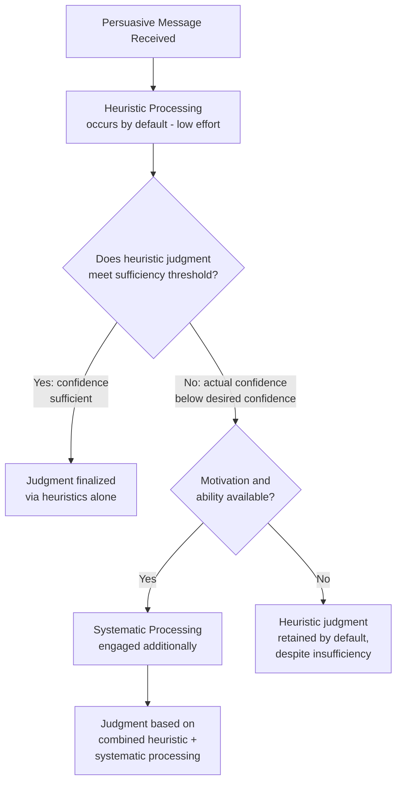

## The Heuristic-Systematic Processing Model

### Overview

The **Heuristic-Systematic Model (HSM)**, developed by **Shelly Chaiken (1980)**, is a dual-process theory of persuasion describing two qualitatively different modes by which individuals process persuasive messages: **systematic processing** (effortful, comprehensive analysis of message content) and **heuristic processing** (reliance on simple decision rules or cognitive shortcuts). Developed contemporaneously with Petty and Cacioppo's Elaboration Likelihood Model, the HSM shares substantial conceptual overlap but differs in several important theoretical specifics, particularly regarding the **co-occurrence** of both processing modes.

The theory's central premise: individuals are motivated to hold accurate attitudes while expending the least cognitive effort necessary — the **"least effort principle"** — and the mode of processing engaged depends on whether heuristic processing alone can achieve "sufficient" confidence in the judgment.

### The Two Processing Modes

**Systematic Processing**

Careful, analytical processing involving comprehensive consideration of all available message content, argument merit, and evidence.

- **Key Points**
  - Requires both sufficient motivation and cognitive capacity
  - Analogous to the ELM's central route, though grounded in different theoretical mechanics (sufficiency, not just motivation/ability)
  - Produces judgments that are more accurate, effortful, and resource-intensive
- **Example**: A consumer comparing mortgage rates across several banks systematically calculates total interest paid over the loan term for each option before deciding.

**Heuristic Processing**

Reliance on simple cognitive shortcuts ("heuristics") — learned decision rules that allow a judgment without deep analysis of message content.

- **Key Points**
  - Requires minimal cognitive effort and can occur even when systematic processing is also occurring
  - Analogous to the ELM's peripheral route
  - Common heuristics: "experts are usually right," "consensus implies correctness," "longer messages are stronger," "attractive people have good products"
- **Example**: A shopper chooses the toothpaste with the most 5-star reviews and a dentist-recommended seal, without reading detailed ingredient claims.

### Diagram: HSM Process Flow

### The Sufficiency Principle

The HSM's most distinctive theoretical contribution is the **sufficiency principle**: individuals possess a **desired confidence level** (how certain they want to feel about their judgment) and an **actual confidence level** (how certain they currently feel). The gap between these two determines whether additional systematic processing is engaged.

$$\text{Processing Effort} \propto (\text{Desired Confidence} - \text{Actual Confidence})$$

- If heuristic processing alone produces actual confidence that meets or exceeds desired confidence, processing stops — no systematic analysis occurs.
- If a gap remains, the individual is motivated to engage systematic processing to close it, **provided sufficient motivation and cognitive capacity exist**.
- [Inference] This framing implies that increasing a consumer's desired confidence level (e.g., by raising perceived decision stakes or risk) can itself trigger systematic processing even when heuristic cues would otherwise have been "good enough" — a mechanism with direct implications for how marketers frame purchase risk.

### Key Distinction from the ELM: Co-occurrence

The single most important theoretical difference between the HSM and the ELM:

| Aspect | ELM (Petty & Cacioppo) | HSM (Chaiken) |
| --- | --- | --- |
| Route relationship | Central and peripheral routes are largely positioned as alternatives along a continuum | Heuristic and systematic processing can co-occur simultaneously |
| Default mode | Neither route is inherently "default" | Heuristic processing occurs by default; systematic processing is added on top when needed |
| Core mechanism | Motivation × Ability determines route | Sufficiency principle (gap between actual and desired confidence) determines added effort |
| Interaction effects | Explicit interaction between argument quality and elaboration level | Additivity, attenuation, and bias effects between heuristic and systematic processing |

Because heuristic processing is assumed to occur by default and persist even during systematic processing, the HSM explicitly models **interaction effects between the two modes**:

- **Additivity effect**: heuristic and systematic processing both independently contribute to the final judgment
- **Attenuation effect**: systematic processing can reduce (attenuate) the influence of heuristic cues when the two conflict
- **Bias effect**: heuristic cues can bias the *interpretation* of systematically-processed information, rather than being overridden by it — e.g., a consumer predisposed to trust a brand (heuristic) may interpret ambiguous technical claims (systematic content) more favorably than an unbiased reading would support

### Common Heuristic Cues in Marketing

- **Consensus heuristic**: "if many people believe/buy this, it must be good" — star ratings, review counts, bestseller labels
- **Expertise heuristic**: "experts/authorities are usually correct" — doctor/dentist recommendations, certifications, credentialed endorsers
- **Liking/attractiveness heuristic**: "attractive or likable sources are trustworthy" — influencer and celebrity marketing
- **Length-implies-strength heuristic**: "longer or more detailed messages are more persuasive" — can be exploited even when added length adds no substantive argument value
- **Length-implies-strength heuristic risk**: [Unverified] this heuristic's practical strength varies by category and audience sophistication; audiences with domain expertise may show reduced or reversed reliance on it, though the boundary conditions are not uniformly established across studies

### Applications in Marketing Strategy

**1. Sufficiency Threshold Management**

Marketers can influence whether systematic processing is triggered by managing perceived decision risk and stakes.

- **Example**: A SaaS company marketing an enterprise tool to a low-stakes trial user might rely on heuristic cues (logos of well-known clients, "trusted by 10,000+ teams"). The same company marketing an annual enterprise contract to a procurement committee anticipates a higher desired confidence threshold, and supplies systematic content (ROI calculators, case studies, security documentation) to close that gap.

**2. Heuristic Cue Stacking for Low-Involvement Categories**

For routine, low-stakes purchases, stacking multiple heuristic cues (reviews + certifications + popularity indicators) can push actual confidence above the desired threshold quickly, short-circuiting the need for systematic evaluation.

**3. Managing the Bias Effect**

Because prior heuristic impressions (e.g., brand reputation) can bias interpretation of subsequent systematic content, [Inference] brand-building investment made *before* a high-involvement purchase decision may have an outsized effect on how favorably technical/product content is later interpreted, compared to attempting to build both brand trust and technical credibility simultaneously at the point of purchase.

### Relationship to Other Frameworks

- **Elaboration Likelihood Model**: largely convergent in practical marketing application; many applied textbooks present the two models side-by-side as complementary lenses on the same dual-process phenomenon rather than as competing theories requiring a choice between them.
- **Functional theory of attitudes**: heuristic processing often aligns with value-expressive or ego-defensive attitude functions (quick, identity/emotion-driven judgments), while systematic processing aligns more naturally with utilitarian and knowledge functions (careful, benefit/logic-driven judgments). [Speculation] This mapping is a reasonable theoretical inference rather than an explicitly stated equivalence in either original theory.
- **Dual-process theories in broader cognitive psychology** (e.g., Kahneman's System 1/System 2 framework): the heuristic/systematic distinction is often treated as a domain-specific application of the broader fast/slow thinking distinction, though Chaiken's model predates Kahneman's popularization and was developed independently within social psychology.

### Boundary Conditions and Critiques

- The sufficiency principle's core constructs (desired confidence, actual confidence) are inherently difficult to measure directly in applied research, and are typically operationalized indirectly through manipulation of risk/stakes rather than measured as subjective states.
- The **bias effect** in particular is harder to test empirically than straightforward additivity, since it requires demonstrating that identical systematic content is interpreted differently depending on heuristic priming — a more complex experimental design than simple attitude-shift measurement.
- [Unverified] As with the ELM, real-world digital environments with rapid information scanning may compress opportunities for genuine systematic processing relative to the controlled lab conditions in which the original HSM studies were conducted; this is a reasonable extrapolation but not a claim directly tested within Chaiken's original framework.
- The model does not strongly specify individual-difference predictors (analogous to the ELM's "need for cognition") for who defaults toward heuristic vs. systematic processing beyond situational motivation and ability factors.

### SVG: Sufficiency Principle Threshold Diagram (svg_diagram)

<svg xmlns="http://www.w3.org/2000/svg" viewBox="0 0 800 420">
<text x="400" y="30" text-anchor="middle" font-size="18" font-weight="bold" font-family="sans-serif">Sufficiency Principle (svg_diagram)</text>
<line x1="90" y1="360" x2="740" y2="360" stroke="#333" stroke-width="2" />
<line x1="90" y1="360" x2="90" y2="60" stroke="#333" stroke-width="2" />
<text x="415" y="395" text-anchor="middle" font-size="13" font-family="sans-serif">Processing Sequence Over Time</text>
<text x="35" y="210" text-anchor="middle" font-size="13" font-family="sans-serif" transform="rotate(-90 35 210)">Confidence Level</text>
<line x1="90" y1="120" x2="740" y2="120" stroke="#4C9A2A" stroke-width="2" stroke-dasharray="6,3" />
<text x="745" y="124" font-size="11" fill="#4C9A2A" font-family="sans-serif">Desired confidence</text>
<path d="M 100 340 L 300 200" stroke="#2C7FB8" stroke-width="3" fill="none" />
<text x="160" y="260" font-size="11" fill="#2C7FB8" font-family="sans-serif">Heuristic processing</text>
<line x1="300" y1="200" x2="300" y2="360" stroke="#999" stroke-width="1" stroke-dasharray="3,3" />
<text x="300" y="378" text-anchor="middle" font-size="10" font-family="sans-serif">Gap detected</text>
<path d="M 300 200 Q 500 160 700 105" stroke="#C8375B" stroke-width="3" fill="none" />
<text x="560" y="150" font-size="11" fill="#C8375B" font-family="sans-serif">+ Systematic processing</text>
<circle cx="700" cy="105" r="5" fill="#4C9A2A" />
<text x="700" y="90" text-anchor="middle" font-size="10" font-family="sans-serif">Threshold met</text>
</svg>

### Related Topics

- Elaboration Likelihood Model (parallel dual-process framework)
- Kahneman's System 1 / System 2 dual-process theory
- Consensus, expertise, and liking heuristics in persuasion research
- Perceived risk and involvement theory in consumer decision-making
- Functional theory of attitudes and its mapping to processing modes
- Cognitive load theory and its marketing applications
- Message framing and the role of perceived stakes in triggering elaboration