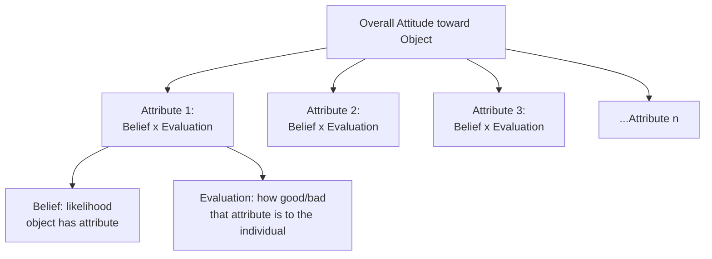
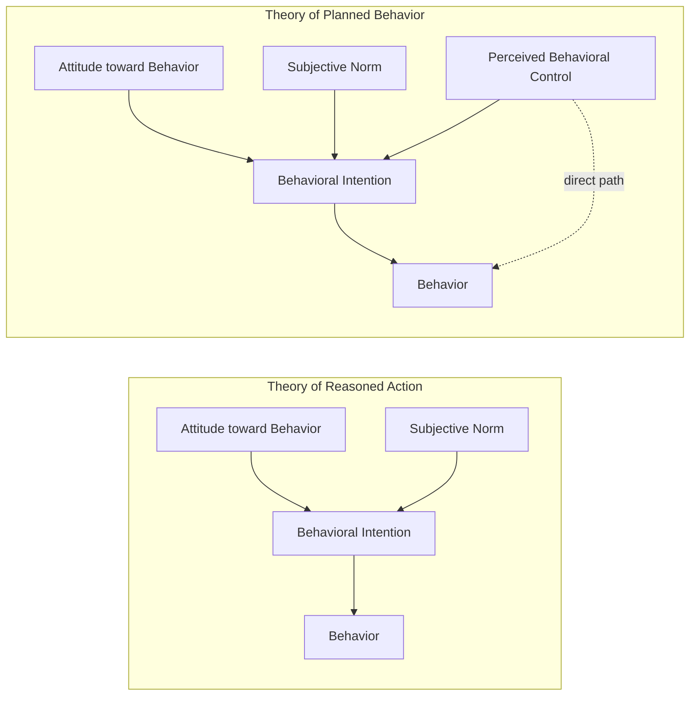

## Multi-Attribute Attitude Models

### Overview

Multi-attribute attitude models propose that an individual's overall attitude toward an object (a brand, product, or company) is a function of their **beliefs about the object's attributes** and the **evaluative importance (weight)** assigned to each attribute. Rather than treating attitude as a single unanalyzed evaluation, these models decompose attitude formation into a computable, componential structure — making them among the most operationally useful attitude theories in applied marketing research, since they translate directly into measurable, actionable survey instruments.

The two most influential models in this family are the **Fishbein Attitude-Toward-Object Model** and its successor, the **Theory of Reasoned Action (TRA)**, later extended into the **Theory of Planned Behavior (TPB)**.

### The Fishbein Multi-Attribute Model

Developed by **Martin Fishbein (1963, 1975)**, this model expresses attitude as a summed product of belief strength and evaluation across salient attributes:

$$A_o = \sum_{i=1}^{n} b_i e_i$$

Where:

- $A_o$ = overall attitude toward the object
- $b_i$ = belief (strength of belief that the object possesses attribute $i$)
- $e_i$ = evaluation (how favorably attribute $i$ is regarded)
- $n$ = number of salient attributes considered
- **Key Points**
  - Beliefs ($b_i$) are typically measured on a likelihood scale (e.g., "How likely is it that this laptop has a long battery life?" from 1–7)
  - Evaluations ($e_i$) are measured on a good–bad scale (e.g., "How good or bad is long battery life to you?" from -3 to +3)
  - The model assumes attributes are compensatory — a weakness in one attribute can be offset by strength in another (see compensatory decision rules below)

**Worked Example**: A consumer evaluating a smartphone considers three salient attributes:

| Attribute | Belief ($b_i$, 1–7) | Evaluation ($e_i$, -3 to +3) | $b_i \times e_i$ |
| --- | --- | --- | --- |
| Camera quality | 6 | +3 | 18 |
| Battery life | 4 | +2 | 8 |
| Price | 3 | -1 | -3 |

$$A_o = 18 + 8 + (-3) = 23$$

This composite score of 23 can be compared across competing brands evaluated on the same attribute set, with the highest score predicting the most favorable overall attitude.

### Diagram: Multi-Attribute Model Structure

### The Theory of Reasoned Action (TRA)

Fishbein and **Icek Ajzen** (1975, 1980) extended the basic attitude model to explicitly predict **behavior** (not just attitude), introducing a second determinant beyond attitude: **subjective norms**.

$$BI = w_1(A_B) + w_2(SN)$$

Where:

- $BI$ = behavioral intention (proxy for actual behavior)
- $A_B$ = attitude toward performing the specific behavior (not just the object)
- $SN$ = subjective norm (perceived social pressure to perform or not perform the behavior)
- $w_1, w_2$ = empirically-derived weights reflecting the relative importance of attitude vs. social norms for a given behavior/population

**Key theoretical refinement**: TRA shifts the attitude object from the *product itself* to the *specific behavior* (e.g., not "attitude toward Tesla" but "attitude toward buying a Tesla"), which more directly predicts intention and subsequent action.

**Subjective norm** is itself decomposed into:

$$SN = \sum_{j=1}^{m} nb_j \cdot mc_j$$

Where $nb_j$ = normative belief (perceived expectation of referent $j$) and $mc_j$ = motivation to comply with referent $j$.

- **Example**: A consumer considering a vegan diet transition may have a positive personal attitude toward the behavior ($A_B$) but weigh subjective norms heavily if their family strongly disapproves ($SN$ pulls intention down), or weakly if they have low motivation to comply with family opinion.

### The Theory of Planned Behavior (TPB)

Ajzen (1985, 1991) extended TRA further by adding **perceived behavioral control** to account for behaviors not fully under volitional control.

$$BI = w_1(A_B) + w_2(SN) + w_3(PBC)$$

Where $PBC$ = perceived behavioral control (the perceived ease or difficulty of performing the behavior, incorporating both internal factors like skill/confidence and external factors like resources/opportunity).

### Diagram: TRA to TPB Evolution

- **Key Points**
  - PBC has both an indirect effect (via intention) and a hypothesized **direct effect on behavior**, accounting for situations where intention alone is insufficient because actual control is limited (e.g., resource constraints, skill barriers)
  - TPB is widely applied in behaviors involving perceived difficulty: financial behaviors (saving, investing), health behaviors (exercise, dieting), and technology adoption
- **Example**: A consumer may have strong purchase intention toward an electric vehicle (favorable attitude, supportive social circle) but low perceived behavioral control due to charging infrastructure concerns, which can suppress actual purchase behavior below what intention alone would predict.

### Ideal-Point (Vector) Model — An Alternative Formulation

An alternative to the additive Fishbein model, the **ideal-point model** proposes that consumers compare a brand's perceived attribute position to their **ideal** position on that attribute, with attitude favorability inversely related to the distance between actual and ideal.

$$A_b = \sum_{i=1}^{n} w_i |I_i - X_i|^v$$

Where $I_i$ = ideal value on attribute $i$, $X_i$ = perceived brand value on attribute $i$, $w_i$ = importance weight, and $v$ is typically 1 or 2 (linear or squared distance).

- **Key Points**
  - Lower total weighted distance from the ideal indicates a more favorable attitude
  - Particularly suited to attributes with a genuine "optimal point" rather than "more is always better" (e.g., sweetness level in a beverage, spiciness in food, screen size in a phone)
  - Contrasts with the standard Fishbein model, which assumes monotonically increasing favorability for "good" attributes

**Example**: For sweetness in a soft drink, the ideal-point model captures that both "too sweet" and "not sweet enough" reduce attitude favorability — a relationship the standard additive Fishbein model, which assumes linear "more is better" attribute evaluation, cannot represent without modification.

### Compensatory vs. Non-Compensatory Decision Rules

Multi-attribute models like Fishbein's are inherently **compensatory**: a low score on one attribute can be mathematically offset by a high score on another. This contrasts with several non-compensatory heuristics consumers sometimes use instead:

| Decision Rule | Mechanism | Compensatory? |
| --- | --- | --- |
| Fishbein weighted-additive | Sum of belief × evaluation across all attributes | Yes |
| Conjunctive | Reject any option failing a minimum threshold on any attribute | No |
| Disjunctive | Accept any option exceeding a threshold on at least one key attribute | No |
| Lexicographic | Rank attributes by importance; compare top attribute first, use next only to break ties | No |
| Elimination-by-aspects (Tversky, 1972) | Sequentially eliminate options failing cutoffs on attributes, in order of importance | No |

- [Inference] In practice, consumers often use non-compensatory rules to narrow a large consideration set down to a manageable few, then apply a compensatory (Fishbein-like) evaluation within that smaller set — a two-stage process sometimes referred to informally as a "funnel" decision strategy, though the precise stage-transition point is difficult to observe directly and varies by individual and category.

### Marketing Applications

**1. Diagnostic Attribute Mapping**

Multi-attribute surveys allow firms to identify which specific attributes drive overall brand attitude gaps relative to competitors, enabling targeted product or messaging interventions rather than generic brand-image campaigns.

**2. Positioning Strategy via Belief Change vs. Evaluation Change**

Two distinct levers exist for shifting $A_o$:

- **Belief change strategy**: convince consumers the brand possesses more of a valued attribute (change $b_i$) — e.g., ad campaigns demonstrating product performance
- **Evaluation change strategy**: convince consumers to value an attribute the brand already possesses more highly (change $e_i$) — e.g., a brand strong in sustainability running campaigns to increase the perceived importance of sustainability generally

**3. New Attribute Introduction**

A brand may attempt to introduce an entirely new salient attribute (adding a term to the summation) on which it holds a competitive advantage, effectively changing the basis of comparison rather than competing on existing attributes.

**4. Predicting Adoption via TPB**

Technology and behavior-change marketers (fintech apps, health platforms, sustainability campaigns) commonly apply TPB constructs directly in pre-launch research to identify whether adoption barriers are attitudinal, social, or control-based — informing whether the appropriate intervention is persuasive messaging, social proof, or removing practical friction.

### Relationship to Other Frameworks

- **Functional theory of attitudes**: multi-attribute models describe attitude *structure and computation*, while functional theory describes attitude *purpose*; a value-expressive attitude function could still be modeled multi-attributively if identity-relevant attributes (e.g., "environmentally friendly") are included in the belief set.
- **Elaboration Likelihood Model / HSM**: multi-attribute, belief-based evaluation is characteristic of central-route/systematic processing; peripheral/heuristic processing typically bypasses explicit multi-attribute computation entirely.
- **Tripartite (ABC) Model**: the multi-attribute model can be seen as a detailed operationalization of the cognitive (belief) component feeding into the overall affective (attitude) evaluation.

### Boundary Conditions and Critiques

- The assumption of **compensatory, linear combination** does not match all real-world decision-making, particularly for time-constrained or low-involvement decisions where non-compensatory heuristics dominate (see above).
- **Attribute salience** must be established before applying the model (typically via free elicitation in formative research); using a fixed, researcher-imposed attribute list risks omitting attributes that are actually salient to consumers, or including irrelevant ones.
- TRA/TPB's predictive power for actual behavior (not just intention) is [Unverified] subject to a well-documented "intention-behavior gap" in the broader literature — meta-analyses have generally found intention to be a substantially stronger predictor of self-reported behavior than of independently verified behavior, though exact effect sizes vary considerably by behavior domain and measurement method.
- The models assume relatively stable, accessible beliefs; they are less suited to capturing impulsive, affect-driven, or habitual purchase behavior where explicit belief-evaluation computation plausibly does not occur in real time.

### SVG: Compensatory vs. Non-Compensatory Comparison (svg_diagram)

<svg xmlns="http://www.w3.org/2000/svg" viewBox="0 0 800 380">
<text x="400" y="30" text-anchor="middle" font-size="18" font-weight="bold" font-family="sans-serif">Decision Rule Comparison (svg_diagram)</text>
<rect x="40" y="60" width="340" height="280" rx="10" fill="#E8F4FD" stroke="#2C7FB8" stroke-width="2" />
<text x="210" y="90" text-anchor="middle" font-size="15" font-weight="bold" font-family="sans-serif">Compensatory</text>
<text x="210" y="115" text-anchor="middle" font-size="12" font-family="sans-serif">(Fishbein Weighted-Additive)</text>
<text x="60" y="150" font-size="12" font-family="sans-serif">Camera: 18</text>
<text x="60" y="175" font-size="12" font-family="sans-serif">Battery: 8</text>
<text x="60" y="200" font-size="12" font-family="sans-serif">Price: -3</text>
<line x1="60" y1="215" x2="360" y2="215" stroke="#333" stroke-width="1" />
<text x="60" y="240" font-size="13" font-weight="bold" font-family="sans-serif">Total: 23 (weak price offset by strong camera)</text>
<text x="60" y="290" font-size="11" font-family="sans-serif" font-style="italic">Weakness in one attribute</text>
<text x="60" y="308" font-size="11" font-family="sans-serif" font-style="italic">can be offset by another</text>
<rect x="420" y="60" width="340" height="280" rx="10" fill="#FDE8EC" stroke="#C8375B" stroke-width="2" />
<text x="590" y="90" text-anchor="middle" font-size="15" font-weight="bold" font-family="sans-serif">Non-Compensatory</text>
<text x="590" y="115" text-anchor="middle" font-size="12" font-family="sans-serif">(Conjunctive Rule)</text>
<text x="440" y="150" font-size="12" font-family="sans-serif">Camera: passes threshold</text>
<text x="440" y="175" font-size="12" font-family="sans-serif">Battery: passes threshold</text>
<text x="440" y="200" font-size="12" font-family="sans-serif">Price: FAILS threshold</text>
<line x1="440" y1="215" x2="740" y2="215" stroke="#333" stroke-width="1" />
<text x="440" y="240" font-size="13" font-weight="bold" font-family="sans-serif">Result: REJECTED</text>
<text x="440" y="290" font-size="11" font-family="sans-serif" font-style="italic">One failed minimum</text>
<text x="440" y="308" font-size="11" font-family="sans-serif" font-style="italic">eliminates the option outright</text>
</svg>

### Related Topics

- Theory of Planned Behavior extensions and applications in behavior-change marketing
- Elimination-by-aspects and other non-compensatory heuristic decision rules
- Ideal-point (vector) models for optimal-point attribute categories
- Functional theory of attitudes
- Elaboration Likelihood Model and Heuristic-Systematic Model
- Conjoint analysis as a market-research technique for estimating attribute weights
- Intention-behavior gap research in consumer psychology