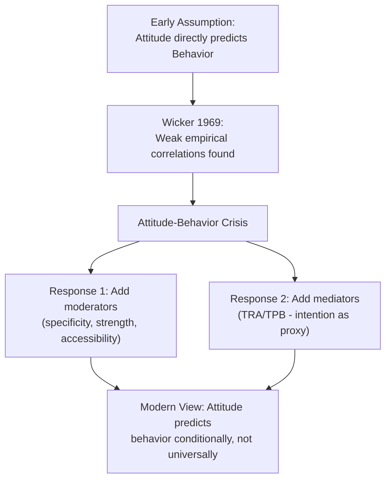
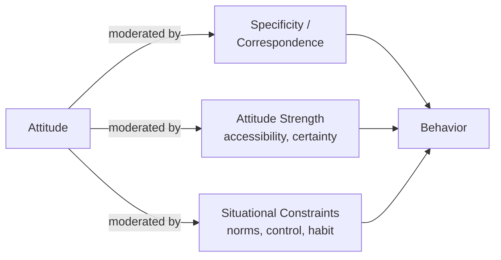

## Attitude-Behavior Consistency and Its Limits

### Overview

The attitude-behavior consistency question addresses a foundational problem in consumer psychology: **does a measured attitude actually predict subsequent behavior, and under what conditions does this relationship break down?** Early attitude research largely assumed a straightforward causal chain (attitude → behavior), but a landmark critical review by **Alan Wicker (1969)** found alarmingly weak empirical correlations between attitudes and behavior across dozens of studies, precipitating what became known as the **attitude-behavior crisis** in social psychology. This crisis directly motivated the development of more sophisticated models (TRA, TPB) and refined understanding of the **moderating conditions** under which attitudes do and do not predict behavior reliably.

### The Wicker Critique

Wicker's 1969 review found that correlations between measured attitudes and corresponding behaviors were typically weak, often in the $r = 0.15$ to $r = 0.30$ range — far below what would justify treating attitude as a reliable behavioral predictor on its own.

- **Key Points**
  - This finding was foundational in shifting the field from "does attitude predict behavior" to "**under what conditions** does attitude predict behavior"
  - It directly motivated Fishbein and Ajzen's development of the Theory of Reasoned Action, which introduced subjective norms as a second predictor precisely because attitude alone was insufficient
  - [Unverified] Exact correlation figures across the reviewed studies varied considerably by behavior type and measurement approach; the "weak correlation" finding is a well-documented characterization of the review's overall conclusion rather than a single precise statistic applicable across all cited studies

### Diagram: Evolution of Attitude-Behavior Thinking

### Key Moderating Conditions

**1. Attitude Specificity (Correspondence Principle)**

Ajzen and Fishbein's **principle of correspondence** (or compatibility) states that attitude-behavior correlations are strongest when attitude and behavior measures match in **action, target, context, and time**.

- **Example**: Attitude toward "recycling in general" poorly predicts "whether this specific person recycles plastic bottles at their workplace next Tuesday." Attitude toward "recycling plastic bottles at work" predicts that specific behavior far better.
- **Key Points**
  - General attitudes predict general/aggregated behavioral patterns better than they predict single specific acts
  - Specific attitudes predict specific corresponding behaviors better than they predict broad behavioral categories
  - This is often called the **compatibility principle** in TRA/TPB literature

**2. Attitude Strength**

Not all attitudes are equally durable or influential; **attitude strength** is a multidimensional construct encompassing several sub-properties:

| Strength Dimension | Description |
| --- | --- |
| Accessibility | How quickly/automatically the attitude comes to mind when the object is encountered |
| Certainty | How confident the individual is in the attitude's correctness |
| Personal importance | How much the individual cares about the attitude object |
| Direct experience | Attitudes formed through direct product experience vs. secondhand information |
| Ambivalence (inverse) | Degree of mixed positive/negative feelings — lower ambivalence associated with stronger, more predictive attitudes |

- [Inference] Attitudes formed through direct experience (e.g., product trial) are generally considered more predictive of subsequent behavior than attitudes formed through secondhand exposure (e.g., advertising alone), consistent with Fazio's broader attitude accessibility research, though the exact predictive advantage varies by product category and study design.

**3. Attitude Accessibility (Fazio's MODE Model)**

**Russell Fazio's** research on attitude accessibility proposes that attitudes stored in memory with strong, automatic object-evaluation associations are activated spontaneously upon encountering the attitude object, making them far more likely to guide immediate behavior — particularly under low-motivation, low-opportunity conditions (the **MODE model**: Motivation and Opportunity as DEterminants of whether deliberate or spontaneous processing governs the attitude-behavior link).

- **Example**: A shopper with a highly accessible negative attitude toward a brand (formed through a strongly negative past experience) will spontaneously avoid that brand at shelf-level even under time pressure, without deliberate reconsideration — whereas a weakly accessible attitude is more easily overridden by in-the-moment cues (promotions, packaging, mood).

**4. Situational and Normative Constraints**

External factors can suppress attitude-behavior consistency even when the underlying attitude is genuine and strong:

- **Social pressure/subjective norms**: a consumer may hold a positive personal attitude toward a product but avoid purchasing it due to anticipated social disapproval
- **Situational constraints**: budget limits, availability, time pressure, or habit can override attitude-driven intention
- **Perceived behavioral control** (per TPB): low perceived or actual control over performing the behavior weakens the attitude-behavior-via-intention pathway

**5. Direct vs. Indirect Experience**

Attitudes based on direct behavioral experience with the object tend to show stronger correlation with future behavior than attitudes based purely on indirect exposure (advertising, word-of-mouth), [Inference] plausibly because direct experience produces attitudes with higher confidence, accessibility, and clarity — though this causal chain is an inference drawn from Fazio's broader theoretical framework rather than a single isolated finding.

### Diagram: Moderators of the Attitude-Behavior Link

### The Intention-Behavior Gap

Even when attitude successfully predicts **behavioral intention** (via TRA/TPB pathways), intention itself does not perfectly predict actual behavior — a distinct and well-documented phenomenon sometimes called the **intention-behavior gap**.

- **Key Points**
  - Meta-analyses in the behavior-change literature (e.g., work following Sheeran's reviews) have generally found intention explains only a moderate proportion of variance in actual behavior, leaving substantial unexplained gap even among people who form strong intentions
  - Implementation intentions (specific "if-then" plans, per Gollwitzer's research) are one well-studied intervention shown to help close this gap by pre-committing to situational triggers for action
  - [Unverified] The precise magnitude of the intention-behavior gap varies considerably across behavior domains (e.g., one-time purchase vs. sustained habit change like exercise or dieting), and specific effect-size figures should not be treated as universally generalizable across contexts

### Practical Marketing Implications

**1. Matching Attitude Measurement to Behavioral Prediction Goals**

Marketers seeking to predict specific purchase behavior should measure attitude at a correspondingly specific level (e.g., "attitude toward buying this specific product in this specific channel this month") rather than relying on broad brand-attitude surveys to forecast narrow behavioral outcomes.

**2. Building Attitude Accessibility, Not Just Favorability**

Since accessible attitudes drive spontaneous shelf-level and low-involvement decisions, [Inference] repeated exposure and consistent brand messaging that strengthens automatic attitude-object association may be at least as valuable for driving actual purchase behavior as increasing attitude favorability alone — a strategic implication drawn from Fazio's accessibility research applied to marketing contexts, rather than a directly tested marketing-specific finding.

**3. Reducing Situational Friction to Close the Intention-Behavior Gap**

Since positive attitudes and intentions often fail to convert into behavior due to situational barriers, tactics that reduce friction at the point of decision (simplified checkout, reminders, removing access barriers) can convert existing favorable attitudes into behavior more effectively than further attitude-strengthening messaging.

**4. Leveraging Implementation Intentions in Campaign Design**

Campaigns that prompt consumers to form specific if-then plans ("If it's Friday, I'll order groceries online") rather than general favorable attitudes have been studied as a mechanism for improving follow-through in behavior-change and habit-formation marketing contexts (subscriptions, health/wellness products, financial products).

**5. Sampling and Trial Programs**

Because direct-experience attitudes are more predictive of behavior than secondhand ones, free trials, samples, and demo programs may build attitudes with disproportionately higher behavioral predictive value relative to advertising-based attitude formation, [Speculation] though isolating this specific advantage from other trial-program benefits (e.g., simple risk reduction) in real-world marketing effectiveness data is difficult.

### Relationship to Other Frameworks

- **Theory of Reasoned Action / Theory of Planned Behavior**: developed substantially in direct response to the attitude-behavior consistency crisis; both models exist specifically to address the gap Wicker identified by introducing intention as a mediating construct and additional predictors (subjective norms, perceived behavioral control).
- **Fazio's MODE Model**: provides the accessibility-based mechanism explaining *when* attitudes translate into spontaneous behavior versus requiring deliberate reasoning.
- **Cognitive dissonance theory**: post-decision dissonance reduction can be understood as behavior driving subsequent attitude change (behavior → attitude), the reverse causal direction from the attitude → behavior question this topic primarily addresses — together illustrating that the attitude-behavior relationship is bidirectional rather than strictly unidirectional.
- **Multi-attribute attitude models**: provide the belief-based attitude measurement typically used as the predictor variable in attitude-behavior consistency research.

### Boundary Conditions and Critiques

- The correspondence principle, while broadly supported, does not fully resolve all attitude-behavior inconsistency — even highly specific, corresponding attitude and behavior measures do not guarantee perfect prediction, since situational and control-based barriers remain independent moderators.
- Self-report attitude measurement is subject to social desirability bias, particularly for behaviors with normative loading (e.g., sustainability, health behaviors), which can inflate apparent attitude-behavior gaps by distorting the attitude measure itself rather than reflecting a genuine disconnect between authentic attitude and behavior.
- [Speculation] Some researchers have questioned whether increasingly automated/algorithmic purchase environments (recommendation engines, one-click purchasing) may be altering the traditional attitude-behavior relationship by reducing the role of deliberate attitude-driven choice in routine purchase behavior, though this remains a developing area of inquiry rather than an established finding.

### SVG: Attitude-Behavior Correlation Strength by Condition (svg_diagram)

<svg xmlns="http://www.w3.org/2000/svg" viewBox="0 0 800 420">
<text x="400" y="30" text-anchor="middle" font-size="18" font-weight="bold" font-family="sans-serif">Attitude-Behavior Correlation by Condition (svg_diagram)</text>
<line x1="200" y1="70" x2="200" y2="370" stroke="#ddd" stroke-width="1" />
<line x1="400" y1="70" x2="400" y2="370" stroke="#ddd" stroke-width="1" />
<line x1="600" y1="70" x2="600" y2="370" stroke="#ddd" stroke-width="1" />
<line x1="100" y1="370" x2="750" y2="370" stroke="#333" stroke-width="2" />
<line x1="100" y1="370" x2="100" y2="60" stroke="#333" stroke-width="2" />
<text x="40" y="220" text-anchor="middle" font-size="13" font-family="sans-serif" transform="rotate(-90 40 220)">Correlation Strength</text>
<rect x="150" y="300" width="100" height="70" fill="#C8375B" />
<text x="200" y="390" text-anchor="middle" font-size="11" font-family="sans-serif">General attitude,</text>
<text x="200" y="404" text-anchor="middle" font-size="11" font-family="sans-serif">specific behavior</text>
<rect x="350" y="220" width="100" height="150" fill="#D9822B" />
<text x="400" y="390" text-anchor="middle" font-size="11" font-family="sans-serif">Moderate specificity,</text>
<text x="400" y="404" text-anchor="middle" font-size="11" font-family="sans-serif">low accessibility</text>
<rect x="550" y="100" width="100" height="270" fill="#4C9A2A" />
<text x="600" y="390" text-anchor="middle" font-size="11" font-family="sans-serif">High correspondence,</text>
<text x="600" y="404" text-anchor="middle" font-size="11" font-family="sans-serif">high accessibility</text>
</svg>

### Related Topics

- Theory of Reasoned Action and Theory of Planned Behavior
- Fazio's MODE Model and attitude accessibility research
- Implementation intentions and behavior-change intervention design
- Multi-attribute attitude models
- Cognitive dissonance and post-decision rationalization
- Habit formation and automaticity in repeat-purchase behavior
- Social desirability bias in attitude measurement