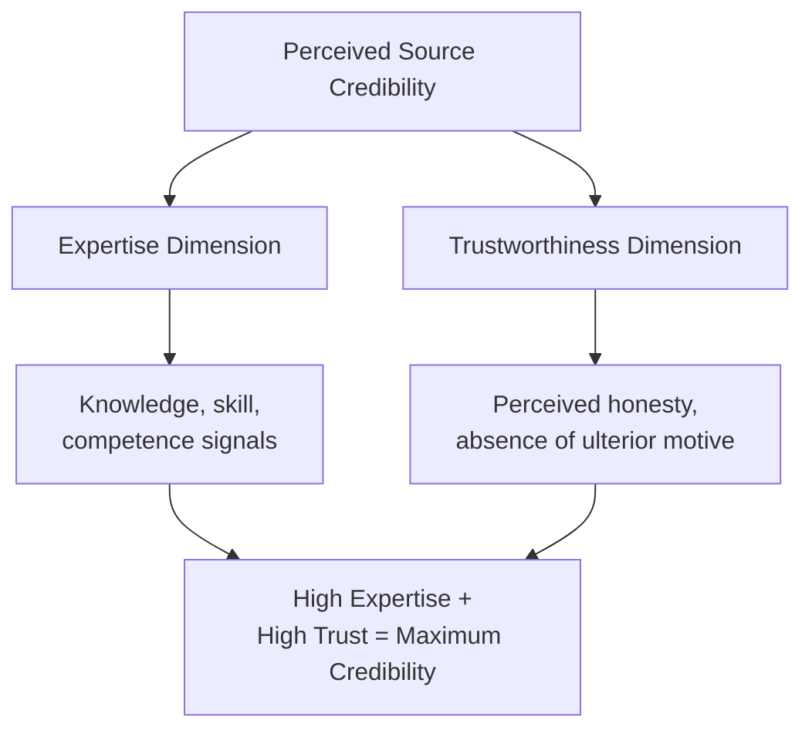
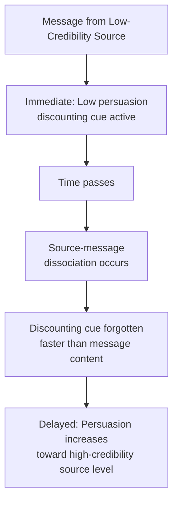

## Source Credibility and Message Effects

### Overview

Source credibility research examines how the perceived characteristics of a message's source — independent of the message's actual content — influence persuasion outcomes. This tradition traces to the **Yale Attitude Change Program** led by **Carl Hovland** in the 1950s, which established source credibility as one of the earliest and most robust variables in persuasion research. The core finding: identical message content produces different persuasive effects depending on who is perceived to be delivering it, though this influence is itself moderated by time, message-source pairing, and the elaboration conditions under which the message is processed.

### The Two Core Dimensions of Source Credibility

Hovland and Weiss's foundational work (1951) identified two primary, largely independent dimensions of perceived source credibility:

**1. Expertise**

The perceived knowledge, skill, or competence of the source regarding the message topic.

- **Key Points**
  - Operates as a heuristic cue (per HSM) or peripheral cue (per ELM) under low-elaboration conditions
  - Can also function as a legitimate input to argument evaluation under high-elaboration conditions (expert testimony as evidence)
- **Example**: A dermatologist endorsing a skincare product is perceived as high-expertise; a random social media influencer with no medical background endorsing the same product is perceived as low-expertise for that specific claim.

**2. Trustworthiness**

The perceived honesty, integrity, and lack of ulterior motive of the source.

- **Key Points**
  - Distinct from expertise — a source can be highly knowledgeable but perceived as biased or self-interested (low trustworthiness), or have low expertise but be perceived as sincere and unbiased (high trustworthiness)
  - Perceived financial or personal incentive to persuade reduces trustworthiness, independent of expertise level
- **Example**: A paid celebrity endorser may be perceived as low-trustworthiness for a health claim (obvious financial incentive) even if the celebrity is otherwise a well-regarded public figure, whereas an independent product-review outlet with no sponsorship ties may be perceived as high-trustworthiness despite lower topical expertise.

### Diagram: Source Credibility Dimensions

### A Third Dimension: Attractiveness/Likability

Later research (notably McGuire, 1985) identified a third, partially distinct credibility-adjacent dimension: **source attractiveness**, encompassing physical attractiveness, similarity to the audience, and likability.

- **Key Points**
  - Operates through a different mechanism than expertise/trustworthiness — primarily via **identification** (the audience wants to be like, or feels similar to, the source) rather than genuine credibility judgment
  - Particularly potent for value-expressive and identity-linked products, per functional theory of attitudes
- **Example**: Celebrity athlete endorsements for athletic apparel work substantially through attractiveness/aspiration rather than genuine product expertise — the athlete is not necessarily perceived as a footwear engineering expert, but as someone the audience wishes to emulate.

### The Sleeper Effect

One of the most theoretically important and counter-intuitive findings in source credibility research: the **sleeper effect** describes a delayed increase in persuasive impact from a low-credibility source over time.

- **Mechanism**: Immediately after exposure, a low-credibility source's message produces less attitude change than a high-credibility source's identical message (discounting cue is active). Over time, the **discounting cue (source) is forgotten faster than the message content itself**, causing the message's persuasive impact to "catch up to" or even exceed that of the high-credibility source.

- [Unverified] The sleeper effect has a complex and somewhat contested replication history in the psychological literature — some conditions and specific experimental paradigms (particularly those involving an explicit, delayed reminder of source identity, known as a "discounting cue reinstatement") are more reliably associated with the effect than others; the phenomenon is real and theoretically established but should not be treated as a guaranteed outcome under all low-credibility-source conditions.
- **Marketing implication** [Inference]: this suggests that low-credibility-source messaging (e.g., low-trust advertorial content, native advertising with weak sponsor disclosure) may retain more persuasive residue over time than immediate post-exposure attitude measurement would suggest — a consideration relevant to long-term brand tracking rather than immediate campaign-response metrics, though marketers should be cautious about relying on this effect deliberately given its inconsistent replication and clear ethical concerns around obscuring source identity.

### Match-Up Hypothesis

The **match-up hypothesis** (Kamins, 1990 and related work) proposes that endorser effectiveness depends on the **congruence between endorser characteristics and product/brand attributes**, rather than endorser credibility or attractiveness in isolation.

- **Example**: An athletic, physically fit celebrity endorsing sports equipment shows strong match-up congruence (attractiveness/expertise relevant to the product category). The same celebrity endorsing an unrelated financial product (e.g., a mutual fund) shows weak match-up congruence, and the attractiveness cue may fail to transfer persuasive value to an unrelated claim domain.
- [Inference] This implies that source credibility effects are not uniformly transferable across product categories — a highly credible source in one domain (e.g., a doctor for health products) does not automatically confer credibility for unrelated claims (e.g., the same doctor endorsing financial services), since expertise, in particular, is domain-specific by nature.

### Interaction with Elaboration Level (ELM/HSM Integration)

Source credibility's persuasive mechanism differs depending on the audience's elaboration level:

| Elaboration Level | Role of Source Credibility |
| --- | --- |
| Low (peripheral/heuristic) | Functions as a direct persuasion cue — "expert says X, so X must be true" without argument evaluation |
| High (central/systematic) | Can bias interpretation of arguments (bias effect, per HSM), serve as one input among many in argument evaluation, or be discounted entirely if audience recognizes source bias |

- Under high elaboration, [Inference] a low-credibility source presenting genuinely strong arguments may still persuade via careful argument evaluation despite the credibility deficit, since the audience is engaging with content rather than relying on the source cue alone — though a credibility deficit strong enough to trigger active source-discounting or suspicion could plausibly undermine even careful evaluation of otherwise strong arguments, a boundary condition not fully resolved in the literature.

### Source Credibility in Digital and Influencer Marketing

Contemporary applications extend classical source credibility research to influencer marketing and native advertising contexts:

- **Perceived authenticity**: functions similarly to trustworthiness — audiences discount sponsored content perceived as inauthentic or excessively promotional
- **Parasocial relationships**: long-term audience-influencer relationships (para-social interaction) can elevate perceived trustworthiness and similarity beyond what a one-off celebrity endorsement achieves, [Speculation] potentially strengthening source credibility effects relative to traditional celebrity endorsement, though rigorous comparative research directly quantifying this difference across formats remains limited
- **Disclosure requirements**: mandatory sponsorship disclosure (e.g., FTC guidelines in the U.S.) directly targets the trustworthiness dimension by making financial incentive explicit — research on disclosure effects generally finds it reduces perceived trustworthiness and persuasive impact to some degree, though findings on the exact magnitude vary by disclosure format, placement, and audience sophistication

### Marketing Applications

**1. Endorser Selection Strategy**

Match endorser dimension (expertise vs. trustworthiness vs. attractiveness) to the claim type: expertise-heavy claims (technical performance, health benefits) call for expert or credentialed sources; identity/aspiration-driven claims call for attractive/relatable sources; trust-sensitive claims (financial products, data privacy) benefit from independent, low-incentive-perception sources.

**2. Third-Party Validation**

Because independent sources carry inherently higher trustworthiness than the brand itself (which has obvious self-interest), third-party reviews, certifications, and earned media are frequently more persuasive per unit of content than equivalent brand-authored claims.

**3. Managing Perceived Incentive**

Explicit or implicit signals of financial motive (aggressive sales language, obvious sponsorship) reduce trustworthiness; softer, editorial-style content formats can preserve higher trust perception, though must be balanced against disclosure and ethical transparency requirements.

**4. Long-Term Brand Tracking Considerations**

Given the sleeper effect's implications, [Speculation] brand tracking studies relying solely on immediate post-exposure measurement may understate or overstate the true long-term persuasive residue of lower-credibility-source campaigns relative to higher-credibility ones; this is a reasonable extrapolation from sleeper-effect theory rather than a standard, widely-adopted measurement practice in the industry.

### Relationship to Other Frameworks

- **Elaboration Likelihood Model / Heuristic-Systematic Model**: source credibility is one of the most-studied peripheral/heuristic cues in both frameworks, and its interaction with elaboration level is a core integration point between source-effects research and dual-process persuasion theory.
- **Functional theory of attitudes**: source attractiveness effects connect most directly to the value-expressive function (identification-driven persuasion), while expertise connects more directly to the utilitarian and knowledge functions.
- **Multi-attribute attitude models**: a credible source can shift belief strength ($b_i$) for specific product attributes by lending credibility to a specific factual claim, functioning as an input into the belief-formation process rather than a wholesale attitude override.

### Boundary Conditions and Critiques

- Credibility dimensions (expertise, trustworthiness, attractiveness) are not perfectly independent in consumer perception; halo effects can cause a source rated highly on one dimension to be over-rated on others, complicating clean measurement.
- The sleeper effect's inconsistent replication history means it should be treated as a real but conditional phenomenon rather than a dependable, universally-applicable persuasion tactic.
- Cultural variation in what constitutes credible source signals (e.g., differing weight placed on institutional authority vs. peer/community endorsement across cultures) is [Speculation] a plausible moderator of these classical findings, though the original Hovland-era research was conducted primarily within a specific cultural and historical context and cross-cultural replication is not uniformly comprehensive across all claimed dimensions.

### SVG: Source Credibility Dimension Mapping (svg_diagram)

<svg xmlns="http://www.w3.org/2000/svg" viewBox="0 0 800 440">
<text x="400" y="30" text-anchor="middle" font-size="18" font-weight="bold" font-family="sans-serif">Source Credibility Dimensions (svg_diagram)</text>
<line x1="400" y1="70" x2="400" y2="400" stroke="#333" stroke-width="1" />
<line x1="100" y1="235" x2="700" y2="235" stroke="#333" stroke-width="1" />
<text x="400" y="60" text-anchor="middle" font-size="12" font-family="sans-serif">High Expertise</text>
<text x="400" y="420" text-anchor="middle" font-size="12" font-family="sans-serif">Low Expertise</text>
<text x="80" y="240" text-anchor="middle" font-size="12" font-family="sans-serif">Low Trust</text>
<text x="720" y="240" text-anchor="middle" font-size="12" font-family="sans-serif">High Trust</text>
<circle cx="600" cy="130" r="8" fill="#4C9A2A" />
<text x="600" y="110" text-anchor="middle" font-size="11" font-family="sans-serif">Independent expert</text>
<text x="600" y="155" text-anchor="middle" font-size="10" font-family="sans-serif" font-style="italic">(e.g., dermatologist,</text>
<text x="600" y="170" text-anchor="middle" font-size="10" font-family="sans-serif" font-style="italic">unpaid reviewer)</text>
<circle cx="230" cy="130" r="8" fill="#D9822B" />
<text x="230" y="110" text-anchor="middle" font-size="11" font-family="sans-serif">Paid expert endorser</text>
<text x="230" y="155" text-anchor="middle" font-size="10" font-family="sans-serif" font-style="italic">(expertise present,</text>
<text x="230" y="170" text-anchor="middle" font-size="10" font-family="sans-serif" font-style="italic">incentive suspected)</text>
<circle cx="600" cy="330" r="8" fill="#2C7FB8" />
<text x="600" y="310" text-anchor="middle" font-size="11" font-family="sans-serif">Trusted friend/peer</text>
<text x="600" y="355" text-anchor="middle" font-size="10" font-family="sans-serif" font-style="italic">(low topical expertise,</text>
<text x="600" y="370" text-anchor="middle" font-size="10" font-family="sans-serif" font-style="italic">high sincerity)</text>
<circle cx="230" cy="330" r="8" fill="#C8375B" />
<text x="230" y="310" text-anchor="middle" font-size="11" font-family="sans-serif">Undisclosed sponsor</text>
<text x="230" y="355" text-anchor="middle" font-size="10" font-family="sans-serif" font-style="italic">(lowest overall</text>
<text x="230" y="370" text-anchor="middle" font-size="10" font-family="sans-serif" font-style="italic">credibility)</text>
</svg>

### Related Topics

- Elaboration Likelihood Model and Heuristic-Systematic Model (source cue processing)
- Sleeper effect replication research and discounting-cue reinstatement
- Match-up hypothesis in celebrity endorsement strategy
- Influencer marketing disclosure and FTC/regulatory guidelines
- Parasocial relationships and long-term audience-creator trust
- Functional theory of attitudes (attractiveness and identification mechanisms)
- Native advertising and advertorial trust perception research