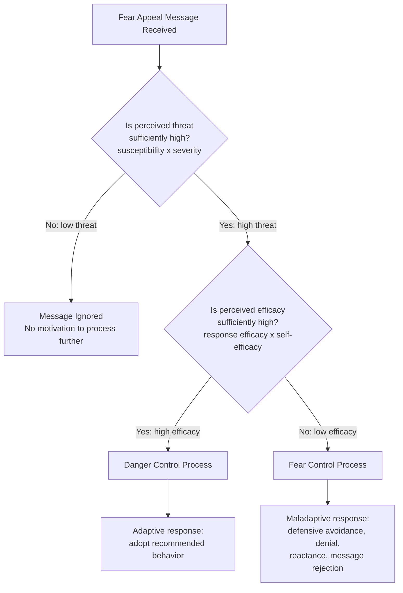
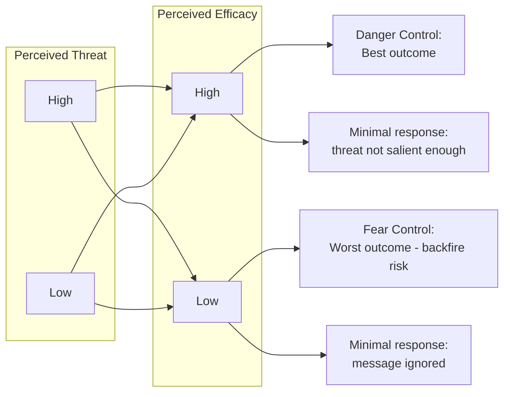

## Fear Appeals and Threat-Based Persuasion

### Overview

Fear appeal research examines how messages that evoke threat and anxiety influence attitude and behavior change. This is one of the most extensively studied and theoretically contested areas of persuasion research, spanning public health campaigns, insurance marketing, cybersecurity messaging, and social cause advertising. The dominant contemporary framework is the **Extended Parallel Process Model (EPPM)**, developed by **Kim Witte (1992)**, which resolved decades of inconsistent earlier findings by identifying the specific conditions under which fear appeals succeed versus backfire.

### Historical Foundations: The Drive Model and Curvilinear Hypothesis

Early fear appeal research (Janis & Feshbach, 1953) proposed a **drive model**: fear creates an aversive drive state that motivates the individual to reduce it, and message compliance is one route to drive reduction. This early work found that *higher* fear sometimes *reduced* persuasion, leading to the **inverted-U (curvilinear) hypothesis** — moderate fear levels were proposed to be optimal, with both very low and very high fear producing weaker persuasion.

- [Unverified] The curvilinear hypothesis had a mixed and inconsistent empirical record across subsequent decades of research, which was a primary motivation for the development of more theoretically precise models like the EPPM; it is best understood as an important historical stepping-stone rather than the current standard model.

### The Extended Parallel Process Model (EPPM)

The EPPM proposes that upon receiving a fear-arousing message, individuals cognitively appraise **two separate dimensions**, and the outcome of this joint appraisal determines whether the message produces **danger control** (adaptive, message-consistent behavior change) or **fear control** (maladaptive defensive responses that reject the message).

**Dimension 1: Perceived Threat**

- **Perceived susceptibility**: "How likely am I to experience this threat?"
- **Perceived severity**: "How serious/harmful would this threat be if it occurred?"

**Dimension 2: Perceived Efficacy**

- **Response efficacy**: "Will the recommended action actually work to reduce the threat?"
- **Self-efficacy**: "Am I personally capable of performing the recommended action?"

$$\text{Message Outcome} = f(\text{Perceived Threat}, \text{Perceived Efficacy})$$

### Diagram: EPPM Decision Logic

### The Four Possible Outcomes

| Perceived Threat | Perceived Efficacy | Outcome |
| --- | --- | --- |
| Low | Low or High | **No response** — threat is dismissed as irrelevant before efficacy is even evaluated |
| High | High | **Danger control** — the individual is motivated and equipped to act; optimal persuasion outcome |
| High | Low | **Fear control** — the individual is motivated but feels unable to act; defensive avoidance, denial, or message rejection follows instead of behavior change |

- **Key Points**
  - The single most important insight of the EPPM: **high threat with low efficacy is the worst-performing combination**, often producing outcomes worse than a low-threat message, because the audience is emotionally activated but has no adaptive outlet — this manifests as denial ("this won't happen to me"), defensive avoidance (actively tuning out the message), reactance (resisting the message on principle), or message derogation (attacking the credibility of the source/message itself)
  - Threat perception is a **necessary but not sufficient** condition for persuasion; it determines whether the message is processed at all, while efficacy determines the *direction* of that processing (adaptive vs. defensive)

### Example: Health Insurance Marketing

- **High threat, high efficacy (danger control)**: "Unexpected medical emergencies cost the average family $3,000+ annually. [response efficacy] Our plan covers 90% of unexpected costs. [self-efficacy] Enrollment takes 5 minutes online." — This is well-constructed: real threat is paired with a clear, achievable, effective solution.
- **High threat, low efficacy (fear control — likely to backfire)**: "Medical bankruptcy can happen to anyone, anytime, without warning" with no clear, simple, affordable solution presented — audience is highly likely to disengage, deny personal susceptibility, or feel overwhelmed rather than act.

### Example: Cybersecurity Awareness Messaging

- **High threat, low efficacy (common failure mode)**: "Your company could be the next ransomware victim, and the average breach costs millions" without simple, actionable steps — [Inference] employees exposed to such messaging without a clear, easy path to compliance (e.g., a specific, low-friction action like enabling two-factor authentication in one click) may plausibly respond with fatalism or disengagement rather than improved security behavior, consistent with EPPM's predicted fear-control outcome, though this specific application context has less direct experimental documentation than the health-communication literature where EPPM is most extensively tested.
- **High threat, high efficacy**: Same threat framing, paired with "Enable two-factor authentication in under 60 seconds — here's exactly how" — provides both response efficacy (the action works) and self-efficacy (the action is easy).

### Boosting Efficacy Perceptions: Practical Techniques

Since efficacy is the pivot point determining whether fear appeals succeed or backfire, marketers and communicators can strengthen perceived efficacy through:

- **Specificity of instructions**: vague recommendations ("be safer online") produce lower self-efficacy than concrete, step-by-step actions ("install this specific app")
- **Demonstrated effectiveness evidence**: statistics, testimonials, or endorsements showing the recommended action genuinely reduces the threat (response efficacy)
- **Reducing perceived difficulty/cost**: framing the action as easy, quick, or low-cost increases self-efficacy
- **Modeling**: showing relatable others successfully performing the recommended behavior (social modeling can support both self-efficacy and response efficacy perceptions)

### Fear Control Manifestations (What Backfire Looks Like)

When threat exceeds efficacy, the EPPM predicts several distinct defensive response patterns rather than a single generic "backfire":

| Fear Control Response | Description |
| --- | --- |
| Denial | Rejecting personal susceptibility ("that won't happen to me") |
| Defensive avoidance | Deliberately avoiding further exposure to the threatening message/topic |
| Reactance | Resisting the message specifically because it feels manipulative or restricts perceived freedom |
| Message/source derogation | Discrediting the message or its source rather than engaging with the threat itself |

- [Inference] Distinguishing which specific fear-control response a given audience segment is likely to exhibit is valuable for message refinement, though the EPPM's original formulation treats these largely as an undifferentiated defensive-response category rather than predicting which specific sub-response will dominate under given conditions.

### Diagram: Threat-Efficacy Interaction Matrix

### Ethical Considerations

Fear appeal design carries distinct ethical responsibilities beyond pure effectiveness optimization:

- **Proportionality**: threat severity claims should be evidence-based and not exaggerated beyond what data supports
- **Avoiding pure fear-control exploitation**: deliberately using high-threat, low-efficacy messaging to manipulate emotional state without providing genuine adaptive recourse is both ethically questionable and, per the EPPM itself, likely to be strategically counterproductive
- **Vulnerable audiences**: populations with pre-existing anxiety, low resources, or limited efficacy to act on recommendations require particular care, since high-threat messaging without accessible solutions risks psychological harm without corresponding behavioral benefit
- [Speculation] Some public health communication scholars argue that fear-based campaigns should be a secondary tool relative to positive/gain-framed and efficacy-building messaging in vulnerable populations specifically, though this represents a strategic and ethical stance within the field rather than a universally adopted standard.

### Relationship to Other Frameworks

- **Elaboration Likelihood Model / HSM**: fear arousal can increase motivation to process a message (potentially pushing toward central/systematic processing), but if perceived efficacy is low, this heightened motivation is redirected toward defensive processing (fear control) rather than argument evaluation — an important nuance distinguishing "motivated to process" from "motivated to comply."
- **Protection Motivation Theory (Rogers, 1975, 1983)**: a closely related predecessor/parallel framework to the EPPM, also built around threat appraisal (severity, vulnerability) and coping appraisal (response efficacy, self-efficacy); the EPPM extended this by explicitly modeling the fear-control pathway as a distinct, competing process rather than treating low-efficacy simply as reduced motivation.
- **Cognitive dissonance theory**: fear-control responses like denial and message derogation can be understood as dissonance-avoidance strategies — rejecting the threatening message preemptively avoids the dissonance that would arise from acknowledging a threat one feels unable to address.

### Marketing Applications Summary

**1. Insurance, Financial Protection, and Risk-Mitigation Products**: naturally threat-relevant categories where EPPM directly applies — success depends on pairing genuine risk communication with clear, achievable protective actions.

**2. Cybersecurity and Data Privacy Messaging**: increasingly important application domain; effective campaigns pair specific threat scenarios with simple, immediate protective actions rather than abstract risk statistics alone.

**3. Public Health and Social Cause Campaigns**: the most extensively studied application domain for the EPPM; anti-smoking, vaccination, and safe-driving campaigns are common empirical testing grounds for threat-efficacy message design.

**4. B2B Risk-Based Selling**: enterprise security, compliance, and insurance sales often implicitly rely on threat-efficacy logic — [Inference] sales messaging emphasizing regulatory or operational risk without a correspondingly clear, feasible mitigation path plausibly risks triggering buyer avoidance or stalling rather than urgency-driven action, consistent with EPPM's predicted fear-control outcome, though this extension from health communication to B2B sales contexts is an application inference rather than a directly EPPM-tested domain.

### Boundary Conditions and Critiques

- The EPPM's threat and efficacy appraisals are typically measured via self-report, which may not fully capture the automatic, non-conscious components of fear response documented in affective neuroscience research.
- Individual differences (trait anxiety, prior experience with the threat domain, cultural risk perception norms) moderate threat and efficacy appraisals in ways the base EPPM model does not explicitly parameterize.
- [Unverified] The precise threshold at which perceived threat or efficacy becomes "sufficiently high" to trigger a given pathway is not specified as a fixed, universal value in the model — thresholds are understood to be relative and context/individual-dependent rather than fixed cutoffs, which limits precise predictive specificity in applied campaign pretesting.

### SVG: EPPM Outcome Matrix (svg_diagram)

<svg xmlns="http://www.w3.org/2000/svg" viewBox="0 0 800 460">
<text x="400" y="30" text-anchor="middle" font-size="18" font-weight="bold" font-family="sans-serif">EPPM Threat x Efficacy Matrix (svg_diagram)</text>
<line x1="200" y1="80" x2="200" y2="400" stroke="#333" stroke-width="2" />
<line x1="200" y1="240" x2="700" y2="240" stroke="#333" stroke-width="2" />

<text x="450" y="65" text-anchor="middle" font-size="13" font-weight="bold" font-family="sans-serif">Perceived Threat</text>

<text x="325" y="80" text-anchor="middle" font-size="12" font-family="sans-serif">Low</text>

<text x="575" y="80" text-anchor="middle" font-size="12" font-family="sans-serif">High</text>

<text x="140" y="240" text-anchor="middle" font-size="13" font-weight="bold" font-family="sans-serif" transform="rotate(-90 140 240)">Perceived Efficacy</text>

<text x="180" y="160" text-anchor="end" font-size="12" font-family="sans-serif">High</text>

<text x="180" y="330" text-anchor="end" font-size="12" font-family="sans-serif">Low</text>

<rect x="200" y="80" width="250" height="160" fill="#FDF0E8" />
<text x="325" y="165" text-anchor="middle" font-size="12" font-family="sans-serif">No response</text>
<text x="325" y="182" text-anchor="middle" font-size="10" font-family="sans-serif" font-style="italic">(threat not salient)</text>
<rect x="450" y="80" width="250" height="160" fill="#EFFDE8" />
<text x="575" y="155" text-anchor="middle" font-size="13" font-weight="bold" font-family="sans-serif">DANGER CONTROL</text>
<text x="575" y="175" text-anchor="middle" font-size="10" font-family="sans-serif" font-style="italic">Best outcome:</text>
<text x="575" y="190" text-anchor="middle" font-size="10" font-family="sans-serif" font-style="italic">adaptive behavior change</text>
<rect x="200" y="240" width="250" height="160" fill="#FDF0E8" />
<text x="325" y="325" text-anchor="middle" font-size="12" font-family="sans-serif">No response</text>
<text x="325" y="342" text-anchor="middle" font-size="10" font-family="sans-serif" font-style="italic">(threat not salient)</text>
<rect x="450" y="240" width="250" height="160" fill="#FDE8EC" />
<text x="575" y="315" text-anchor="middle" font-size="13" font-weight="bold" font-family="sans-serif">FEAR CONTROL</text>
<text x="575" y="335" text-anchor="middle" font-size="10" font-family="sans-serif" font-style="italic">Worst outcome:</text>
<text x="575" y="350" text-anchor="middle" font-size="10" font-family="sans-serif" font-style="italic">denial, avoidance, reactance</text>
</svg>

### Related Topics

- Protection Motivation Theory (Rogers) as EPPM's theoretical predecessor
- Message framing (gain vs. loss framing) in health and risk communication
- Reactance theory and its role in defensive message rejection
- Elaboration Likelihood Model and motivated processing under emotional arousal
- Ethical standards in public health and risk-based marketing communication
- Self-efficacy theory (Bandura) as the psychological foundation of the efficacy dimension
- Cognitive dissonance as a mechanism underlying message/source derogation