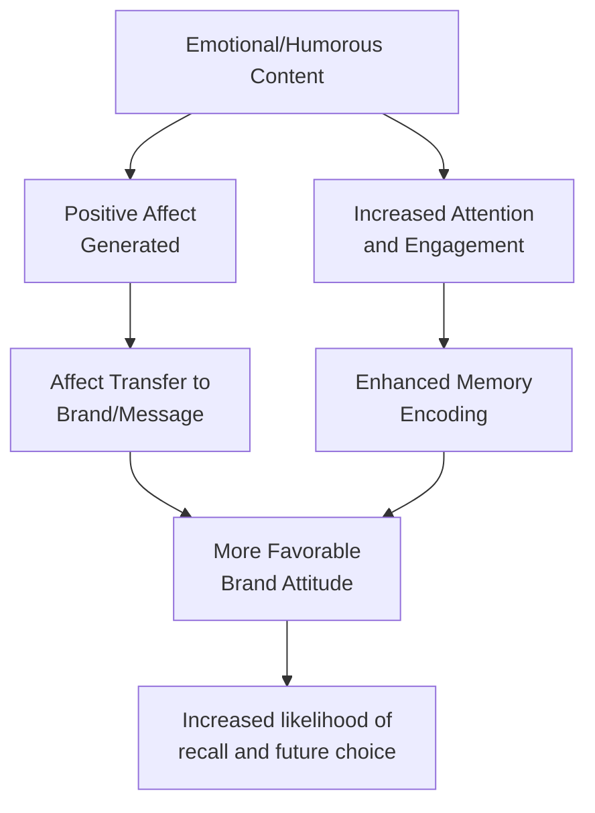
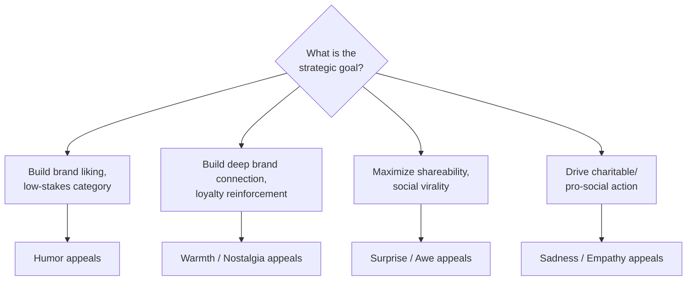

## Humor and Emotional Appeals in Messaging

### Overview

Humor and broader emotional appeals represent a persuasion strategy fundamentally distinct from argument-based (cognitive) approaches: rather than relying primarily on logical evidence, these appeals work by shaping affective state, attention, memory encoding, and source/brand association. Emotional appeals span a wide spectrum — humor, warmth, nostalgia, surprise, sadness, awe, and fear (covered separately under threat-based persuasion) — each operating through partially distinct psychological mechanisms with different strategic applications and risk profiles.

### Core Mechanisms of Emotional Persuasion

**1. Affect-as-Information**

Per Schwarz and Clore's affect-as-information theory, individuals often use their current emotional state as a heuristic input when forming judgments, effectively asking "how do I feel about this?" rather than exhaustively analyzing the actual message content.

- [Inference] This implies that a positive emotional response elicited by an ad (via humor, warmth, or pleasant music) can transfer to the evaluated brand even when the emotional content bears no logical relationship to actual product attributes — a mechanism sometimes referred to as **affect transfer** or **evaluative conditioning** in the marketing literature.

**2. Classical Conditioning / Evaluative Conditioning**

Repeated pairing of a brand (conditioned stimulus) with a positive emotional trigger (unconditioned stimulus — humor, attractive imagery, pleasant music) can, over repeated exposures, transfer the positive affective response to the brand itself.

**3. Attention and Memory Encoding**

Emotionally arousing content — whether humorous, surprising, or touching — reliably captures attention more effectively than emotionally neutral content, and emotional arousal at encoding is associated with enhanced memory consolidation, [Unverified] though the specific relationship between arousal intensity and memory strength is not strictly linear across all studies and can vary by valence, content type, and delay interval before recall testing.

### Diagram: Emotional Appeal Mechanism Pathways

### Humor in Advertising: Mechanisms and Theories

**Incongruity-Resolution Theory**

The dominant theoretical account of why humor is perceived as funny: humor arises from the perception of an **incongruity** (something unexpected, absurd, or logically inconsistent) that is then **resolved** in a way that makes sense within an alternate frame, producing pleasurable cognitive surprise.

- **Example**: An ad depicting a serious corporate boardroom scene, where the "important announcement" turns out to be trivial or absurd (incongruity), followed by a punchline that recontextualizes the scene logically (resolution) — the humor derives from this surprise-then-sense-making sequence.

**Superiority Theory**

An older theoretical tradition proposing humor arises from a sense of superiority over another person or situation (e.g., seeing someone else's mishap). [Speculation] This mechanism is generally considered less central to contemporary advertising humor than incongruity-resolution, given ethical and brand-safety concerns with humor that positions the audience as superior to a mocked party, though it remains theoretically relevant to certain comedic ad formats (e.g., self-deprecating brand humor, where the brand itself is the target).

**Relief Theory**

Proposes humor functions as a release of built-up nervous energy or tension. [Speculation] This is generally considered the least empirically dominant of the three classic humor theories in contemporary advertising research, though tension-and-release structures do appear in some ad formats (e.g., an ad building suspense before a comedic payoff).

### Key Empirical Findings on Advertising Humor

- **Attention capture**: humorous ads generally attract and hold attention more effectively than non-humorous equivalents, a fairly consistent finding across the advertising effectiveness literature
- **Liking transfer**: humor tends to increase liking of the ad itself, and this ad-liking frequently (though not universally) transfers to brand liking
- **Comprehension trade-off risk**: [Unverified] highly complex or elaborate humor can, in some cases, reduce message comprehension by diverting cognitive resources toward processing the joke itself rather than the underlying brand/product claim — this trade-off is content- and complexity-dependent rather than a universal effect of humor as such
- **Persuasion effects are weaker and less consistent than attention/liking effects**: humor's positive effect on attitude toward the ad is more robustly documented than its effect on actual purchase intention or behavior change, [Unverified] and the gap between "liked the ad" and "changed my behavior/attitude toward the brand" is a recurring caveat across meta-analytic reviews of advertising humor research

### Humor-Product Fit and Boundary Conditions

Humor effectiveness is **not universal** across product categories and message types — several important boundary conditions constrain when humor helps versus hurts:

| Condition | Humor Generally Helps | Humor Generally Risks Backfiring |
| --- | --- | --- |
| Product involvement | Low-involvement, low-risk products | High-involvement, high-risk products (financial services, healthcare, insurance) |
| Message complexity | Simple, easily-grasped claims | Complex, information-dense claims requiring careful processing |
| Brand/product seriousness | Fun, lifestyle, entertainment categories | Serious, safety-critical, or socially sensitive categories |
| Cultural context | Humor styles well-matched to target culture | Cross-cultural campaigns using humor that doesn't translate/resonate |

- **Example**: Self-deprecating or absurdist humor may work well for a low-cost snack brand (low stakes, simple message) but poorly for a life insurance company communicating complex financial protection benefits (high stakes, information-dense, seriousness expectation).

### Interaction with Elaboration Level

Humor's persuasive mechanism connects directly to dual-process theory (ELM/HSM):

- Under **low elaboration**, humor functions as a peripheral/heuristic cue — positive affect transfers to the brand with minimal argument scrutiny
- Under **high elaboration**, humor can **distract from central-route argument processing**, which is advantageous when the underlying argument is weak (distraction reduces counter-arguing) but disadvantageous when the underlying argument is strong (distraction reduces the persuasive benefit of genuinely compelling content)
- [Inference] This implies a strategic principle: humor may be more valuable as a persuasion tool when the brand's actual argument/evidence is comparatively weak (since distraction protects against scrutiny), while strong-argument brands may sometimes see higher returns from complementing rather than centering humor, so the underlying evidence still receives adequate elaboration — though this is a theoretical extrapolation from the distraction literature rather than a universally tested prescriptive rule.

### Other Emotional Appeal Categories

**Warmth**

Emotional appeals evoking tenderness, empathy, or affectionate connection (family scenes, caregiving, reunions).

- **Example**: Holiday-season advertising frequently uses warmth appeals (family reunions, acts of kindness) to build positive brand association through pure affect transfer rather than argument.

**Nostalgia**

Appeals evoking sentimental longing for the past, often through retro branding, familiar cultural references, or "remember when" framing.

- [Inference] Nostalgia appeals may be particularly effective for reinforcing established brand relationships and loyalty (reactivating positive prior associations) rather than for building persuasion with entirely new prospects who lack the relevant shared cultural/personal reference points.

**Surprise and Awe**

Appeals leveraging unexpectedness or a sense of wonder, frequently used to maximize shareability and social virality in digital/social advertising contexts.

**Sadness/Empathy**

Appeals designed to evoke compassion or concern, common in cause marketing, charitable campaigns, and public service announcements — functions through a different mechanism than fear appeals (evoking pro-social motivation rather than self-protective threat response), though both fall under the broader emotional-appeal umbrella.

### Diagram: Emotional Appeal Selection by Context

### Marketing Applications

**1. Category-Appropriate Appeal Selection**

Match emotional appeal type to product involvement and category seriousness — humor for low-stakes/lifestyle categories, warmth for family/relationship-oriented categories, gravity-appropriate empathy appeals for cause-related and social-impact messaging.

**2. Distraction Management for Weak vs. Strong Arguments**

When the underlying product argument is strong and central-route processing would benefit the brand, emotional appeals should complement rather than dominate the creative, preserving space for argument comprehension; when the underlying argument is comparatively weak, heavier emotional/humor weighting can be a more defensible strategic choice.

**3. Testing for Comprehension Trade-offs**

Given the documented risk that complex humor can reduce message comprehension, pre-testing for both "ad liking" and "message/brand recall" separately — rather than "ad liking" alone — helps detect cases where humor is entertaining but failing to transfer to actual brand communication goals.

**4. Cross-Cultural Adaptation**

Humor in particular is highly culture-specific (reliant on shared cultural references, linguistic wordplay, and social norms around what is appropriate to joke about); [Speculation] global campaigns relying on a single humor execution across highly diverse markets carry meaningfully higher localization risk than warmth or awe-based appeals, which may translate more consistently across cultural contexts, though rigorous comparative cross-cultural effectiveness data specifically isolating this claim is limited.

### Relationship to Other Frameworks

- **Elaboration Likelihood Model / HSM**: emotional appeals, including humor, are classic peripheral/heuristic cues, and their distraction-based mechanism directly maps onto ELM's motivation/ability determinants of route selection.
- **Functional theory of attitudes**: emotional appeals connect most naturally to value-expressive and ego-defensive functions (identity, self-image, anxiety-reduction) rather than the utilitarian or knowledge functions, which are better served by argument-based, informational appeals.
- **Source credibility research**: humor and warmth can enhance perceived source likability, which interacts with (and is theoretically distinct from) source expertise and trustworthiness.
- **Fear appeals (EPPM)**: emotional appeals broadly and fear appeals specifically share the foundational premise that affective arousal shapes persuasion outcomes, but diverge sharply in mechanism — fear appeals hinge on threat/efficacy appraisal producing either adaptive or defensive responses, while humor and warmth generally operate through more straightforward positive-affect transfer without an equivalent "backfire" appraisal structure.

### Boundary Conditions and Critiques

- Humor and emotional response are inherently subjective and demographically/culturally variable, making universal creative prescriptions unreliable without audience-specific testing.
- The gap between ad-level emotional response (liking, engagement) and brand-level or behavior-level outcomes (purchase intention, actual sales) is a persistent measurement and causal-inference challenge in emotional appeal research — strong ad-liking metrics do not guarantee proportional business impact.
- [Unverified] The relative effectiveness ranking of different emotional appeal types (humor vs. warmth vs. nostalgia, etc.) is highly dependent on category, brand maturity, and campaign objective; general claims that one appeal type is "more effective" than another without specifying these contextual factors should be treated with caution.
- Ethical considerations apply particularly to sadness/empathy appeals in cause marketing (risk of "poverty porn" or exploitative suffering imagery) and warrant separate consideration from the more purely aesthetic risks associated with humor or nostalgia appeals.

### SVG: Humor Effectiveness by Product Involvement (svg_diagram)

<svg xmlns="http://www.w3.org/2000/svg" viewBox="0 0 800 400">
<text x="400" y="30" text-anchor="middle" font-size="18" font-weight="bold" font-family="sans-serif">Humor Effectiveness by Involvement (svg_diagram)</text>
<line x1="90" y1="340" x2="740" y2="340" stroke="#333" stroke-width="2" />
<line x1="90" y1="340" x2="90" y2="60" stroke="#333" stroke-width="2" />
<text x="415" y="375" text-anchor="middle" font-size="13" font-family="sans-serif">Product Involvement / Stakes (Low to High)</text>
<text x="35" y="200" text-anchor="middle" font-size="13" font-family="sans-serif" transform="rotate(-90 35 200)">Humor Effectiveness</text>
<path d="M 110 100 Q 300 130 450 220 T 700 320" stroke="#D9822B" stroke-width="3" fill="none" />
<circle cx="150" cy="105" r="6" fill="#4C9A2A" />
<text x="150" y="90" text-anchor="middle" font-size="11" font-family="sans-serif">Snack food</text>
<circle cx="400" cy="205" r="6" fill="#2C7FB8" />
<text x="400" y="190" text-anchor="middle" font-size="11" font-family="sans-serif">Consumer electronics</text>
<circle cx="650" cy="310" r="6" fill="#C8375B" />
<text x="650" y="295" text-anchor="middle" font-size="11" font-family="sans-serif">Life insurance</text>
</svg>

### Related Topics

- Extended Parallel Process Model and fear appeals (contrasting emotional mechanism)
- Elaboration Likelihood Model and distraction-based peripheral processing
- Affect-as-information theory and evaluative conditioning
- Functional theory of attitudes (value-expressive and ego-defensive connections)
- Cause marketing and ethical considerations in empathy-based appeals
- Cross-cultural advertising adaptation and localization strategy
- Source credibility and likability as a persuasion dimension