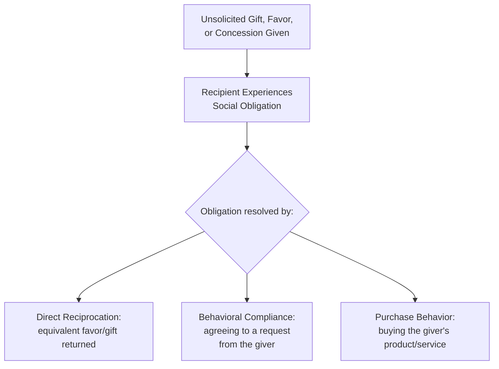
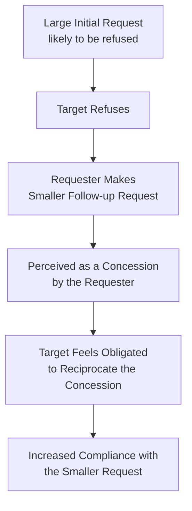

## Reciprocity and the Norm of Obligation

### Overview

Reciprocity is one of the most robust and widely-documented compliance principles in social psychology, formalized in marketing and persuasion contexts primarily through **Robert Cialdini's** work on influence (1984, *Influence: The Psychology of Persuasion*). The **norm of reciprocity** describes a near-universal social expectation: when someone gives us something, we feel obligated to give something back. This obligation operates largely automatically and can be triggered even by unsolicited, small, or seemingly trivial gifts, favors, or concessions — making it one of the most operationally powerful and widely-deployed tools in applied marketing and sales practice.

### Theoretical Foundation

The anthropological and sociological roots of reciprocity trace to **Alvin Gouldner's** (1960) identification of the **norm of reciprocity** as a near-universal feature of human social organization, functioning as a foundational mechanism for cooperative exchange across virtually all documented human societies.

- **Key Points**
  - The norm operates largely below conscious deliberation — recipients often feel obligated to reciprocate without explicitly reasoning through the social contract involved
  - Violating the norm (accepting without reciprocating) carries genuine social discomfort and reputational risk, which is precisely what gives the norm its behavioral force
  - The obligation to repay can be triggered even when the initial gift was **unsolicited and unwanted** by the recipient — this is a critical and somewhat counter-intuitive feature exploited in commercial and compliance contexts

### The Free Sample Effect (Classic Demonstration)

Cialdini's often-cited illustrative example (drawing on earlier restaurant-tipping and door-to-door sales research) involves the disproportionate effect of small unsolicited gifts on compliance rates: **a small gift or free sample, given without obligation, measurably increases the recipient's likelihood of purchasing or complying with a subsequent request** — even when the gift's monetary value is trivial relative to the resulting purchase.

- **Example**: A grocery store food-sampling program (giving away small tastes of a product) reliably increases subsequent purchase rates of the sampled item well beyond what pure taste-preference discovery alone would predict, [Inference] because the sampling itself functions as an unsolicited gift that activates reciprocity obligation independent of the taste information provided — though isolating the pure reciprocity effect from the taste-discovery effect in any single sampling event is empirically difficult since both mechanisms operate simultaneously.

### Diagram: Reciprocity Mechanism

### Reciprocal Concessions: The Door-in-the-Face Technique

A specific, well-documented application of reciprocity operates through **concession-making** rather than direct gift-giving: the **door-in-the-face (DITF) technique** (Cialdini et al., 1975).

**Mechanism**: A requester first makes a deliberately large, likely-to-be-refused request, then follows with a smaller, more reasonable "real" request. Because the requester appears to have made a concession (scaling down their ask), the target feels a reciprocal obligation to also concede — by agreeing to the smaller request.

- **Example**: A charity solicitor first asks for a large monthly pledge (likely refused), then follows with "Could you at least contribute $10 once?" — the smaller ask, framed as a concession from the larger one, sees higher compliance than if it had been presented as the sole opening request.
- [Unverified] The door-in-the-face effect has shown a somewhat inconsistent replication record across different contexts and requester-target relationship types compared to the foundational reciprocity principle itself; certain boundary conditions (e.g., the same requester making both requests, a delay too long between requests, or the target perceiving manipulation) can weaken or eliminate the effect.

### Contrast with Foot-in-the-Door Technique

The reciprocity-based door-in-the-face technique is frequently taught alongside the **foot-in-the-door (FITD) technique** (Freedman & Fraser, 1966), which operates through a different underlying mechanism (self-perception/consistency rather than reciprocal concession):

| Technique | Sequence | Underlying Mechanism |
| --- | --- | --- |
| Door-in-the-face | Large request → refusal → smaller request | Reciprocal concession (obligation to reciprocate the requester's "concession") |
| Foot-in-the-door | Small request → agreement → larger request | Self-perception/consistency (having agreed once, the individual perceives themselves as the type of person who complies, and complies again) |

- [Inference] Because these two techniques rely on distinct psychological mechanisms, they are not simply mirror-image strategies with the request order reversed — each has different optimal conditions, and combining or conflating them in campaign design risks applying the wrong theoretical logic to a given persuasion context.

### Reciprocal Self-Disclosure and Information Exchange

Reciprocity extends beyond material gifts and favors to **information exchange**: when a communicator shares personal, vulnerable, or exclusive information, recipients often feel a norm-driven pull to reciprocate with their own disclosure — a mechanism relevant to relationship-building sales approaches, personalized marketing data collection, and community-building content strategies.

- **Example**: A brand's "behind-the-scenes" content sharing internal processes, founder stories, or exclusive information may prime audience reciprocity in the form of increased engagement, user-generated content, or willingness to share personal data/feedback with the brand.

### Marketing and Sales Applications

**1. Free Trials and Samples**

The most direct commercial application: free trials (SaaS), samples (CPG/retail), and free consultations (professional services) leverage reciprocity to increase subsequent conversion, functioning alongside their more straightforward "risk reduction" and "product discovery" benefits.

**2. Value-First Content Marketing**

Providing genuinely useful free content (educational resources, tools, guides) before any sales ask is a widely-adopted content marketing strategy explicitly informed by reciprocity principles — the audience is expected to feel some reciprocal goodwill toward the brand, [Inference] though isolating reciprocity's specific contribution to subsequent conversion from simple brand awareness/trust-building effects of the same content is difficult in applied marketing measurement.

**3. Loyalty Program Surprise Rewards**

Unexpected, unsolicited rewards or upgrades within loyalty programs (surprise bonus points, unrequested upgrades) are specifically designed to trigger reciprocity obligation beyond what the program's stated earn-and-redeem structure alone would produce.

**4. Negotiation and Concession Framing (B2B Sales)**

Deliberately opening B2B negotiations with an ambitious initial position, then conceding to the actual target terms, can leverage door-in-the-face-style reciprocal concession dynamics — though this must be balanced against the technique's more fragile replication profile and the risk of damaging trust if the buyer perceives the initial position as insincere or manipulative.

**5. Personalized Outreach and Relationship Selling**

Sales approaches emphasizing genuine, unsolicited value delivery (introductions, useful information, problem-solving assistance unconnected to an immediate sale) prior to any ask are a direct commercial application of reciprocity in relationship-based B2B and high-touch consumer sales models.

### Boundary Conditions and Limits

Reciprocity's power is not unconditional — several factors moderate its effectiveness:

- **Perceived sincerity**: if the initial gift or concession is perceived as a manipulative or insincere tactic rather than genuine goodwill, the obligation to reciprocate weakens substantially or can trigger reactance instead
- **Magnitude mismatch**: excessively generous gifts relative to social context can create discomfort rather than warm obligation, particularly if the recipient suspects an unreasonable reciprocal expectation is attached
- **Relationship context**: reciprocity operates differently in transactional/commercial relationships (where some obligation may be expected and normalized) versus personal relationships (where commercial-style reciprocity framing can feel inappropriate or transactional in an unwelcome way)
- **Cultural variation**: [Speculation] the specific norms governing gift-giving, obligation, and appropriate reciprocation timing vary considerably across cultures, and applying a reciprocity-based tactic calibrated for one cultural context to another without adaptation carries meaningful risk of misfire or unintended offense, though the underlying reciprocity norm itself is documented as broadly cross-cultural in its general existence.

### Ethical Considerations

- Reciprocity-based tactics sit on a spectrum from genuinely value-additive (a useful free resource, honest trial) to manipulative (deliberately engineered obligation designed to override careful decision-making)
- Deceptive framing of a "gift" that is actually contingent or has hidden strings attached undermines both the ethical standing and, per the sincerity-perception boundary condition above, the practical effectiveness of the tactic
- Regulatory and disclosure considerations apply particularly to contexts where reciprocity-triggering gifts intersect with conflict-of-interest concerns (e.g., pharmaceutical sample-giving to healthcare providers, subject to specific industry regulation in many jurisdictions)

### Relationship to Other Compliance Principles

Reciprocity is one of several core Cialdini-identified compliance principles (alongside commitment/consistency, social proof, authority, liking, and scarcity); [Inference] in applied campaign design, these principles are frequently combined rather than deployed in isolation — for example, a free trial (reciprocity) that also displays user-count social proof and time-limited scarcity messaging simultaneously — though isolating the marginal contribution of each individual principle within a multi-principle campaign is a persistent measurement challenge in applied persuasion research.

### Boundary Conditions and Critiques

- Much of the foundational reciprocity research derives from mid-20th-century social psychology experiments; while the core phenomenon is considered well-established, [Unverified] specific effect-size figures from classic studies should be treated as illustrative of the phenomenon's existence and direction rather than precisely generalizable magnitudes for contemporary digital marketing contexts.
- Overuse or transparent tactical deployment of reciprocity triggers (e.g., audiences becoming sophisticated about recognizing "free trial as sales tactic") may reduce the norm's practical effectiveness over time in heavily marketed categories, though systematic longitudinal data on this specific erosion effect is limited.
- The door-in-the-face technique specifically carries a less robust and more context-dependent replication record than the foundational reciprocity principle, and should be applied with corresponding caution relative to more straightforward gift/sample-based reciprocity tactics.

### SVG: Reciprocity Techniques Comparison (svg_diagram)

<svg xmlns="http://www.w3.org/2000/svg" viewBox="0 0 800 380">
<text x="400" y="30" text-anchor="middle" font-size="18" font-weight="bold" font-family="sans-serif">Reciprocity-Based Techniques (svg_diagram)</text>
<rect x="50" y="70" width="330" height="270" rx="10" fill="#E8F4FD" stroke="#2C7FB8" stroke-width="2" />
<text x="215" y="100" text-anchor="middle" font-size="15" font-weight="bold" font-family="sans-serif">Direct Gift/Sample</text>
<text x="70" y="135" font-size="12" font-family="sans-serif">1. Unsolicited gift given</text>
<text x="70" y="160" font-size="12" font-family="sans-serif">2. Obligation felt</text>
<text x="70" y="185" font-size="12" font-family="sans-serif">3. Compliance/purchase follows</text>
<text x="70" y="230" font-size="11" font-style="italic" font-family="sans-serif">Example: free product sample,</text>
<text x="70" y="248" font-size="11" font-style="italic" font-family="sans-serif">free trial, free consultation</text>
<text x="70" y="290" font-size="11" font-family="sans-serif">Replication: strong, consistent</text>
<rect x="420" y="70" width="330" height="270" rx="10" fill="#FDF0E8" stroke="#D9822B" stroke-width="2" />
<text x="585" y="100" text-anchor="middle" font-size="15" font-weight="bold" font-family="sans-serif">Door-in-the-Face</text>
<text x="440" y="135" font-size="12" font-family="sans-serif">1. Large request refused</text>
<text x="440" y="160" font-size="12" font-family="sans-serif">2. Smaller request follows</text>
<text x="440" y="185" font-size="12" font-family="sans-serif">3. Perceived as concession</text>
<text x="440" y="230" font-size="11" font-style="italic" font-family="sans-serif">Example: charity ask sequence,</text>
<text x="440" y="248" font-size="11" font-style="italic" font-family="sans-serif">negotiation opening position</text>
<text x="440" y="290" font-size="11" font-family="sans-serif">Replication: moderate, context-dependent</text>
</svg>

### Related Topics

- Commitment and consistency principle (Cialdini) and foot-in-the-door technique
- Social proof and authority as complementary compliance principles
- Scarcity and urgency-based persuasion tactics
- Gouldner's norm of reciprocity in sociological exchange theory
- Ethical standards in gift-based marketing and conflict-of-interest regulation
- Free trial and freemium business model design
- Negotiation strategy and concession-sequencing tactics