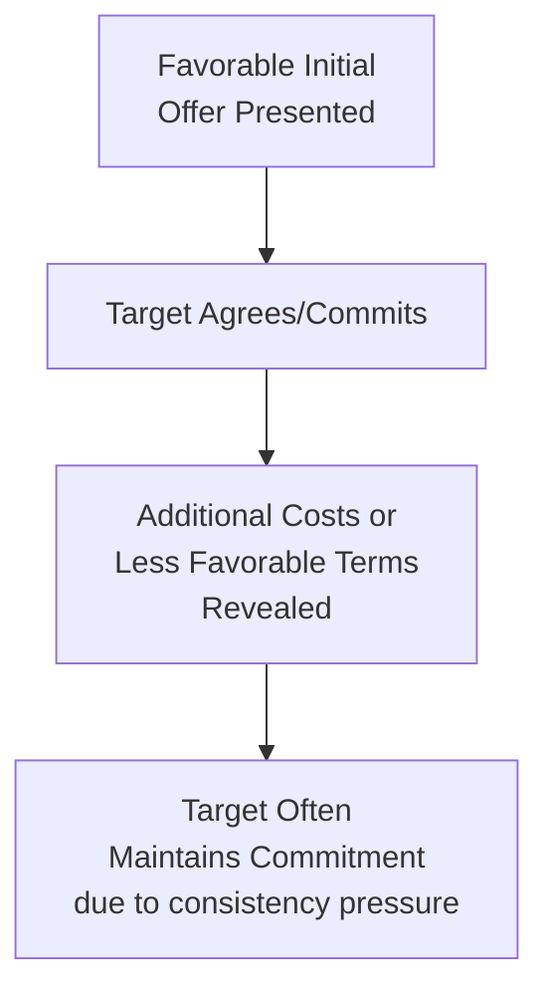

## Commitment, Consistency, and Foot-in-the-Door


### Overview

The commitment and consistency principle, extensively documented by **Robert Cialdini** and grounded in earlier social psychology research, describes a powerful human motivation to **behave in ways consistent with prior commitments, statements, and self-perceptions**. Once an individual makes a commitment — especially one that is active, public, effortful, and perceived as freely chosen — a strong psychological pressure emerges to act in accordance with that commitment going forward, even when circumstances change or the original reasoning no longer fully applies. This principle underlies one of the most extensively studied and applied compliance techniques in marketing and sales: the **foot-in-the-door (FITD) technique**.

### Theoretical Foundations

**Cognitive Dissonance as Underlying Mechanism**

Consistency pressure is substantially explained by **cognitive dissonance theory** (Festinger, 1957): behaving inconsistently with a prior commitment creates uncomfortable psychological tension between the "I did/said X" cognition and any subsequent "but I'm now doing not-X" cognition, motivating the individual to resolve this tension by maintaining behavioral consistency.

**Self-Perception Theory as an Alternative/Complementary Mechanism**

**Daryl Bem's self-perception theory** (1967) offers an alternative account: rather than experiencing genuine internal discomfort, individuals infer their own attitudes and identity from observing their own past behavior — "I agreed to that small request, so I must be the type of person who supports this cause/brand." This self-inference then guides subsequent behavior to remain consistent with the inferred self-concept.

- [Inference] Most contemporary treatments regard dissonance-based and self-perception-based accounts as complementary rather than competing explanations for consistency effects, with self-perception theory plausibly dominating for low-stakes, low-arousal initial commitments and genuine dissonance-driven discomfort dominating for higher-stakes, higher-arousal ones — though the precise boundary between these mechanisms remains an area of ongoing theoretical discussion rather than firmly settled consensus.

### The Foot-in-the-Door Technique

Developed and named by **Freedman and Fraser (1966)**, the foot-in-the-door technique involves securing agreement to a **small, easy initial request**, which increases the likelihood of subsequent compliance with a **larger, related follow-up request**.

```mermaid
flowchart TD
    A[Small Initial Request<br/>easy to agree to] --> B[Target Agrees]
    B --> C[Self-Perception Shift:<br/>"I am the type of person<br/>who supports this"]
    C --> D[Larger Follow-up<br/>Request Made]
    D --> E[Increased Compliance<br/>vs. baseline without<br/>the initial small request]
```

- **Key Points**
  - The initial request must be genuinely accepted (not merely presented) for the technique to function — compliance with the small request is the mechanism, not mere exposure to it
  - The technique is generally more effective when the follow-up request is **related in theme or domain** to the initial request, consistent with a self-perception mechanism grounded in a specific identity/value domain rather than generalized compliance
  - Freedman and Fraser's original field study found that residents who first agreed to a small request (a window sign) showed substantially higher compliance with a much larger follow-up request (a large yard sign) compared to residents approached only with the large request directly

### Example: Marketing Application

- **Step 1 (small ask)**: A brand asks a website visitor to complete a simple 1-question poll or provide just an email address for a free resource
- **Step 2 (self-perception activation)**: The visitor's completion of that small action subtly reinforces an identity as "someone interested in this brand/topic"
- **Step 3 (larger ask)**: A follow-up email sequence progressively requests larger commitments — downloading a more substantial resource, attending a webinar, starting a free trial, then eventually a paid conversion
- [Inference] This staged escalation logic underlies much of modern marketing funnel design (lead magnet → nurture sequence → paid offer), where each stage functions partly as a foot-in-the-door for the next, though funnel design also incorporates other principles (trust-building, education, timing) simultaneously, making it difficult to isolate the specific incremental contribution of the consistency mechanism alone within a full funnel's overall conversion performance.

### Conditions That Strengthen the Consistency Effect

Cialdini's broader analysis identifies specific properties of a commitment that make it more likely to produce durable, consistency-driven follow-through:

| Commitment Property | Effect on Consistency Pressure |
| --- | --- |
| **Active** (behavioral, not just contemplated) | Stronger — doing something creates more consistency pressure than merely considering it |
| **Public** (visible to others) | Stronger — social consequences of inconsistency add to internal consistency pressure |
| **Effortful** (required real time/energy) | Stronger — greater effort invested increases perceived personal significance of the commitment |
| **Freely chosen** (not coerced) | Stronger — commitments perceived as externally forced produce weaker self-attribution and consistency pressure |
| **Written** (documented, not just verbal) | Stronger — written commitments are harder to psychologically reinterpret or deny after the fact |

- **Example**: A gym membership signup that includes writing a personal fitness goal statement (active, effortful, written, freely chosen) is likely to produce stronger long-term engagement consistency than a signup process with no such reflective commitment step — [Inference] though isolating the incremental behavioral effect of the commitment exercise itself from general motivation differences between people who choose to complete it versus skip it is a genuine measurement challenge in applied program design.

### The Low-Ball Technique

A related but distinct compliance technique exploiting consistency: the **low-ball technique** (Cialdini et al., 1978) involves securing agreement to a request or deal under favorable terms, then **subsequently revealing additional costs or less favorable terms** — with the target often maintaining compliance despite the changed conditions, due to the psychological commitment already made to the decision itself.



- **Example**: A car sale where a low initial price is agreed upon, then additional mandatory fees are subsequently disclosed — some buyers proceed with the purchase despite the effective price increase, maintaining consistency with their initial decision to buy that specific car.
- **Ethical note**: The low-ball technique raises significant ethical concerns distinct from more benign consistency applications (like reflective goal-setting), since it deliberately exploits consistency pressure through a form of **initial misrepresentation or incomplete disclosure**; many jurisdictions' consumer protection regulations directly target low-ball-style bait-and-switch practices, and its use carries genuine reputational and legal risk beyond pure psychological persuasion considerations.

### Contrast with Door-in-the-Face

Foot-in-the-door and door-in-the-face are frequently taught together as a contrasting pair, since they use **opposite request sequencing** but rely on **different underlying mechanisms**:

| Technique | Sequence | Mechanism |
| --- | --- | --- |
| Foot-in-the-door | Small request → agreement → larger request | Self-perception/consistency |
| Door-in-the-face | Large request → refusal → smaller request | Reciprocal concession (reciprocity norm) |

- [Inference] Because these techniques rely on distinct psychological processes, they are not simply interchangeable mirror-image tactics, and campaign designers should select based on the specific mechanism appropriate to their context (e.g., building an ongoing identity-based relationship favors FITD; a single negotiation or one-time ask favors DITF) rather than treating request-ordering alone as the operative variable.

### Marketing and Sales Applications

**1. Lead Generation and Funnel Design**

Progressive commitment escalation (email signup → content engagement → free trial → paid conversion) is a direct commercial application of foot-in-the-door logic, structuring the customer journey around incrementally larger, self-perception-reinforcing commitments.

**2. Onboarding and Activation Design**

Encouraging small, active, effortful early actions during product onboarding (completing a profile, setting a goal, customizing a setting) can build self-perception-based commitment to continued product use, [Inference] plausibly contributing to reduced early-stage churn beyond what the functional value of the onboarding action alone would produce, though isolating this specific consistency-driven contribution from general onboarding-quality effects is methodologically difficult.

**3. Loyalty Program Tiering**

Structuring loyalty programs around a sequence of escalating, self-reinforcing commitments (basic signup → engagement milestones → premium tier commitment) leverages consistency to support member progression through the program's structure.

**4. Public Commitment Devices**

Marketing tactics that encourage public statements of intent (social media challenges, public goal-sharing, testimonial requests before full engagement) leverage the "public" dimension of commitment strength to increase follow-through likelihood.

**5. Cause Marketing and Petition-to-Donation Sequences**

Nonprofit and cause-marketing organizations frequently use small, easy initial asks (signing a petition, sharing a post) as a foot-in-the-door toward subsequent, larger asks (donation, volunteering, recurring giving).

### Ethical Considerations

- The core foot-in-the-door mechanism (genuine small commitment leading to genuine larger engagement) is generally considered ethically unremarkable when the escalation remains transparent and each stage delivers genuine value
- The low-ball technique specifically raises more serious ethical concerns due to its reliance on incomplete initial disclosure, and warrants separate ethical treatment from the broader consistency principle
- [Speculation] Some marketing ethics scholars distinguish between "legitimate" self-perception-building tactics (e.g., encouraging genuine reflection and goal-setting) and "exploitative" consistency tactics (e.g., manufactured public commitments designed primarily to trap rather than genuinely serve the consumer), though this represents a normative ethical framework applied to the underlying psychological principle rather than a bright-line distinction established within the core research itself.

### Relationship to Other Frameworks

- **Cognitive dissonance theory**: provides one of the two principal theoretical mechanisms (alongside self-perception theory) explaining why consistency pressure exists and operates as strongly as documented research shows.
- **Reciprocity and door-in-the-face**: a frequently-paired contrasting compliance principle, distinguished by opposite request sequencing and a different underlying psychological mechanism (reciprocal concession vs. self-perception/consistency).
- **Theory of Planned Behavior**: commitment-driven behavioral intention can be understood as one specific pathway by which attitude and self-concept translate into sustained behavioral follow-through, particularly relevant to the "attitude toward the behavior" component when that attitude has been reinforced through an active prior commitment.
- **Attitude-behavior consistency research**: the foot-in-the-door mechanism can be viewed as a practical technique for artificially strengthening attitude accessibility and behavioral correspondence by inserting an active behavioral commitment step prior to the target behavior.

### Boundary Conditions and Critiques

- The FITD effect's magnitude and reliability vary depending on the relatedness of the initial and follow-up requests, the time elapsed between them, and whether the same requester makes both asks — these moderating conditions mean FITD should not be treated as a uniformly powerful technique regardless of implementation specifics.
- [Unverified] Meta-analytic reviews of the FITD literature have generally found a real but moderate average effect size across studies, with substantial variation depending on study design and context; specific numeric effect-size claims from any single classic study should not be treated as a stable, universal figure applicable to all marketing contexts.
- Self-perception theory's applicability is most clearly supported under conditions of genuine ambiguity about one's own attitudes; for behaviors where the individual already holds a strong, well-formed prior attitude, the self-inference mechanism has less room to operate, potentially limiting FITD's effectiveness for highly attitude-certain target audiences.

### SVG: Consistency Strength Factors (svg_diagram)

<svg xmlns="http://www.w3.org/2000/svg" viewBox="0 0 800 400">
<text x="400" y="30" text-anchor="middle" font-size="18" font-weight="bold" font-family="sans-serif">Commitment Strength Factors (svg_diagram)</text>
<line x1="100" y1="350" x2="700" y2="350" stroke="#333" stroke-width="2" />
<rect x="120" y="280" width="80" height="70" fill="#E8F4FD" stroke="#2C7FB8" />
<text x="160" y="270" text-anchor="middle" font-size="11" font-family="sans-serif">Passive</text>
<rect x="230" y="240" width="80" height="110" fill="#D6E9F8" stroke="#2C7FB8" />
<text x="270" y="230" text-anchor="middle" font-size="11" font-family="sans-serif">Active</text>
<rect x="340" y="200" width="80" height="150" fill="#C4DFF5" stroke="#2C7FB8" />
<text x="380" y="190" text-anchor="middle" font-size="11" font-family="sans-serif">Effortful</text>
<rect x="450" y="150" width="80" height="200" fill="#A9D0F0" stroke="#2C7FB8" />
<text x="490" y="140" text-anchor="middle" font-size="11" font-family="sans-serif">Public</text>
<rect x="560" y="100" width="80" height="250" fill="#7FB8E8" stroke="#2C7FB8" />
<text x="600" y="90" text-anchor="middle" font-size="11" font-family="sans-serif">Written +<br />Freely Chosen</text>

<text x="400" y="380" text-anchor="middle" font-size="13" font-family="sans-serif">Increasing Consistency Pressure -&gt;</text>

</svg>

### Related Topics

- Reciprocity and the norm of obligation (contrasting door-in-the-face technique)
- Cognitive dissonance theory and self-perception theory as dual mechanisms
- Theory of Planned Behavior and behavioral intention pathways
- Attitude-behavior consistency and correspondence principle
- Low-ball technique and consumer protection regulation
- Customer onboarding and activation strategy design
- Loyalty program architecture and progressive commitment structures