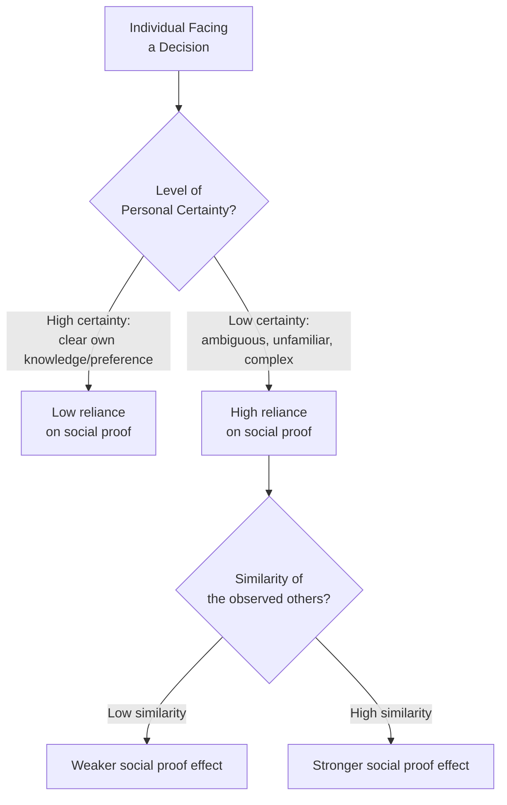
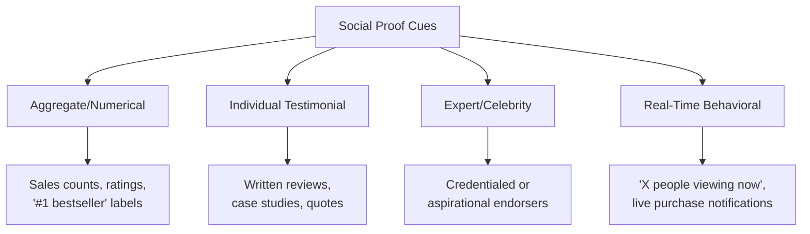

## Social Proof and Consensus Cues

### Overview

Social proof is a compliance and persuasion principle describing the tendency for individuals to look to the behavior of others as a guide for their own judgments and actions, particularly under conditions of **uncertainty**. Formalized as a psychological construct primarily through **Robert Cialdini's** work on influence, and grounded in earlier foundational social psychology research (Sherif's autokinetic effect studies, Asch's conformity experiments), social proof operates on the underlying assumption that **if many others are doing or believing something, it is more likely to be correct, appropriate, or safe** — a heuristic that is highly efficient but also systematically exploitable in marketing and persuasion contexts.

### Theoretical Foundations

**Informational Social Influence**

Individuals conform to others' behavior because they genuinely believe the group possesses accurate information they themselves lack — this is the primary mechanism underlying social proof's persuasive power, distinct from normative social influence (conforming to gain approval or avoid disapproval, though the two frequently co-occur).

**Sherif's Autokinetic Effect (1935)**

An early foundational demonstration: in an ambiguous perceptual task (judging the apparent movement of a stationary point of light in darkness — an optical illusion), individuals' judgments converged toward group consensus over repeated trials, illustrating that ambiguity dramatically increases reliance on others' judgments as an information source.

**Asch's Conformity Experiments (1951)**

Demonstrated conformity even in **unambiguous** perceptual tasks (comparing clearly different line lengths) when a majority of confederates gave an obviously incorrect answer — a substantial proportion of participants conformed to the incorrect majority judgment at least once, illustrating that social proof operates even against seemingly clear objective evidence, [Unverified] with specific conformity rate figures varying across replications and experimental variations of the original paradigm.

### The Uncertainty Amplification Principle

Social proof's persuasive power is not constant — it is systematically **amplified under conditions of uncertainty** and **similarity to the observed others**.

- **Key Points**
  - Novel, complex, or high-uncertainty purchase decisions (new product categories, unfamiliar services, high-stakes/infrequent purchases) show stronger susceptibility to social proof cues than familiar, low-uncertainty categories
  - The **similarity principle**: social proof is more persuasive when the "others" being referenced are perceived as similar to oneself (same demographic, same situation, same needs) — a general, undifferentiated crowd is less persuasive than "people like you"

### Types of Social Proof Cues in Marketing

**1. Numerical/Aggregate Consensus Cues**

Simple quantity-based signals of popularity or widespread adoption.

- **Example**: "Over 10 million users," "Best-seller," "#1 in category," follower/subscriber counts

**2. Rating and Review Systems**

Aggregated evaluative feedback functioning as a distributed, crowd-sourced consensus signal.

- **Key Points**
  - Star ratings function partly as a numerical heuristic (average score) and partly as a gateway to individual testimonial content (written reviews)
  - Review **volume** and review **valence** (positive/negative) both independently contribute to persuasive effect — a product with many reviews averaging 4.2 stars can be perceived differently than one with few reviews averaging the same 4.2 stars
  - [Unverified] The relationship between review volume and purchase conversion has been studied extensively in e-commerce research, with generally positive but not perfectly linear relationships reported; the precise functional form (diminishing returns points, minimum thresholds) varies by product category and platform

**3. Testimonials and Case Studies**

Individual-level social proof, often more vivid and identification-friendly than aggregate statistics, particularly effective when the testimonial-giver is perceived as similar to the target audience.

**4. Expert and Celebrity Endorsement**

A hybrid form combining social proof with source credibility principles — the "other" being referenced is a specific, credentialed or aspirational individual rather than an undifferentiated crowd.

**5. "Others Like You" / Behavioral Cues**

Real-time or algorithmically-generated signals indicating what similar users are currently doing.

- **Example**: E-commerce notifications like "12 people are viewing this item" or "3 people bought this in the last hour" combine social proof with urgency/scarcity cues.

**6. Social Media Engagement Metrics**

Likes, shares, comments, and follower counts function as continuously visible, ambient social proof signals embedded directly into digital content consumption.

### Diagram: Social Proof Cue Taxonomy

### Descriptive vs. Injunctive Norms

An important theoretical refinement to social proof, developed substantially through **Cialdini and Robert Cialdini's collaborators' research on social norms** (notably the Cialdini, Reno & Kallgren work on littering behavior, 1990), distinguishes two related but distinct types of social norm:

- **Descriptive norms**: what most people **actually do** ("most guests reuse their towels")
- **Injunctive norms**: what most people **approve or disapprove of** ("please help us reduce waste — it's the right thing to do")
- [Unverified] Research on hotel towel-reuse messaging and related field studies found descriptive norm messaging (communicating what other guests actually do) often outperformed purely injunctive appeals (communicating what one should do) in these specific contexts, though the relative effectiveness of descriptive versus injunctive framing is context-dependent and should not be treated as a universal ranking applicable across all behavior domains.
- [Inference] This distinction has direct marketing application: communicating "most customers choose our premium plan" (descriptive) may function differently — and in some contexts more effectively — than "you should choose our premium plan because it's the better value" (injunctive/persuasive argument), since the former leverages social proof's informational mechanism while the latter relies on direct argument-based persuasion.

### The Boomerang Effect Risk

A critical caution in descriptive norm messaging: communicating a norm that is **less desirable than the current behavior of the specific target audience segment** can backfire, producing a **boomerang effect** — inadvertently signaling to already-compliant individuals that their good behavior is not, in fact, the norm, potentially reducing their own compliance toward the (lower) perceived average.

- **Example**: Telling energy-efficient households "the average household uses X kWh" (a number below their own low usage) can, per boomerang-effect research on energy conservation messaging, risk increasing usage among already-efficient households who learn they are using *less* than the norm and may feel less compelled to maintain their unusually low consumption.
- [Inference] This implies that social proof campaigns should ideally segment messaging so that already-desirable-behavior audiences receive injunctive reinforcement (approval-based, "keep up the great work") rather than descriptive-norm information that might reveal their behavior as atypically virtuous rather than standard — a pairing strategy directly informed by the original boomerang-effect field research on household energy conservation.

### Marketing Applications

**1. E-Commerce Conversion Optimization**

Review systems, "bestseller" labeling, real-time purchase notifications, and social share counts are near-universal features of e-commerce interfaces, directly informed by social proof research.

**2. New Product/Category Launch Strategy**

Since uncertainty amplifies social proof reliance, launching genuinely novel products or entering unfamiliar categories benefits disproportionately from early social proof generation (beta user testimonials, early-adopter case studies, influencer seeding) relative to established, well-understood product categories.

**3. Similarity-Matched Testimonial Selection**

Selecting testimonial-givers who closely resemble the target audience segment (industry, company size, demographic, use case) leverages the similarity-amplification principle more effectively than generic or dissimilar testimonials.

**4. Cause Marketing and Behavior Change Campaigns**

Public health, sustainability, and civic behavior campaigns frequently apply descriptive/injunctive norm distinctions directly, informed by the household energy conservation and related social-norm intervention research literature.

**5. Scarcity-Social Proof Combination Tactics**

Real-time behavioral cues ("X people are viewing this," "only 2 left in stock, 5 sold in the last hour") deliberately combine social proof with scarcity to compound persuasive pressure — a widely-used but ethically sensitive e-commerce pattern (see boundary conditions below).

### Relationship to Other Frameworks

- **Elaboration Likelihood Model / Heuristic-Systematic Model**: social proof is among the most-studied peripheral/heuristic cues in dual-process persuasion research, particularly relevant under low-elaboration, low-motivation conditions where the consensus heuristic ("if everyone else likes it, it must be good") substitutes for detailed argument evaluation.
- **Source credibility**: expert and celebrity endorsement represents a hybrid category bridging social proof and source credibility research, since the persuasive mechanism draws on both "this person is credible" and "this person's choice is a signal I should follow."
- **Reciprocity and commitment/consistency**: frequently deployed alongside social proof in multi-principle campaign design (e.g., a free trial with visible user-count social proof simultaneously leverages reciprocity and consensus cues).
- **Multi-attribute attitude models**: social proof cues can function as an input shifting belief strength ($b_i$) for a specific attribute (e.g., "widely trusted" as a perceived quality signal) rather than replacing systematic attribute evaluation entirely.

### Ethical Considerations and Manipulation Risks

- **Fabricated or manipulated social proof** (fake reviews, purchased followers, artificially inflated engagement metrics) constitutes both an ethical violation and, in many jurisdictions, a regulatory/legal risk (e.g., FTC guidelines against deceptive review practices in the U.S.)
- **Dark pattern concerns**: real-time behavioral notifications ("X people viewing this now") have drawn scrutiny when the underlying data is fabricated or misleadingly presented rather than genuinely reflective of real user activity
- The boomerang effect risk illustrates that even well-intentioned, accurate social proof messaging requires careful segmentation and framing to avoid unintended counterproductive effects

### Boundary Conditions and Critiques

- Social proof effects are substantially moderated by cultural context; [Speculation] collectivist cultural orientations may generally show heightened sensitivity to consensus/conformity cues relative to individualist orientations, a pattern broadly consistent with cross-cultural conformity research literature, though this is a generalization with meaningful within-culture variation and should not be applied as a rigid prescriptive rule for any specific individual or market.
- The strength of social proof effects diminishes as personal certainty, expertise, or direct product experience increases — highly informed or expert consumers rely comparatively less on aggregate consensus cues than novice or uncertain consumers.
- Digital review ecosystem sophistication (increasing consumer awareness of fake review prevalence) may be gradually reducing the face-value trust placed in raw aggregate rating numbers, [Speculation] a plausible trend given documented rising consumer skepticism toward online reviews generally, though precise longitudinal data isolating this specific erosion effect on social-proof persuasive power is limited.

### SVG: Social Proof Amplification by Uncertainty (svg_diagram)

<svg xmlns="http://www.w3.org/2000/svg" viewBox="0 0 800 400">
<text x="400" y="30" text-anchor="middle" font-size="18" font-weight="bold" font-family="sans-serif">Social Proof Reliance by Uncertainty (svg_diagram)</text>
<line x1="90" y1="340" x2="740" y2="340" stroke="#333" stroke-width="2" />
<line x1="90" y1="340" x2="90" y2="60" stroke="#333" stroke-width="2" />
<text x="415" y="375" text-anchor="middle" font-size="13" font-family="sans-serif">Decision Uncertainty / Ambiguity (Low to High)</text>
<text x="35" y="200" text-anchor="middle" font-size="13" font-family="sans-serif" transform="rotate(-90 35 200)">Social Proof Reliance</text>
<path d="M 110 320 Q 350 280 450 180 T 700 90" stroke="#2C7FB8" stroke-width="3" fill="none" />
<circle cx="150" cy="315" r="6" fill="#4C9A2A" />
<text x="150" y="300" text-anchor="middle" font-size="11" font-family="sans-serif">Familiar grocery item</text>
<circle cx="400" cy="220" r="6" fill="#D9822B" />
<text x="400" y="205" text-anchor="middle" font-size="11" font-family="sans-serif">New software tool</text>
<circle cx="650" cy="100" r="6" fill="#C8375B" />
<text x="650" y="85" text-anchor="middle" font-size="11" font-family="sans-serif">Novel medical treatment</text>
</svg>

### Related Topics

- Elaboration Likelihood Model and Heuristic-Systematic Model (consensus heuristic processing)
- Descriptive vs. injunctive norms in behavior-change campaign design
- Boomerang effect and segmentation risk in normative messaging
- Source credibility and celebrity/expert endorsement research
- Fake review detection and FTC deceptive-practice regulation
- Reciprocity and commitment/consistency (multi-principle campaign design)
- Cross-cultural variation in conformity and consensus sensitivity