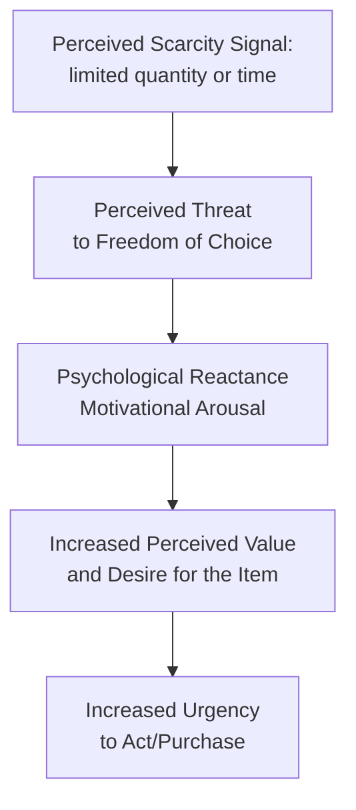
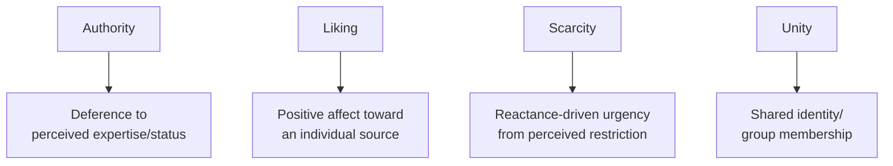

## Authority, Liking, Scarcity, and Unity

### Overview

This item covers the four remaining principles of Robert Cialdini's widely-applied framework of compliance and influence (originally six principles in *Influence*, 1984, with a seventh, **unity**, added in the 2016 revised edition, *Pre-Suasion* and later editions of *Influence*). Together with reciprocity and commitment/consistency (covered separately), these constitute the most extensively applied set of compliance principles in marketing, sales, and negotiation practice. Each operates through a distinct psychological mechanism, and each carries specific boundary conditions and ethical considerations relevant to responsible application.

### Authority

The tendency to comply with directives or recommendations from individuals perceived to hold legitimate authority, expertise, or institutional standing.

**Theoretical Foundation: Milgram's Obedience Studies**

**Stanley Milgram's** obedience experiments (1963) remain the most historically significant demonstration of authority's behavioral power, showing that a substantial proportion of participants would administer what they believed were increasingly severe, and eventually life-threatening, electric shocks to another person when instructed to do so by an authoritative experimenter figure. [Unverified] The precise compliance percentages varied across replications and experimental variations of Milgram's original paradigm; the core finding — that legitimate-seeming authority can drive compliance beyond what individuals would predict for themselves in the abstract — is well-established, but specific numeric figures from any single study should not be treated as a fixed universal rate.

**Symbols of Authority in Marketing**

Authority compliance in commercial contexts is frequently triggered not by genuine deep expertise verification, but by **surface symbols of authority**:

- **Titles**: "Dr.," "Certified," "Licensed," professional credentials displayed prominently
- **Uniforms and professional attire**: white lab coats, formal business dress, branded professional uniforms
- **Institutional affiliation**: association with respected institutions (universities, established organizations, government bodies)
- **Trappings of expertise**: technical jargon, credentials, published research, awards
- **Example**: Toothpaste advertising featuring "9 out of 10 dentists recommend" leverages both authority (dental expertise) and social proof (consensus) simultaneously — a common overlap between compliance principles in applied advertising.
- [Inference] Because authority compliance can be triggered by surface symbols alone, without necessarily verifying genuine underlying expertise, this principle carries a distinct manipulation risk when symbols of authority are used without corresponding legitimate substance (e.g., actors in lab coats with no genuine medical credentials) — a practice that intersects directly with false-advertising and deceptive-endorsement regulation in many jurisdictions.

### Liking

The tendency to be more easily persuaded by, and comply more readily with requests from, individuals we like.

**Key Drivers of Liking (per Cialdini's synthesis)**

| Driver | Description |
| --- | --- |
| Physical attractiveness | Attractive individuals are often subject to a "halo effect," being perceived more favorably on unrelated traits (intelligence, trustworthiness) |
| Similarity | We tend to like people perceived as similar to ourselves (background, values, interests, opinions) |
| Compliments/flattery | Genuine or perceived praise increases liking toward the source, even when the praise's sincerity is somewhat suspect |
| Familiarity/mere exposure | Repeated, non-aversive contact with a person, brand, or stimulus tends to increase liking over time (the **mere exposure effect**, Zajonc, 1968) |
| Cooperation toward shared goals | Liking increases when individuals perceive themselves as working cooperatively toward a common objective, rather than in opposition |

- **Example**: Salesforce and relationship-based B2B selling explicitly train reps to identify genuine similarities and shared interests with prospects, and to seek small opportunities for authentic collaboration, directly leveraging the liking principle's similarity and cooperation drivers.
- [Inference] The mere exposure effect underlies much of brand-building advertising strategy — consistent, repeated, non-intrusive brand exposure over time is a documented mechanism for building baseline positive affect toward a brand, independent of any specific persuasive argument content in the exposure itself, though the effect's strength diminishes and can reverse into aversion with excessive repetition (advertising wear-out).

### Scarcity

The tendency to value opportunities, products, or information more highly when they are perceived as **limited in availability or time**.

**Mechanism: Psychological Reactance**

Scarcity's persuasive power is substantially explained by **psychological reactance theory** (Brehm, 1966): when a freedom or option is perceived as being restricted or under threat of restriction, individuals experience motivational arousal to reassert that freedom — often manifesting as increased desire for the restricted option itself.

**Types of Scarcity Cues**

- **Quantity-limited scarcity**: "Only 3 left in stock," limited-edition releases
- **Time-limited scarcity**: "Sale ends tonight," countdown timers, flash sales
- **Access-limited scarcity**: invitation-only launches, waitlists, exclusive membership tiers
- **Newly-created scarcity vs. increasing scarcity**: Cialdini's research additionally distinguishes signals of scarcity that has always existed from signals that scarcity is **newly increasing** (e.g., "recently sold out in other regions") — the latter has been found in some studies to be a particularly potent variant, as it combines scarcity with an implicit social proof signal (others are competing for the same limited resource)
- **Example**: E-commerce countdown timers combined with low-stock indicators ("Sale ends in 2:14:33 — only 4 left") stack multiple scarcity cue types simultaneously to compound urgency.
- [Unverified] The relative persuasive strength of quantity-limited versus time-limited scarcity cues appears to vary by product category and consumer motivation in the applied marketing research literature, and general claims that one scarcity type is universally more effective than another should be treated with appropriate caution.

### Unity

The most recently formalized of Cialdini's principles (added in later editions of *Influence*), unity describes compliance driven by a sense of **shared identity or "we-ness"** with the source of a request — distinct from mere liking, which can exist between individuals who do not share group identity.

**Distinction from Liking**

| Principle | Basis | Example Trigger |
| --- | --- | --- |
| Liking | Positive affect toward an individual (attractiveness, similarity, familiarity) | "I find this person likable" |
| Unity | Shared category membership / collective identity ("we," not just "like") | "This person is part of my group/family/community" |

- **Key Points**
  - Unity can be triggered by genuine shared categories (family, ethnicity, hometown, alma mater, fandom) or by **deliberately co-created shared experiences** (working together toward a joint outcome, participating in a shared ritual)
  - Marketing applications frequently invoke unity through **brand community construction** — positioning customers as members of a collective identity ("Apple users," a sports team's fanbase, a fitness brand's community) rather than merely individual purchasers
- **Example**: Brand communities and superfan programs (exclusive forums, branded events, member-only content) are explicit unity-principle applications, aiming to shift the customer relationship from transactional liking toward genuine perceived shared identity/membership.
- [Inference] Because unity operates through group-identity mechanisms rather than individual-level affect, its persuasive effects may be more durable and resistant to competitor counter-messaging than liking-based appeals, since shifting someone's felt group membership generally requires deeper intervention than simply presenting a more likable alternative source — though this specific durability comparison is a theoretical inference rather than a directly and extensively tested empirical claim across the marketing literature.

### Diagram: Four Principles Mechanism Comparison

### Marketing Applications Summary

**1. Authority**: expert endorsements, credentialed spokespeople, professional certifications displayed prominently, "as seen in [respected publication]" citations, academic or clinical research citations

**2. Liking**: relationship-based sales training, influencer partnerships selected for genuine audience affinity/similarity, consistent non-intrusive brand exposure (mere exposure effect), warmth-based advertising creative

**3. Scarcity**: limited-time offers, limited-edition product drops, countdown timers, low-stock indicators, waitlist/invitation-only launch strategies

**4. Unity**: brand community programs, co-creation initiatives (customers as collaborators, not just buyers), shared-identity messaging (nationality, values, lifestyle affiliation), exclusive membership tiers framed around belonging rather than transactional benefit alone

### Interaction and Stacking Across Principles

Applied marketing frequently combines multiple Cialdini principles within a single campaign or interface, and isolating each principle's independent marginal contribution to a given outcome is a persistent measurement challenge:

- **Example — combined stacking**: A limited-edition product drop (scarcity) endorsed by a credible expert (authority), promoted by a well-liked influencer with genuine audience affinity (liking), and framed around exclusive community membership (unity) — a common structure in premium/luxury and fandom-driven product launches.
- [Inference] While principle-stacking is common practice and plausibly compounds persuasive effect, the specific interaction effects (additive, synergistic, or occasionally counteracting) between multiple simultaneously-deployed principles are not fully mapped in a single unified predictive model within the applied literature, meaning campaign-level effectiveness testing (rather than assuming linear additivity of individually-documented principle effects) remains the more reliable practical approach.

### Ethical Considerations

- **Authority**: risk of deceptive symbol use (false credentials, misleading professional presentation) without genuine underlying expertise
- **Liking**: risk of manufactured or insincere rapport-building (inauthentic flattery, fabricated similarity claims) that, if discovered, can produce significant trust damage and backlash beyond the immediate transaction
- **Scarcity**: risk of **fabricated scarcity** (false countdown timers, artificially inflated "low stock" claims not reflecting genuine inventory conditions) — a practice that has drawn specific regulatory scrutiny in several jurisdictions as a deceptive marketing practice
- **Unity**: risk of exploitative in-group targeting, particularly when unity appeals are constructed around socially sensitive identity categories in ways that feel opportunistic or performative rather than genuinely reflective of authentic brand values and community investment

### Relationship to Other Frameworks

- **Source credibility research**: authority overlaps substantially with the expertise dimension of source credibility, while liking overlaps with the attractiveness/likability dimension — these literatures developed somewhat independently but describe closely related psychological territory.
- **Reactance theory**: scarcity's mechanism is a direct, specific application of the broader reactance theory framework, which also explains defensive/backfire responses in other persuasion contexts (e.g., overly restrictive or manipulative-feeling fear appeals, per the EPPM's fear-control pathway).
- **Functional theory of attitudes**: unity and liking appeals connect most directly to the value-expressive attitude function (identity and belonging), while authority connects more to the knowledge function (deference to expert-provided understanding) and utilitarian function (trusting expert judgment on practical outcomes).
- **Reciprocity and commitment/consistency**: together with authority, liking, scarcity, and unity, these constitute Cialdini's full seven-principle framework, frequently taught and applied as an integrated toolkit rather than as isolated independent principles.

### Boundary Conditions and Critiques

- All four principles' effect sizes and boundary conditions vary by cultural context, individual differences (e.g., trait reactance proneness moderating scarcity response), and product/decision category — none should be treated as universally and uniformly powerful across all contexts.
- The addition of unity as a distinct seventh principle is a comparatively recent theoretical development relative to the other six, longer-established principles, and [Speculation] carries a correspondingly smaller and less extensive independent empirical research base specifically isolating unity's effects from closely related constructs like liking and social identity theory more broadly.
- Fabricated scarcity and deceptive authority-symbol use, while historically common in some corners of direct-response marketing, carry meaningfully increased regulatory and reputational risk in the current environment of heightened consumer skepticism and more assertive consumer-protection enforcement.

### SVG: Four Principles Quick Reference (svg_diagram)

<svg xmlns="http://www.w3.org/2000/svg" viewBox="0 0 800 460">
<text x="400" y="30" text-anchor="middle" font-size="18" font-weight="bold" font-family="sans-serif">Authority, Liking, Scarcity, Unity (svg_diagram)</text>
<rect x="30" y="60" width="340" height="160" rx="10" fill="#E8F4FD" stroke="#2C7FB8" stroke-width="2" />
<text x="200" y="85" text-anchor="middle" font-size="15" font-weight="bold" font-family="sans-serif">Authority</text>
<text x="200" y="110" text-anchor="middle" font-size="12" font-family="sans-serif">Mechanism: deference to expertise</text>
<text x="200" y="130" text-anchor="middle" font-size="12" font-family="sans-serif">Cue: titles, uniforms, credentials</text>
<text x="200" y="155" text-anchor="middle" font-size="12" font-family="sans-serif">Risk: deceptive symbol use</text>
<text x="200" y="195" text-anchor="middle" font-size="11" font-style="italic" font-family="sans-serif">"9 out of 10 dentists recommend"</text>
<rect x="430" y="60" width="340" height="160" rx="10" fill="#FDF0E8" stroke="#D9822B" stroke-width="2" />
<text x="600" y="85" text-anchor="middle" font-size="15" font-weight="bold" font-family="sans-serif">Liking</text>
<text x="600" y="110" text-anchor="middle" font-size="12" font-family="sans-serif">Mechanism: positive affect</text>
<text x="600" y="130" text-anchor="middle" font-size="12" font-family="sans-serif">Cue: similarity, familiarity, praise</text>
<text x="600" y="155" text-anchor="middle" font-size="12" font-family="sans-serif">Risk: insincere rapport-building</text>
<text x="600" y="195" text-anchor="middle" font-size="11" font-style="italic" font-family="sans-serif">Relationship-based selling</text>
<rect x="30" y="250" width="340" height="160" rx="10" fill="#FDE8EC" stroke="#C8375B" stroke-width="2" />
<text x="200" y="275" text-anchor="middle" font-size="15" font-weight="bold" font-family="sans-serif">Scarcity</text>
<text x="200" y="300" text-anchor="middle" font-size="12" font-family="sans-serif">Mechanism: reactance-driven urgency</text>
<text x="200" y="320" text-anchor="middle" font-size="12" font-family="sans-serif">Cue: countdowns, low-stock alerts</text>
<text x="200" y="345" text-anchor="middle" font-size="12" font-family="sans-serif">Risk: fabricated scarcity</text>
<text x="200" y="385" text-anchor="middle" font-size="11" font-style="italic" font-family="sans-serif">"Only 3 left - sale ends tonight"</text>
<rect x="430" y="250" width="340" height="160" rx="10" fill="#EFFDE8" stroke="#4C9A2A" stroke-width="2" />
<text x="600" y="275" text-anchor="middle" font-size="15" font-weight="bold" font-family="sans-serif">Unity</text>
<text x="600" y="300" text-anchor="middle" font-size="12" font-family="sans-serif">Mechanism: shared group identity</text>
<text x="600" y="320" text-anchor="middle" font-size="12" font-family="sans-serif">Cue: "we," community, co-creation</text>
<text x="600" y="345" text-anchor="middle" font-size="12" font-family="sans-serif">Risk: performative identity targeting</text>
<text x="600" y="385" text-anchor="middle" font-size="11" font-style="italic" font-family="sans-serif">Brand community programs</text>
</svg>

### Related Topics

- Reciprocity and commitment/consistency (remaining Cialdini principles)
- Milgram's obedience research and psychological reactance theory
- Source credibility research (authority/expertise dimension overlap)
- Mere exposure effect and repetition-based brand building
- Brand community construction and co-creation marketing strategy
- Deceptive marketing regulation (fabricated scarcity, false endorsement)
- Social identity theory as a broader foundation for the unity principle