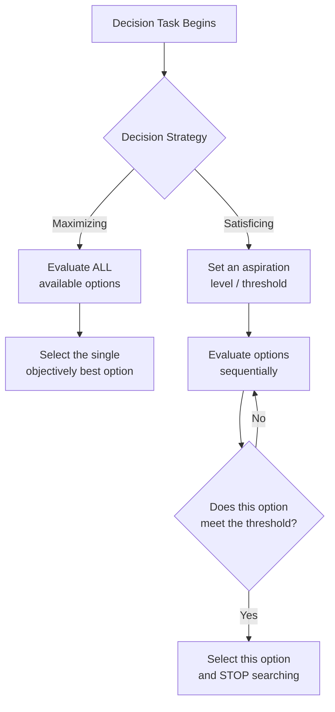
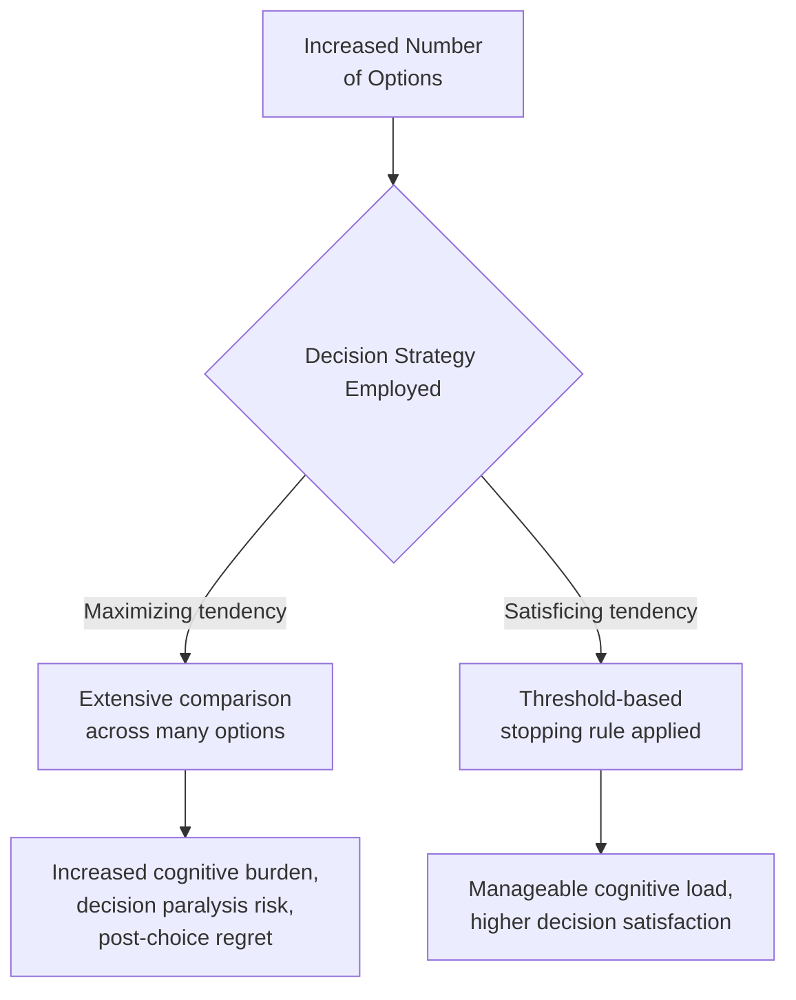

## Bounded Rationality and Satisficing

### Overview

Bounded rationality, introduced by **Herbert Simon (1955, 1957)**, is a foundational framework challenging the classical economic assumption of perfectly rational, utility-maximizing decision-makers. Simon proposed that human decision-making is constrained by **limited cognitive capacity, incomplete information, and finite time**, and that individuals therefore do not — and cannot — optimize decisions in the way classical rational-choice theory assumes. Instead, decision-makers employ **satisficing**: seeking a solution that is "good enough" to meet a defined threshold of acceptability, rather than exhaustively searching for the objectively optimal option. This framework underlies much of contemporary behavioral economics and consumer decision-making research, and directly informs how marketers design choice environments.

### The Core Distinction: Maximizing vs. Satisficing

| Dimension | Maximizing (Classical Rational Choice) | Satisficing (Bounded Rationality) |
| --- | --- | --- |
| Search process | Exhaustive evaluation of all available options | Sequential search, stopping once an acceptable option is found |
| Information use | Complete information gathering and processing | Selective, limited information gathering constrained by time/effort |
| Decision criterion | Identify the single objectively best option | Identify the first option meeting a pre-set "good enough" threshold |
| Cognitive demand | Very high | Substantially lower |
| Outcome | Theoretically optimal (in idealized models) | Acceptable, but not necessarily optimal |

$$\text{Satisficing Rule: choose the first option } x \text{ such that } U(x) \geq \text{Aspiration Level}$$

Where $U(x)$ is the perceived utility of option $x$, and the **aspiration level** is a pre-established threshold of "good enough" that the decision-maker sets based on experience, expectations, and context.

### Diagram: Maximizing vs. Satisficing Decision Process

### Three Core Constraints Underlying Bounded Rationality

Simon identified three fundamental limitations that make pure maximizing behavior practically impossible for real decision-makers:

**1. Limited Information**

Decision-makers rarely, if ever, have complete information about all available options and their consequences — search itself carries a cost, and some information may be entirely unavailable or unknowable in advance.

**2. Limited Cognitive Processing Capacity**

Even with complete information, human working memory and processing capacity constrain the ability to compare and evaluate numerous options across many attributes simultaneously — a constraint later formalized more precisely in cognitive load and working memory research.

**3. Limited Time**

Most real-world decisions occur under time pressure, whether from external deadlines or the practical opportunity cost of continued deliberation, making exhaustive search impractical even when information and cognitive capacity would theoretically allow it.

### Satisficing in Consumer Choice

Consumer decision-making research has extensively documented satisficing behavior across purchase contexts, particularly in **low-involvement, routine, and time-constrained** decisions.

- **Example**: A shopper selecting a brand of paper towels does not typically compare every available option across every attribute (price per sheet, absorbency ratings, environmental certifications, brand reputation) — instead, they likely select the first option that meets a rough "acceptable price, familiar brand, adequate quality" threshold and stop searching.
- **Key Points**
  - Satisficing is more prevalent in low-stakes, frequently-repeated purchase decisions where the cost of suboptimal choice is low and the cost of continued search is comparatively higher relative to the decision's importance
  - High-stakes, infrequent purchases (homes, cars, major appliances) tend to show more maximizing-like search behavior, though even these decisions rarely achieve genuinely exhaustive option evaluation

### Maximizers vs. Satisficers as an Individual-Difference Trait

Building on Simon's original organizational/cognitive framework, later psychological research (notably **Barry Schwartz and colleagues, 2002**) identified **maximizing tendency as a stable individual-difference trait**, distinguishing people who chronically seek to identify the objectively best option ("maximizers") from those who are comfortable stopping at "good enough" ("satisficers") across many decision domains.

| Trait Profile | Search Behavior | Documented Correlates |
| --- | --- | --- |
| Maximizers | Extensive search, high option comparison, difficulty finalizing decisions | Associated in Schwartz et al.'s research with higher decision-related regret, lower satisfaction with chosen outcomes, and greater vulnerability to post-decision comparison with foregone alternatives |
| Satisficers | Threshold-based search, decisive stopping once "good enough" is found | Associated with generally higher decision satisfaction and lower regret in the same research tradition |

- [Unverified] While Schwartz and colleagues' original findings linking maximizing tendency to lower well-being and satisfaction outcomes have been influential and widely cited, subsequent research has produced a more mixed and nuanced picture, with some studies finding weaker or more context-dependent relationships between maximizing tendency and negative well-being outcomes than the original formulation suggested; the maximizing-satisficing distinction as a general trait construct is well-established, but specific well-being correlational claims should be treated as an area of ongoing research refinement rather than a fully settled finding.

### Diagram: The Paradox of Choice Connection

### Relationship to Choice Overload / Paradox of Choice

Bounded rationality and satisficing provide the theoretical foundation for understanding the **paradox of choice** phenomenon (popularized by Schwartz, 2004): as the number of available options increases, the cognitive burden of genuinely maximizing behavior increases correspondingly, while satisficing remains comparatively robust to option-set size since it requires only sequential threshold-checking rather than exhaustive comparison.

- [Inference] This suggests that excessively large choice sets may disproportionately burden maximizer-oriented consumers relative to satisficer-oriented consumers, since the former's chosen strategy scales poorly with option-set size while the latter's does not — a reasonable extrapolation connecting the two research traditions, though direct experimental work explicitly testing this specific interaction (large choice sets × individual maximizing tendency × downstream satisfaction) is more limited than the foundational choice-overload literature considered on its own.

### Marketing Applications

**1. Choice Architecture and Assortment Design**

Since satisficing is the dominant real-world decision strategy for most routine purchases, curated, moderately-sized assortments (rather than maximally exhaustive product catalogs) can reduce decision friction and support faster, more confident purchase completion — directly informed by bounded rationality's implications for realistic decision capacity.

**2. Default Options and Threshold-Meeting Design**

Presenting a well-designed default or "recommended" option that clearly meets likely aspiration-level thresholds (adequate quality, reasonable price, trusted brand) can accelerate satisficing-based decision-making by reducing the cognitive work of independently establishing what "good enough" looks like.

**3. Simplifying Comparison for Low-Involvement Categories**

For product categories where satisficing dominates, providing simple, quickly-scannable "good enough" signals (clear price, star rating, basic feature summary) supports the natural decision process more effectively than dense, comprehensive comparison charts designed for maximizing-style evaluation.

**4. Segment-Specific Strategy for High-Involvement Categories**

For categories attracting more maximizer-oriented decision-makers (major purchases, career/education decisions, significant financial products), providing genuinely comprehensive comparison tools and detailed information may better serve this segment's search style, [Inference] though offering such tools to satisficer-oriented consumers in the same category risks introducing unnecessary complexity and potential decision paralysis for that segment — suggesting that segmentation by search-strategy preference, not just by product category alone, may usefully inform information-architecture decisions.

**5. Post-Purchase Support for Maximizer Segments**

Given documented associations between maximizing tendency and higher post-decision regret, [Speculation] post-purchase reassurance content (following the general logic of post-decision dissonance reduction, covered separately) may be particularly valuable for maximizer-inclined customer segments, though this specific segment-targeted application of dissonance-reduction strategy is an inference connecting two related literatures rather than a directly tested combined intervention.

### Relationship to Other Frameworks

- **Cognitive dissonance and post-decision rationalization**: satisficing and dissonance-reduction can be understood as complementary — satisficing describes the pre-decision search-stopping strategy, while dissonance reduction describes the post-decision psychological process of reconciling the (necessarily imperfect, non-maximized) chosen option with awareness of foregone alternatives.
- **Multi-attribute attitude models**: the Fishbein weighted-additive model implicitly assumes something closer to maximizing (comprehensive weighted evaluation across all attributes), while non-compensatory decision rules (conjunctive, lexicographic, elimination-by-aspects) are more directly consistent with bounded-rationality-driven satisficing behavior, since they permit stopping search once minimum thresholds are met rather than requiring full comparative evaluation.
- **Heuristics and biases research more broadly** (Kahneman, Tversky): bounded rationality is frequently cited as the foundational theoretical precursor to the broader heuristics-and-biases research program, since both traditions share the core premise that human judgment systematically departs from idealized rational-choice models due to genuine cognitive constraints rather than simple error or irrationality.
- **Choice overload / paradox of choice**: directly builds on bounded rationality's implications for how decision strategy interacts with option-set size and complexity.

### Boundary Conditions and Critiques

- Satisficing thresholds ("aspiration levels") are not fixed or universal — they are shaped by prior experience, available reference points, and social/market context, making them somewhat difficult to predict or measure precisely in applied research without direct elicitation.
- The maximizing-satisficing individual-difference trait, while a useful practical heuristic for segmentation, is measured via self-report scales (e.g., Schwartz et al.'s Maximization Scale) subject to the general limitations of self-report psychometric measurement, and subsequent psychometric refinement work has revised understanding of the scale's factor structure since its original formulation.
- Bounded rationality does not claim decision-making is arbitrary or unstructured — rather, it proposes a different, resource-constrained form of structured decision-making (satisficing) rather than the absence of structure altogether; this distinction is sometimes lost in more casual applications of the framework.
- [Speculation] The proliferation of algorithmic recommendation systems and AI-assisted comparison tools in contemporary digital commerce may be altering the practical search costs underlying classical bounded-rationality assumptions (since automated tools can partially substitute for the consumer's own limited search capacity), though systematic research directly re-examining Simon's original constraints in this specific technological context is an evolving rather than fully established area of inquiry.

### SVG: Satisficing Search Process Over Time (svg_diagram)

<svg xmlns="http://www.w3.org/2000/svg" viewBox="0 0 800 400">
<text x="400" y="30" text-anchor="middle" font-size="18" font-weight="bold" font-family="sans-serif">Satisficing: Sequential Search Process (svg_diagram)</text>
<line x1="90" y1="340" x2="740" y2="340" stroke="#333" stroke-width="2" />
<line x1="90" y1="340" x2="90" y2="60" stroke="#333" stroke-width="2" />
<text x="415" y="375" text-anchor="middle" font-size="13" font-family="sans-serif">Options Evaluated in Sequence</text>
<text x="35" y="200" text-anchor="middle" font-size="13" font-family="sans-serif" transform="rotate(-90 35 200)">Perceived Utility</text>
<line x1="90" y1="180" x2="740" y2="180" stroke="#4C9A2A" stroke-width="2" stroke-dasharray="6,3" />
<text x="745" y="184" font-size="11" fill="#4C9A2A" font-family="sans-serif">Aspiration level</text>
<circle cx="150" cy="280" r="7" fill="#C8375B" />
<text x="150" y="300" text-anchor="middle" font-size="10" font-family="sans-serif">Option 1: rejected</text>
<circle cx="300" cy="230" r="7" fill="#C8375B" />
<text x="300" y="250" text-anchor="middle" font-size="10" font-family="sans-serif">Option 2: rejected</text>
<circle cx="450" cy="150" r="9" fill="#4C9A2A" />
<text x="450" y="130" text-anchor="middle" font-size="11" font-weight="bold" font-family="sans-serif">Option 3: ACCEPTED</text>
<text x="450" y="115" text-anchor="middle" font-size="10" font-family="sans-serif" font-style="italic">Search stops here</text>
<line x1="500" y1="150" x2="700" y2="90" stroke="#999" stroke-width="2" stroke-dasharray="4,4" />
<text x="650" y="75" text-anchor="middle" font-size="10" font-family="sans-serif" font-style="italic">Options 4+ never evaluated</text>
</svg>

### Related Topics

- Paradox of choice and choice overload research (Schwartz)
- Maximizing vs. satisficing as an individual-difference trait
- Non-compensatory decision rules (conjunctive, lexicographic, elimination-by-aspects)
- Heuristics and biases research program (Kahneman and Tversky)
- Cognitive dissonance and post-decision rationalization
- Choice architecture and default-option design
- Working memory and cognitive load constraints on decision-making