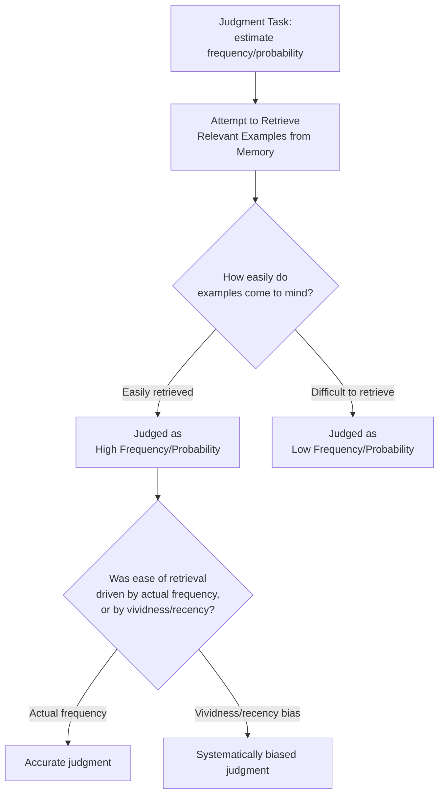
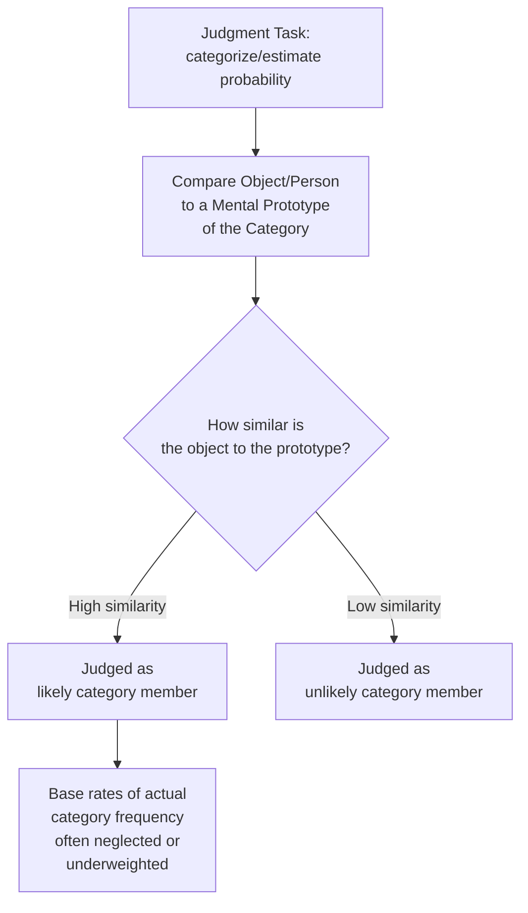

## Availability and Representativeness Heuristics

### Overview

The availability and representativeness heuristics are two of the most extensively documented cognitive shortcuts identified by **Amos Tversky and Daniel Kahneman** in their foundational heuristics-and-biases research program (beginning with their landmark 1974 *Science* paper, "Judgment under Uncertainty: Heuristics and Biases"). Both heuristics describe systematic, largely automatic mental shortcuts used to estimate probability, frequency, or category membership under uncertainty — shortcuts that are cognitively efficient and often reasonably accurate, but which produce **predictable, systematic biases** in specific, well-documented circumstances. These two heuristics, alongside the anchoring-and-adjustment heuristic, form the core original triad of Tversky and Kahneman's 1974 framework and remain foundational to behavioral economics and consumer judgment research.

### The Availability Heuristic

**Definition**: Individuals estimate the frequency or probability of an event based on **how easily relevant examples come to mind**, rather than on objective statistical frequency.

$$\text{Perceived Probability}(E) \propto \text{Ease of Retrieval of Instances of } E$$

- **Key Points**
  - Ease of retrieval is influenced by **recency** (recently encountered examples are more available), **vividness/emotional salience** (dramatic, emotionally striking examples are more available), and **frequency of actual personal exposure**
  - The heuristic conflates *ease of recall* with *actual frequency* — these are correlated in many everyday circumstances (common events genuinely are recalled more easily), which is precisely why the heuristic is often reasonably accurate, but the correlation breaks down systematically for memorable-but-rare events

### Diagram: Availability Heuristic Mechanism

**Classic Illustrative Finding**: Tversky and Kahneman's original research found that people tend to overestimate the frequency of dramatic, memorable causes of death (e.g., accidents, homicides, dramatic disasters) relative to less vivid but statistically more common causes (e.g., certain chronic diseases), because dramatic events receive disproportionate media coverage and are consequently more cognitively available, independent of their true relative frequency.

- **Consumer Example**: A highly publicized product recall or safety incident (e.g., a specific airline crash, a specific car model's defect) can cause consumers to substantially overestimate the general risk associated with that entire product category (flying, that car brand) relative to the statistically-grounded risk, because the vivid, media-amplified example is now highly available in memory.

### The Representativeness Heuristic

**Definition**: Individuals judge the probability that an object or event belongs to a category based on **how similar it is to a prototype or stereotype of that category**, rather than on objective statistical base rates.

- **Key Points**
  - This heuristic systematically neglects **base rates** (the actual underlying statistical frequency of category membership in the population), a phenomenon termed **base-rate neglect**
  - It also underlies the **conjunction fallacy** — judging a conjunction of two events as more probable than either individual event alone, when it is logically impossible for a conjunction to exceed the probability of its constituent parts, because the conjunction "feels" more representative of a coherent narrative

### Diagram: Representativeness Heuristic Mechanism

**Classic Illustrative Paradigm: "Linda the Bank Teller" (Tversky & Kahneman, 1983)**

The original conjunction fallacy demonstration presented a personality description matching a stereotype of social/political activism, then asked participants to judge the relative probability of two statements: "Linda is a bank teller" versus "Linda is a bank teller and is active in the feminist movement." A majority of participants judged the conjunction (bank teller AND feminist) as more probable than the single condition (bank teller) alone — a logical impossibility, since a conjunction cannot exceed the probability of either of its constituent parts, illustrating how a description's representativeness of a stereotype can override basic probability logic.

- [Unverified] The specific percentage of participants exhibiting the conjunction fallacy in the original studies, and in subsequent replications, has varied somewhat depending on question framing (e.g., whether probability is asked about directly versus via frequency-format framing, which some subsequent research found reduces the fallacy's occurrence); the core phenomenon is well-established, but should not be treated as producing an identical, fixed error rate across all presentation formats.

### Marketing Applications: Availability Heuristic

**1. Media Coverage and Perceived Risk Management**

Since availability drives perceived risk independent of actual statistical frequency, brands facing a well-publicized negative incident (recall, safety issue, scandal) may face perceived risk substantially disproportionate to the incident's actual statistical rarity, requiring communication strategy specifically addressing the availability-driven risk perception gap rather than statistical risk alone.

**2. Testimonial and Vivid Example Marketing**

Because vivid, specific, emotionally engaging examples are more cognitively available than abstract statistics, marketing that uses concrete customer stories and specific vivid scenarios ("Sarah saved $2,000 in her first year") tends to be more persuasive and memorable than equivalent aggregate statistics alone ("customers save an average of $2,000 annually"), [Inference] plausibly because the vivid example creates a more available, retrievable mental instance that subsequently biases probability/likelihood estimates in the brand's favor when the consumer later considers similar outcomes for themselves.

**3. Repetition and Recency Effects on Perceived Popularity**

Since recency independently boosts availability, sustained or repeated advertising exposure can increase a brand's perceived prevalence/popularity in a category beyond what genuine market share data would indicate, [Inference] since consumers' subjective sense of "how common is this brand" is influenced by how easily brand instances come to mind (partly driven by advertising frequency) rather than by direct market-share knowledge.

**4. Negative Publicity Amplification Risk**

Viral negative content (a single dramatic customer complaint video, a widely-shared negative incident) can disproportionately shape aggregate brand perception due to availability bias, even when such incidents are statistically rare relative to the brand's overall transaction volume — a consideration directly relevant to crisis communication and reputation management strategy.

### Marketing Applications: Representativeness Heuristic

**1. Brand Stereotyping and Category Prototypes**

Consumers judge new or unfamiliar products partly by their similarity to an established category prototype ("this looks like a premium product" based on packaging/design cues resembling known premium exemplars), independent of actual underlying quality — directly informing packaging design, positioning cues, and category-entry strategy.

**2. Base-Rate Neglect in Targeting and Segmentation**

[Inference] Marketers themselves are not immune to representativeness-driven base-rate neglect — for example, over-indexing marketing persona development on vivid, memorable "representative" customer archetypes while underweighting the actual statistical distribution of the broader customer base, a risk directly relevant to persona-based marketing methodology and market segmentation practice.

**3. Country-of-Origin and Category Association Effects**

Products leveraging strong category-representative cues (e.g., specific design aesthetics, packaging conventions, or branding elements strongly associated with a particular country-of-origin stereotype for quality) can benefit from representativeness-driven quality inference, independent of actual product attribute verification by the consumer.

**4. Conjunction Fallacy in Feature-Bundling Perception**

[Speculation] Marketing messaging that constructs a detailed, coherent, "representative" narrative combining multiple specific claims (e.g., a product described with a rich, specific persona-fit story) may, per conjunction-fallacy logic, be perceived by some consumers as more probable/credible in its aggregate claims than a more sparse but logically equivalent presentation — though directly applying the conjunction fallacy's classic probability-judgment paradigm to real-world marketing claim evaluation is an extrapolation rather than a directly and extensively tested application in the applied marketing literature.

### Relationship to Other Frameworks

- **Bounded rationality and satisficing**: both heuristics are consistent with, and frequently cited as specific mechanisms supporting, Simon's broader bounded-rationality framework — availability and representativeness are efficient cognitive shortcuts operating under the same fundamental information/time/capacity constraints Simon identified, rather than being independent or unrelated phenomena.
- **Anchoring and adjustment heuristic**: the third member of Tversky and Kahneman's original 1974 heuristic triad, frequently discussed alongside availability and representativeness as a complete foundational set, though anchoring operates through a distinct numeric-adjustment mechanism rather than memory-retrieval or prototype-similarity.
- **Social proof and consensus cues**: the availability heuristic provides a plausible cognitive mechanism partly underlying social proof's effectiveness — widely-discussed or highly visible behaviors/opinions become more cognitively available, which can independently reinforce the perception that such behaviors/opinions are common or correct.
- **Source credibility and the sleeper effect**: vivid, available source-related information (a specific memorable negative story about a source) may persist and influence judgment independent of more abstract credibility ratings, connecting to broader questions of how specific memorable instances versus abstract trait judgments differentially influence downstream evaluation.

### Boundary Conditions and Critiques

- Both heuristics are best understood as generally adaptive and often accurate cognitive shortcuts that produce systematic, predictable errors under specific identifiable conditions — not as generalized "irrationality," a distinction the original Tversky and Kahneman research was careful to emphasize and that is sometimes lost in more casual popularizations of heuristics-and-biases research.
- The conjunction fallacy and related representativeness-driven errors show some sensitivity to question framing (probability format versus frequency format, per work following Gigerenzer's critiques of the original heuristics-and-biases paradigm), suggesting these are not entirely context-independent, fixed cognitive errors but are moderated by how a judgment task is presented.
- [Unverified] The generalizability of classic laboratory heuristics-and-biases findings to real-world, high-stakes, expertise-informed consumer and professional judgment contexts has been an area of ongoing debate in the decision-science literature (associated with the broader "heuristics and biases" versus "ecological rationality" theoretical divide), and effect sizes/error rates observed in controlled laboratory paradigms should not be assumed to transfer identically to all applied marketing or consumer-judgment contexts.

### SVG: Availability vs. Representativeness Comparison (svg_diagram)

<svg xmlns="http://www.w3.org/2000/svg" viewBox="0 0 800 380">
<text x="400" y="30" text-anchor="middle" font-size="18" font-weight="bold" font-family="sans-serif">Availability vs. Representativeness (svg_diagram)</text>
<rect x="40" y="60" width="340" height="280" rx="10" fill="#E8F4FD" stroke="#2C7FB8" stroke-width="2" />
<text x="210" y="90" text-anchor="middle" font-size="15" font-weight="bold" font-family="sans-serif">Availability Heuristic</text>
<text x="60" y="125" font-size="12" font-family="sans-serif">Basis: ease of memory retrieval</text>
<text x="60" y="150" font-size="12" font-family="sans-serif">Driven by: recency, vividness,</text>
<text x="60" y="168" font-size="12" font-family="sans-serif">emotional salience</text>
<text x="60" y="205" font-size="12" font-weight="bold" font-family="sans-serif">Marketing example:</text>
<text x="60" y="228" font-size="11" font-family="sans-serif" font-style="italic">Vivid customer testimonial</text>
<text x="60" y="246" font-size="11" font-family="sans-serif" font-style="italic">outperforms abstract statistic</text>
<text x="60" y="285" font-size="11" font-family="sans-serif">Risk: viral negative incidents</text>
<text x="60" y="303" font-size="11" font-family="sans-serif">distort perceived brand risk</text>
<rect x="420" y="60" width="340" height="280" rx="10" fill="#FDF0E8" stroke="#D9822B" stroke-width="2" />
<text x="590" y="90" text-anchor="middle" font-size="15" font-weight="bold" font-family="sans-serif">Representativeness Heuristic</text>
<text x="440" y="125" font-size="12" font-family="sans-serif">Basis: similarity to prototype</text>
<text x="440" y="150" font-size="12" font-family="sans-serif">Driven by: stereotype match,</text>
<text x="440" y="168" font-size="12" font-family="sans-serif">base-rate neglect</text>
<text x="440" y="205" font-size="12" font-weight="bold" font-family="sans-serif">Marketing example:</text>
<text x="440" y="228" font-size="11" font-family="sans-serif" font-style="italic">Packaging design cues signal</text>
<text x="440" y="246" font-size="11" font-family="sans-serif" font-style="italic">"premium" category membership</text>
<text x="440" y="285" font-size="11" font-family="sans-serif">Risk: over-indexed personas</text>
<text x="440" y="303" font-size="11" font-family="sans-serif">ignore true customer base-rates</text>
</svg>

### Related Topics

- Anchoring and adjustment heuristic (third member of the original heuristic triad)
- Bounded rationality and satisficing as the broader theoretical foundation
- Conjunction fallacy and base-rate neglect in probability judgment
- Ecological rationality and the Gigerenzer critique of heuristics-and-biases framing
- Social proof and consensus cues (availability-based reinforcement mechanism)
- Crisis communication and reputation management under viral publicity
- Persona-based segmentation and base-rate considerations in market research