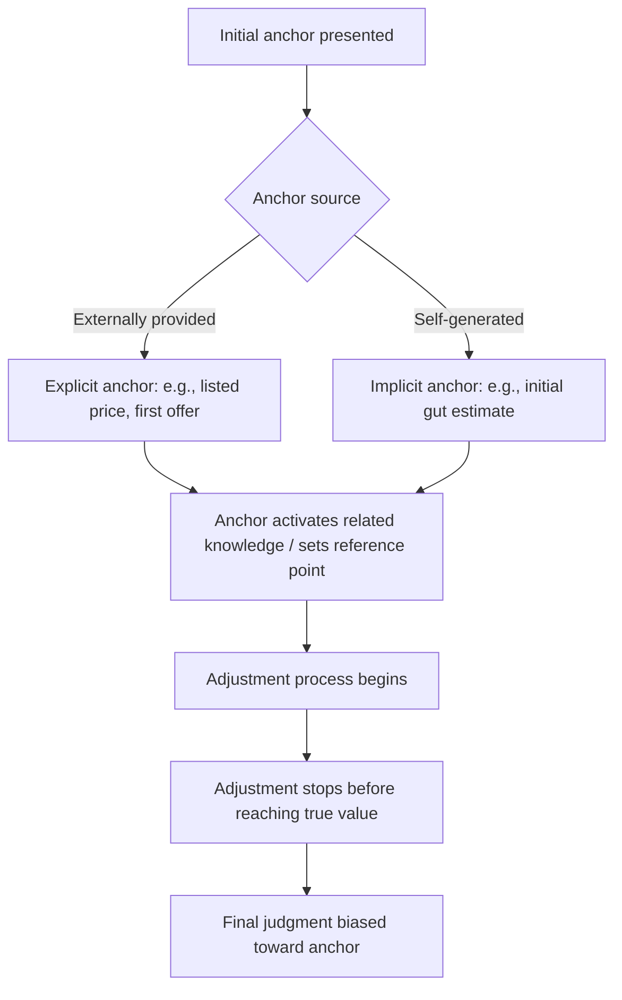

## Anchoring and Adjustment

### Definition and Core Mechanism

Anchoring and adjustment is a cognitive heuristic in which people form judgments by starting from an initial reference point (the "anchor") and then adjusting away from it to arrive at a final estimate. The adjustment is typically insufficient, causing the final judgment to remain biased toward the initial value. This heuristic was first systematically documented by Amos Tversky and Daniel Kahneman in their 1974 paper "Judgment under Uncertainty: Heuristics and Biases."

The mechanism operates in two stages:

1. **Anchor activation** — an initial number, value, or reference point enters working memory, whether self-generated, provided externally, or entirely arbitrary.
2. **Insufficient adjustment** — subsequent estimation processes move away from the anchor but stop too early, leaving the final judgment systematically skewed toward the anchor.

**Key Points**

- Anchors influence judgment even when they are explicitly irrelevant to the decision (e.g., a random number generated by spinning a wheel).
- The effect persists even when people are warned about it in advance.
- Anchoring is distinct from simple priming in that it specifically affects *numeric or scalar* judgments.
- Two theoretical accounts dominate the literature: **insufficient adjustment** (Tversky & Kahneman's original account) and **selective accessibility** (anchors activate anchor-consistent knowledge, biasing the search for comparison information). [Inference — the relative contribution of each mechanism in any given context is still debated in the literature]

### Classic Experimental Evidence

The original wheel-of-fortune study asked participants to spin a rigged wheel (landing on either 10 or 65) and then estimate the percentage of African countries in the United Nations. Participants who saw "65" gave substantially higher estimates than those who saw "10," despite the wheel's outcome being obviously random and irrelevant to the question.

Other well-documented demonstrations include:

- **Anchoring in negotiations** — the first offer in a negotiation strongly predicts the final settlement price.
- **Anchoring in real estate appraisal** — even professional real estate agents shown a property's listing price adjusted their independent valuations toward that price, despite claiming the listing price didn't influence them.
- **Self-generated anchors** — asking whether Gandhi died before or after age 9 (an absurd anchor) versus age 140 produces markedly different subsequent age estimates for his actual death.

### Applications in Marketing and Consumer Psychology

Anchoring is one of the most operationally exploited heuristics in pricing and persuasion strategy.

#### Price Anchoring

- **Reference pricing**: Displaying a high "original" price crossed out next to a "sale" price anchors the consumer's valuation to the original figure, making the discounted price feel like exceptional value regardless of its absolute level.
- **Decoy pricing / asymmetric dominance**: Introducing a third, clearly inferior option shifts the anchor point for comparison, making a target option appear more attractive relative to the decoy.
- **Tiered pricing (good-better-best)**: The highest-priced tier often functions primarily as an anchor to make the middle tier seem reasonably priced, even if few customers are expected to purchase the top tier.
- **Luxury "prestige" items in a lineup**: Retailers place a very high-priced item (e.g., a $10,000 handbag) near mid-range items (e.g., $500 handbags) so the mid-range price feels moderate by comparison.

#### Negotiation and Sales

- Salespeople are trained to make the first offer in price negotiations because the initial anchor disproportionately determines the final agreed price.
- In B2B sales, presenting a high-end custom quote first before offering a "standard package" anchors the buyer's expectations upward.

#### Promotional and Quantity Framing

- Signage stating "Limit 12 per customer" has been shown to increase average purchase quantities relative to no-limit signage, anchoring the customer's mental reference point for "normal" purchase volume.
- Subscription and SaaS pricing pages anchor high with an "Enterprise" tier to make "Pro" tier pricing seem more accessible.

**Example**

A SaaS company lists three plans: Basic ($29/mo), Pro ($79/mo), and Enterprise ($299/mo). Sales data typically show Pro as the most-purchased tier — not because $79 is objectively "the right price," but because the $299 anchor recalibrates the customer's internal reference point, making $79 feel moderate. [Inference — actual conversion distributions vary by product category, price sensitivity of the customer base, and competitive context]

### Anchoring in Advertising and Communications

- **Numeric claims in headlines**: "Save up to 70%" anchors consumers to the maximum discount figure, even though actual savings across most SKUs may be far lower.
- **Comparative advertising**: Explicitly stating a competitor's price or a category-average price sets an anchor that the advertiser's price is then framed against.
- **Testimonial numbers**: Statistics like "9 out of 10 dentists recommend" function as social-proof anchors that shape the perceived credibility baseline for a product claim.

### Moderating Factors

Research has identified several variables that influence the strength of the anchoring effect:

| Factor | Effect on Anchoring Strength |
| --- | --- |
| Anchor plausibility | Plausible anchors within a believable range produce stronger effects than implausible ones |
| Expertise/domain knowledge | Experts show reduced but not eliminated anchoring bias |
| Cognitive load | Higher load increases reliance on the anchor (less capacity for adjustment) |
| Motivation/incentives | Financial incentives to be accurate reduce but do not eliminate the effect |
| Anchor extremity | Very extreme anchors sometimes produce a "backlash" or contrast effect rather than assimilation [Inference — this boundary condition is context-dependent and not universally replicated] |
| Numeric vs. non-numeric anchors | Numeric anchors produce more reliable, larger effects than vague verbal anchors |

### Distinguishing Anchoring from Related Heuristics

- **Anchoring vs. Framing**: Framing concerns how equivalent information is presented (gain vs. loss language); anchoring concerns a numeric starting point that biases subsequent estimation.
- **Anchoring vs. Priming**: Priming is a broader concept involving activation of any related concept (semantic, affective, or numeric); anchoring is a specific case of priming applied to quantitative judgment.
- **Anchoring vs. Availability heuristic**: Availability concerns ease of recall influencing probability judgments; anchoring concerns adjustment from a starting value.

### Process Flow of the Anchoring Effect

### Mitigation Strategies (Debiasing)

For practitioners and researchers seeking to reduce anchoring bias in judgment tasks:

- **Consider-the-opposite technique**: Explicitly generating reasons why the anchor might be wrong or why the true value could be different.
- **Multiple independent anchors**: Exposing judges to several different anchors reduces the influence of any single one.
- **Delayed judgment**: Introducing a time gap between anchor exposure and the final decision.
- **Explicit warning + incentive**: Combining awareness of the bias with accuracy incentives produces the largest (though still incomplete) reduction in adjustment error. [Unverified — effect sizes for combined interventions vary substantially across studies and populations]

### Measuring Anchoring Effects

A standard experimental paradigm for quantifying anchoring strength:

$$\text{Anchoring Index} = \frac{\bar{E}_{\text{high anchor}} - \bar{E}_{\text{low anchor}}}{\text{Anchor}_{\text{high}} - \text{Anchor}_{\text{low}}}$$

Where $\bar{E}$ represents the mean estimate given by participants in each anchor condition. An index approaching 1 indicates the final estimate moved almost entirely with the anchor (strong anchoring); an index near 0 indicates the anchor had little to no effect.

### Ethical Considerations in Marketing Use

- Regulatory bodies in several jurisdictions (e.g., FTC guidelines in the U.S., Consumer Rights Directive in the EU) restrict the use of fabricated "original" reference prices that were never genuinely offered, since this constitutes a deceptive anchoring practice.
- Ethical use of anchoring generally involves transparent framing (e.g., genuine tiered value propositions) rather than fabricated reference points designed solely to manipulate perceived value.

**Related Topics**

- Framing effects (gain/loss framing)
- Decoy effect and asymmetric dominance
- Prospect theory and reference-dependent valuation
- Priming effects in consumer decision-making
- Availability heuristic
- Reference price theory in behavioral pricing
- Loss aversion
- Choice architecture and nudging