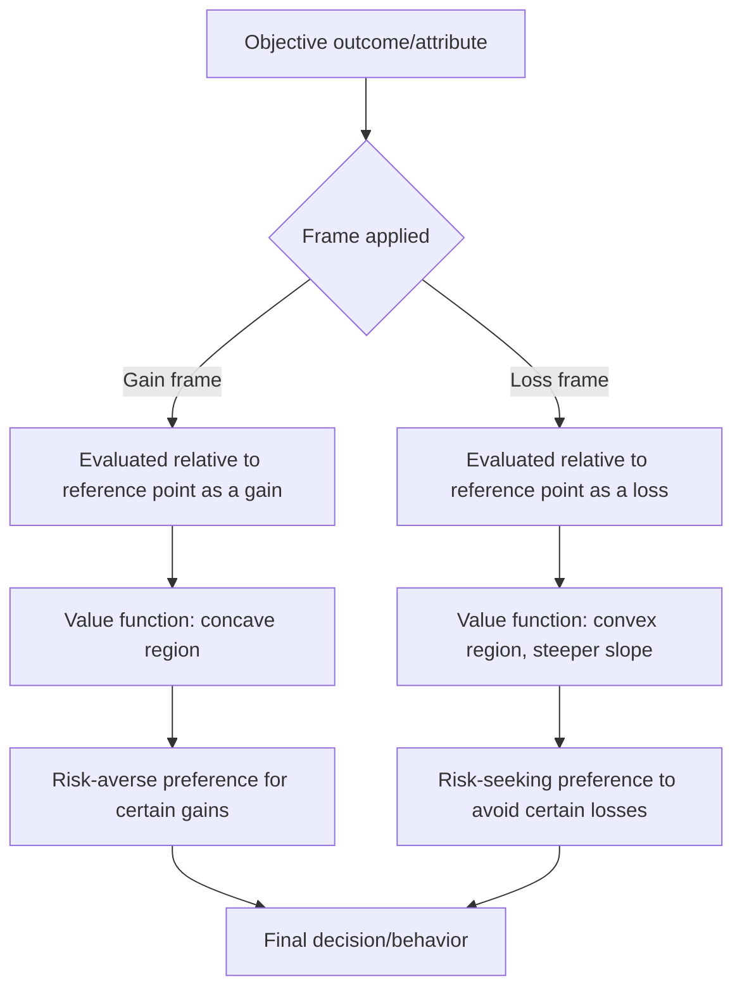

## Framing Effects and Prospect Theory

### Overview and Theoretical Origin

Prospect theory, developed by Daniel Kahneman and Amos Tversky in their 1979 paper "Prospect Theory: An Analysis of Decision under Risk," is a descriptive model of how people actually make decisions under risk and uncertainty, in contrast to expected utility theory, which is a normative model of how rational agents *should* decide. Framing effects are a closely related phenomenon: logically equivalent information produces different decisions depending on whether it is presented (framed) in terms of gains or losses.

**Key Points**

- Prospect theory won Kahneman the 2002 Nobel Memorial Prize in Economic Sciences (Tversky had died in 1996 and was ineligible).
- The theory replaced the expected utility model's assumption of consistent, rational risk preferences with an empirically-grounded model of systematic, predictable deviations.
- Framing effects are one of the direct behavioral consequences predicted by prospect theory's value function.

### Core Components of Prospect Theory

Prospect theory consists of two main components: a **value function** and a **probability weighting function**.

#### The Value Function

The value function describes how people subjectively evaluate outcomes, and has three defining properties:

1. **Reference dependence** — outcomes are evaluated as gains or losses relative to a reference point (often the status quo), not as absolute final wealth states.
2. **Loss aversion** — losses loom larger than equivalent gains; the pain of losing $100 is felt more intensely than the pleasure of gaining $100.
3. **Diminishing sensitivity** — the marginal psychological impact of a change decreases as one moves further from the reference point, in both the gain and loss domains (the function is concave for gains, convex for losses).

The value function is commonly expressed as:

$$v(x) = \begin{cases} x^{\alpha} & \text{if } x \geq 0 \\ -\lambda(-x)^{\beta} & \text{if } x < 0 \end{cases}$$

Where $x$ is the outcome relative to the reference point, $\alpha$ and $\beta$ are parameters governing diminishing sensitivity (typically estimated around 0.88 in the original Kahneman-Tversky formulation), and $\lambda$ is the loss aversion coefficient (originally estimated around 2.25, meaning losses are felt roughly 2.25 times as strongly as equivalent gains). [Inference — these specific parameter values come from the original 1979/1992 estimates; replication studies have found a range of values depending on population and elicitation method]

#### The Probability Weighting Function

People do not treat probabilities linearly. Instead:

- Small probabilities are overweighted (a 1% chance of winning feels more significant than its mathematical value suggests, which explains lottery ticket purchases).
- Moderate-to-large probabilities are underweighted.
- The weighting function is typically expressed as $w(p)$, an inverse-S-shaped curve, distinct from the identity function $w(p) = p$ that expected utility theory assumes.

**S-curve shape (SVG diagram, described)**

<svg xmlns="http://www.w3.org/2000/svg" viewBox="0 0 500 500">
<rect width="500" height="500" fill="#ffffff" />
<text x="250" y="30" font-size="16" font-family="sans-serif" text-anchor="middle" fill="#111111">Prospect Theory Value Function (svg_diagram)</text>
<line x1="50" y1="250" x2="450" y2="250" stroke="#333333" stroke-width="2" />
<line x1="250" y1="50" x2="250" y2="450" stroke="#333333" stroke-width="2" />
<text x="460" y="255" font-size="12" font-family="sans-serif" fill="#333333">Gains</text>
<text x="20" y="255" font-size="12" font-family="sans-serif" fill="#333333">Losses</text>
<text x="255" y="45" font-size="12" font-family="sans-serif" fill="#333333">Value</text>
<path d="M 250 250 C 300 230, 350 180, 450 120" stroke="#1a73e8" stroke-width="3" fill="none" />
<path d="M 250 250 C 200 300, 150 400, 50 460" stroke="#d93025" stroke-width="3" fill="none" />
<circle cx="250" cy="250" r="4" fill="#111111" />
<text x="255" y="270" font-size="11" font-family="sans-serif" fill="#111111">Reference point</text>
<text x="330" y="150" font-size="11" font-family="sans-serif" fill="#1a73e8">Concave (gains)</text>
<text x="90" y="380" font-size="11" font-family="sans-serif" fill="#d93025">Convex &amp; steeper (losses)</text>
</svg>

The steeper slope on the loss side versus the gain side is the graphical representation of loss aversion; the concave/convex curvature on each side represents diminishing sensitivity.

### Framing Effects: The Behavioral Manifestation

Framing effects occur because the same objective outcome, when described relative to a gain-framed or loss-framed reference point, triggers different regions of the value function and therefore different risk preferences.

#### The Asian Disease Problem (Classic Demonstration)

Kahneman and Tversky's canonical study presented participants with a hypothetical disease expected to kill 600 people, and two equivalent programs described in different frames:

**Gain frame:**

- Program A: 200 people will be saved.
- Program B: 1/3 probability all 600 are saved, 2/3 probability no one is saved.
- Result: Majority chose Program A (risk-averse in the gain domain).

**Loss frame:**

- Program C: 400 people will die.
- Program D: 1/3 probability no one dies, 2/3 probability all 600 die.
- Result: Majority chose Program D (risk-seeking in the loss domain), despite Program C being mathematically identical to Program A and Program D identical to Program B.

This reversal — risk aversion for gains, risk seeking for losses — is called the **reflection effect** and is a direct prediction of the value function's shape.

### Applications in Marketing and Consumer Psychology

#### Gain vs. Loss Framing in Messaging

- **Gain-framed appeals** ("Save $50 by switching now") tend to be more persuasive for prevention-oriented, low-risk decisions.
- **Loss-framed appeals** ("Avoid losing your $50 discount if you don't switch today") tend to be more persuasive for decisions involving detection behaviors or urgency (e.g., health screenings, security products, limited-time offers).
- Meta-analytic research on health communication has found loss-framed messages are often more effective for encouraging detection behaviors (e.g., cancer screenings), while gain-framed messages are often more effective for encouraging prevention behaviors (e.g., sunscreen use). [Inference — the "prevention vs. detection" moderation pattern (Rothman & Salovey's framework) is a well-cited finding but effect sizes vary by study, message, and population]

#### Reference Price Framing

- "Was $199, now $149" frames the $50 difference as a **gain** (a discount received) rather than presenting $149 as a **loss** relative to some other reference.
- Subscription cancellation flows often reframe cancellation as a loss ("You'll lose access to X, Y, Z") rather than a neutral state change, exploiting loss aversion to reduce churn.

#### Fee and Surcharge Framing

- Businesses prefer framing price differences as "cash discounts" (a gain for paying cash) rather than "credit card surcharges" (a loss for using credit), even when the underlying price difference is identical — because losses are weighted more heavily than equivalent forgone gains.

#### Endowment Effect and Loss Aversion in Product Design

- Free trials and "try before you buy" models leverage loss aversion: once a consumer mentally incorporates a product into their reference point (their sense of ownership), losing it at the end of the trial feels like a loss, increasing conversion to paid plans.
- Money-back guarantees reduce perceived risk by reframing the purchase decision away from a potential loss.

#### Insurance and Warranty Sales

- Extended warranties are frequently purchased despite being actuarially poor value, in part because the small, certain cost is preferred over the framed possibility of a larger loss (a manifestation of risk-seeking avoidance in the loss domain combined with overweighting of small probabilities).

**Example**

An e-commerce checkout page tests two messages for an extended warranty add-on:

- Frame A (gain): "Protect your purchase for peace of mind."
- Frame B (loss): "Don't risk paying full repair costs if something breaks."

  Loss-framed messaging (Frame B) is hypothesized to produce a higher attach rate, consistent with loss aversion research, though actual results depend on product category, price point, and audience risk tolerance. [Inference — this is an illustrative hypothesis, not a reported empirical result]

### Framing Effects Beyond Gain/Loss: Attribute Framing and Goal Framing

Framing effects research (following Levin, Schneider, and Gaeth's 1998 typology) identifies three distinct subtypes:

| Framing Type | Description | Marketing Example |
| --- | --- | --- |
| Risky choice framing | Choice between a sure outcome and a gamble, framed as gain or loss | Asian disease problem; insurance decisions |
| Attribute framing | A single attribute of an object is described positively or negatively | "90% fat-free" vs. "10% fat" ground beef |
| Goal framing | The consequences of performing or not performing an action are framed | "Perform breast self-exams to detect cancer early" vs. "Failure to perform self-exams reduces early detection chances" |

Attribute framing in particular is heavily used in food and product labeling, where identical nutritional facts produce different purchase intentions depending on positive vs. negative phrasing.

### Process Flow: How Framing Shapes Decision Outcomes

### Relationship to Other Heuristics and Biases

- **Endowment effect**: A direct corollary of loss aversion — once an item is owned, giving it up is coded as a loss, inflating its subjective value relative to acquiring the same item.
- **Status quo bias**: Related to reference dependence; deviating from the current state is often coded as a potential loss.
- **Sunk cost fallacy**: Connected to the value function's shape in the loss domain — continuing a failing course of action to avoid "realizing" a loss reflects risk-seeking behavior once already in the loss domain.
- **Anchoring**: Distinct mechanism (numeric starting point and adjustment) but often interacts with framing, since the anchor can itself define the reference point used for gain/loss coding.

### Measurement and Experimental Paradigms

Common methods for studying framing/prospect theory effects include:

- **Between-subjects gain/loss framing experiments** (the standard Asian disease-style design).
- **Certainty equivalent elicitation**, where researchers determine the guaranteed amount a person considers equivalent to a risky gamble, used to empirically estimate the curvature parameters ($\alpha$, $\beta$) of the value function.
- **Multiple price list (MPL) tasks**, commonly used in behavioral economics experiments to estimate individual-level loss aversion coefficients ($\lambda$).

### Boundary Conditions and Critiques

- Framing effects are generally weaker among individuals with higher numeracy or analytical thinking dispositions, though the effect is rarely eliminated entirely. [Inference — moderation by numeracy is a replicated pattern but magnitude varies across studies]
- Cross-cultural research has found framing effects to be broadly replicable across many populations, though effect sizes and the specific reference points used can vary by cultural context. [Unverified — cross-cultural magnitude comparisons are an active and contested area of research]
- Critics (e.g., in some replication and "heuristics and biases" debates) argue certain framing manipulations are sensitive to specific wording, sample, and context, and do not always generalize with the same effect size reported in original studies.

### Ethical Considerations in Marketing Use

- Regulatory scrutiny (e.g., FTC "deceptive framing" guidance, EU Unfair Commercial Practices Directive) applies when framing is used to misrepresent actual costs, risks, or probabilities rather than simply presenting truthful information in a psychologically effective manner.
- A key ethical distinction is between framing that clarifies genuine trade-offs (ethically defensible) and framing that obscures material information to manipulate a decision the consumer would not otherwise make with full information (ethically contested).

**Related Topics**

- Anchoring and adjustment
- Loss aversion (as a standalone construct)
- Endowment effect
- Status quo bias
- Mental accounting
- Sunk cost fallacy
- Nudge theory and choice architecture
- Regret theory and anticipated regret in decision-making