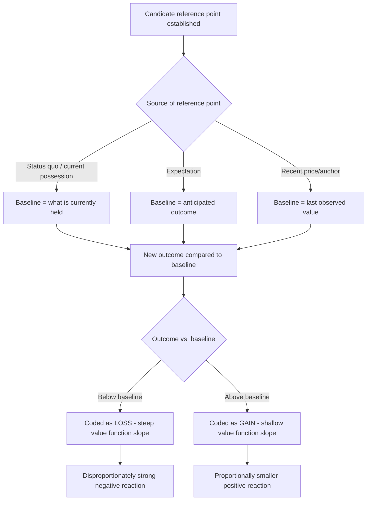

## Loss Aversion and Reference Dependence

### Definition and Theoretical Foundation

Loss aversion is the empirical finding that losses are psychologically weighted more heavily than objectively equivalent gains. Reference dependence is the closely related principle that outcomes are evaluated not in terms of absolute final states, but relative to a reference point — typically the current status quo, an expectation, or a recently established baseline. Both concepts were formalized as core components of prospect theory by Daniel Kahneman and Amos Tversky (1979), and loss aversion specifically was elaborated in their 1991 paper "Loss Aversion in Riskless Choice: A Reference-Dependent Model."

**Key Points**

- The commonly cited loss aversion coefficient ($\lambda$) from the original research is approximately 2.25, meaning a loss is felt roughly 2.25 times as intensely as an equivalent-sized gain, though later replications report a wide range (often cited between 1.5 and 2.5 depending on domain and elicitation method). [Inference — the coefficient is highly method- and context-dependent, and there is no single universally agreed value]
- Reference dependence means the *same* absolute outcome can be coded as a gain or a loss depending entirely on what reference point is salient at the time of judgment.
- Loss aversion is distinct from general risk aversion: risk aversion concerns preferences over uncertain outcomes, while loss aversion concerns the differential psychological weight of losses versus gains even when magnitudes are certain.

### The Reference Point: What Determines It

The reference point is not fixed; it can be shaped by several factors:

- **Status quo** — the individual's current possessions, position, or state (the default reference point in most models).
- **Expectations** — anticipated outcomes can function as a reference point even before they are realized (e.g., an expected bonus not received can feel like a loss).
- **Recent history** — a previous price, a prior year's performance, or a recently displayed anchor can shift the reference point.
- **Social comparison** — peer outcomes or competitor benchmarks can serve as an externally imposed reference point.

**Key Points**

- Because the reference point is malleable, marketers and choice architects can influence which frame (gain or loss) a consumer applies to a given outcome, without changing the outcome itself.
- This malleability is what connects loss aversion directly to framing effects (see "Framing Effects and Prospect Theory").

### The Value Function and Loss Aversion

Within prospect theory's value function, loss aversion is represented by the discontinuity in slope at the reference point (kink at the origin):

$$v(x) = \begin{cases} x^{\alpha} & \text{if } x \geq 0 \\ -\lambda(-x)^{\beta} & \text{if } x < 0 \end{cases}$$

The slope of $v(x)$ just below zero (the loss side) is steeper than the slope just above zero (the gain side), which is the mathematical expression of "losses loom larger than gains." The parameter $\lambda$ directly scales this asymmetry.

**S-shaped value function with loss aversion kink (svg_diagram)**

<svg xmlns="http://www.w3.org/2000/svg" viewBox="0 0 500 460">
<rect width="500" height="460" fill="#ffffff" />
<text x="250" y="28" font-size="16" font-family="sans-serif" text-anchor="middle" fill="#111111">Loss Aversion Kink at Reference Point (svg_diagram)</text>
<line x1="50" y1="230" x2="450" y2="230" stroke="#333333" stroke-width="2" />
<line x1="250" y1="40" x2="250" y2="430" stroke="#333333" stroke-width="2" />
<text x="455" y="235" font-size="12" font-family="sans-serif" fill="#333333">Gains</text>
<text x="15" y="235" font-size="12" font-family="sans-serif" fill="#333333">Losses</text>
<path d="M 250 230 C 300 210, 350 160, 450 100" stroke="#1a73e8" stroke-width="3" fill="none" />
<path d="M 250 230 C 210 280, 170 360, 90 420" stroke="#d93025" stroke-width="3" fill="none" />
<circle cx="250" cy="230" r="5" fill="#111111" />
<text x="258" y="250" font-size="11" font-family="sans-serif" fill="#111111">Reference point (kink)</text>
<line x1="250" y1="180" x2="290" y2="150" stroke="#1a73e8" stroke-width="1" stroke-dasharray="3,2" />
<text x="295" y="150" font-size="10" font-family="sans-serif" fill="#1a73e8">gain slope</text>
<line x1="250" y1="280" x2="210" y2="320" stroke="#d93025" stroke-width="1" stroke-dasharray="3,2" />
<text x="130" y="330" font-size="10" font-family="sans-serif" fill="#d93025">steeper loss slope</text>
</svg>

### Distinguishing Loss Aversion from Related Concepts

| Concept | Core Mechanism | Relationship to Loss Aversion |
| --- | --- | --- |
| Risk aversion | Preference for certain outcomes over risky ones of equal expected value | Independent construct; can co-occur but is conceptually distinct |
| Endowment effect | Overvaluing owned items relative to identical unowned items | A direct behavioral consequence of loss aversion (giving up an owned item is coded as a loss) |
| Status quo bias | Preference for the current state over alternatives | Partly driven by loss aversion (change is often coded as containing a loss) |
| Sunk cost fallacy | Continuing investment based on prior (unrecoverable) costs | Related through the loss domain of the value function, where risk-seeking behavior emerges to avoid "locking in" a loss |

### Classic Empirical Demonstrations

- **Mug experiments (Kahneman, Knetsch, Thaler, 1990)**: Participants randomly given a coffee mug demanded roughly twice as much money to sell it as other participants were willing to pay to acquire an identical mug — despite no functional difference, illustrating the endowment effect as a manifestation of loss aversion.
- **Golfer putting performance (Pope & Schweitzer, 2011)**: Professional golfers were found to make putts for par (avoiding a loss relative to par) at a higher rate than statistically equivalent putts for birdie (achieving a gain), consistent with heightened motivation to avoid losses. [Inference — this is a widely cited field study finding; it illustrates the general pattern rather than a universal law across all skill domains]
- **Labor supply studies (e.g., NYC cab drivers)**: Some studies have found that drivers set informal daily income targets and stop working once the target is reached, quitting earlier on high-earning days and working longer on low-earning days — a pattern consistent with reference-dependent target income framing, although this finding has also been challenged and partially contested in subsequent replications. [Unverified — the cab driver labor-supply literature includes both supporting and contradicting studies]

### Applications in Marketing and Consumer Psychology

#### Pricing and Promotions

- **"Was/Now" pricing**: Establishes the original price as the reference point, so the current price is coded as a gain (a "saving") rather than being evaluated in isolation.
- **Cash discount vs. surcharge framing**: A price reduction for paying cash is coded as a gain, while an equivalent surcharge for credit card use is coded as a loss — even though the net price difference is identical, consumers respond more negatively to surcharge framing due to loss aversion.
- **Free shipping thresholds**: Structuring a shipping fee as something to be "lost" if the cart falls below a threshold (versus a fee simply charged) leverages loss aversion to increase average order value.

#### Retention and Churn Reduction

- Subscription cancellation flows frequently emphasize what the customer stands to lose ("You'll lose access to your saved playlists, your history, your premium features") rather than a neutral description of plan differences, directly invoking loss aversion to reduce churn.
- Loyalty programs that use "status" or "tier" systems (e.g., airline elite status) leverage loss aversion because falling out of a tier is experienced as a loss of a previously-held reference state, motivating continued spending to maintain status.

#### Free Trials and the Endowment Effect

- Free trial periods allow consumers to psychologically incorporate a product into their reference point. When the trial ends, discontinuing the product is coded as a loss rather than the neutral decision to not acquire something new, increasing conversion to paid subscriptions.
- "Try it, if you don't like it, send it back" return policies exploit the same mechanism: once a product is in the consumer's possession, returning it is experienced as relinquishing something already owned.

#### Insurance, Warranties, and Risk-related Products

- Consumers often purchase insurance and extended warranties at prices that exceed the actuarially fair value, partly because avoiding a potential future loss is weighted more heavily than the certain cost of the premium. [Inference — multiple factors beyond loss aversion contribute to warranty purchase decisions, including risk misperception and probability weighting]

#### Default Options and Loss-Framed Opt-outs

- Presenting a premium feature or add-on as a default that must be actively removed ("opt-out" design) frames its removal as a loss, increasing retention of the default option relative to an "opt-in" design where the same feature must be actively added.

**Example**

A streaming service tests two cancellation-flow messages for users attempting to downgrade from Premium to Basic:

- Neutral: "Basic plan removes offline downloads and HD streaming."
- Loss-framed: "You will lose offline downloads and HD streaming you currently have."

  The loss-framed version is hypothesized to produce a lower downgrade completion rate, consistent with loss aversion research, though actual measured effect sizes depend on the specific user base, feature salience, and price sensitivity. [Inference — illustrative hypothesis, not a reported empirical result]

### Process Flow: Reference Point Formation and Loss Coding

### Measurement Approaches

- **Willingness-to-pay (WTP) vs. willingness-to-accept (WTA) gap**: The standard experimental measure of loss aversion; WTA for giving up an item typically exceeds WTP for acquiring the same item, and the ratio between them is used to estimate the loss aversion coefficient.
- **Multiple price list (MPL) gamble tasks**: Presenting a series of mixed gambles (possible gain, possible loss) and identifying the point of indifference to estimate $\lambda$ at the individual level.
- **Field experiments on price framing**: A/B testing cash-discount vs. surcharge framing, or "was/now" vs. flat pricing, as applied measures of loss aversion's real-world marketing impact.

### Boundary Conditions and Critiques

- Some researchers have questioned whether loss aversion is a truly universal, stable individual trait or is more accurately described as a context-sensitive response strongly shaped by how a choice is elicited or measured. [Unverified — this remains an active debate in the behavioral economics literature, including critiques from researchers such as Gal & Rucker (2018) questioning the necessity of loss aversion as an explanatory construct in some contexts]
- Loss aversion effects tend to be attenuated for very small stakes and can vary substantially by individual difference variables (e.g., prior experience with the domain, financial literacy, and emotional state at time of decision).
- Cross-cultural and demographic studies show variation in the magnitude of loss aversion, though the general directional pattern (losses felt more strongly than equivalent gains) has been widely replicated. [Inference — degree of cross-cultural universality vs. magnitude variance is still actively studied]

### Ethical Considerations in Marketing Use

- Using loss-framed messaging to accurately convey genuine trade-offs (e.g., informing a customer they will lose specific features) is generally considered ethically acceptable transparency.
- Using artificially manufactured scarcity or fabricated "you're about to lose this" urgency where no genuine loss exists crosses into manipulative dark-pattern territory and may run afoul of consumer protection regulations (e.g., FTC guidance on deceptive urgency claims, EU Unfair Commercial Practices Directive provisions on manufactured scarcity).

**Related Topics**

- Framing effects and prospect theory
- Endowment effect
- Status quo bias
- Sunk cost fallacy
- Mental accounting
- Willingness-to-pay/willingness-to-accept gap
- Regret aversion
- Dark patterns in choice architecture