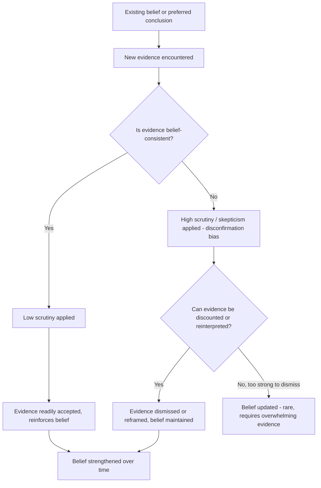

## Confirmation Bias and Motivated Reasoning

### Definitions and Conceptual Distinction

**Confirmation bias** is the tendency to search for, interpret, favor, and recall information in ways that confirm one's pre-existing beliefs or hypotheses, while giving disproportionately less attention to information that contradicts them. **Motivated reasoning** is the broader phenomenon in which emotional or goal-driven motivations (not just prior beliefs) bias the reasoning process itself — people reason as if they were building a case for a conclusion they want to reach, rather than reasoning neutrally toward the most accurate conclusion.

**Key Points**

- Confirmation bias was extensively documented by psychologist Peter Wason in the 1960s, most notably through the "2-4-6 task" and the Wason selection task.
- Motivated reasoning was formalized as a distinct framework by Ziva Kunda in her influential 1990 paper "The Case for Motivated Reasoning," which distinguished between "accuracy goals" (motivation to reach a correct conclusion) and "directional goals" (motivation to reach a preferred conclusion).
- Confirmation bias can be understood as one *mechanism* through which directionally-motivated reasoning operates — but motivated reasoning also includes related mechanisms such as biased memory search, selective skepticism, and disconfirmation bias (applying stricter scrutiny to unwelcome evidence).

### The Wason Selection Task and 2-4-6 Task

**2-4-6 task**: Participants were told the sequence "2-4-6" fits a rule and asked to discover the rule by proposing new sequences and receiving yes/no feedback. Most participants proposed sequences designed to *confirm* their current hypothesis (e.g., "8-10-12" to test "even numbers increasing by 2") rather than sequences designed to *falsify* it (e.g., "3-2-1," which would have revealed the actual, simpler rule: "any ascending sequence").

**Wason selection task**: A logic task involving four cards, where participants must select which cards to turn over to test a conditional rule (e.g., "If a card has a vowel on one side, it has an even number on the other"). Most participants select cards that could confirm the rule rather than the cards that could logically falsify it, demonstrating a systematic difficulty with falsification-based reasoning even in formal logical contexts.

### Mechanisms Underlying Confirmation Bias

Three principal cognitive sub-processes contribute to confirmation bias:

1. **Biased information search** — actively seeking sources, media, or evidence likely to support existing beliefs while avoiding disconfirming sources.
2. **Biased interpretation** — ambiguous or mixed evidence is interpreted as more supportive of one's existing view than a neutral observer would judge it to be.
3. **Biased memory (selective recall)** — belief-consistent information is more easily recalled from memory than belief-inconsistent information.

### Motivated Reasoning: Directional vs. Accuracy Goals

Kunda's framework distinguishes:

- **Accuracy-motivated reasoning**: The individual is motivated to reach the most correct conclusion, leading to more effortful, careful, and even-handed processing of evidence.
- **Directionally-motivated reasoning**: The individual is motivated to reach a particular, pre-desired conclusion (e.g., that a preferred product is superior, that a personal decision was correct, that an in-group is not at fault), leading to biased evidence evaluation that still *feels* like rational, objective analysis to the person doing it.

**Key Points**

- A defining feature of motivated reasoning is that it typically operates outside conscious awareness — people believe they are being objective even as their reasoning process is systematically skewed toward a preferred conclusion.
- Motivated reasoning is constrained by plausibility: people cannot simply believe anything they want; the biased conclusion must still be minimally defensible given the available evidence (Kunda called this having to "convince an imaginary jury").
- Related but distinct concepts include **disconfirmation bias** (applying more skeptical scrutiny specifically to evidence that threatens a preferred belief) and **naive realism** (the belief that one's own perception of reality is objective and unbiased, while those who disagree are biased, uninformed, or irrational).

### Neurological and Affective Correlates

Research using fMRI (e.g., Westen et al., 2006, on politically motivated reasoning) has found that processing threatening, belief-inconsistent information activates brain regions associated with negative affect and emotion regulation, and that resolving the threat (by dismissing or reinterpreting the information) is associated with activation in reward-related regions. [Inference — specific neuroimaging findings on motivated reasoning are drawn from a limited number of studies and should be treated as suggestive rather than definitively established mechanisms]

### Applications in Marketing and Consumer Psychology

#### Brand Loyalty and Post-Purchase Rationalization

- Consumers who have already purchased a product tend to seek out and favorably interpret information that confirms their purchase decision was correct, while discounting negative reviews or contradicting information — a phenomenon closely related to **cognitive dissonance reduction** (Festinger, 1957).
- This effect underlies why loyal customers are often resistant to negative press or comparative disadvantages of their preferred brand: their reasoning is directionally motivated toward maintaining a positive self-concept as having made a good decision.

#### Selective Exposure to Advertising and Content

- Consumers disproportionately engage with brand content, reviews, and influencer opinions that align with their existing brand preferences, reinforcing existing loyalty rather than prompting reconsideration (a marketing-relevant instance of biased information search).
- This has direct implications for algorithmic content curation: platforms optimizing for engagement can inadvertently amplify confirmation bias by serving users content that confirms existing preferences, extending to product recommendations and category preferences.

#### Testimonials, Reviews, and Social Proof Interpretation

- When consumers read mixed reviews for a product they are inclined to purchase, motivated reasoning leads them to weight positive reviews more heavily and rationalize or dismiss negative reviews (e.g., attributing negative reviews to "user error" or "unusual circumstances").
- Marketers leveraging this pattern often front-load positive testimonials and social proof early in the customer journey, before potentially disconfirming information (e.g., critical reviews) is encountered, since an early directional commitment strengthens subsequent confirmation-biased processing of later ambiguous or mixed information.

#### Political, Cause-Based, and Ideological Marketing

- Cause-marketing and issue-based advertising that aligns with a consumer's existing political or ideological identity benefits from motivated reasoning: messages consistent with identity are processed with less scrutiny, and inconsistent counter-messaging is subjected to heightened skepticism (disconfirmation bias).
- This has documented risks around **selective fact-checking behavior** — consumers are more likely to independently verify claims that threaten a preferred belief than claims that support it.

#### Confirmation Bias in Market Research and A/B Testing

- Marketers and researchers themselves are susceptible to confirmation bias when interpreting campaign or experimental results, favoring metrics or interpretations that validate a preferred hypothesis (e.g., a creative direction they championed) and discounting metrics that suggest the hypothesis was wrong.
- This has direct methodological implications: pre-registration of hypotheses, blind analysis, and predefined success metrics are recommended practices to reduce confirmation bias in interpreting marketing experiment results. [Inference — these are standard debiasing recommendations from behavioral research methodology, not universally adopted industry practice]

**Example**

A brand manager champions a new tagline based on personal intuition. When A/B test results come back mixed (the new tagline outperforms on click-through rate but underperforms on conversion rate), the manager may emphasize the click-through improvement as the "real" signal while attributing the conversion shortfall to an unrelated seasonal factor — a case of directionally-motivated interpretation of ambiguous data. [Inference — illustrative scenario, not a specific documented case]

### Process Flow: How Motivated Reasoning Shapes Belief Maintenance

### Distinguishing Confirmation Bias from Related Biases

| Concept | Core Mechanism | Distinction |
| --- | --- | --- |
| Confirmation bias | Selectively seeking/interpreting/recalling belief-consistent information | Primarily about information processing, not necessarily emotionally motivated |
| Motivated reasoning | Emotionally/goal-driven distortion of the entire reasoning process | Broader; includes confirmation bias as one mechanism plus others (disconfirmation bias, selective skepticism) |
| Cognitive dissonance | Discomfort from holding contradictory cognitions, resolved by changing belief/behavior/rationalization | Provides the motivational *pressure* that often drives motivated reasoning after a decision is made |
| Belief perseverance | Continuing to hold a belief even after its original evidential basis has been discredited | A downstream *consequence* of confirmation bias and motivated reasoning |
| Naive realism | Belief that one's own view is objective while others' views are biased | A meta-level belief that shields motivated reasoning from self-correction |

### Debiasing and Mitigation Strategies

- **Consider-the-opposite technique**: Deliberately generating reasons the opposite conclusion might be true.
- **Pre-registration of hypotheses**: In research and marketing experimentation contexts, committing to success criteria before seeing results reduces post-hoc rationalization of ambiguous findings.
- **Blind or masked analysis**: Withholding condition labels during data analysis to prevent motivated interpretation.
- **Devil's advocate / red team processes**: Structurally assigning someone to argue against the prevailing hypothesis in decision-making groups.
- **Accuracy incentives**: Providing explicit incentives for correct (rather than preferred) conclusions has been shown in some studies to shift reasoning from directional toward accuracy-motivated processing, though the effect is not always sufficient to fully eliminate bias. [Inference — effectiveness of accuracy incentives varies by domain, stakes, and how identity-relevant the belief in question is]

### Boundary Conditions and Critiques

- Confirmation bias and motivated reasoning are generally stronger for beliefs that are tied to personal identity, group membership, or self-concept (e.g., political beliefs, brand identity as a form of self-expression) than for low-stakes, identity-neutral factual questions.
- Some researchers distinguish "hot" motivated reasoning (driven by emotional/directional goals) from "cold" cognitive biases (arising from processing limitations without emotional motivation), though in practice the two frequently interact and can be difficult to cleanly separate in applied settings. [Unverified — the hot/cold distinction is a useful conceptual framework but empirical separation of the two in specific behaviors is often contested]

### Ethical Considerations in Marketing Use

- Deliberately exploiting confirmation bias to reinforce false beliefs (e.g., amplifying misinformation that a competitor's product is unsafe, when it is not) constitutes deceptive marketing practice under most consumer protection frameworks.
- Ethically appropriate use generally involves working *with* natural confirmation-seeking tendencies to reduce decision friction for a genuinely well-suited product (e.g., surfacing relevant confirming social proof) rather than manufacturing false confirming "evidence" or suppressing materially relevant disconfirming information (e.g., known product defects or limitations).

**Related Topics**

- Cognitive dissonance and post-purchase rationalization
- Availability heuristic
- Anchoring and adjustment
- Social proof and consensus heuristics
- Belief perseverance and the backfire effect
- Selective exposure theory in media psychology
- In-group/out-group bias in brand identity