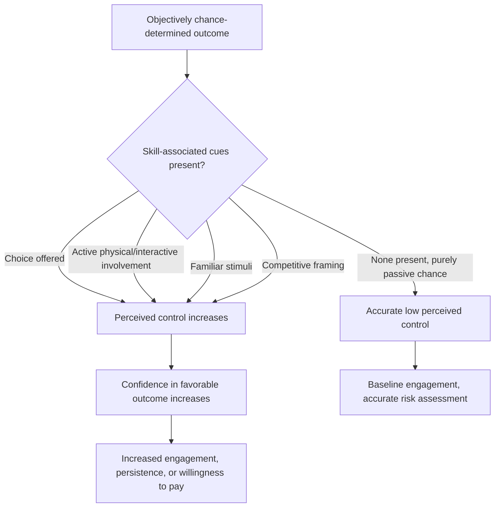

## Overconfidence and Illusion of Control

### Definitions and Conceptual Distinction

**Overconfidence** is a family of related biases in which subjective confidence in one's judgments, predictions, or abilities systematically exceeds objective accuracy. **Illusion of control** is a specific manifestation in which people overestimate their ability to control or influence outcomes that are, in fact, determined by chance or factors outside their influence. Illusion of control was first systematically studied by psychologist Ellen Langer in her 1975 paper "The Illusion of Control."

**Key Points**

- Overconfidence is not a single unified bias but an umbrella term covering at least three distinct sub-types identified in the literature: **overestimation** (believing one's actual performance, ability, or level of control is better than it is), **overplacement** (believing one is better than others, also called the "better-than-average effect"), and **overprecision** (excessive certainty about the accuracy of one's beliefs, often measured via overly narrow confidence intervals).
- Illusion of control is most pronounced when situational cues resemble those of skill-based tasks (e.g., choice, competition, familiarity, active involvement) even when the underlying outcome is actually random.
- These biases are considered among the most robust and consequential findings in judgment and decision-making research, with well-documented effects in finance, entrepreneurship, medicine, and consumer behavior.

### Overprecision: The Confidence Interval Problem

Overprecision is typically measured by asking people to provide a range (e.g., a 90% confidence interval) within which they believe the true answer falls. Studies consistently find that the true answer falls outside people's stated 90% confidence intervals far more than 10% of the time — often 30–40% of the time — indicating people's intervals are systematically too narrow. [Inference — the specific miss-rate figures vary across studies, tasks, and populations, but the general direction (intervals too narrow) is a highly replicated finding]

### Overestimation and the Better-Than-Average Effect

Classic demonstrations include:

- **Driving ability studies** (Svenson, 1981): The majority of surveyed drivers rated themselves as above-median in driving skill and safety — a statistical impossibility if the sample is representative, since only half of any population can be truly above the median.
- **Entrepreneurial survival estimates**: Research on small business owners has found that individuals often provide substantially higher estimates of their own venture's chances of success than the objective base rate of small business survival would justify, even while acknowledging that the general failure rate for businesses like theirs is high. [Inference — this pattern of "it won't happen to me" self-exemption is well documented in entrepreneurship research, though specific percentage gaps vary by study]

### Illusion of Control: Key Experimental Findings

Langer's original studies identified several factors that inflate the illusion of control even in explicitly chance-determined situations:

| Factor | Effect on Illusion of Control |
| --- | --- |
| Choice | Being allowed to choose one's own lottery ticket (vs. being assigned one) increases perceived winning chances, and increases the price demanded to sell the ticket back |
| Competition | Competing against a visibly nervous or unskilled-seeming opponent (even in a chance game) increases confidence of winning |
| Familiarity | Familiar stimuli (e.g., familiar symbols on a chance-based game) increase perceived control |
| Active involvement | Personally rolling dice, throwing a ball, or otherwise being physically involved in a chance-based process increases perceived control over the outcome |
| Sequential outcomes / early wins | Early "wins" in a chance sequence increase confidence in future chance-based outcomes, resembling a hot-hand-style misattribution |

### Theoretical Accounts

- **Positive illusions framework** (Taylor & Brown, 1988): Argues that overconfidence and illusion of control (alongside unrealistic optimism) are part of a broader set of "positive illusions" that may serve adaptive psychological functions, such as supporting motivation, persistence, and mental well-being, even though they distort accuracy. [Inference — the adaptive-function interpretation is a contested theoretical position, not a settled consensus]
- **Self-serving attribution bias**: People tend to attribute successes to internal, controllable factors (skill, effort) and failures to external, uncontrollable factors (bad luck, unfair circumstances), reinforcing both overconfidence and illusion of control over time.
- **Skill-cue confusion**: Illusion of control frequently arises because the human cognitive system did not evolve to cleanly distinguish games of skill from games of chance; cues associated with skill contexts (choice, competition, practice) are misapplied to chance contexts.

### Applications in Marketing and Consumer Psychology

#### Gambling, Gaming, and Loyalty Mechanics

- **Lottery and scratch-card design**: Allowing players to choose their own numbers (rather than receiving randomly assigned numbers) increases engagement and perceived winning likelihood, directly leveraging the "choice" factor identified in Langer's research.
- **Loot boxes and gacha mechanics in gaming**: Visual and interactive elements (e.g., a "pull" lever, an unwrapping animation, near-miss displays) create an illusion of skill or influence over an outcome that is purely probabilistic, a design pattern that has drawn regulatory scrutiny in several jurisdictions due to its resemblance to gambling mechanics. [Inference — the degree of regulatory classification as "gambling" varies significantly by jurisdiction and is an evolving legal area]
- **Near-miss effects**: Slot machines and similar mechanics are often designed to produce "near-miss" outcomes (e.g., two matching symbols and a third just adjacent) more frequently than chance alone would produce, which has been shown to increase continued play by reinforcing an illusory sense of "almost winning through skill." [Unverified — the specific engineering intent and prevalence of designed near-miss rates varies by manufacturer and jurisdiction, and is a topic of ongoing regulatory and academic scrutiny]

#### Skill-Framing in Promotions and Contests

- Marketing promotions often frame prize draws or sweepstakes using skill-adjacent language ("enter to win," "play now," interactive mini-games layered atop random outcomes) rather than purely passive chance framing, increasing perceived agency and participation rates.
- "Spin to win" wheel mechanics on e-commerce sites use active user involvement (clicking "spin") to create a sense of influence over an outcome that is typically predetermined or weighted by the retailer.

#### Financial and Investment Product Marketing

- Overconfidence is a well-documented driver of excessive trading activity among retail investors; research has found that more frequent traders tend to earn lower net returns than less frequent traders, a pattern widely attributed in the behavioral finance literature to overconfidence in one's own stock-picking or timing ability. [Inference — this is a well-cited finding in behavioral finance (e.g., Barber & Odean's research), though specific effect sizes vary by market, time period, and investor population]
- Trading platforms and investment apps that emphasize active decision-making, real-time data, and frequent interaction may inadvertently (or deliberately) reinforce illusion of control among users, a design pattern that has drawn consumer protection attention in some markets. [Inference — the causal link between specific app design choices and increased trading frequency is an area of ongoing research and regulatory discussion, not a definitively settled causal finding]

#### Product Customization and "Build Your Own" Offerings

- Allowing consumers to customize a product (choosing colors, features, configurations) increases their confidence in and satisfaction with the outcome, even in cases where the underlying product quality or performance is unaffected by the specific choices offered — an application of the "choice" factor in illusion of control research to legitimate product personalization strategies.

#### Overconfidence in Marketer/Brand Decision-Making

- Marketing teams themselves are subject to overconfidence, particularly overprecision, when forecasting campaign performance, often providing narrower ranges of expected outcomes (e.g., ROI projections) than warranted by historical variance, leading to systematic disappointment relative to overly optimistic projections. [Inference — this is a general pattern observed in business forecasting research (e.g., planning fallacy literature) applied to the marketing context]

**Example**

An e-commerce site adds a "Spin the Wheel for a Discount" pop-up before checkout. Even though the discount tiers and their probabilities are fixed by the retailer, the active click-to-spin interaction is hypothesized to increase perceived value and engagement compared to simply displaying "You get 10% off," consistent with illusion-of-control research on active involvement. [Inference — illustrative hypothesis, not a specific reported empirical result]

### Process Flow: How Illusion of Control Forms

### Distinguishing Overconfidence/Illusion of Control from Related Biases

| Concept | Core Mechanism | Distinction |
| --- | --- | --- |
| Overconfidence (general) | Confidence exceeds actual accuracy/ability | Umbrella category |
| Illusion of control | Belief that one can influence chance-determined outcomes | Specific sub-type involving perceived causal agency |
| Optimism bias | Belief that negative future events are less likely to happen to oneself than to others | Related "positive illusion" but focused on future risk perception rather than control/skill |
| Planning fallacy | Underestimating time, cost, or risk of future tasks despite knowing similar tasks took longer before | Often co-occurs with overconfidence but specifically concerns project/task time estimation |
| Dunning-Kruger effect | Low performers particularly overestimate their competence due to lack of metacognitive skill to recognize their own errors | A specific overestimation pattern tied to skill level and self-assessment ability, not a general confidence bias |

### Debiasing and Mitigation Strategies

- **Calibration training and feedback**: Providing repeated feedback comparing stated confidence to actual outcomes has been shown to improve calibration over time in some domains (e.g., weather forecasting), though transfer to novel domains is limited. [Inference — calibration training effectiveness is domain-specific and does not reliably generalize]
- **Reference class forecasting**: Grounding predictions in the historical base rate of similar past cases (rather than intuitive judgment) reduces both overconfidence and the planning fallacy.
- **Wider interval elicitation techniques**: Explicitly asking for 10th/90th percentile estimates (rather than a single point estimate) and considering reasons the estimate could be wrong tends to widen and improve the calibration of confidence intervals.
- **Structured pre-mortems**: Imagining a future failure and working backward to identify causes counteracts both overconfidence and illusion of control by forcing consideration of uncontrollable or overlooked factors.

### Boundary Conditions and Critiques

- Overconfidence effects are not uniform across all judgment types; some research finds people are actually *underconfident* on very easy tasks and overconfident primarily on difficult or ambiguous tasks (the "hard-easy effect"). [Inference — the hard-easy effect is a documented but not universally replicated pattern, and its robustness across task types has been debated]
- Illusion of control effects tend to diminish (but not disappear entirely) among individuals with clinical depression, a pattern researchers have referred to as "depressive realism," though this finding has also faced replication challenges and alternative explanations in subsequent research. [Unverified — depressive realism remains a contested and incompletely replicated finding in the literature]

### Ethical Considerations in Marketing Use

- Regulatory frameworks in several jurisdictions (e.g., gambling commissions, and emerging consumer protection guidance on loot boxes) specifically address marketing and game design mechanics that exploit illusion of control, particularly where they resemble gambling or target vulnerable populations, including minors.
- Ethical use of choice/customization to enhance genuine consumer satisfaction is generally distinguished from mechanics specifically engineered to obscure the true (low) probability of an outcome or to encourage compulsive, harmful engagement patterns.

**Related Topics**

- Optimism bias
- Planning fallacy
- Dunning-Kruger effect
- Gambler's fallacy and hot-hand fallacy
- Self-serving attribution bias
- Behavioral finance and investor overtrading
- Gamification and engagement-driven design ethics