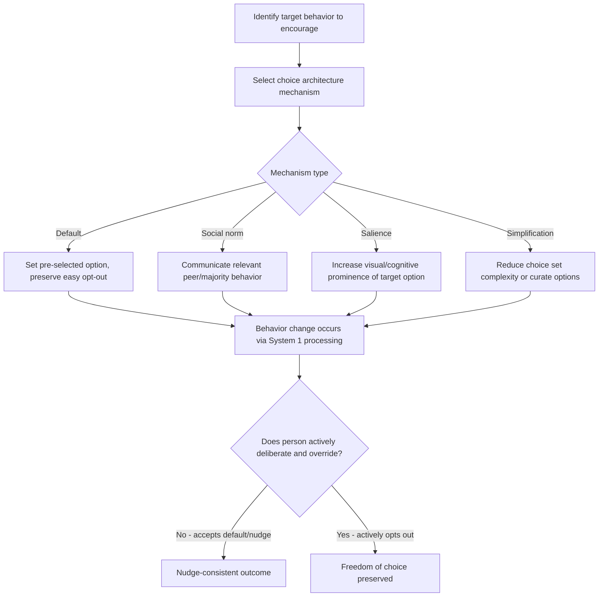

## Nudge Theory and Libertarian Paternalism

### Definitions and Theoretical Origin

**Nudge theory** describes interventions that alter the "choice architecture" surrounding a decision in ways that predictably influence behavior without forbidding any options or significantly changing economic incentives. **Libertarian paternalism** is the philosophical justification underpinning nudges: the idea that it is legitimate (and even desirable) for institutions to steer people toward choices that improve their welfare, while preserving freedom of choice. Both concepts were introduced by economist Richard Thaler and legal scholar Cass Sunstein, most comprehensively in their 2008 book *Nudge: Improving Decisions About Health, Wealth, and Happiness*.

**Key Points**

- Thaler received the 2017 Nobel Memorial Prize in Economic Sciences in substantial part for his contributions to behavioral economics, including nudge theory.
- The canonical definition from Thaler and Sunstein specifies that a nudge must (1) not forbid any options, (2) not significantly change economic incentives, and (3) be easy and cheap to avoid — distinguishing it from mandates, bans, or taxes/subsidies.
- The "libertarian" component refers to preserving freedom of choice; the "paternalism" component refers to the deliberate intent to influence choices in a direction believed to improve the chooser's own welfare, as judged by the chooser's own standards where possible.

### Theoretical Foundation: Dual-Process Reasoning

Nudge theory is grounded in dual-process models of cognition (popularized by Kahneman's "System 1 / System 2" framework), which distinguish:

- **System 1 (automatic)**: Fast, intuitive, effortless, heuristic-driven processing — the primary target of most nudges.
- **System 2 (reflective)**: Slow, deliberate, effortful, analytical processing.

Because many real-world decisions (retirement savings, health behaviors, environmental choices) are made using System 1 processing or default to inaction, choice architecture that leverages System 1 tendencies (e.g., defaults, framing, salience) can predictably shift behavior even without engaging deliberate reasoning.

### Core Nudge Mechanisms (Choice Architecture Tools)

Thaler and Sunstein's framework identifies several specific choice architecture techniques:

| Mechanism | Description | Underlying Heuristic Exploited |
| --- | --- | --- |
| Defaults | Setting a pre-selected option that applies unless the person actively opts out | Status quo bias, inertia |
| Framing | Presenting logically equivalent information in different ways | Framing effects (see prospect theory) |
| Social norms / social proof | Communicating what most other people do | Conformity, social proof heuristics |
| Salience and attention direction | Making certain information or options more visually or cognitively prominent | Availability heuristic, attention limitations |
| Simplification | Reducing complexity of choices or information presentation | Cognitive load reduction, bounded rationality |
| Feedback | Providing timely information about the consequences of past choices | Reinforcement learning, self-monitoring |
| Structuring complex choices | Organizing large choice sets to reduce decision paralysis | Choice overload / paradox of choice |
| Incentivizing (mild) | Small, non-coercive incentives that nudge without mandating | Loss aversion, immediate reward salience |

### The Default Effect: The Most Studied Nudge Mechanism

The default effect — the tendency for people to stick with a pre-set default option rather than actively opt out — is among the most extensively researched and applied nudges.

- **Organ donation opt-in vs. opt-out systems**: Countries using an opt-out (presumed consent) system for organ donation registration have substantially higher donor registration rates than comparable opt-in countries, a pattern widely cited as one of the clearest real-world demonstrations of default effects. [Inference — while the directional pattern (opt-out systems produce higher registration rates) is well-replicated, the causal contribution of the default alone versus other systemic factors, such as actual organ procurement infrastructure, is debated in the literature]
- **Retirement savings auto-enrollment**: Employer retirement plans that automatically enroll employees (with an opt-out option) rather than requiring active opt-in have been shown in multiple studies to substantially increase participation rates compared to opt-in designs.

### Applications in Marketing and Consumer Psychology

#### Default Settings in Product and Subscription Design

- **Pre-selected add-ons at checkout**: E-commerce platforms often pre-check boxes for warranties, insurance, or premium shipping options, relying on the default effect and status quo bias to increase attach rates. This practice sits close to the ethical boundary discussed below, particularly when the default is not clearly disclosed or easily reversible.
- **Subscription auto-renewal defaults**: Setting auto-renewal as the default (rather than requiring active renewal) leverages the same default effect that improves retirement savings participation, but applied to a context where the "improved welfare" justification is more contested — a key example of how the same nudge mechanism can be judged differently depending on whose interests it serves.

#### Social Proof and Norm-Based Nudges

- **"9 out of 10 customers chose this plan"** and similar norm-communication tactics leverage social proof to guide selection toward a particular option, functioning as a norm-based nudge.
- **Hotel towel reuse studies** (Goldstein, Cialdini, & Griskevicius, 2008) found that messaging referencing what *other guests in that specific room* had done ("75% of guests who stayed in this room reused their towels") produced higher reuse rates than generic environmental appeals, demonstrating the power of localized, specific social norm framing — a widely cited applied marketing/sustainability nudge study.

#### Simplification and Choice Set Structuring

- **Reducing SKU counts or curating "recommended" product subsets** addresses choice overload (the "paradox of choice," associated with psychologist Barry Schwartz's research), simplifying decisions and often increasing conversion rates compared to overwhelming product catalogs.
- **Comparison tables and "most popular" labels** on pricing pages structure a complex choice (which plan to select) into a simplified, guided decision architecture.

#### Salience Nudges in Packaging and Point-of-Sale

- Placing healthier food options at eye level or near checkout ("healthy checkout lane" initiatives) increases their salience and selection likelihood without restricting access to less healthy options elsewhere in the store.
- Traffic-light nutrition labeling (red/amber/green) increases the salience of health-relevant information at the point of decision, nudging toward healthier choices without banning any product.

#### Feedback-Based Nudges

- Home energy usage reports that compare a household's consumption to similar neighboring households (a combination of feedback and social norm nudging) have been used by utility companies to reduce energy consumption, a widely cited commercial application (e.g., Opower's programs) of nudge theory in a consumer-facing product.

**Example**

A subscription meal-kit service changes its checkout flow so that the "annual plan" (with better per-unit pricing) is pre-selected by default, with monthly billing available as an easy one-click alternative. This is expected to increase enrollment in the annual plan relative to a checkout flow with no default (forced active choice), consistent with default-effect research, though realized uplift depends on price sensitivity and the visibility/ease of switching away from the default. [Inference — illustrative hypothesis, not a specific reported empirical case]

### Process Flow: Nudge Design and Application

### Distinguishing Nudges from Related Interventions

| Intervention Type | Forbids Options? | Changes Economic Incentives Significantly? | Example |
| --- | --- | --- | --- |
| Nudge | No | No | Default enrollment in a savings plan |
| Mandate/ban | Yes | N/A | Legal requirement to wear seatbelts |
| Tax/subsidy | No | Yes | Sugar tax on soft drinks |
| Education/information campaign | No | No, but not a "nudge" in the strict Thaler-Sunstein sense unless it exploits a specific heuristic | Generic public health advertising |
| Dark pattern | Technically no (options remain) | Sometimes | Confusing cancellation flow designed to increase friction on exit |

**Key Points**

- The dark pattern distinction is contested: critics of nudge theory argue the line between a legitimate "nudge" (which should be transparent and reversible) and a manipulative "sludge" (a term Thaler and Sunstein later used for nudges designed to make beneficial actions harder, such as convoluted subscription cancellation processes) can be thin in commercial applications.

### Criticisms and Ethical Debates

- **Manipulation concerns**: Critics (e.g., some philosophers and behavioral ethicists) argue that nudges, by design, exploit non-rational, automatic (System 1) processing rather than persuading through rational argument, raising questions about respect for individual autonomy even when the nudge's stated intent is beneficial.
- **Whose welfare?**: A central critique is that "libertarian paternalism" assumes the nudging institution can reliably identify what improves the chooser's welfare — a determination that is more straightforward in some domains (e.g., retirement savings) than others (e.g., contested lifestyle or political choices).
- **Transparency requirement**: Thaler and Sunstein themselves proposed a "publicity principle" — a nudge is ethically legitimate only if the nudging institution would be willing to publicly disclose it and defend it, distinguishing ethical nudges from manipulative dark patterns designed to operate covertly.
- **"Sludge"**: Thaler's later work explicitly identified "sludge" as the harmful counterpart to nudges — friction deliberately added to make an action against the person's interest more difficult (e.g., complex subscription cancellation flows, deliberately confusing rebate processes) — while nudges are meant to reduce friction toward beneficial actions.
- **Effect size debates**: Some meta-analyses and replication efforts (particularly regarding certain widely publicized nudge interventions) have found smaller effect sizes than originally reported studies suggested, contributing to an ongoing "nudge replication" debate within behavioral science. [Unverified — this is an active area of methodological debate, and effect size estimates vary considerably by intervention type and study quality]

### Ethical Considerations in Marketing Use

- Regulatory bodies increasingly distinguish between "nudges" that respect the publicity principle and are easy to reverse, and manipulative dark patterns / sludge that are difficult to detect or reverse (e.g., the EU's Digital Services Act and various FTC actions on deceptive subscription and cancellation practices).
- A useful practical test for marketers: would the choice architecture technique remain acceptable to consumers if fully and transparently disclosed? Techniques that only "work" because they are hidden or obscured are more likely to constitute manipulative dark patterns than legitimate nudges.

**Related Topics**

- Choice architecture and dark patterns
- Default effect and status quo bias
- Social proof and normative influence
- Choice overload / paradox of choice
- System 1 / System 2 dual-process theory
- Sludge and friction-based deterrence
- Behavioral public policy design