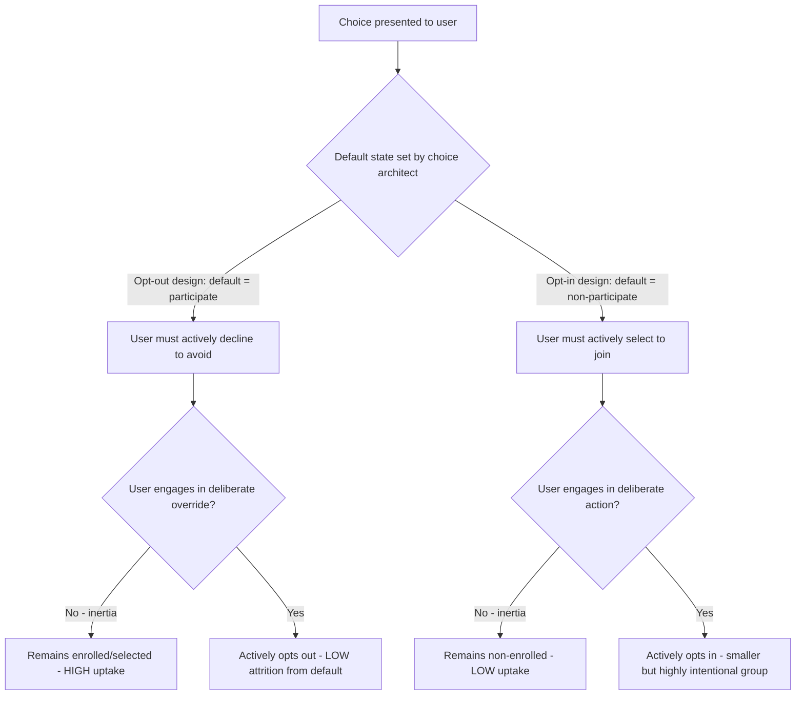

## Default Effects and Opt-in Versus Opt-out Design

### Definition and Core Mechanism

The default effect is the tendency for people to retain a pre-set option rather than actively selecting an alternative, even when alternatives are readily available and switching involves minimal effort. **Opt-out design** sets a particular option as the default, requiring active action to decline it; **opt-in design** requires active action to select it, with non-participation as the default. The magnitude of the difference in uptake between these two designs — often substantial even when the "effortful" action required is trivial — is one of the most robustly replicated findings in behavioral economics.

**Key Points**

- The default effect operates even when switching costs are negligible (a single click or checkbox), indicating the effect is not purely explained by rational effort-minimization.
- Defaults are considered a nudge mechanism under Thaler and Sunstein's choice architecture framework, since they preserve full freedom of choice while predictably shaping outcomes.
- Default effects are among the most consistently replicated behavioral economics findings across domains including retirement savings, organ donation, insurance selection, and privacy settings.

### Theoretical Mechanisms Behind the Default Effect

Several overlapping mechanisms have been proposed to explain why defaults exert such strong influence:

1. **Status quo bias / effort minimization**: Changing from a default requires a decision-making effort that inaction avoids, even when the physical action to switch is trivial.
2. **Implied endorsement / anchoring**: People infer that the default option is recommended or the "sensible" choice by the entity presenting it (the choice architect), especially in contexts with information asymmetry (e.g., insurance, retirement plans).
3. **Loss aversion**: Once a default is presented, deviating from it can be cognitively framed as giving up the default's "endowed" state, activating loss-averse decision-making.
4. **Cognitive load and decision fatigue**: In contexts involving multiple simultaneous decisions, defaults reduce the total cognitive burden, making it more likely a person will conserve effort on any single decision by accepting the default.

**Key Points**

- These mechanisms are not mutually exclusive; most researchers view the default effect as arising from a combination of implied endorsement, status quo bias, and effort minimization operating simultaneously, with the relative contribution of each mechanism varying by context. [Inference — the precise decomposition of default effect strength into these separate mechanisms is difficult to isolate empirically and is debated in the literature]

### Landmark Empirical Studies

- **Organ donation registration (Johnson & Goldstein, 2003)**: Comparative analysis across European countries found dramatically higher effective organ donor consent rates in countries using presumed-consent (opt-out) systems compared to explicit-consent (opt-in) systems, a widely cited natural-experiment demonstration of the default effect. [Inference — while directionally robust, actual donation *rates* (as opposed to registered consent rates) are also affected by healthcare infrastructure and family override policies, which complicates simple cross-country comparisons]
- **401(k) automatic enrollment (Madrian & Shea, 2001)**: A study of a firm that switched its 401(k) retirement plan from opt-in to automatic enrollment (opt-out) found participation rates rose substantially, with many employees remaining at the default contribution rate and default fund allocation rather than actively adjusting them — demonstrating that defaults influence not just *whether* to participate but *how* people participate.
- **Email marketing and privacy consent studies**: Studies of GDPR-style consent mechanisms have found that pre-checked ("opt-out") consent boxes for marketing communications or data sharing produce substantially higher nominal consent/subscription rates than unchecked ("opt-in") boxes requiring active selection. [Inference — specific effect sizes vary considerably by study, industry, and regulatory context]

### Opt-in vs. Opt-out: Structural Comparison

| Dimension | Opt-in Design | Opt-out Design |
| --- | --- | --- |
| Default state | Non-participation / non-selection | Participation / selection |
| Action required | Active step to join/select | Active step to leave/decline |
| Typical uptake | Lower (bounded by active engagement) | Higher (bounded by inertia) |
| Perceived consumer intent signal | Stronger signal of genuine interest | Weaker signal; may include passive/inattentive acceptors |
| Regulatory treatment | Generally preferred/required for marketing consent under most modern privacy law (e.g., GDPR) | Increasingly restricted for consent-sensitive contexts; more accepted for beneficial-by-consensus contexts (e.g., retirement savings) |

### Applications in Marketing and Consumer Psychology

#### Subscription and Membership Design

- **Free trial to paid auto-conversion**: Structuring free trials to auto-convert to paid subscriptions by default (opt-out via cancellation) rather than requiring active opt-in to continue is one of the most common commercial applications of the default effect, directly increasing paid conversion rates relative to an opt-in renewal design.
- **Auto-renewal billing**: Annual or monthly auto-renewal as the default billing state (rather than requiring active repurchase) leverages the same mechanism that increases retirement plan participation, applied to recurring revenue retention.

#### Checkout and Add-on Design

- **Pre-selected add-ons**: E-commerce checkout flows that pre-check optional extras (extended warranties, gift wrapping, donation add-ons, expedited shipping) rely on the default effect to increase attach rates compared to requiring active selection.
- **Default shipping/delivery options**: Setting a specific delivery speed or method as the pre-selected default (e.g., a paid expedited option) can shift the distribution of consumer choices toward that default even when a free/slower option is equally visible.

#### Marketing Consent and Communication Preferences

- **Newsletter and marketing communication checkboxes**: Historically, many commercial forms defaulted marketing consent checkboxes to "checked" (opt-out), maximizing nominal list growth; this practice has been substantially restricted in jurisdictions with GDPR-style consent requirements, which generally mandate opt-in (unchecked by default) consent for marketing communications and non-essential data processing.
- **Cookie consent banners**: Default-accept cookie banners (requiring an active click to reject or customize) have been shown in usability studies to produce substantially higher "acceptance" rates than default-reject or neutral-choice banners, a widely discussed application of the default effect in privacy/consent UX design that has drawn regulatory attention (e.g., under GDPR and ePrivacy Directive enforcement actions in the EU). [Inference — specific enforcement standards and required banner designs continue to evolve and vary by jurisdiction]

#### Product Configuration Defaults

- **Pre-selected product tiers or bundles**: Presenting a specific plan tier, bundle, or configuration as the pre-highlighted/pre-selected "recommended" option on a pricing page leverages both the default effect and implied endorsement to steer selection.
- **Default quantity settings**: Subscription or recurring-order forms that default to larger pack sizes or higher order quantities (with an easy option to reduce) can shift average order value upward via the same inertia mechanism.

**Example**

A software company changes its trial signup flow. Previously, users had to explicitly select "Continue to paid plan" after a 14-day trial (opt-in continuation). The company switches to an opt-out design: the trial automatically converts to a paid subscription unless the user actively cancels before the trial ends. This change is expected to increase paid conversion rates substantially, consistent with default-effect research, though it also raises retention/goodwill and regulatory risk considerations discussed below (e.g., dark-pattern scrutiny if cancellation is made deliberately difficult). [Inference — illustrative hypothesis; actual uplift and downstream churn/complaint effects depend on execution and disclosure clarity]

### Process Flow: Default Effect on Decision Outcome

### Measuring Default Effect Strength

A simple applied metric compares uptake rates under each condition:

$$\text{Default Effect Size} = P(\text{selected} \mid \text{opt-out default}) - P(\text{selected} \mid \text{opt-in default})$$

Where $P(\text{selected})$ is the observed proportion of users retaining or choosing the option under each design. Large positive values indicate a strong default effect; values near zero suggest the choice is being made deliberately regardless of default framing (e.g., for high-stakes or high-salience decisions where System 2 processing dominates).

### Distinguishing Default Effects from Related Concepts

| Concept | Core Mechanism | Distinction |
| --- | --- | --- |
| Default effect | Retention of pre-set option due to inertia/implied endorsement | Specific nudge mechanism |
| Status quo bias | General preference for the current state across any context | Broader; default effect is one specific application of status quo bias in choice architecture |
| Anchoring | Numeric/scalar judgment biased toward an initial reference value | Distinct mechanism (affects quantitative estimation, not binary participation choices) |
| Dark pattern (e.g., "confirmshaming," "roach motel") | Deliberately obstructive design that exploits or manufactures friction | Overlaps with opt-out defaults when the *opt-out path itself* is made deliberately difficult, crossing from a nudge into manipulative design |

### Boundary Conditions and Moderators

- Default effects are weaker for decisions that are highly salient, personally significant, or where the person has strong pre-existing preferences (e.g., defaults have less influence on major life decisions like choice of spouse or career than on incidental settings like default printer paper size). [Inference — the general pattern of stronger defaults for low-salience/low-stakes decisions is well supported, though the exact threshold varies by domain and individual]
- Default effects can be attenuated by explicit disclosure and active-choice requirements (e.g., "smart disclosure" policies that require users to make an active choice rather than simply presenting a passive default), which some researchers propose as a middle-ground policy between pure opt-in and pure opt-out. [Inference — "active choice" as an alternative design has mixed empirical support depending on implementation]
- Repeated or forced re-confirmation of defaults (e.g., periodic subscription renewal notices) can reduce the default effect's strength over time compared to a "set once and forget" default.

### Regulatory and Ethical Considerations

- **GDPR (EU) and similar privacy frameworks**: Generally require opt-in (unchecked-by-default) consent for marketing communications and non-essential data processing, explicitly restricting the use of opt-out defaults in these consent-sensitive contexts.
- **Subscription and auto-renewal regulations**: Numerous jurisdictions (e.g., US state auto-renewal laws, EU Consumer Rights Directive provisions) increasingly require clear, conspicuous disclosure of auto-renewal terms and straightforward cancellation mechanisms, directly targeting cases where opt-out defaults are paired with deliberately difficult cancellation processes (the "sludge" pattern).
- **Distinction between legitimate defaults and dark patterns**: A default is generally considered ethically legitimate when (1) it is clearly disclosed, (2) the opt-out mechanism is genuinely easy to use, and (3) the default plausibly serves the chooser's own interest or a neutral administrative purpose — versus dark-pattern defaults designed to obscure costs or make reversal deliberately difficult.

**Related Topics**

- Nudge theory and libertarian paternalism
- Status quo bias
- Dark patterns and sludge
- Loss aversion and reference dependence
- Choice overload and decision fatigue
- Privacy consent design (GDPR/CCPA compliance UX)
- Subscription economics and churn management