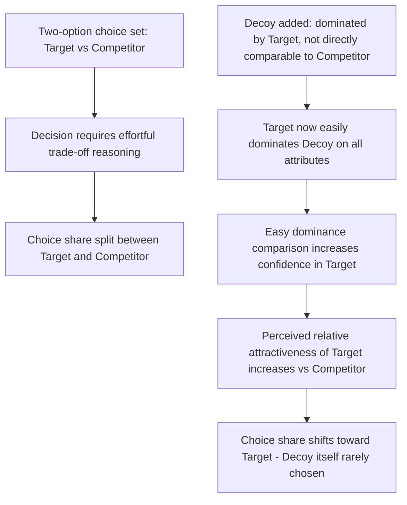

## The Decoy Effect and Asymmetric Dominance

### Definition and Core Mechanism

The decoy effect (also called the **attraction effect** or **asymmetric dominance effect**) occurs when adding a third option to a choice set — one that is clearly inferior to one existing option but not directly comparable to the other — increases the likelihood that the dominant, "target" option is chosen over the alternative. The decoy itself is rarely or never selected; its function is purely to reshape the comparative context in which the other two options are evaluated. This phenomenon was first experimentally demonstrated by Joel Huber, John Payne, and Christopher Puto in their 1982 paper "Adding Asymmetrically Dominated Alternatives: Violations of Regularity and the Similarity Hypothesis."

**Key Points**

- The defining structural feature of a true decoy is **asymmetric dominance**: the decoy is dominated by (i.e., worse than) the target option on all relevant attributes, but is only dominated by (or not directly comparable to) the competitor option on some attributes.
- The decoy effect is considered a violation of two foundational principles of rational choice theory: the **regularity principle** (adding an option should never increase the choice share of an existing option relative to the original choice set) and **independence of irrelevant alternatives** (preferences between two options should not be affected by the presence of a third, unchosen option).
- Unlike anchoring or framing, the decoy effect operates specifically through **relative comparison structuring** within a multi-attribute choice set, rather than through a numeric reference point or valence framing of a single option.

### Structural Requirements for a Valid Decoy

For the asymmetric dominance effect to occur, the choice set typically involves two attributes (e.g., price and quality) and three options:

| Option | Attribute 1 (e.g., Price) | Attribute 2 (e.g., Quality) | Role |
| --- | --- | --- | --- |
| Target (A) | Moderate | High | The option the choice architect wants to promote |
| Competitor (B) | Low | Moderate | The alternative the target competes against |
| Decoy (C) | Moderate-to-high (worse than A) | Lower than A (worse than A on both dimensions) | Dominated by A; not directly comparable to B |

The decoy (C) is positioned so that it is unambiguously worse than the target (A) on every attribute, making A look like a clear "win" by comparison, while C remains either better or non-comparable to B on at least one dimension, so it does not simply make B look better instead.

### The Classic Economist Subscription Study (Ariely, 2008)

One of the most widely cited applied demonstrations comes from Dan Ariely's research (described in *Predictably Irrational*), which examined *The Economist* magazine's subscription options:

- **Original two-option set**: Web-only subscription ($59) vs. Web + Print subscription ($125). In this configuration, most respondents chose the cheaper web-only option.
- **Three-option set with decoy added**: Web-only ($59), Print-only ($125), Web + Print ($125). The print-only option at $125 functions as a decoy — dominated by the Web + Print option at the same price (since Web + Print offers strictly more for the same cost) — and its presence caused a majority of respondents to switch their preference to the Web + Print bundle, even though the web-only and web+print options were unchanged in price and features. [Inference — this specific study is widely cited as an illustrative applied demonstration, though as a single study its precise effect size and generalizability have been discussed and partially contested in subsequent replication efforts]

### Theoretical Explanations for Why Decoys Work

Several theoretical accounts have been proposed:

1. **Comparative ease / trade-off avoidance**: Decision-makers often prefer choices that can be justified through easy, dominance-based comparisons (A beats C on everything) rather than difficult trade-off reasoning (A costs more than B, but offers more; is the trade-off worth it?). The decoy provides an easy dominance comparison that spills over into increased confidence about choosing A over B as well.
2. **Range and frequency theory**: The decoy shifts the perceived range of the attribute (e.g., making the target's price seem more "average" within the expanded range) and increases the frequency with which the target "wins" pairwise attribute comparisons within the choice set.
3. **Loss aversion in trade-off structuring**: Some accounts suggest the decoy reduces the perceived "loss" (e.g., paying more) associated with selecting the target, because that loss is now also present (and worse) in the decoy option, making it feel less exceptional. [Inference — this loss-aversion-based account is one of several competing explanations and is not the sole accepted mechanism in the literature]

### Distinguishing the Decoy Effect from Related Phenomena

| Concept | Core Mechanism | Distinction |
| --- | --- | --- |
| Decoy effect / asymmetric dominance | Adding a dominated third option shifts preference toward the dominant target | Requires a specific asymmetric dominance structure across at least two attributes |
| Compromise effect | Middle options in a range are chosen more often because they minimize the risk of an extreme trade-off | Does not require a dominated decoy; relies on extremeness aversion across three or more options on a single spectrum |
| Anchoring | A numeric starting point biases subsequent estimation | Affects scalar/numeric judgment, not relative option comparison structure |
| Framing effects | Presentation of equivalent information as gain/loss shifts risk preference | Concerns valence of description, not addition of a comparison option |

**Key Points**

- The decoy effect and the compromise effect are often discussed together because both are **context effects** — violations of the assumption that preferences between two options are independent of the surrounding choice set — but they operate through different structural mechanisms and are frequently combined in applied pricing menus (e.g., a "good-better-best" tier structure can incorporate both a compromise effect on the middle tier and an asymmetric-dominance decoy on a rarely-chosen tier).

### Applications in Marketing and Consumer Psychology

#### Subscription and SaaS Pricing Tiers

- **Three-tier "good-better-best" pricing pages**: A common implementation adds a tier priced close to the "best" tier but with fewer features, functioning as a decoy that makes the "best" tier appear to be exceptional value by comparison, increasing selection of the higher-margin option.
- **Feature-matched decoys**: Some SaaS pricing structures deliberately include a mid-tier plan with a feature set that is dominated by the tier just above it at only a slightly higher price, nudging buyers toward the higher tier via easy dominance comparison rather than complex value trade-off reasoning.

#### Menu Engineering in Food and Hospitality

- Restaurant menus frequently include a very high-priced "anchor/decoy" dish that is rarely ordered but makes mid-priced dishes appear more reasonably priced by comparison — combining decoy-effect logic with anchoring.
- Combo meal structures (e.g., a small drink priced almost the same as a large) function as classic decoys, making the large size appear to be dramatically better value and shifting preference toward higher-margin larger sizes.

#### Retail Product Bundling

- Electronics and appliance retailers often display a mid-range product alongside a nearly-identically priced but feature-poorer model, using the asymmetric dominance structure to steer purchases toward the higher-margin mid-range product.
- Bundle offers (e.g., "buy the camera body alone" vs. "camera + lens kit at the same price as body-only elsewhere") mirror the *Economist* subscription study structure directly.

#### E-commerce Comparison Displays

- Product listing pages that display a "similar item" comparison panel can be engineered so that a specific competing or lower-tier product serves as a decoy relative to the retailer's preferred (often higher-margin) featured product.

**Example**

A software company sells three plans: Starter ($19/mo, 5 projects), Team ($49/mo, 20 projects, priority support), and a decoy "Team Basic" ($45/mo, 10 projects, no priority support). Team Basic is dominated by Team on every attribute for only $4/mo less, making Team look like the clearly superior choice and increasing Team plan selection relative to a two-tier Starter/Team structure alone. [Inference — illustrative pricing design pattern, not a specific reported case study]

### Process Flow: How the Decoy Reshapes Choice

### Empirical Robustness and Boundary Conditions

- The decoy effect has been replicated across numerous product categories, including consumer electronics, food and beverage choices, and financial products, though effect sizes vary considerably depending on the salience of the decoy, the number of attributes being compared, and respondent expertise. [Inference — the general directional effect is well-replicated; magnitude is context-dependent]
- The effect tends to be stronger when consumers have low domain expertise or face high cognitive load, and weaker among expert decision-makers who can more easily perform direct multi-attribute trade-off comparisons without relying on the dominance heuristic. [Inference — expertise-moderation is a commonly cited boundary condition but is not uniformly quantified across all product categories]
- Some large-scale replication and meta-analytic efforts in behavioral economics and consumer research have found the effect to be robust on average but more variable at the level of individual studies than early demonstrations suggested. [Unverified — specific meta-analytic effect size estimates vary by review and are subject to ongoing methodological debate regarding publication bias in the original decoy-effect literature]

### Ethical Considerations in Marketing Use

- Using decoy pricing to genuinely highlight a superior value proposition (where the "target" option is honestly the best value for most customers) is generally viewed as a legitimate merchandising and choice-architecture practice.
- Ethical concerns arise when decoys are constructed to obscure a target option's true cost-effectiveness or to exploit cognitive shortcuts specifically to drive customers toward options that do not serve their actual interests (e.g., a decoy designed to push customers toward an unnecessarily expensive tier they would not choose under full, effortful deliberation) — this overlaps with broader dark-pattern and manipulative-design concerns in choice architecture.

**Related Topics**

- Compromise effect and extremeness aversion
- Anchoring and adjustment
- Framing effects and prospect theory
- Choice overload and decision fatigue
- Price bundling and tiered pricing strategy
- Menu engineering in hospitality and retail
- Nudge theory and libertarian paternalism