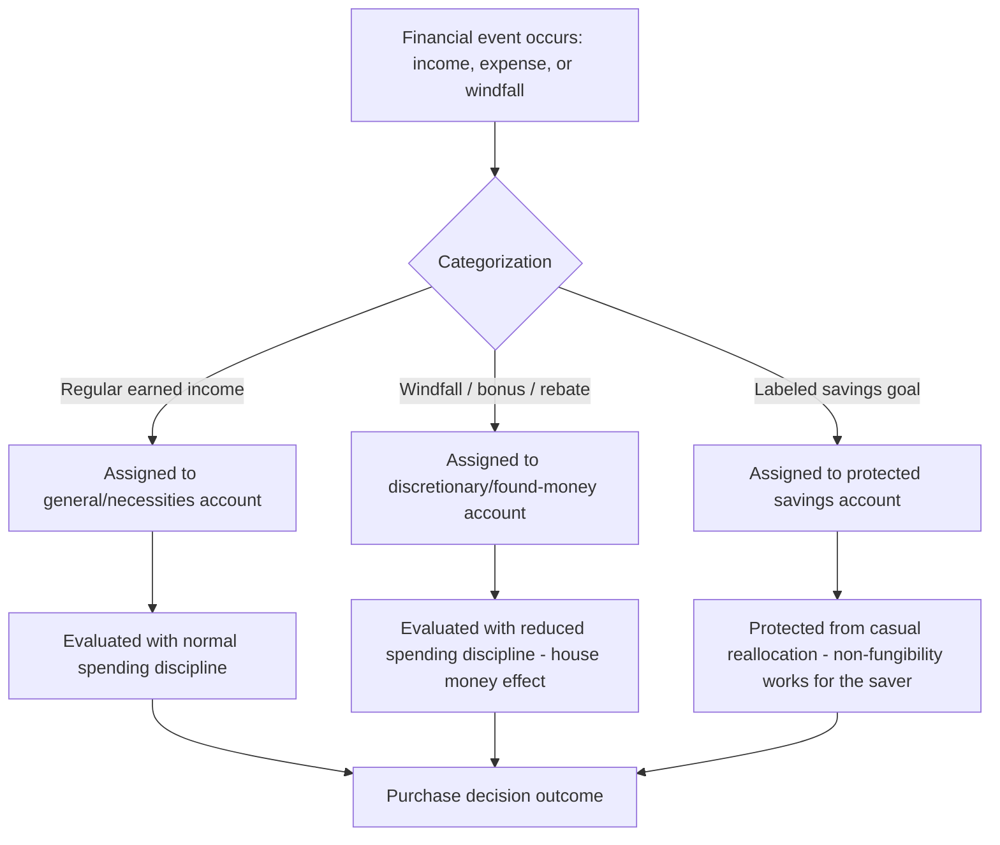

## Mental Accounting and Budgeting

### Definition and Theoretical Origin

Mental accounting is the cognitive process by which individuals categorize, evaluate, and track financial activities into separate mental "accounts" or "buckets," rather than treating money as perfectly fungible as standard economic theory assumes. The concept was formalized by economist Richard Thaler, most comprehensively in his 1985 paper "Mental Accounting and Consumer Choice" and later expanded in his 1999 paper "Mental Accounting Matters."

**Key Points**

- The core departure from standard economic theory is the **fungibility violation**: classical economics assumes a dollar is a dollar regardless of its source or intended use, while mental accounting demonstrates that people systematically treat money differently depending on which mental "account" it is assigned to (e.g., a tax refund vs. regular salary, a "vacation fund" vs. "grocery budget").
- Mental accounting operates at three related levels identified by Thaler: (1) how outcomes are perceived and experienced (framing), (2) how activities are assigned to specific accounts (categorization), and (3) how frequently accounts are evaluated (choice bracketing).
- Mental accounting draws directly on the value function from prospect theory, since the categorization of a financial event as a "gain" or "loss" within a specific account determines how it is psychologically processed.

### The Three Components of Mental Accounting

#### 1. Framing of Outcomes

How a financial outcome is coded (as an isolated gain/loss vs. integrated into a broader account) affects its subjective impact. Thaler's principles, derived from the concave/convex shape of the prospect theory value function, include:

- **Segregate multiple gains**: Two small separate gains feel better than one combined larger gain (since the value function is concave for gains, the sum of two smaller evaluations exceeds one larger evaluation).
- **Integrate multiple losses**: Two small losses feel worse separately than one combined larger loss (since the value function is convex for losses).
- **Integrate a smaller loss with a larger gain**: A small loss is best combined with a larger gain (canceling out some of the disproportionate pain of the loss).
- **Segregate a small gain from a larger loss ("silver lining")**: A small gain is best presented separately from a larger loss, since the concave gain region provides a proportionally larger psychological boost when evaluated in isolation.

#### 2. Categorization into Accounts

People assign money to specific categories based on source, intended purpose, or time horizon (e.g., "rent money," "fun money," "savings," "windfall"), and these categories are often treated as non-fungible — money will not readily move between accounts even when doing so would be economically rational.

#### 3. Choice Bracketing (Evaluation Frequency)

This refers to how broadly or narrowly a set of decisions is grouped for evaluation purposes:

- **Narrow bracketing**: Evaluating each decision or account in isolation (e.g., checking a single stock's daily performance).
- **Broad bracketing**: Evaluating decisions as part of an aggregated whole (e.g., evaluating an entire investment portfolio's performance over a year).
- Narrow bracketing tends to amplify the influence of loss aversion because each isolated evaluation triggers a fresh gain/loss assessment, whereas broad bracketing smooths out individual losses within a larger aggregated context.

### Classic Empirical Demonstrations

- **The theater ticket experiment (Tversky & Kahneman, 1981)**: Participants imagining they had lost a $10 theater ticket were less likely to say they would buy a replacement ticket than participants imagining they had lost $10 in cash (unrelated to the ticket) — because the lost ticket was mentally charged against a specific "entertainment account" (making the replacement feel like paying $20 for one show), while the lost cash was not charged against that account.
- **The windfall gain effect**: Money received unexpectedly (e.g., bonuses, tax refunds, gambling winnings) is more likely to be spent on hedonic, non-essential purchases than equivalent money earned through regular income, because windfalls are mentally categorized differently from "earned" income and are held to a lower standard of prudent allocation. [Inference — this pattern, sometimes called the "house money effect" in gambling contexts, is well documented but effect magnitude varies by study design and population]
- **Payment decoupling and credit cards**: Research has found that people spend more freely when payment is decoupled from consumption (e.g., paying by credit card, prepaid packages, or subscriptions) compared to when payment is immediate and salient (e.g., cash), because decoupled payment reduces the "pain of paying" registered in the relevant mental account at the moment of consumption.

### Applications in Marketing and Consumer Psychology

#### Payment Decoupling and Pain of Paying

- **Subscription and prepaid models**: By collecting payment upfront or on a recurring automated basis (rather than at the moment of each use), businesses reduce the salience of the "cost" mental account at the point of consumption, increasing usage frequency and reducing price sensitivity per use (e.g., gym memberships, streaming services, all-inclusive resort packages).
- **Cashless and digital payment methods**: Mobile wallets, buy-now-pay-later (BNPL) services, and stored-value cards further decouple the physical/psychological experience of paying from spending, generally increasing willingness to spend compared to cash transactions. [Inference — the general direction of this effect is well supported in payment psychology research; specific magnitude varies by payment method and consumer population]

#### Windfall and Bonus Marketing

- **"Free money" framing for promotional credits**: Store credit, cashback rewards, or promotional bonus funds are often mentally categorized by consumers as "found money" or a separate account from their regular budget, making them more likely to be spent on discretionary or higher-margin items rather than saved or applied to essential purchases.
- **Timing promotions around windfalls**: Marketing campaigns timed around tax refund season or bonus payment periods can exploit the tendency to spend windfall money more freely than regular income.

#### Budget Account Labeling and Product Positioning

- **Positioning products against specific mental budget categories**: Marketing a product as belonging to a "treat yourself" or "self-care" account (rather than competing against a "necessities" budget) can reduce price sensitivity, since consumers evaluate the purchase against a more permissive mental account.
- **Sub-budget creation via apps and tools**: Budgeting apps and banking products that allow consumers to create labeled sub-accounts (e.g., "vacation fund," "emergency fund") leverage mental accounting to increase savings discipline by making the fungibility violation work in the consumer's favor — money labeled for a specific purpose is less likely to be diverted to impulsive spending.

#### Bundling and Reference Account Framing

- **Bundling a small cost with a larger purchase**: Add-on fees (e.g., a warranty or accessory) are more readily accepted when bundled into a single larger transaction (integrating a small loss with a larger purchase) than when presented as a separate, isolated charge.
- **"Only $X more"** framing for upsells leverages the same integration principle: framing an upgrade cost as a small increment to an already-committed larger purchase reduces its perceived psychological weight compared to presenting it as a standalone cost.

#### Discount and Rebate Structuring

- **Segregating gains**: Offering multiple smaller discounts or rebates (e.g., "10% off today, plus a $5 rebate by mail") can produce greater perceived value than a single combined discount of equivalent total value, consistent with the "segregate multiple gains" principle.

**Example**

A furniture retailer sells a couch for $1,200 with a $150 optional protection plan. Presenting the protection plan as a small add-on during the same checkout transaction ("just $150 more, added to your couch purchase") is expected to produce higher attach rates than sending a separate follow-up offer for the same $150 plan after the couch purchase is completed, consistent with the mental accounting principle of integrating a small loss with a larger gain/purchase. [Inference — illustrative application of established mental accounting principles, not a specific reported case study]

### Process Flow: Mental Accounting in a Purchase Decision

### Distinguishing Mental Accounting from Related Concepts

| Concept | Core Mechanism | Distinction |
| --- | --- | --- |
| Mental accounting | Categorizing money into non-fungible mental "buckets" | Broad framework covering categorization, framing, and bracketing |
| Loss aversion | Losses weighted more heavily than equivalent gains | A component mechanism that shapes how mental accounting framing rules operate |
| Sunk cost fallacy | Continuing investment due to prior unrecoverable costs | A specific consequence of narrow bracketing and account-specific evaluation (e.g., theater ticket effect) |
| Anchoring | Numeric judgment biased toward an initial reference value | Distinct mechanism; can interact with mental accounting when an account's initial "budget" functions as an anchor |
| Choice bracketing | Narrow vs. broad evaluation scope of a set of decisions | A specific sub-component of mental accounting theory, not a separate standalone bias |

### Boundary Conditions and Critiques

- Mental accounting effects tend to be stronger for lower-stakes, routine financial decisions and can be attenuated among individuals with higher financial literacy or those who use formal, comprehensive budgeting systems that explicitly track fungibility across categories. [Inference — the moderating role of financial literacy is a plausible and commonly cited boundary condition, though its precise magnitude has not been uniformly quantified across populations]
- Some economists have criticized mental accounting as descriptively useful but difficult to formally integrate into standard rational-agent economic models, since the "accounts" are not directly observable and can be defined post hoc to fit observed behavior. [Unverified — this is a methodological critique raised in some economic literature, not a universally accepted limitation]
- Mental accounting-based budgeting tools (e.g., envelope budgeting systems, labeled savings sub-accounts) have shown positive associations with increased savings rates in some studies, though causal isolation from other factors (e.g., general financial motivation) is methodologically challenging. [Inference — correlational evidence is more robust than causal evidence in this specific area]

### Ethical Considerations in Marketing Use

- Using mental accounting principles to help consumers achieve their own stated financial goals (e.g., labeled savings sub-accounts, clear budget categorization tools) is generally viewed as a beneficial, welfare-enhancing application.
- Ethical concerns arise when mental accounting is exploited specifically to encourage overspending beyond a consumer's genuine financial interest (e.g., aggressively marketing windfall spending, structuring payment decoupling specifically to obscure the cumulative cost of small recurring charges) — this connects directly to broader debates about payment decoupling in subscription fatigue and "invisible" recurring billing practices.

**Related Topics**

- Prospect theory and the value function
- Loss aversion and reference dependence
- Sunk cost fallacy
- Pain of paying and payment decoupling
- Choice bracketing (narrow vs. broad)
- Subscription fatigue and recurring billing psychology
- Buy-now-pay-later (BNPL) consumer behavior