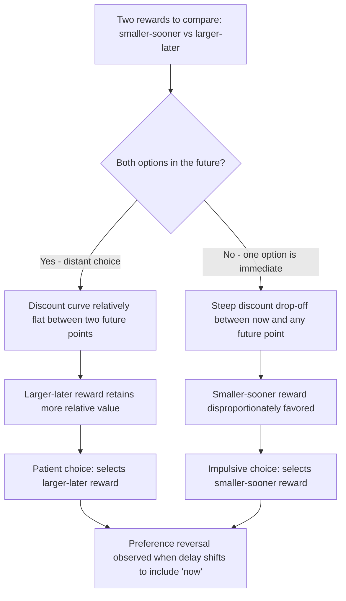

## Present Bias and Hyperbolic Discounting

### Definition and Theoretical Origin

Present bias is the tendency to disproportionately favor immediate rewards over larger, delayed rewards, even when the delayed reward would be objectively preferable when evaluated with consistent discounting. Hyperbolic discounting is the mathematical model that best captures this pattern empirically, describing how the subjective value of a future reward declines non-exponentially with delay — more steeply for near-term delays and more gradually for longer-term delays — in contrast to the constant-rate exponential discounting assumed by standard economic theory. The foundational formalization is generally credited to psychologist and economist George Ainslie (1975, 1992), with significant extensions by David Laibson (1997) introducing the quasi-hyperbolic ("beta-delta") model widely used in behavioral economics.

**Key Points**

- Standard economic theory (the discounted utility model, Samuelson 1937) assumes **exponential discounting**: a constant discount rate applied uniformly regardless of when in time the delay occurs, implying time-consistent preferences.
- Hyperbolic discounting instead implies **time-inconsistent preferences**: a person's ranking of two future rewards can reverse simply as the delay to the earlier reward shrinks toward zero, even though the objective time gap between the two rewards has not changed.
- Present bias and hyperbolic discounting are closely related but distinct: hyperbolic discounting is the descriptive mathematical curve; present bias (particularly as formalized in the quasi-hyperbolic model) isolates the specific tendency to weight "now" disproportionately compared to any other point in the future.

### The Exponential vs. Hyperbolic Discounting Models

**Exponential discounting** (standard/normative model):

$$V(D) = \frac{V_0}{(1+k)^D}$$

Where $V(D)$ is the present subjective value of a reward $V_0$ delayed by $D$ time units, and $k$ is a constant discount rate.

**Hyperbolic discounting** (descriptive/empirical model, Mazur's formulation):

$$V(D) = \frac{V_0}{1 + kD}$$

The key empirical distinction is that hyperbolic discounting produces a discount curve that drops off steeply for short delays and flattens for longer delays, whereas exponential discounting produces a constant proportional drop-off regardless of when the delay occurs.

**Quasi-hyperbolic (beta-delta) model** (Laibson, 1997), commonly used in applied behavioral economics for tractability:

$$V(D) = \begin{cases} V_0 & \text{if } D = 0 \\ \beta \delta^D V_0 & \text{if } D > 0 \end{cases}$$

Where $\delta$ represents a standard long-run exponential discount factor, and $\beta < 1$ represents an additional, present-biased discount applied specifically to *any* future delay relative to immediate consumption — capturing the discontinuous "jump" in value between "now" and "any point later."

### The Classic Preference Reversal Demonstration

The signature empirical pattern used to demonstrate present bias/hyperbolic discounting involves two comparisons:

- **Distant choice**: Offered $100 in 30 days vs. $110 in 31 days, most people choose to wait for the larger $110 reward (patient choice).
- **Immediate choice**: Offered $100 today vs. $110 tomorrow, many of the same people switch to preferring the smaller, immediate $100 (impatient choice), despite the objective one-day delay difference being identical in both scenarios.

This reversal — patient when both options are in the future, impulsive when one option is immediate — is the empirical fingerprint of hyperbolic (rather than exponential) discounting, since exponential discounting predicts no such reversal should occur.

### Sophisticated vs. Naive Present-Biased Agents

Behavioral economics distinguishes between two types of present-biased individuals based on their self-awareness:

| Type | Awareness of Own Present Bias | Behavioral Implication |
| --- | --- | --- |
| Naive | Unaware that future preferences will also be present-biased; expects future self to act patiently | Repeatedly fails to follow through on plans, is surprised by lack of self-control, does not seek external commitment devices |
| Sophisticated | Aware that future preferences will also be present-biased | Proactively uses commitment devices to bind future behavior, anticipates and plans around expected self-control failure |

**Key Points**

- This distinction, formalized by Ted O'Donoghue and Matthew Rabin in the late 1990s, has significant applied implications: naive present-biased individuals are the primary targets of commitment-device products, while sophisticated ones are motivated purchasers of the same products.

### Applications in Marketing and Consumer Psychology

#### Buy-Now-Pay-Later (BNPL) and Credit Products

- BNPL products directly exploit present bias by allowing consumers to receive a product immediately while deferring payment (a cost) into the future, aligning the purchase decision with the steep, near-term-discounted segment of the hyperbolic curve.
- Credit card revolving debt more broadly reflects present-biased preferences: immediate consumption is heavily favored over the discounted future cost of interest payments, particularly among naive present-biased consumers who underestimate their future difficulty repaying.

#### Subscription and Free Trial Structuring

- Free trials that require future active cancellation (rather than immediate payment) exploit present bias: the immediate reward (free access now) is heavily weighted, while the future cost (needing to remember to cancel, or accepting a future charge) is discounted disproportionately, especially by naive present-biased consumers.

#### Limited-Time Offers and Urgency Marketing

- "Buy now" urgency tactics (countdown timers, limited-time discounts) work in part by making the immediate reward (savings) salient in the present, exploiting the steep discounting of "now vs. later" relative to the flatter discounting of "later vs. even later."
- Flash sales and same-day promotions leverage the specific present-vs-future discontinuity captured by the $\beta$ parameter in the quasi-hyperbolic model, rather than simply reflecting general impatience.

#### Installment and "Pay Over Time" Product Framing

- Presenting a large purchase as smaller installment payments (e.g., "$29.99/month" rather than "$360/year") leverages present bias by making the immediately relevant cost small, even when the effective total cost or interest may be higher than a lump-sum alternative.

#### Rewards, Loyalty Points, and Delayed Gratification Products

- Loyalty and rewards programs that offer immediate small rewards (instant discounts, immediate cashback) tend to be more motivating for consumer engagement than equivalent-value delayed rewards (accumulating points redeemable in the distant future), consistent with the steep near-term discounting predicted by the hyperbolic model. [Inference — the general direction is consistent with present bias research, though specific engagement lift depends on reward salience, program design, and consumer segment]

#### Health, Fitness, and Wellness Product Marketing

- Gym memberships and wellness subscriptions are frequently purchased with strong intentions (a distant-future framing where patience prevails) but underused once payment is committed and usage requires immediate present-tense effort against a more comfortable immediate alternative (skipping the gym) — a widely cited applied example of the preference reversal pattern, drawn from research on gym attendance and membership contract choices (e.g., DellaVigna & Malmendier's research on health club contracts). [Inference — this is a well-cited applied finding, though it reflects a combination of present bias and other factors such as overoptimism about future usage]

**Example**

A meal-kit subscription service offers two signup options: pay $60/month with a 12-month contract, or pay $70/month with no contract. Present-biased consumers, weighting the immediate lower monthly payment heavily while discounting the future cost of an inflexible 12-month commitment, are hypothesized to disproportionately choose the discounted contract option relative to what a fully patient, exponentially-discounting consumer would choose given their actual expected usage duration. [Inference — illustrative hypothesis, not a specific reported empirical result]

### Process Flow: Preference Reversal Under Hyperbolic Discounting

### Distinguishing Present Bias from Related Concepts

| Concept | Core Mechanism | Distinction |
| --- | --- | --- |
| Present bias / hyperbolic discounting | Time-inconsistent preferences; disproportionate weight on "now" | Concerns intertemporal choice specifically |
| Loss aversion | Losses weighted more heavily than equivalent gains | Concerns valence (gain/loss), not time delay |
| Impulsivity (general trait) | Broad individual difference in self-control across contexts | Present bias is a specific, formally modeled economic preference pattern; impulsivity is a broader psychological trait construct |
| Temporal discounting (exponential) | Standard normative model with time-consistent preferences | The benchmark model that hyperbolic discounting empirically violates |
| Planning fallacy | Underestimating time/cost of future tasks | Distinct mechanism concerning estimation, not reward valuation over time |

### Commitment Devices as a Countermeasure

Because sophisticated present-biased individuals anticipate their own future impatience, they are motivated to adopt **commitment devices** — mechanisms that restrict or penalize future deviation from a currently-preferred patient plan:

- Automatic payroll deductions into retirement or savings accounts (removing the option to spend the money impulsively).
- Pre-committed, non-refundable payment for future services (e.g., prepaid gym memberships, prepaid course tuition) to lock in a patient decision against future present-biased temptation to skip.
- App-based commitment tools that impose financial penalties for failing to complete a stated future goal (e.g., commitment contract platforms).

**Key Points**

- Commitment devices represent a significant marketing opportunity: products framed as "helping you stick to your goals" or "locking in your savings" directly appeal to sophisticated present-biased consumers' self-awareness.

### Boundary Conditions and Critiques

- The quasi-hyperbolic (beta-delta) model, while analytically convenient, is a simplification; some researchers argue real-world discounting patterns are better described by other functional forms (e.g., generalized hyperbolic functions), and debate continues over which model best fits various empirical datasets. [Unverified — model-fitting debates are ongoing in the intertemporal choice literature and the "best" functional form varies by dataset and elicitation method]
- Individual differences in present bias/discount rates are substantial, and are correlated in some studies with factors such as socioeconomic circumstances, cognitive load, and specific reward domains (e.g., money vs. health vs. environmental outcomes are often discounted at different implied rates by the same individual). [Inference — domain-specific discounting variation is a replicated pattern, though the underlying causal explanation is debated]
- Some critics argue that apparent hyperbolic discounting in experimental settings can be partly explained by factors such as uncertainty about whether a delayed reward will actually be delivered (trust/risk discounting) rather than pure time preference alone, complicating clean interpretation of some studies. [Unverified — the relative contribution of risk/trust versus pure time preference in explaining experimental hyperbolic discounting patterns remains debated]

### Ethical Considerations in Marketing Use

- Regulatory attention (e.g., consumer credit regulations, BNPL-specific rules emerging in various jurisdictions) increasingly targets products that appear to specifically exploit present bias among financially vulnerable or naive consumers, particularly where future costs are obscured or minimized in marketing presentation.
- A useful ethical distinction is between products that genuinely help consumers manage intertemporal trade-offs in their own interest (e.g., legitimate commitment-device savings products) versus those designed to exploit the "now vs. later" discontinuity specifically to encourage borrowing or spending decisions the consumer would not make under full, patient deliberation.

**Related Topics**

- Commitment devices and self-control mechanisms
- Buy-now-pay-later (BNPL) consumer behavior
- Planning fallacy
- Mental accounting and budgeting
- Loss aversion and reference dependence
- Behavioral economics of savings and retirement planning
- Time-inconsistent preferences in health behavior (e.g., smoking, exercise)