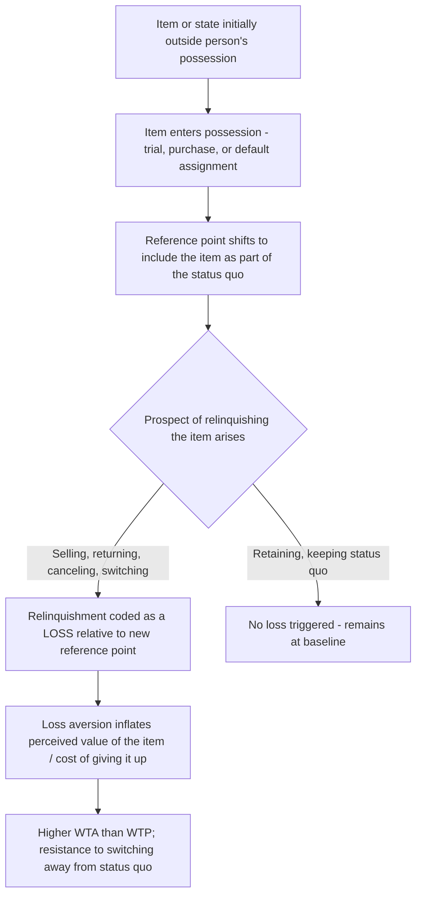

## Endowment Effect and Status Quo Bias

### Definitions and Conceptual Relationship

The **endowment effect** is the tendency for people to assign greater value to an object simply because they own it, compared to the value they would assign to the same object if they did not own it. **Status quo bias** is the broader tendency to prefer the current state of affairs over alternatives, resisting change even when the change involves no switching cost or when an objective analysis might favor switching. The endowment effect was named and extensively documented by Richard Thaler (1980), building on earlier observations, and was further formalized through experimental work by Daniel Kahneman, Jack Knetsch, and Thaler (1990, 1991). Status quo bias was formally identified and named by William Samuelson and Richard Zeckhauser in their 1988 paper "Status Quo Bias in Decision Making."

**Key Points**

- The endowment effect is generally understood as a specific instance of the broader status quo bias, applied particularly to owned physical or intangible goods; status quo bias applies more generally to any current state (a policy, a default setting, a habitual behavior) not limited to ownership of objects.
- Both phenomena are considered direct behavioral consequences of loss aversion within prospect theory: relinquishing a currently-held object or state is coded as a loss, while acquiring the same object or switching to the same alternative from a neutral starting point would be coded merely as a foregone gain — and losses are weighted more heavily than foregone gains.
- The classic diagnostic measure of the endowment effect is the gap between **willingness to accept (WTA)** — the minimum price an owner will accept to sell an item — and **willingness to pay (WTP)** — the maximum price a non-owner will pay to acquire the same item. Standard economic theory predicts WTA ≈ WTP for goods without significant transaction costs; the endowment effect predicts WTA substantially exceeds WTP.

### The Classic Mug Experiment

The most widely cited demonstration (Kahneman, Knetsch, & Thaler, 1990) involved randomly giving half of a group of participants a coffee mug, then eliciting:

- **Sellers' prices**: The minimum amount mug-owners would accept to sell their mug.
- **Buyers' prices**: The maximum amount non-owners would pay to acquire an identical mug.
- **Choosers' prices** (a control condition): Participants who did not own a mug indicated which of a range of cash amounts or the mug they would prefer, without any ownership framing.

The finding: median selling prices were roughly twice as high as median buying/choosing prices, despite all participants being randomly assigned to conditions and evaluating physically identical mugs — demonstrating that mere possession, not any objective quality difference, drove the valuation gap. [Inference — the specific ~2x ratio is from the original studies; the magnitude of the WTA/WTP gap varies across replications and product categories]

### Theoretical Explanations

Several overlapping mechanisms have been proposed:

1. **Loss aversion (the dominant account)**: Giving up an owned item is processed as a loss (weighted heavily, per the steep loss-side slope of the prospect theory value function), while acquiring the same item from a no-ownership baseline is processed merely as a gain (weighted less heavily).
2. **Reference point shift upon acquisition**: The mere act of taking possession — even briefly, even without legal or permanent ownership — appears to be sufficient to shift a person's reference point to include the item, making its removal register as a loss almost immediately.
3. **Query theory** (an alternative/supplementary account, Johnson, Häubl, & Keinan, 2007): Suggests owners and non-owners retrieve different sets of thoughts when evaluating a transaction — sellers naturally generate more reasons to keep the item first, while buyers generate more reasons to avoid paying first — and this asymmetric internal "querying" process itself contributes to the valuation gap, independent of loss aversion alone. [Inference — query theory is a competing/complementary theoretical account, not a fully settled replacement for the loss-aversion explanation]

### Status Quo Bias: Broader Manifestations

Status quo bias extends beyond object ownership to any decision involving a "current state" versus alternatives:

- **Samuelson and Zeckhauser's original experiments** found that when a hypothetical inheritance was already invested in a particular asset (the status quo), participants disproportionately chose to keep it in that asset rather than reallocating — even when the same allocation, if framed as a completely new/neutral decision, would not have been the most commonly chosen option.
- **Insurance and utility plan selection**: Consumers overwhelmingly tend to remain on their existing insurance plan, utility provider, or subscription tier even when switching would be financially favorable and switching costs are low, a widely documented pattern in behavioral economics research on consumer inertia in these markets. [Inference — the general direction of this "status quo inertia" pattern is well-documented across many market studies, though specific magnitude of financial loss from inertia varies by market and study]

### Applications in Marketing and Consumer Psychology

#### Free Trials and Product Sampling

- Free trials, samples, and "try before you buy" programs allow consumers to psychologically incorporate a product into their reference point during the trial period. Ending the trial (giving up something now "owned," even temporarily) is coded as a loss, increasing conversion to purchase relative to marketing that only describes the product without granting temporary possession.
- Test drives in automotive sales and in-home trial periods for furniture, mattresses, and appliances leverage the same mechanism: physical possession, even briefly, activates the endowment effect.

#### Return Policies and "Risk-Free" Framing

- Generous return policies ("30-day money-back guarantee," "wear it, if you don't love it, return it") appear to reduce purchase risk, but they also work in the seller's favor via the endowment effect: once a consumer has taken possession, the psychological cost of initiating a return (relinquishing something now considered "owned") reduces actual return rates below what pure risk-based decision-making would predict. [Inference — reduced actual return rates relative to stated return intentions is a commonly observed pattern in retail, attributable in part to endowment-effect-driven inertia, though other factors like return-process friction also contribute]

#### Customization and Personal Investment ("IKEA Effect")

- The related **IKEA effect** (Norton, Mochon, & Ariely, 2012) found that consumers who partially assemble or customize a product themselves assign it higher value than an identical, pre-assembled version — an extension of endowment-effect logic to effort-based psychological ownership rather than mere legal possession.
- Product customization tools (build-your-own configurators, personalized engravings, custom color selections) increase perceived ownership and value before a purchase is even finalized, priming an endowment-like attachment during the configuration process itself.

#### Subscription and Service Retention

- Subscription services that emphasize accumulated personal data, history, or content (e.g., saved playlists, watch history, personalized recommendations, loyalty point balances) increase the perceived "endowment" a customer would lose by canceling, directly leveraging status quo bias and the endowment effect to reduce churn.
- Default auto-renewal (discussed under default effects) compounds with the endowment effect over time: the longer a subscription is held, the more accumulated "owned" value (history, status, familiarity) reinforces resistance to switching away from the status quo.

#### Real Estate and High-Value Asset Marketing

- Real estate agents and sellers often anchor their own valuations upward due to the endowment effect (a seller's own home is valued more highly than an equivalent home would be valued by a neutral buyer), a well-documented pattern with direct implications for negotiation dynamics and listing price-setting behavior.

#### Loyalty Programs and Status Tiers

- Airline, hotel, and retail loyalty tier systems leverage status quo bias: once a customer attains a status level (e.g., elite tier), the prospect of losing that status functions as a loss relative to the newly established reference point, motivating continued spending specifically to avoid the loss of status rather than purely to gain new rewards.

**Example**

An online furniture retailer offers a 60-day, no-obligation in-home trial for a sofa (rather than a standard showroom purchase). Even though customers can return the sofa at no cost, the in-home trial period is expected to substantially increase final purchase completion relative to a showroom-only sales model, since the sofa becomes part of the customer's home environment and reference point during the trial, triggering the endowment effect upon the prospect of its removal. [Inference — illustrative hypothesis; consistent with established endowment-effect research but not a specific reported case result]

### Process Flow: Endowment Effect Activation

### Distinguishing the Endowment Effect from Related Concepts

| Concept | Core Mechanism | Distinction |
| --- | --- | --- |
| Endowment effect | Ownership inflates subjective valuation of a specific item | Object/possession-specific |
| Status quo bias | General preference for current state over alternatives | Broader; applies to any current state, not only owned objects |
| IKEA effect | Self-invested effort/labor inflates perceived value | Ownership-adjacent but driven by effort/labor investment, not mere possession |
| Loss aversion | Losses weighted more heavily than equivalent gains | The underlying mechanism that produces both the endowment effect and status quo bias |
| Default effect | Pre-set option retained due to inertia | A choice-architecture application of status quo bias specifically to pre-selected options in a decision interface |

### Boundary Conditions and Critiques

- The endowment effect is attenuated or absent for goods held explicitly "for exchange" (e.g., money itself, or goods a person clearly intends to trade rather than personally use), suggesting the effect depends on psychological attachment rather than mere technical possession. [Inference — this "goods for use vs. goods for exchange" distinction is a documented moderator from the original and subsequent research, though its boundaries are not always sharply defined in applied contexts]
- Experienced traders and market professionals in goods they routinely buy and sell (e.g., sports card dealers, in some studies) show substantially reduced or absent endowment effects for their trading-relevant goods, suggesting domain-specific market experience can attenuate the bias. [Inference — professional-experience attenuation is a documented pattern in specific studies but is not established as a universal rule across all professional trading contexts]
- Some researchers have questioned whether apparent endowment effects in certain experimental designs partly reflect uncertainty aversion or experimental demand effects rather than pure ownership-driven valuation, and this remains a subject of methodological debate. [Unverified — the relative contribution of pure ownership effects versus other confounds in specific experimental paradigms continues to be examined in replication literature]

### Ethical Considerations in Marketing Use

- Using free trials, samples, and generous return policies to let consumers genuinely evaluate a product's fit for their needs is broadly considered a legitimate and even pro-consumer practice, since it reduces information asymmetry about product quality.
- Ethical concerns arise when possession-based psychological attachment is deliberately engineered to override a consumer's genuine, deliberated preference (e.g., making returns or cancellations deliberately difficult to compound the endowment effect with added friction — a dark-pattern overlap with "sludge" as discussed in nudge theory).

**Related Topics**

- Loss aversion and reference dependence
- Framing effects and prospect theory
- Default effects and opt-in versus opt-out design
- Nudge theory and libertarian paternalism (sludge)
- IKEA effect and effort-based valuation
- Subscription retention and churn psychology
- Willingness-to-pay/willingness-to-accept measurement methods