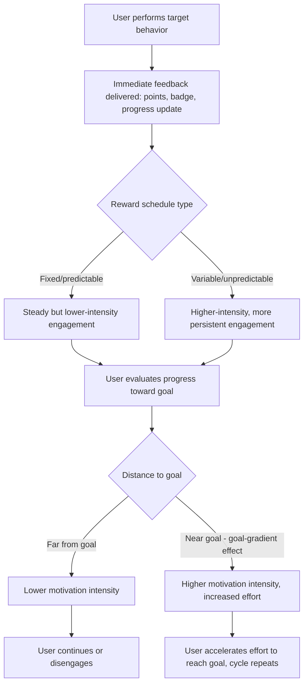

## Gamification and Behavioral Engagement Design

### Definition and Theoretical Foundation

Gamification is the application of game-design elements (points, badges, leaderboards, progress tracking, levels, challenges) to non-game contexts in order to increase user motivation, engagement, and desired behavior. Behavioral engagement design more broadly encompasses the deliberate application of psychological and behavioral economics principles to sustain user attention and activity within a product or service. The term "gamification" gained widespread usage following its formalization in industry and academic discourse around 2010–2011, though the underlying psychological principles draw on decades of earlier research in operant conditioning, self-determination theory, and goal-setting theory.

**Key Points**

- Gamification is distinct from "serious games" (full games designed for a non-entertainment purpose); gamification applies isolated game *elements* to an otherwise non-game product or service, rather than constructing an entire game experience.
- Effective gamification design draws on multiple distinct psychological frameworks simultaneously: reinforcement schedules (behaviorism), intrinsic/extrinsic motivation theory (self-determination theory), goal-setting theory, and social comparison processes.
- A key design distinction is between **extrinsic motivators** (points, badges, rankings — external rewards for behavior) and **intrinsic motivators** (a sense of mastery, autonomy, purpose, or genuine enjoyment) — with research suggesting that over-reliance on extrinsic gamification elements can, in some contexts, undermine pre-existing intrinsic motivation (the "overjustification effect").

### Core Psychological Mechanisms

#### Operant Conditioning and Variable Reward Schedules

- B.F. Skinner's research on operant conditioning established that **variable ratio reinforcement schedules** (rewards delivered unpredictably, after a variable number of actions) produce the highest and most persistent rates of behavioral response, more resistant to extinction than fixed or predictable reward schedules.
- This principle underlies many of the most engagement-maximizing gamification mechanics, including loot boxes, random reward drops, and unpredictable notification timing, and is frequently cited as a contributing factor in comparisons drawn between certain app engagement mechanics and gambling-adjacent psychology. [Inference — the application of variable ratio reinforcement to specific commercial products is a widely discussed design pattern, though direct causal attribution of engagement outcomes to this single mechanism (versus other contributing app design factors) is difficult to isolate empirically in real-world products]

#### Self-Determination Theory (Deci & Ryan)

Self-determination theory identifies three basic psychological needs that, when satisfied, support genuine intrinsic motivation:

- **Autonomy**: A sense of choice and self-directed control over one's actions.
- **Competence**: A sense of mastery and effective capability.
- **Relatedness**: A sense of social connection and belonging.

Gamification elements are generally more sustainably engaging when they support these needs (e.g., meaningful progress tracking that builds a genuine sense of competence) rather than relying solely on external rewards disconnected from any underlying skill or purpose.

#### Goal-Setting Theory (Locke & Latham)

- Specific, challenging (but attainable) goals produce higher performance and engagement than vague or overly easy goals — a well-established finding in organizational psychology directly applied in gamified progress tracking (e.g., specific step-count targets, specific savings goals).
- **Goal-gradient effect**: Motivation to complete a goal increases as the perceived distance to completion decreases, a pattern first demonstrated in animal behavior research (Hull, 1932) and later confirmed in human consumer loyalty program contexts (Kivetz, Urminsky, & Zheng, 2006), where progress accelerates disproportionately as a stated goal (e.g., a loyalty card nearing completion) approaches its endpoint.

#### Social Comparison and Competition

- Leaderboards and visible ranking systems leverage social comparison theory (Festinger, 1954), motivating engagement through competitive positioning relative to peers.
- Research on leaderboard design has found that relative ranking near the middle or top of a leaderboard (rather than being ranked very low) tends to be more motivating, and some platforms deliberately design "local" leaderboards (comparing users to a similarly-ranked peer subset) to keep competitive comparison motivating rather than discouraging. [Inference — this "optimal comparison range" pattern is a commonly cited design principle drawing on social comparison theory, though specific optimal thresholds vary by platform and user population]

### Common Gamification Elements and Mechanisms

| Element | Mechanism | Psychological Basis |
| --- | --- | --- |
| Points and scores | Quantify progress or achievement in a visible metric | Goal-setting, feedback loops |
| Badges and achievements | Discrete, collectible markers of accomplishment | Competence signaling, collection instinct |
| Leaderboards | Visible relative ranking among peers | Social comparison, competition |
| Progress bars | Visual representation of completion toward a goal | Goal-gradient effect, Zeigarnik effect (unfinished tasks are more mentally salient) |
| Streaks | Consecutive-day or consecutive-action tracking | Loss aversion (breaking a streak feels like losing accumulated value), commitment consistency |
| Levels/tiers | Staged progression through increasing difficulty/status | Mastery/competence, status-seeking |
| Variable rewards | Unpredictable reward timing or magnitude | Variable ratio reinforcement schedules |
| Social sharing/challenges | Peer-to-peer competition or collaboration prompts | Relatedness, social proof, network effects |

### Applications in Marketing and Consumer Psychology

#### Loyalty and Rewards Programs

- Points-based loyalty programs directly apply operant conditioning and goal-gradient principles: accumulating points toward a redemption threshold increases engagement as the threshold nears, and tiered status systems (e.g., airline elite tiers) combine goal-gradient motivation with status quo bias and endowment-effect-driven retention (discussed in prior sections).
- "Stamp card" style progress mechanics (e.g., "buy 9 coffees, get the 10th free") have been shown in applied research to increase completion rates and repeat visits when framed with an artificial head start (e.g., a 12-stamp card pre-stamped with 2 stamps, requiring the same 10 purchases as an unstamped 10-stamp card) — a direct application of the goal-gradient effect combined with an illusion of accelerated progress. [Inference — this specific "artificial head start" finding stems from Kivetz, Urminsky, & Zheng's applied loyalty card research and related work; generalization to all loyalty program formats varies by implementation]

#### Streak Mechanics in Habit-Forming Products

- Consecutive-day usage streaks (common in language-learning apps, fitness trackers, and social media platforms) leverage loss aversion: once a streak is established, breaking it is coded as losing accumulated value, motivating continued daily engagement beyond what pure task interest alone would sustain.
- Streak mechanics are among the most heavily scrutinized gamification patterns from a digital wellbeing perspective, given documented associations between streak-based design and compulsive usage patterns in some user populations. [Unverified — causal claims linking specific streak mechanics to compulsive usage outcomes are an active area of research and public health discussion, with effect sizes and causal direction not fully settled]

#### Onboarding and Progress-Based Activation

- SaaS and app onboarding flows frequently use progress bars and checklist mechanics ("Complete your profile: 60%") to leverage the goal-gradient effect and the Zeigarnik effect (the tendency for incomplete tasks to remain more cognitively salient than completed ones), increasing completion of onboarding steps that correlate with long-term product retention.

#### E-commerce and Purchase-Driving Gamification

- Gamified promotional mechanics (spin-to-win wheels, scratch-card discounts, mystery reward reveals) combine variable reward schedules with the illusion of control (discussed in the overconfidence/illusion of control topic) to increase engagement with promotional offers compared to static discount presentation.
- Progress-to-free-shipping bars ("Add $12 more for free shipping") apply goal-gradient motivation directly to increase average order value.

#### Fitness, Health, and Habit-Tracking Apps

- Step-count goals, badge systems for milestones, and social leaderboard challenges in fitness apps are widely used applications combining goal-setting theory, social comparison, and variable/streak-based reward structures to encourage sustained health behavior engagement.

**Example**

A language-learning app implements a daily streak counter, a leaderboard comparing users to others at a similar skill level, and periodic "double XP" bonus events with unpredictable timing. This combination is designed to leverage loss aversion (streak protection), social comparison (leaderboard), and variable reinforcement (unpredictable bonus timing) to sustain daily engagement beyond what pure content interest alone would produce. [Inference — illustrative composite design pattern reflecting documented mechanisms, not a specific reported case study]

### Process Flow: Gamification Engagement Loop

### Distinguishing Gamification from Related Concepts

| Concept | Core Mechanism | Distinction |
| --- | --- | --- |
| Gamification | Applying discrete game elements to non-game contexts | Isolated mechanic-level application |
| Nudge theory | Choice architecture altering decisions without restricting options | Broader framework; gamification can be viewed as one category of engagement-oriented nudge |
| Variable ratio reinforcement | Unpredictable reward timing driving persistent behavior | A specific psychological mechanism gamification often incorporates, not synonymous with gamification itself |
| Dark pattern / addictive design | Deliberately engineered compulsive engagement, often against user interest | Gamification becomes ethically contested when it shifts from supporting genuine user goals to exploiting compulsive engagement mechanisms |
| Self-determination theory | Framework for intrinsic motivation via autonomy, competence, relatedness | The theoretical lens for evaluating whether gamification supports sustainable intrinsic motivation or relies on potentially unsustainable extrinsic rewards |

### Boundary Conditions and Critiques

- Research on the overjustification effect suggests that introducing extrinsic rewards (points, badges) for activities a person was already intrinsically motivated to perform can, in some cases, reduce subsequent intrinsic motivation once the extrinsic reward is removed — a caution against over-gamifying activities that already have genuine inherent appeal. [Inference — the overjustification effect is a well-established finding in motivation research generally, though its specific magnitude and applicability across all gamification contexts is debated and context-dependent]
- Gamification effectiveness varies considerably by user population and personality type; some research on "player types" (e.g., Bartle's taxonomy, originally developed for multiplayer game design) suggests different users are motivated by different mechanics (achievement, competition, social connection, or exploration), meaning a single gamification approach is unlikely to be uniformly effective across a diverse user base. [Inference — player-type frameworks are widely referenced in applied gamification design but have mixed empirical validation as precise predictive models]
- Meta-analyses of gamification effectiveness in fields such as education and corporate training have found generally positive but highly variable effect sizes, with implementation quality and context-fit mattering considerably more than the mere presence of game elements. [Unverified — specific meta-analytic effect size ranges vary across reviews and are sensitive to publication bias and heterogeneous outcome measures across the gamification research literature]

### Ethical Considerations in Marketing Use

- Gamification that genuinely supports user goals (health tracking that motivates real fitness improvement, learning apps that sustain genuine skill acquisition) is broadly viewed as an ethically sound engagement strategy.
- Ethical concerns intensify when gamification mechanics are specifically engineered to exploit variable reward psychology, loss aversion (streak-breaking anxiety), or illusion of control to drive compulsive engagement disconnected from genuine user benefit — this overlaps substantially with regulatory and public discourse concerns around loot boxes, infinite scroll mechanics, and notification-driven engagement loops, particularly regarding effects on minors and vulnerable populations.
- Several jurisdictions have begun introducing or discussing regulation specifically targeting gamification mechanics that resemble gambling (e.g., loot box disclosure requirements) or that are found to disproportionately drive compulsive usage among minors. [Inference — the regulatory landscape in this area is actively evolving and varies substantially by jurisdiction]

**Related Topics**

- Overconfidence and illusion of control
- Loss aversion and reference dependence (streak mechanics)
- Nudge theory and libertarian paternalism
- Variable ratio reinforcement schedules
- Self-determination theory and intrinsic motivation
- Dark patterns and addictive design ethics
- Loyalty program design and goal-gradient effect