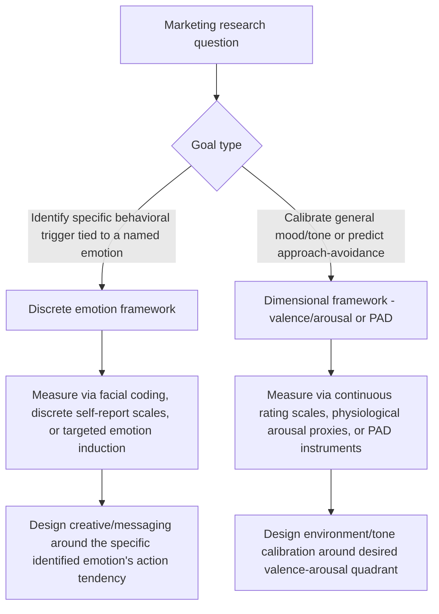

## Discrete Versus Dimensional Models of Emotion

### Overview and Theoretical Divide

Discrete and dimensional models represent two foundational, historically competing frameworks for conceptualizing and measuring human emotion within psychology, with direct downstream implications for how emotion is studied and applied in consumer research and marketing. **Discrete emotion theory** holds that a limited set of biologically basic, distinct emotions (e.g., joy, fear, anger, sadness, disgust, surprise) exist as qualitatively separate categories, each with a unique physiological signature, facial expression, and functional purpose. **Dimensional models** instead propose that all emotional experiences can be located within a small number of continuous underlying dimensions (most commonly valence and arousal), without assuming discrete, categorically separate emotion types.

**Key Points**

- Discrete emotion theory is most closely associated with psychologist Paul Ekman, whose cross-cultural research on facial expressions (beginning in the late 1960s and 1970s) proposed a set of universally recognized "basic emotions."
- Dimensional models are most closely associated with the **circumplex model of affect**, formalized by James Russell (1980), which maps emotional experience onto two orthogonal axes: valence (pleasant–unpleasant) and arousal (activated–deactivated).
- Neither framework is universally accepted as definitively correct; both remain active, debated frameworks in affective science, and much applied consumer psychology research draws selectively on whichever framework best fits the measurement or intervention context.

### Discrete Emotion Theory

#### Core Claims

- A small set of emotions are considered "basic" — biologically hardwired, evolutionarily adaptive, and associated with distinct, universally recognizable facial expressions. Ekman's most commonly cited original list includes: happiness, sadness, fear, anger, surprise, and disgust (with contempt sometimes added in later work).
- Each basic emotion is theorized to have a unique **action tendency** (a characteristic behavioral response pattern) and physiological signature, distinguishing it functionally from other emotions rather than treating emotions as varying only in intensity or valence.
- Discrete theorists generally view complex or "blended" emotional experiences (e.g., bittersweet nostalgia) as combinations or rapid sequences of these more basic underlying categories, rather than as points on a continuous dimensional space.

#### Supporting Evidence

- Cross-cultural facial expression recognition studies (Ekman & Friesen, and subsequent replications across diverse cultural populations) found substantial cross-cultural agreement in identifying certain facial expressions with specific basic emotions, supporting the universality claim. [Inference — while cross-cultural recognition agreement for a subset of expressions is well replicated, the degree of universality versus cultural specificity in emotional expression and recognition remains a genuinely contested area, with some more recent research raising methodological questions about original study designs]

### Dimensional Models of Emotion

#### The Circumplex Model (Russell, 1980)

The circumplex model represents emotions as points within a two-dimensional space:

- **Valence**: The pleasant-to-unpleasant quality of the emotional experience (horizontal axis).
- **Arousal**: The degree of physiological activation, from calm/low-energy to excited/high-energy (vertical axis).

Under this model, emotions traditionally treated as discrete categories are instead positioned as regions within this continuous space — for example, "excitement" and "joy" both sit in high-valence territory but differ primarily in arousal level, while "contentment" and "excitement" share high valence but differ substantially in arousal.

**Circumplex model structure (svg_diagram)**

<svg xmlns="http://www.w3.org/2000/svg" viewBox="0 0 500 500">
<rect width="500" height="500" fill="#ffffff" />
<text x="250" y="28" font-size="16" font-family="sans-serif" text-anchor="middle" fill="#111111">Circumplex Model of Affect (svg_diagram)</text>
<line x1="50" y1="260" x2="450" y2="260" stroke="#333333" stroke-width="2" />
<line x1="250" y1="60" x2="250" y2="460" stroke="#333333" stroke-width="2" />
<text x="455" y="265" font-size="12" font-family="sans-serif" fill="#333333">+ Valence</text>
<text x="10" y="265" font-size="12" font-family="sans-serif" fill="#333333">- Valence</text>
<text x="255" y="55" font-size="12" font-family="sans-serif" fill="#333333">+ Arousal</text>
<text x="230" y="475" font-size="12" font-family="sans-serif" fill="#333333">- Arousal</text>
<circle cx="350" cy="180" r="4" fill="#1a73e8" />
<text x="358" y="180" font-size="11" font-family="sans-serif" fill="#1a73e8">Excitement</text>
<circle cx="380" cy="260" r="4" fill="#1a73e8" />
<text x="388" y="260" font-size="11" font-family="sans-serif" fill="#1a73e8">Contentment</text>
<circle cx="150" cy="180" r="4" fill="#d93025" />
<text x="65" y="180" font-size="11" font-family="sans-serif" fill="#d93025">Anger/Fear</text>
<circle cx="130" cy="330" r="4" fill="#d93025" />
<text x="75" y="345" font-size="11" font-family="sans-serif" fill="#d93025">Sadness/Boredom</text>
<circle cx="250" cy="120" r="4" fill="#333333" />
<text x="258" y="118" font-size="11" font-family="sans-serif" fill="#333333">Surprise (neutral valence)</text>
</svg>

#### The PAD (Pleasure-Arousal-Dominance) Model

A closely related and highly influential dimensional model in consumer and environmental psychology is the **PAD model** (Mehrabian & Russell, 1974), which adds a third dimension:

- **Pleasure**: Equivalent to valence — pleasant vs. unpleasant.
- **Arousal**: Equivalent to the circumplex's arousal dimension.
- **Dominance**: The degree of perceived control or lack of constraint over the situation.

The PAD model has been particularly influential in retail environment and servicescape research, since it directly links environmental stimuli (e.g., store lighting, music tempo, crowding) to approach-avoidance consumer behaviors via measurable P-A-D states.

### Comparing the Two Frameworks

| Dimension of Comparison | Discrete Emotion Theory | Dimensional Models |
| --- | --- | --- |
| Basic unit of analysis | Distinct, named emotion categories | Continuous coordinates on underlying dimensions |
| Number of "core" states | Small fixed set (e.g., 6-7 basic emotions) | Two or three continuous dimensions generating infinite possible states |
| Measurement approach | Categorical labeling (e.g., "which emotion did you feel?") | Continuous rating scales (e.g., 1-9 valence, 1-9 arousal) |
| Physiological specificity | Claims unique physiological/facial signatures per emotion | Does not require unique physiological signatures per labeled emotion; states differ by degree |
| Strength for applied research | Useful for identifying which specific emotion drives a specific behavioral response (e.g., disgust driving avoidance) | Useful for predicting general approach/avoidance behavior and broad affective states (e.g., mood-congruent purchasing) |

**Key Points**

- Neither model has been proven definitively superior; a substantial body of research (e.g., the "psychological constructionist" approach associated with Lisa Feldman Barrett) has proposed hybrid or alternative frameworks arguing that even the apparent universality of discrete basic emotions may be partly a product of learned conceptual categories rather than purely hardwired biological modules. [Unverified — this constructionist critique remains an actively contested position within affective science, not a settled resolution of the discrete/dimensional debate]

### Applications in Marketing and Consumer Psychology

#### Advertising Emotional Appeal Design

- **Discrete-emotion-based advertising**: Campaigns designed to evoke a specific, named emotion (e.g., nostalgia in holiday advertising, fear in safety product marketing, disgust in anti-smoking campaigns) rely implicitly on discrete emotion theory, since the specific emotional category is assumed to drive a specific, predictable behavioral response distinct from other emotions of similar valence.
- **Dimensional approach to ad tone calibration**: Brand and campaign tone is often calibrated along valence and arousal dimensions more broadly (e.g., "we want high-arousal positive content for a product launch" vs. "low-arousal positive content for a relaxation-focused wellness brand") without necessarily specifying a single discrete named emotion.

#### Retail Environment and Servicescape Design (PAD Model Applications)

- Store ambiance elements (lighting brightness, music tempo and volume, scent, crowding density) are studied through the PAD framework's lens: environments that increase pleasure and appropriately calibrate arousal (not too overstimulating, not too understimulating) tend to increase approach behaviors (browsing time, spending), while environments producing high arousal combined with low pleasure or low dominance (e.g., overcrowded, chaotic retail spaces) tend to increase avoidance behaviors.
- Music tempo research in retail settings has found that faster tempo music tends to increase arousal and can either increase or decrease dwell time and spending depending on the baseline pleasantness of the environment and the type of retail context (e.g., fast-casual dining vs. leisurely browsing retail). [Inference — the general PAD-based directional pattern is well supported in servicescape literature; specific optimal tempo/arousal combinations vary considerably by retail context and consumer segment]

#### Discrete Emotions in Specific Marketing Contexts

- **Disgust-based public health and safety marketing**: Anti-smoking and food safety campaigns often specifically target disgust (a discrete emotion with a well-documented avoidance action tendency) rather than a generic negative-valence appeal, since disgust produces a distinctive rejection/avoidance response.
- **Nostalgia-driven brand marketing**: Nostalgia is studied as a specific discrete emotional state (though it is sometimes considered a complex or "self-conscious" emotion rather than a basic one) associated with distinctive effects on brand loyalty, willingness to pay, and social connectedness that differ from generic positive-valence appeals.
- **Fear appeals in risk communication**: Extensively studied in health and insurance marketing; fear appeal effectiveness depends heavily on the specific combination of perceived threat severity and perceived efficacy of the recommended action (per the Extended Parallel Process Model), a nuance that a purely dimensional (valence/arousal) approach would not capture as precisely.

#### Sentiment Analysis and Emotion AI in Marketing Analytics

- Automated sentiment analysis tools applied to customer reviews, social media, and support interactions often use a simplified dimensional approach (positive/negative/neutral valence, sometimes with an intensity or arousal proxy) for scalability, while more sophisticated emotion-AI tools attempt discrete emotion classification (e.g., classifying text or facial expression data into anger, joy, sadness categories) for more granular diagnostic insight into customer experience drivers. [Inference — the relative prevalence and accuracy of discrete-classification versus dimensional-scoring approaches in commercial sentiment analysis tools varies by vendor and has not been comprehensively benchmarked in independent published research]

**Example**

A skincare brand tests two ad concepts: one designed to evoke disgust at skin imperfections followed by relief upon product use (a discrete-emotion narrative arc), versus one designed simply to evoke a generally positive, moderately-arousing tone through upbeat music and imagery (a dimensional valence/arousal approach). The discrete disgust-relief narrative is hypothesized to produce a more specific and measurable behavioral action (immediate purchase intent tied to problem-resolution), while the dimensional approach is hypothesized to build more generalized positive brand affect over repeated exposure. [Inference — illustrative comparison of application logic, not a specific reported study result]

### Process Flow: Emotion Measurement Approach Selection

### Measurement Instruments

- **Discrete framework tools**: Facial Action Coding System (FACS, Ekman & Friesen), Differential Emotions Scale (DES, Izard), and various discrete self-report emotion checklists.
- **Dimensional framework tools**: Self-Assessment Manikin (SAM, Bradley & Lang, 1994) — a widely used pictorial, non-verbal rating scale for valence, arousal, and dominance — and the Positive and Negative Affect Schedule (PANAS, Watson, Clark & Tellegen, 1988), which, despite its name suggesting two dimensions, is sometimes used to derive both dimensional scores and discrete affect item groupings.

### Boundary Conditions and Ongoing Debates

- The number and identity of "basic" discrete emotions is itself contested among discrete-emotion theorists; different researchers have proposed varying lists (ranging from four to eleven or more "basic" emotions across different theoretical proposals), indicating the discrete category boundaries are not as settled as the framework's applied use sometimes implies. [Unverified — the exact count and membership of "basic emotions" remains an unresolved theoretical question within discrete emotion research]
- Dimensional models, while parsimonious, have been criticized for potentially collapsing functionally distinct emotional states (e.g., fear and anger, which share high arousal and negative valence but produce very different action tendencies) into indistinguishable regions of the affect space, limiting their precision for predicting specific behaviors. [Inference — this is a commonly cited critique of purely dimensional approaches in the applied consumer behavior literature]
- Hybrid approaches combining both frameworks (e.g., using dimensional scores as a general screening tool, then applying discrete categorization for high-arousal or ambiguous states) are increasingly common in both academic and applied consumer research, reflecting the frameworks' complementary rather than strictly competing practical utility. [Inference — the trend toward hybrid measurement approaches is observable in recent applied research but is not a formally unified or standardized methodology]

**Related Topics**

- Mood-congruent judgment and purchasing behavior
- Affect heuristic in decision-making
- Fear appeals and the Extended Parallel Process Model
- Nostalgia marketing and brand attachment
- Servicescape design and the PAD model
- Sentiment analysis and emotion AI in marketing analytics
- Emotional branding and brand personality theory