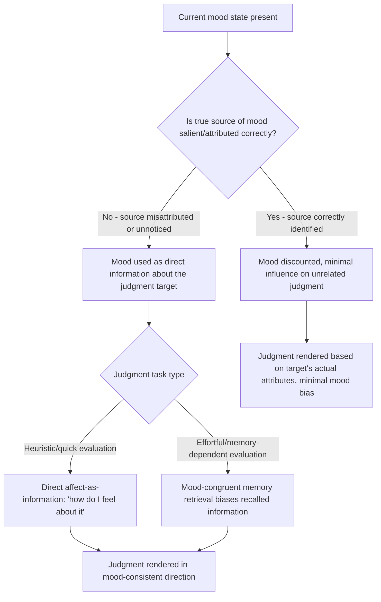

## Affect-as-Information and Mood Congruence

### Definitions and Theoretical Origin

**Affect-as-information theory** proposes that people use their current feelings as a direct source of information when making judgments, effectively asking themselves "how do I feel about this?" and treating the answer as diagnostic — even when the feeling's true source is irrelevant to the judgment at hand (e.g., ambient weather, unrelated prior events). **Mood congruence** refers to the broader empirical pattern in which a person's current mood biases judgments, memory, and evaluations in a mood-consistent direction — positive moods promote more favorable evaluations and positive memory recall, while negative moods promote more critical evaluations and negative memory recall. The affect-as-information framework was formalized by Norbert Schwarz and Gerald Clore in their influential 1983 paper, building on their "misattribution of arousal" and mood research.

**Key Points**

- The core theoretical claim of affect-as-information is that people frequently misattribute the *source* of their current feeling state, treating incidental mood (caused by something unrelated, like weather) as though it were informative about the specific target being judged (e.g., life satisfaction, a product, a person).
- Mood congruence effects operate through both **judgment formation** (evaluating a target more favorably when in a positive mood) and **memory processes** (more easily recalling mood-consistent information — described by the related "mood-congruent memory" literature associated with Gordon Bower's research).
- Affect-as-information is distinct from simple valence transfer or classical conditioning: it specifically emphasizes that people use their feelings *as information* in an inferential, "how-do-I-feel-about-it" heuristic process, rather than the feeling merely becoming associated with the target through repeated pairing.

### The Classic Weather and Life Satisfaction Study

Schwarz and Clore's foundational 1983 study called people on sunny or rainy days and asked them to rate their overall life satisfaction:

- Respondents called on sunny days reported significantly higher life satisfaction than those called on rainy days.
- Critically, when interviewers first asked about the weather explicitly before the life satisfaction question, the weather-mood effect on life satisfaction ratings disappeared — because making the true source of the mood (the weather) salient allowed respondents to correctly discount the incidental feeling rather than misattributing it to their overall life circumstances.

This finding is the central empirical demonstration of the affect-as-information mechanism: mood influences judgment specifically when its true source is not salient or is misattributed, and the effect is substantially reduced or eliminated once the actual source is made explicit. [Inference — while this study is foundational and widely replicated in spirit, exact effect sizes for weather-mood-judgment links have varied across subsequent replication attempts and geographic/cultural contexts]

### Mechanisms: How Mood Shapes Judgment

Two primary explanatory routes are generally identified:

1. **Direct affect-as-information (heuristic route)**: Under low cognitive elaboration or when a quick, global evaluation is needed, people directly consult their current feeling state as a proxy for a judgment (e.g., "I feel good, so I must like this").
2. **Mood-congruent memory and information processing (associative network route)**: Bower's associative network theory of memory (1981) proposes that emotions are represented in memory as nodes connected to related thoughts, memories, and concepts; activating a mood state increases the accessibility of mood-congruent material stored in memory, biasing recall, attention, and interpretation of ambiguous information in a mood-consistent direction.

**Key Points**

- The two mechanisms are complementary rather than mutually exclusive: affect-as-information tends to dominate under quick, heuristic-based judgment conditions, while mood-congruent memory effects tend to dominate under more elaborated, memory-retrieval-dependent judgment tasks.
- The **mood-as-information vs. mood-as-input distinction** (a further refinement by Martin and colleagues) notes that the *same* mood can produce different judgment outcomes depending on the task framing — for example, a positive mood can sometimes signal "this is enough, I can stop" for enjoyment-focused tasks but "I need to work harder" for accuracy-focused tasks, complicating a simple universal mood-congruence rule. [Inference — this refinement is a recognized extension in the mood-and-judgment literature but is less universally applied in commercial/marketing contexts than the simpler mood-congruence pattern]

### Mood Effects on Processing Style: The Affect-as-Information Extension

Beyond direct judgment content, affect-as-information theory also proposes that mood signals information about the current environment's safety or demand level, which in turn shapes cognitive processing style:

- **Positive mood** tends to signal a benign, safe environment, promoting more heuristic, less effortful, more creative and flexible (though sometimes less critically scrutinized) processing.
- **Negative mood** tends to signal a problematic environment requiring attention, promoting more systematic, detail-oriented, effortful, and critically scrutinized processing.

This has direct implications for persuasion research: messages requiring careful, systematic processing to be persuasive (e.g., detailed argument-based appeals) may be processed differently depending on the audience's incidental mood state at exposure. [Inference — the mood-processing-style link is a well-established finding in social cognition research, though its specific applied magnitude in real-world advertising exposure contexts (where moods are more variable and less controlled than in lab settings) is less precisely quantified]

### Applications in Marketing and Consumer Psychology

#### Advertising Context and Media Placement

- Advertisements placed within positive-mood-inducing media content (e.g., uplifting television programming, humorous content) have been found in multiple studies to be evaluated more favorably than identical advertisements placed within neutral or negative-mood-inducing content, a direct application of mood congruence to media buying and ad placement strategy.
- This has practical implications for programmatic advertising and content adjacency decisions: placing ads near distressing news content has been associated with reduced ad recall and more negative brand evaluation in some studies, informing "brand safety" and contextual advertising practices. [Inference — the general mood-congruence-based rationale for brand safety practices is well supported by underlying theory; specific quantified effect sizes for particular ad-content pairings vary by study and platform]

#### In-Store Mood Induction (Servicescape Applications)

- Retail environmental design (music, lighting, scent — connecting to the PAD model discussed under discrete/dimensional emotion models) is frequently used to induce positive incidental mood states in shoppers, which then transfers via mood-congruent judgment to more favorable evaluations of products, service quality, and overall shopping experience, as well as increased spontaneous/unplanned purchasing.
- Background music tempo and genre selection in retail settings has been studied extensively as a mood-induction tool, with several studies finding that pleasant background music increases positive mood and, correspondingly, product evaluations and time spent in-store. [Inference — while the general directional relationship is well-supported across multiple retail studies, optimal music characteristics vary by retail category, target demographic, and cultural context]

#### Online Reviews and User-Generated Content Timing

- Consumers reading online reviews or generating their own reviews while in a positive incidental mood (e.g., immediately following an enjoyable, unrelated experience) may render more favorable evaluations than the same consumers reviewing in a neutral or negative mood state, a mood-congruence effect with implications for the timing of review-request prompts in customer experience design. [Inference — this application draws logically from established mood-congruence research but the specific magnitude in review-generation contexts (versus laboratory judgment tasks) has been less extensively directly studied]

#### Emotional Priming in Digital Experiences

- Video content, imagery, and even color schemes used in digital marketing (websites, apps, email campaigns) can function as incidental mood inducers that carry over into subsequent purchase-related judgments, particularly when the true source of the induced feeling (the marketing content itself) is not consciously salient to the consumer as the "cause" of their positive disposition toward the product.

#### Customer Service and Complaint Handling

- Mood congruence has direct implications for customer service timing and sequencing: addressing a customer's negative mood (e.g., frustration from a service failure) before presenting a resolution or additional offer can prevent the negative mood from coloring evaluation of the resolution itself, since unaddressed negative affect can carry over and bias subsequent judgments in a mood-congruent negative direction.

**Example**

A hotel chain tests sending post-stay review request emails at two different times: immediately upon checkout (potentially while residual travel stress or fatigue is present) versus 24 hours later (after the stressful travel transition has resolved). The delayed timing is hypothesized to produce more favorable review ratings on average, consistent with mood-congruent judgment research suggesting incidental negative mood at the moment of evaluation can bias otherwise unrelated satisfaction judgments downward. [Inference — illustrative hypothesis grounded in established mood-congruence theory, not a specific reported case result]

### Process Flow: Affect-as-Information in Judgment Formation

### Distinguishing Affect-as-Information from Related Concepts

| Concept | Core Mechanism | Distinction |
| --- | --- | --- |
| Affect-as-information | Current feeling used as direct judgment input, often via misattribution | Emphasizes real-time inferential use of feeling state |
| Mood-congruent memory | Mood increases accessibility of mood-consistent stored memories | Emphasizes memory retrieval bias specifically, a component mechanism |
| Classical conditioning (evaluative conditioning) | Repeated pairing of a stimulus with an affective state creates learned association | Does not require misattribution or real-time inference; operates through associative learning over repeated exposures |
| Priming (general) | Activation of related concepts influences subsequent processing | Broader category; affect-as-information is a specific affective/mood-based instance of priming effects on judgment |
| Discrete emotion appeals | Targeting a specific named emotion for a specific action tendency | Affect-as-information concerns general incidental mood states influencing unrelated judgments, not necessarily discrete, target-relevant emotions |

### Boundary Conditions and Moderators

- Affect-as-information effects are strongest for judgments that are inherently evaluative, global, or subjective (e.g., overall satisfaction, liking, quality perception) and weaker for judgments involving objective, verifiable facts, since factual judgments are less dependent on subjective feeling-based inference. [Inference — this pattern is broadly consistent with the theoretical framework and supported in the original and related research, though the precise boundary between "evaluative" and "factual" judgment types is not always sharply defined in applied consumer contexts]
- As demonstrated in the original weather study, making the true source of an incidental mood salient substantially attenuates or eliminates the affect-as-information effect, meaning awareness or explicit questioning about mood source is a robust boundary condition, not merely a theoretical footnote.
- Individual differences in "need for affect" and habitual reliance on feelings versus deliberative reasoning have been proposed as moderators of susceptibility to affect-as-information effects, though this remains a less extensively and consistently validated area compared to the core mood-congruence findings. [Unverified — individual difference moderation in this specific domain is a less mature area of the literature compared to the foundational mood-congruence effects themselves]

### Ethical Considerations in Marketing Use

- Using pleasant environmental or content design to create a genuinely positive customer experience (e.g., pleasant music, attractive store design) is broadly viewed as a legitimate and long-standing marketing and hospitality practice.
- Ethical concerns arise when incidental mood induction is used specifically to obscure a consumer's objective evaluation of product quality, price fairness, or contract terms — for example, timing high-pressure sales interactions to coincide with artificially induced positive mood states (e.g., free alcohol at a timeshare presentation) in order to reduce critical scrutiny of unfavorable terms, which overlaps with broader concerns about manipulative sales tactics and, in some regulated contexts (e.g., high-value financial products), specific disclosure requirements exist to counteract mood-driven impulsive decision-making. [Inference — regulatory specificity regarding mood-manipulation tactics varies substantially by industry and jurisdiction]

**Related Topics**

- Discrete versus dimensional models of emotion
- Servicescape design and the PAD model
- Mood-congruent memory (Bower's associative network theory)
- Misattribution of arousal
- Elaboration likelihood model and processing style
- Contextual advertising and brand safety
- Customer experience sequencing and peak-end rule