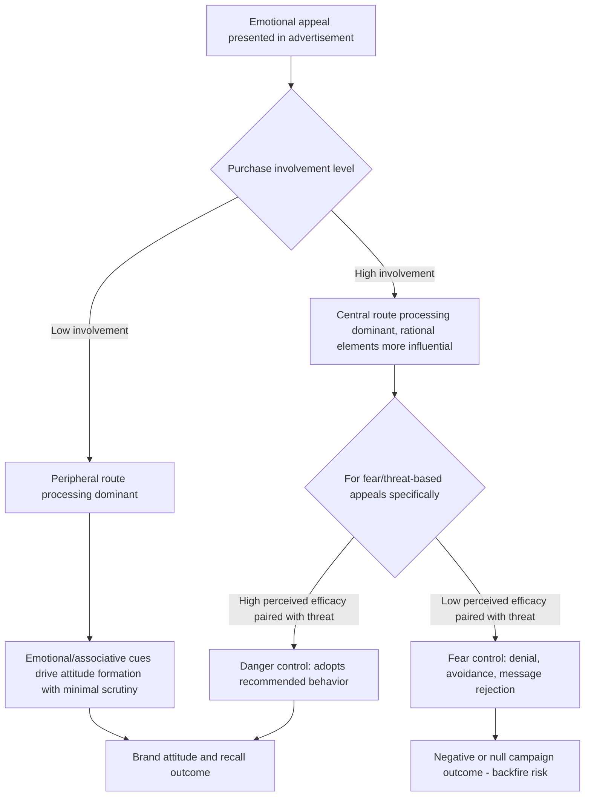

## Emotional Appeals and Advertising Effectiveness

### Definition and Theoretical Foundation

Emotional appeals in advertising are persuasive strategies that deliberately elicit specific affective responses (fear, humor, warmth, nostalgia, guilt, pride, sadness, excitement) in order to influence attitude formation, brand recall, and purchase behavior, as distinct from **rational/informational appeals**, which rely primarily on factual claims, feature comparisons, and logical argumentation. The theoretical grounding for emotional appeal effectiveness draws on multiple overlapping frameworks: discrete emotion theory and dimensional models (valence/arousal), affect-as-information and mood congruence, dual-process persuasion models, and specific applied frameworks such as fear appeal theory.

**Key Points**

- Meta-analytic advertising research (e.g., work synthesized by scholars such as Robert Heath and various academic advertising effectiveness reviews) has generally found that emotionally-engaging advertising tends to produce stronger long-term brand-building effects and better memory encoding than purely rational/informational advertising, particularly for low-involvement or parity-category products. [Inference — this is a broadly supported directional pattern in advertising effectiveness research, though specific comparative effect sizes vary considerably across product categories, media channels, and measurement methodologies]
- Emotional appeals operate through both **conscious, deliberate persuasion routes** (e.g., a fear appeal explicitly arguing "you should act because this is dangerous") and **low-attention, implicit conditioning routes** (e.g., pairing a brand with pleasant imagery and music without an explicit argumentative claim), which is a key distinction in models such as the Elaboration Likelihood Model (ELM, Petty & Cacioppo, 1986).
- The choice between emotional and rational appeals is not strictly binary in practice; most effective advertising combines elements of both, with the relative emphasis varying by category, purchase involvement level, and campaign objective (brand-building vs. direct response).

### The Elaboration Likelihood Model (ELM) and Dual-Route Processing

The ELM distinguishes two persuasion routes relevant to understanding when emotional appeals are most effective:

- **Central route processing**: High-effort, careful evaluation of message arguments; more relevant for high-involvement purchase decisions (e.g., major financial products, B2B purchases) where rational appeals and detailed information tend to be more persuasive.
- **Peripheral route processing**: Low-effort processing relying on peripheral cues (source attractiveness, emotional tone, music, imagery) rather than argument quality; more relevant for low-involvement purchase decisions (e.g., everyday consumer packaged goods) where emotional and associative appeals tend to be more persuasive.

**Key Points**

- Emotional appeals are generally more effective via the peripheral route for products where consumers have low motivation or ability to process detailed argumentation, while rational appeals retain greater relative importance for high-involvement, high-stakes purchase decisions processed via the central route.
- Advertising for the same product category can shift in appeal type depending on purchase stage: emotional appeals often dominate broad brand-awareness and consideration-stage advertising, while rational/informational appeals become more prominent closer to the point of purchase decision, when consumers are more likely to engage in effortful central-route evaluation.

### Types of Emotional Appeals and Their Documented Effects

#### Humor Appeals

- Humor has been extensively studied and generally found to increase attention, likability, and message recall, though its effect on actual persuasion and purchase intent is more mixed and depends heavily on relevance between the humor and the brand/product message. [Inference — the attention/likability benefits of humor are well-replicated; the persuasion/purchase-intent link is more variable and context-dependent across studies]
- A commonly cited risk with humor appeals is the "vampire effect," where the humorous content itself is well-recalled but overshadows recall of the actual brand or product message — a documented risk requiring careful integration of humor with brand-relevant content.

#### Fear Appeals

- Fear appeal effectiveness is best explained by the **Extended Parallel Process Model** (EPPM, Witte, 1992), which proposes that fear appeals only produce the intended protective behavior change when both **perceived threat** (severity and susceptibility) and **perceived efficacy** (response efficacy and self-efficacy) are sufficiently high.
- When perceived threat is high but perceived efficacy is low, the EPPM predicts a "fear control" response (denial, avoidance, reactance against the message) rather than the intended "danger control" response (adopting the recommended protective behavior) — meaning poorly designed fear appeals can backfire, producing message rejection rather than behavior change.
- This has direct implications for health, safety, insurance, and security product marketing, where fear-based messaging must be carefully paired with a clear, credible, actionable solution to avoid triggering defensive avoidance rather than purchase/adoption behavior.

#### Warmth and Nostalgia Appeals

- Warmth appeals (evoking feelings of tenderness, connection, and positive social bonds) have been associated in advertising research with increased liking and positive attitude transfer to the brand, particularly effective in categories associated with family, care, and relationships (e.g., insurance, household products, holiday advertising).
- Nostalgia appeals have been specifically studied for their association with increased willingness to pay, brand loyalty, and feelings of social connectedness, functioning somewhat differently from simple positive-valence appeals because nostalgia combines positive and bittersweet elements and is tied to personal or collective memory rather than purely present-moment feeling. [Inference — nostalgia's specific psychological profile (a "self-conscious," mixed-valence emotion) is documented in academic research, though the precise boundary between nostalgia and generic positive sentimental appeals is not always cleanly distinguished in applied advertising practice]

#### Guilt and Negative Emotional Appeals

- Guilt appeals (common in charitable giving and prosocial marketing) can increase compliance with a requested behavior, but research has found a nonlinear relationship: moderate guilt appeals tend to be more effective than either very mild or very intense guilt appeals, with excessive guilt sometimes triggering reactance, defensive denial, or message avoidance rather than compliance. [Inference — this "moderate guilt is optimal" pattern is a documented finding in prosocial/charitable marketing research, though optimal intensity likely varies by cause, audience, and cultural context]

### Emotional Intensity, Arousal, and Virality

- Content evoking high-arousal emotions (whether positive, like awe and excitement, or negative, like anger and anxiety) has been found in social sharing research (notably Berger & Milkman's studies on viral content) to be shared more frequently than content evoking low-arousal emotions (like sadness or contentment), regardless of valence — suggesting arousal, not just positive/negative valence, is a key driver of advertising content virality and organic sharing behavior. [Inference — the arousal-driven virality finding is a well-cited pattern from specific studies on shared online content; generalization across all advertising formats and platforms should account for context-specific variation]

### Applications in Marketing and Consumer Psychology

#### Category-Specific Emotional Appeal Selection

- Low-involvement, parity-category products (soft drinks, snacks, everyday household goods) tend to rely heavily on emotional/peripheral-route appeals (humor, warmth, excitement) since functional differentiation between competing brands is often minimal, making emotional differentiation the primary lever for brand preference.
- High-involvement, high-risk category products (insurance, financial services, healthcare, B2B software) tend to blend rational appeals (addressing risk, providing evidence, feature comparison) with emotional appeals addressing the underlying anxiety or aspiration driving the purchase (e.g., security, peace of mind, professional confidence).

#### Campaign Objective Alignment

- **Brand-building campaigns** (long-term equity, awareness, and preference building) generally favor emotional appeals with broad reach and memorable creative execution, consistent with research suggesting emotional advertising produces more durable implicit memory associations that influence future purchase consideration even without immediate measurable direct response.
- **Direct-response/performance campaigns** (immediate conversion-focused advertising) often favor a hybrid approach, using emotional hooks for initial attention capture combined with clear rational calls-to-action and functional benefit statements to drive immediate measurable action.

#### Testing and Optimization of Emotional Creative

- Biometric and implicit measurement tools (facial coding via computer vision, galvanic skin response, eye-tracking, and implicit association tests) are increasingly used in advertising pre-testing to assess actual emotional response to creative content, as a complement to (or corrective for) self-reported emotional reaction, which can be subject to social desirability bias and limited introspective access to one's own affective responses. [Inference — the adoption and validated predictive accuracy of specific biometric ad-testing methods varies considerably across vendors and has been the subject of ongoing methodological debate regarding their correlation with actual downstream sales or behavior outcomes]

**Example**

An insurance company tests two ad concepts: a purely rational appeal listing coverage details and price comparisons, versus a fear-appeal narrative depicting a family facing an unexpected accident, followed by a clear, specific, and credible depiction of how the insurance resolves the crisis (addressing both threat and efficacy per the EPPM). The EPPM-informed emotional appeal is hypothesized to outperform the purely rational appeal on both attention and behavioral intent, provided the efficacy message is concrete and credible — a poorly resolved fear appeal (high threat, vague or non-credible solution) would be expected to underperform due to defensive avoidance. [Inference — illustrative application of established fear appeal theory, not a specific reported case result]

### Process Flow: Emotional Appeal Effectiveness Pathway

### Distinguishing Emotional Appeals from Related Concepts

| Concept | Core Mechanism | Distinction |
| --- | --- | --- |
| Emotional appeal | Deliberate elicitation of a specific feeling to drive attitude/behavior | The overarching persuasive strategy category |
| Fear appeal / EPPM | Threat + efficacy combination determines danger control vs. fear control | A specific, well-formalized sub-type with a documented backfire risk |
| Mood congruence / affect-as-information | Incidental mood biases unrelated judgment | Concerns general background mood state, not necessarily a deliberately targeted persuasive appeal |
| Elaboration Likelihood Model | Central vs. peripheral route processing | The broader dual-process framework explaining *when* emotional (peripheral) vs. rational (central) appeals are more persuasive |
| Discrete emotion theory | Specific named emotions with distinct action tendencies | Provides the theoretical basis for selecting which specific discrete emotion (fear, disgust, nostalgia) an appeal should target |

### Boundary Conditions and Critiques

- The relative effectiveness of emotional versus rational appeals is not fixed and interacts substantially with cultural context; some cross-cultural advertising research suggests collectivist cultures respond differently to individually-framed emotional appeals (e.g., personal pride, individual achievement) compared to socially-framed emotional appeals (e.g., family harmony, group belonging), though the specific magnitude and consistency of these cultural moderation effects vary across studies. [Unverified — cross-cultural moderation of emotional appeal effectiveness is an active and methodologically challenging research area, with findings not fully consistent across studies and product categories]
- Self-reported emotional response to advertising has documented limitations (social desirability bias, limited introspective accuracy, post-hoc rationalization), which has driven increased adoption of implicit and physiological measurement methods, though these methods carry their own validity and standardization challenges and have not fully replaced self-report measures in industry practice. [Inference — the general critique of self-report limitations is well-established in psychological measurement literature broadly; its specific application and resolution in advertising testing practice remains an evolving, imperfectly standardized area]
- Long-term brand-building effects of emotional advertising are inherently harder to causally isolate and measure than short-term direct-response metrics, contributing to ongoing debates in the advertising industry about appropriate attribution models and measurement time horizons for emotionally-driven brand campaigns. [Unverified — this measurement/attribution debate is a genuinely unresolved methodological challenge in advertising effectiveness research and industry practice]

### Ethical Considerations in Marketing Use

- Emotional appeals that accurately reflect genuine product benefits or risks (e.g., an accurately depicted fear appeal for a genuinely risky situation, paired with a genuinely effective solution) are broadly viewed as legitimate persuasive communication.
- Ethical concerns intensify with appeals that exploit vulnerable emotional states, target vulnerable populations (particularly children, given their more limited capacity for critical evaluation of persuasive intent), or use fear/guilt appeals disproportionate to actual risk in order to manipulate rather than genuinely inform purchase decisions — several advertising standards bodies (e.g., self-regulatory advertising councils in various jurisdictions) specifically address exaggerated fear-based or guilt-based claims that lack substantiated basis.

**Related Topics**

- Discrete versus dimensional models of emotion
- Affect-as-information and mood congruence
- Elaboration Likelihood Model and dual-process persuasion
- Extended Parallel Process Model and fear appeals
- Nostalgia marketing and brand attachment
- Social sharing and viral content psychology
- Implicit measurement and biometric ad testing