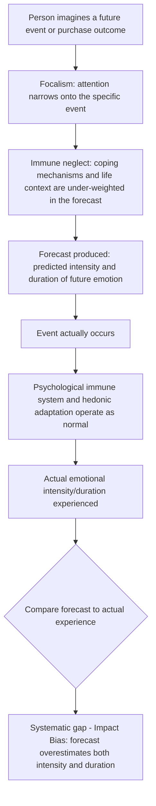

## Affective Forecasting and Anticipated Emotion

### Definitions and Theoretical Origin

**Affective forecasting** is the process by which people predict their future emotional reactions to upcoming events, outcomes, or purchases. **Anticipated emotion** refers to the predicted feeling itself — how a person expects to feel *if* a future event occurs — which is distinct from **anticipatory emotion**, the feeling experienced *in the present* while anticipating a future event (e.g., current excitement or dread about something yet to happen). The field of affective forecasting research was substantially developed by psychologists Timothy Wilson and Daniel Gilbert, most notably synthesized in their widely cited 2003 paper "Affective Forecasting."

**Key Points**

- Affective forecasting research consistently finds that people are relatively accurate at predicting the *valence* (positive or negative direction) of their future feelings, but systematically inaccurate at predicting the **intensity** and especially the **duration** of those feelings — a pattern termed the **impact bias**.
- The impact bias applies symmetrically to both positive events (people overestimate how happy a purchase, achievement, or positive life event will make them, and for how long) and negative events (people overestimate how devastated they will be by a loss, failure, or negative life event, and for how long).
- Anticipated emotion (the forecast) and anticipatory emotion (the present-moment feeling of anticipating) are functionally distinct but often confused; anticipatory emotion (e.g., current excitement before a purchase) can itself influence decision-making independently of the accuracy of the affective forecast about the post-outcome state.

### The Impact Bias and Its Underlying Mechanisms

Several mechanisms have been proposed to explain why people systematically overestimate the intensity and duration of future emotional reactions:

1. **Focalism (focusing illusion)**: When predicting a future emotional state, people tend to focus excessively on the specific, salient event in question while neglecting the many other ongoing life circumstances that will continue to influence their overall wellbeing after the event occurs — leading to an overestimation of that single event's emotional impact relative to everything else in their lives.
2. **Immune neglect**: People underestimate the operation of their own "psychological immune system" — the array of cognitive coping mechanisms (rationalization, reframing, finding silver linings, social comparison) that naturally operate to buffer emotional reactions to negative events over time, leading to overestimation of how bad and how long a negative outcome will feel.
3. **Hedonic adaptation**: The broader phenomenon whereby people naturally return toward a baseline level of subjective wellbeing following both positive and negative life changes, faster and more completely than forecasters typically anticipate.

### Key Empirical Demonstrations

- **Lottery winners and paraplegics (Brickman, Coates, & Janoff-Bulman, 1978)**: An early and highly influential (though since qualified and partially contested) study found that lottery winners were not significantly happier than a comparison group in overall life satisfaction some time after their win, and individuals who had experienced spinal cord injuries were not as unhappy as anticipated, illustrating both hedonic adaptation and the discrepancy between predicted and actual long-term emotional impact of major life events. [Inference — this study is foundational and widely cited, but subsequent research has qualified and, in some respects, contested aspects of its original findings and small sample size, and should be treated as an illustrative early demonstration rather than a definitive, uncontested modern benchmark]
- **Academic tenure decisions (Gilbert et al., 1998)**: Assistant professors predicted they would be significantly happier if granted tenure and significantly unhappier if denied tenure than they actually reported being when surveyed some years after the actual outcome, demonstrating the impact bias in a real-world, high-stakes professional context.
- **Consumer purchase satisfaction studies**: Multiple studies in consumer behavior research have found that anticipated satisfaction from planned purchases (particularly larger, more emotionally significant purchases) often exceeds actual reported post-purchase satisfaction measured after a delay, consistent with the general impact bias pattern. [Inference — the general directional pattern (anticipated exceeding actual post-purchase satisfaction) is documented in consumer behavior research, though the specific magnitude varies considerably by product category, price point, and time elapsed since purchase]

### Anticipated Emotion as a Distinct Decision Input

Beyond the accuracy question, anticipated emotion functions as a direct input into decision-making, independent of whether the forecast turns out to be accurate:

- **Anticipated regret**: The expectation of feeling regret if a decision turns out poorly is a well-documented influence on choice behavior, often leading to more risk-averse or status-quo-preserving decisions specifically to avoid the anticipated feeling of regret, regardless of the objective probability of a poor outcome (regret theory, Loomes & Sugden, 1982; Bell, 1982).
- **Anticipated pride/satisfaction**: The expectation of positive feelings (pride in an achievement, satisfaction from self-improvement) can motivate goal pursuit and purchase decisions (e.g., fitness products, self-improvement courses) even when the actual realized satisfaction may not match the anticipated intensity.
- **Anticipatory consumption/savoring**: Research on "savoring" (Bryant & Veroff) demonstrates that the anticipatory phase of looking forward to a positive future event (e.g., an upcoming vacation) can itself be a significant source of present-moment positive affect and wellbeing, sometimes comparable to or even exceeding the pleasure derived from the event itself. [Inference — the relative magnitude comparison between anticipatory pleasure and in-the-moment/retrospective pleasure varies by study and event type]

### Applications in Marketing and Consumer Psychology

#### Purchase Decision Framing Around Anticipated Emotion

- Marketing messaging frequently emphasizes the anticipated emotional payoff of a purchase ("imagine how you'll feel," "you deserve this") rather than purely functional benefits, directly leveraging consumers' (often inflated) affective forecasts about the purchase's emotional impact.
- Experiential purchases (travel, events, dining experiences) versus material purchases (goods) have been extensively studied in relation to affective forecasting: research (notably by Thomas Gilovich and colleagues) has found that people tend to more accurately anticipate greater and more durable satisfaction from experiential purchases than material purchases, and this "experiential advantage" itself has become a significant positioning strategy in experience-based marketing (e.g., "buy experiences, not things" campaign messaging). [Inference — the experiential-vs-material purchase satisfaction research is well-cited and directionally robust, though the precise mechanisms (social comparison resistance, identity connection, anticipation/reminiscence value) and their relative contributions continue to be studied and debated]

#### Anticipatory Consumption and the "Looking Forward To It" Value Proposition

- Travel, event ticketing, and pre-order marketing explicitly capitalize on anticipatory emotion as a standalone value driver: the marketing of an upcoming vacation, concert, or product launch generates present-moment positive affect through the anticipation phase itself, independent of the eventual on-the-day experience.
- Pre-order and "coming soon" marketing strategies extend the anticipatory phase deliberately, since research on savoring suggests a longer, well-managed anticipation period can enhance total experienced value from a purchase, though excessively long anticipation periods can also risk anticipatory anxiety or diminished excitement by the time of actual delivery (a boundary condition requiring careful campaign timing). [Inference — the "optimal anticipation length" is not a precisely established universal parameter and likely varies by product category and consumer segment]

#### Anticipated Regret in Risk-Averse Purchase Categories

- Insurance, warranty, and safety-related product marketing frequently invokes anticipated regret directly ("don't wait until it's too late," "what if something happens and you're not covered") to motivate purchase by making the potential future regret of inaction vivid and salient at the point of decision.
- Return policies, price-match guarantees, and "risk-free" purchase framing are partly designed to reduce anticipated regret at the point of purchase decision, lowering a key psychological barrier to conversion, particularly for higher-consideration purchases.

#### Countering the Impact Bias in Customer Expectation Management

- Overpromising the emotional payoff of a product or experience (exploiting or amplifying the impact bias in marketing claims) creates a documented risk of post-purchase disappointment, since actual satisfaction is likely to fall short of an inflated affective forecast — with direct implications for customer satisfaction, return rates, and negative word-of-mouth or reviews.
- Some customer experience and expectation-setting best practices explicitly aim to calibrate anticipated satisfaction closer to realistic post-purchase experience (rather than maximizing pre-purchase excitement at any cost), reducing the gap between forecasted and actual satisfaction that can otherwise drive buyer's remorse and returns. [Inference — this is a generally recommended practice grounded in affective forecasting and expectation-disconfirmation research, though its adoption and specific implementation vary considerably across industries and firms]

**Example**

A travel company markets an all-inclusive resort vacation heavily emphasizing anticipated emotional payoff ("imagine total relaxation, no stress, pure joy"). While this framing may boost initial booking conversion by leveraging optimistic affective forecasts, if the actual on-site experience involves normal frictions (crowds, minor service issues) not addressed in expectation-setting, the gap between the inflated anticipated emotion and the more moderate actual experience is expected to produce disproportionately negative post-trip reviews relative to a marketing approach that set more calibrated, realistic expectations alongside genuine positive highlights. [Inference — illustrative application of expectation-disconfirmation and impact-bias research, not a specific reported case result]

### Process Flow: Affective Forecasting and the Impact Bias

### Distinguishing Affective Forecasting Concepts from Related Ideas

| Concept | Core Mechanism | Distinction |
| --- | --- | --- |
| Affective forecasting | Predicting future emotional reactions | The overarching predictive process |
| Impact bias | Systematic overestimation of intensity/duration of forecasted emotion | The specific documented error pattern within affective forecasting |
| Anticipated emotion | The predicted future feeling itself | The *content* of the forecast |
| Anticipatory emotion | Present-moment feeling while anticipating a future event | Distinct from the forecast; a real, current emotional state that itself influences behavior |
| Hedonic adaptation | Return toward baseline wellbeing after life changes | The underlying phenomenon that immune neglect fails to adequately account for in forecasts |
| Anticipated regret | Expected future regret used as a present decision input | A specific applied instance of anticipated emotion shaping risk-averse choice behavior |

### Boundary Conditions and Critiques

- The magnitude of the impact bias varies considerably by event type, personal significance, and time horizon of the forecast; forecasts about very near-term, low-stakes events tend to be more accurate than forecasts about distant, high-stakes life events. [Inference — this general pattern (accuracy degrading with greater temporal distance and higher stakes) is consistent with the broader affective forecasting literature, though precise accuracy thresholds are not uniformly established across all event types]
- Some more recent replication and meta-analytic work has found the impact bias to be a real but more variable phenomenon than early foundational studies (some involving smaller samples) suggested, with effect sizes differing based on study design, population, and measurement timing. [Unverified — the precise, generalizable magnitude of the impact bias across all life domains remains an area of ongoing empirical refinement, and some foundational studies have faced methodological scrutiny in subsequent reanalysis]
- Cultural and individual differences (e.g., dispositional optimism, prior experience with similar events, cultural norms around emotional expression and coping) have been proposed as moderators of both forecasting accuracy and the underlying immune neglect mechanism, though comprehensive cross-cultural validation of these moderators remains limited. [Unverified — cross-cultural and individual-difference moderation of affective forecasting accuracy is a less mature area of the literature compared to the core impact-bias findings themselves]

### Ethical Considerations in Marketing Use

- Marketing that authentically communicates the genuine emotional benefits of a product or experience, while allowing consumers to form their own realistic expectations, is broadly considered legitimate persuasive communication.
- Ethical concerns arise when marketing deliberately amplifies or exploits the impact bias to inflate anticipated emotional payoff well beyond what a product can realistically deliver, particularly for high-cost, high-consideration purchases (timeshares, luxury experiences, aspirational lifestyle products) where the resulting gap between anticipated and actual satisfaction can produce significant buyer's remorse, financial harm, and erosion of consumer trust.

**Related Topics**

- Emotional appeals and advertising effectiveness
- Regret theory and anticipated regret in decision-making
- Hedonic adaptation and the hedonic treadmill
- Experiential versus material purchase satisfaction
- Expectation-disconfirmation theory in customer satisfaction
- Peak-end rule and retrospective evaluation
- Savoring and anticipatory positive affect