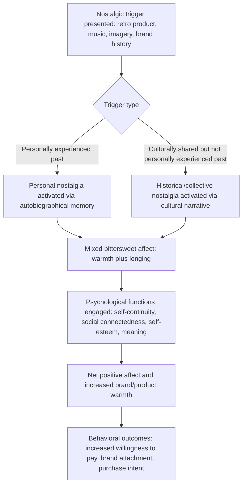

## Nostalgia and Sentimentality in Marketing

### Definitions and Theoretical Foundation

Nostalgia is a complex, predominantly positive but bittersweet emotional state involving a sentimental longing or affection for the past, typically associated with personally meaningful memories, formative life periods, or culturally shared past eras. Sentimentality more broadly refers to an emotional disposition toward tender, warm, or wistful feelings, of which nostalgia is a specific temporally-oriented form. Contemporary academic research on nostalgia's psychological structure and social functions has been substantially developed by psychologists Constantine Sedikides, Tim Wildschut, and colleagues, whose work since the early 2000s reestablished nostalgia as a legitimate, adaptive psychological construct after earlier characterizations (extending back to nostalgia's 17th-century origin as a diagnosed medical condition akin to homesickness) treated it as a negative or pathological state.

**Key Points**

- Nostalgia is classified in contemporary emotion research as a **self-conscious, mixed or "bittersweet" emotion** — it typically combines positive affect (warmth, fondness) with an undercurrent of loss or longing (the past period is gone), distinguishing it from simpler, purely positive discrete emotions like joy or contentment.
- Sedikides and Wildschut's research identifies four primary psychological functions served by nostalgic reflection: enhancing **self-continuity** (connecting one's past and present identity), strengthening **social connectedness** (nostalgic memories are typically social/relational in content), boosting **self-esteem**, and providing **existential meaning** (a sense that one's life has had significance and coherence).
- Two broad types are distinguished in the marketing literature: **personal nostalgia** (rooted in an individual's own autobiographical memories) and **historical/collective nostalgia** (a longing for a past era one may not have personally experienced, often mediated through cultural artifacts, media, and shared societal narratives).

### Nostalgia's Distinct Emotional Profile

Unlike simple positive-valence appeals, nostalgia's bittersweet structure has specific implications for how it should be measured and applied:

- Nostalgic experiences frequently involve simultaneous activation of both positive affect (warmth, fondness, happiness about the remembered period) and mild negative affect (sadness or longing that the period has passed), making nostalgia poorly captured by a simple single-dimension positive/negative valence scale (connecting to the discrete-versus-dimensional emotion models discussed previously).
- Despite this mixed structure, empirical research consistently finds the net effect of nostalgic reflection to be psychologically beneficial — increasing positive affect, self-esteem, and social connectedness on balance — rather than being experienced as a predominantly negative or depressive state. [Inference — the "net positive despite mixed valence" finding is well-replicated across numerous studies by Sedikides, Wildschut, and colleagues, though individual variation in how nostalgia is subjectively experienced exists]

### Documented Psychological and Behavioral Effects of Nostalgia

Experimental research (typically using standardized nostalgia induction procedures, such as recalling and writing about a nostalgic memory versus a neutral or ordinary event) has found nostalgic states are associated with:

- **Increased prosocial behavior and generosity**: Nostalgic states have been linked to greater willingness to help others and increased charitable intentions in several studies. [Inference — this prosocial effect is documented in multiple studies within the Sedikides/Wildschut research program, though effect sizes and generalizability across all prosocial behavior types vary]
- **Increased willingness to pay and reduced price sensitivity**: Nostalgia induction has been associated with increased willingness to pay for products, particularly when the product itself is nostalgically relevant (connects to the remembered period or brand).
- **Increased social connectedness and reduced loneliness**: Because nostalgic memories are predominantly social in content (involving family, friends, formative relationships), nostalgic reflection has been found to buffer feelings of loneliness and increase perceived social support.
- **Increased optimism about the future**: Somewhat counterintuitively for a past-oriented emotion, nostalgic reflection has been associated with increased optimism and motivation regarding future goals, theorized to operate through the self-continuity and meaning-enhancing functions of nostalgic reflection.

### Applications in Marketing and Consumer Psychology

#### Retro and Heritage Branding

- **Product revivals and retro packaging**: Brands frequently reintroduce discontinued products, retro packaging designs, or "throwback" product lines specifically to activate personal nostalgia among consumers who associate the original product or era with formative life periods (e.g., childhood, adolescence, young adulthood) — a strategy widely used in food and beverage, toy, and entertainment industries.
- **Heritage brand storytelling**: Long-established brands frequently emphasize brand history, founding stories, and historical continuity in marketing communications to leverage both personal nostalgia (for consumers with direct brand history) and collective/historical nostalgia (for the broader cultural era the brand represents).

#### Generational Marketing and the "Nostalgia Window"

- Marketing research on generational nostalgia has identified that nostalgic appeal tends to be strongest for cultural touchstones from a person's adolescence and young adulthood (roughly ages 10-25), a period associated with particularly strong autobiographical memory formation (sometimes called the "reminiscence bump" in memory research) — informing generationally-targeted nostalgic marketing (e.g., specific decade-themed campaigns targeting cohorts who came of age during that decade). [Inference — the reminiscence bump's application to marketing-relevant nostalgia targeting is a reasonable extension of established memory research, though precise age-window boundaries for optimal nostalgic marketing impact vary by product category and specific cultural touchstone]
- Media, entertainment, and gaming industries have extensively capitalized on this pattern through remakes, reboots, and re-releases of properties originally popular with a now-adult target demographic, directly leveraging the reminiscence-bump-timed nostalgia of that cohort.

#### Holiday and Seasonal Advertising

- Holiday advertising (particularly for winter holidays in many Western markets) has long relied heavily on nostalgic and sentimental themes (family gatherings, childhood traditions, warmth, generosity), representing one of the most consistent and long-standing applications of nostalgic and sentimental appeal in mainstream advertising.

#### Anniversary and Milestone Marketing

- Brand anniversary campaigns (e.g., "50 years of [brand]") explicitly invoke collective/historical nostalgia and brand heritage, reinforcing brand credibility and emotional attachment through a narrative of continuity and endurance.

#### Nostalgia in Music, Sound, and Sensory Branding

- Advertising music selection frequently draws on songs from a target demographic's nostalgic reminiscence-bump period, leveraging the well-documented strong associative power of music-evoked autobiographical memory to enhance emotional engagement with advertising content.
- Scent and sensory marketing similarly leverage nostalgia, since olfactory memory is particularly strongly linked to vivid autobiographical recall (a well-established finding in memory research sometimes termed the "Proust phenomenon").

**Example**

A breakfast cereal brand relaunches a discontinued product from the 1990s with its original packaging design, marketed to now-adult consumers who were children during that decade. The campaign is expected to activate personal nostalgia tied to childhood memories, increasing willingness to pay a premium for the revived product relative to a functionally similar but non-nostalgic new product launch, consistent with nostalgia-marketing research on willingness-to-pay effects. [Inference — illustrative application of documented nostalgia-marketing principles, not a specific reported case result]

### Process Flow: Nostalgia Activation and Marketing Outcome

### Distinguishing Nostalgia from Related Emotional Appeals

| Concept | Core Mechanism | Distinction |
| --- | --- | --- |
| Nostalgia | Bittersweet longing for a personally or culturally meaningful past | Specifically past-oriented, mixed-valence, self-conscious emotion |
| Sentimentality (general) | Tender, warm, wistful emotional disposition | Broader category; nostalgia is a specific temporally-anchored form |
| Warmth appeals | Evoking tenderness and positive social connection | Can be present-oriented (e.g., current family bonding imagery) without necessarily invoking the past |
| Discrete positive emotions (joy, contentment) | Purely positive-valence states | Lack the bittersweet, mixed-valence structure that defines nostalgia specifically |
| Affective forecasting / anticipated emotion | Prediction of future feelings | Forward-oriented; nostalgia is explicitly backward-oriented, though anticipated future nostalgia ("this will be a memory someday") is itself sometimes leveraged in experiential marketing |

### Measurement Approaches

- **Southampton Nostalgia Scale (SNS)**: A widely used standardized instrument in academic nostalgia research measuring individual differences in nostalgia proneness and state nostalgic feeling.
- **Nostalgia induction paradigms**: Experimental studies commonly use a written recall task (describing a nostalgic memory in detail) compared against a neutral/ordinary-event control condition to isolate causal effects of nostalgic state on subsequent judgments and behavior.
- **Applied marketing measurement**: Brand tracking studies and ad-testing research sometimes include specific nostalgia-related survey items (e.g., "this ad reminds me of my past," "this makes me feel nostalgic") alongside general emotional response and purchase intent measures to isolate nostalgia's specific contribution to campaign performance.

### Boundary Conditions and Critiques

- Nostalgic marketing appeals are inherently generationally and culturally specific — a nostalgic trigger effective for one age cohort or cultural group may have little or no emotional resonance (or even confusion) for a different cohort or cultural context, requiring careful audience segmentation for effective targeting. [Inference — this generational/cultural specificity is a logical and widely acknowledged constraint in applied nostalgia marketing, though precise audience boundaries require case-by-case research]
- Overreliance on nostalgic appeals in product innovation contexts carries a documented risk of appearing to prioritize past association over genuine product improvement, potentially signaling stagnation rather than innovation if not carefully balanced with contemporary relevance. [Unverified — this is a commonly discussed practitioner concern in brand strategy literature rather than a precisely quantified empirical finding]
- Some research distinguishes "personal" from "historical" nostalgia as having potentially different psychological profiles and marketing implications, but the field has not fully resolved how consistently these two forms produce equivalent behavioral effects across different product categories and consumer segments. [Unverified — the personal-versus-historical nostalgia distinction is theoretically established, but comparative effect-size research between the two types remains limited]

### Ethical Considerations in Marketing Use

- Nostalgic marketing that authentically connects a brand's genuine history or a product's genuine past relevance to consumers is broadly viewed as a legitimate emotional branding strategy.
- Ethical considerations can arise when nostalgic appeals are used to obscure genuine product quality issues (e.g., relying on nostalgic goodwill to mask a decline in actual product quality or value relative to the original nostalgically-remembered version) or when historical/collective nostalgia is invoked selectively in ways that sanitize or misrepresent genuinely complex or contested historical periods for commercial purposes.

**Related Topics**

- Discrete versus dimensional models of emotion
- Emotional appeals and advertising effectiveness
- Affective forecasting and anticipated emotion
- Brand attachment and emotional branding
- Reminiscence bump and autobiographical memory
- Heritage branding and brand storytelling
- Sensory marketing and multisensory branding