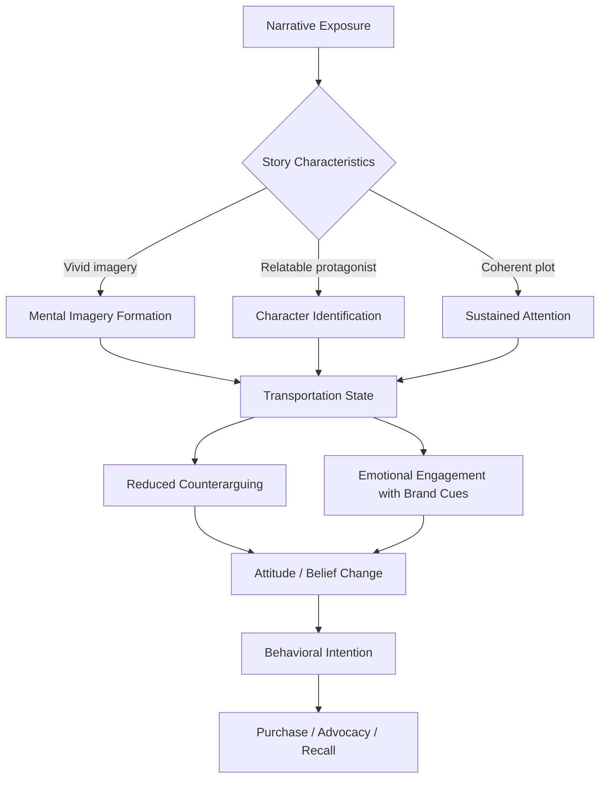

## Narrative Transportation and Storytelling

### Definition and Theoretical Foundation

Narrative transportation refers to the psychological state in which a consumer becomes so absorbed in a story that they mentally "travel into" the narrative world, temporarily losing awareness of their actual surroundings. The construct was formalized by Green and Brock (2000) in their Transportation-Imagery Model, which proposed that transportation is a distinct mental process involving attention, imagery, and emotional engagement operating together.

The core theoretical claim is that transportation reduces counterarguing. When a person is deeply absorbed in a story, they have fewer cognitive resources available to generate skeptical or critical responses to persuasive content embedded within it. This differs from traditional persuasion models (such as the Elaboration Likelihood Model), which emphasize deliberate evaluation of argument quality. Transportation theory instead suggests that narratives persuade through immersion rather than through explicit argumentation.

### Components of Transportation

Transportation is typically modeled as a multidimensional experience:

- **Cognitive attention**: Mental resources are focused on the story world, with reduced awareness of the physical environment
- **Affective engagement**: Emotional responses to characters and events (empathy, tension, relief)
- **Mental imagery**: Vivid visualization of scenes, characters, and settings described in the narrative
- **Loss of self-awareness**: Reduced monitoring of one's own identity and surroundings while "inside" the story

These components are usually measured jointly using Green and Brock's Transportation Scale, a self-report instrument with items such as "I could picture myself in the scene of the events described in the narrative" and "I was mentally involved in the narrative while reading it."

### Mechanism: Why Transportation Persuades

**Key Points**

- Transportation reduces counterarguing by occupying cognitive capacity that would otherwise be used to scrutinize claims
- Transportation increases connection to characters (identification), which transfers positive affect toward associated brands or products
- Transported individuals report beliefs and attitudes more consistent with the story's implied conclusions, even when they know the story is fictional
- Effects tend to persist over time and can be resistant to counter-persuasion, a pattern sometimes called the "sleeper effect" in narrative contexts [Inference: the durability of narrative-driven attitude change relative to non-transported conditions varies across studies and is not uniformly observed]

The mechanism can be summarized as a mediation chain: narrative structure and vividness → transportation → reduced counterarguing and increased character identification → attitude and belief change → behavioral intention (e.g., purchase intent, brand preference).

### Narrative Transportation vs. Traditional Persuasion Routes

| Dimension | Narrative Transportation | Central Route (ELM) | Peripheral Route (ELM) |
| --- | --- | --- | --- |
| Processing mode | Immersive, holistic | Deliberate, analytical | Heuristic, cue-based |
| Resistance mechanism bypassed | Counterarguing | N/A (counterarguing is expected) | Source credibility cues |
| Persuasion durability | Often high and resistant to counter-messages | High if argument is strong | Low, easily reversed |
| Ideal content type | Stories, testimonials, character-driven ads | Feature comparisons, technical specs | Endorsements, attractiveness cues |

### Storytelling Structures Used in Marketing

**Key Points**

- **Three-act structure**: Setup (introduce protagonist/problem), confrontation (rising tension, brand as aid), resolution (problem solved, brand associated with positive outcome)
- **Hero's journey**: The customer (not the brand) is framed as the hero; the brand serves as the "mentor" or "magical aid" that enables transformation — this is the basis of Donald Miller's StoryBrand framework
- **Problem-agitate-solve (PAS)**: A copywriting-native structure that compresses narrative arc into short-form ad copy
- **Slice-of-life**: Low-narrative-arc, high-realism scenes designed to maximize relatability and identification rather than dramatic tension
- **Testimonial narrative**: First-person account structured as a personal story, which leverages transportation and source credibility simultaneously

### The Role of Identification and Parasocial Connection

Identification with a character is a distinct but related construct to transportation. It occurs when the audience adopts the perspective of a character, temporarily merging their own identity with the character's goals and emotions. High identification amplifies transportation effects because:

- Consumers process brand-relevant events as though they were happening to them
- Resistance to the character's implied choices (e.g., the character choosing a brand) is lowered
- Emotional payoff (relief, satisfaction) experienced by the character is vicariously experienced by the consumer, and this affect can transfer to the brand via evaluative conditioning

Parasocial relationships (one-sided emotional bonds with media figures, including brand mascots, influencers, or recurring campaign characters) function similarly and are especially relevant to influencer marketing and long-running brand mascot campaigns (e.g., Flo from Progressive, the Michelin Man).

### Empirical Findings

- Green and Brock (2000) demonstrated that more transported readers showed story-consistent beliefs regardless of whether they were told the story was fact or fiction, suggesting transportation operates independently of perceived factuality
- Escalas (2004) extended transportation theory to advertising, showing that self-referencing prompts ("imagine this happening to you") increase transportation and subsequently improve brand attitudes
- Van Laer et al. (2014) conducted a meta-analysis identifying four antecedents of transportation in a persuasion context: the narrative's relevance to the reader, the reader's imagination ability, verisimilitude (perceived realism of the story world), and narrator identification [Inference: the relative weight of each antecedent varies by product category and content medium]

### Practical Applications in Marketing

**Example**

A financial services company launching a retirement product could:

1. Open with a relatable protagonist facing a specific, concrete fear (not having enough saved by a target age)
2. Build tension through a realistic obstacle (a market downturn, an unexpected expense)
3. Introduce the brand's product not as the hero, but as the tool that helps the protagonist regain control
4. Resolve with a vivid, sensory-specific image of the desired future state (a specific scene, not an abstract "peace of mind" claim)
5. End with a call to action framed as the next step in the viewer's own story ("Start your plan")

This structure applies the hero's journey pattern, maximizes self-referencing (positioning the viewer as protagonist), and uses concrete imagery to increase transportation.

### Measuring Transportation in Practice

Common operationalizations include:

- **Post-exposure surveys** using the Transportation Scale (typically 6–11 items on Likert scales covering attention, imagery, and emotional engagement)
- **Physiological proxies**: reduced blink rate, skin conductance changes during emotionally charged story beats, and eye-tracking fixation patterns consistent with sustained attention [Unverified: physiological transportation proxies are less standardized across studies than self-report scales and results can be sensitive to measurement protocol]
- **Behavioral proxies**: video completion rate, time spent on branded content, self-reported "losing track of time"
- **Recall and recognition tests**: transported audiences often show better recall of narrative details but sometimes worse recall of explicit brand mentions, a tension sometimes called the "vampire effect" when creative elements overshadow brand recall [Inference: whether this trade-off occurs depends heavily on how tightly the brand is integrated into the plot versus appended to it]

### Boundary Conditions and Limitations

**Key Points**

- Transportation effects are attenuated when the narrative is perceived as an obvious sales pitch, since this triggers persuasion knowledge (Friestad and Wright's Persuasion Knowledge Model) and reactivates critical evaluation
- Overly explicit brand integration (heavy-handed product placement) can reduce transportation by breaking narrative immersion
- Cultural and individual differences in "need for imagination" or trait transportability affect how strongly a given individual responds to the same narrative
- Short-form and interruption-heavy formats (e.g., skippable pre-roll ads) constrain the narrative arc length needed to build meaningful transportation, favoring compressed structures like PAS

### Narrative Transportation Process Flow

### Conceptual Diagram: Transportation-Persuasion Pathway (svg_diagram)

<svg xmlns="http://www.w3.org/2000/svg" viewBox="0 0 820 340">
<text x="410" y="28" text-anchor="middle" font-size="18" font-weight="bold" fill="#1a1a1a">Transportation-Persuasion Pathway (svg_diagram)</text>
<rect x="20" y="70" width="150" height="60" rx="8" fill="#e3f2fd" stroke="#1565c0" stroke-width="1.5" />
<text x="95" y="95" text-anchor="middle" font-size="12" fill="#0d47a1">Narrative</text>
<text x="95" y="112" text-anchor="middle" font-size="12" fill="#0d47a1">Content</text>
<rect x="220" y="70" width="150" height="60" rx="8" fill="#fff3e0" stroke="#ef6c00" stroke-width="1.5" />
<text x="295" y="95" text-anchor="middle" font-size="12" fill="#e65100">Transportation</text>
<text x="295" y="112" text-anchor="middle" font-size="12" fill="#e65100">(Attention+Imagery+Affect)</text>
<rect x="420" y="20" width="170" height="55" rx="8" fill="#f3e5f5" stroke="#6a1b9a" stroke-width="1.5" />
<text x="505" y="45" text-anchor="middle" font-size="12" fill="#4a148c">Reduced</text>
<text x="505" y="62" text-anchor="middle" font-size="12" fill="#4a148c">Counterarguing</text>
<rect x="420" y="125" width="170" height="55" rx="8" fill="#f3e5f5" stroke="#6a1b9a" stroke-width="1.5" />
<text x="505" y="150" text-anchor="middle" font-size="12" fill="#4a148c">Character</text>
<text x="505" y="167" text-anchor="middle" font-size="12" fill="#4a148c">Identification</text>
<rect x="630" y="70" width="160" height="60" rx="8" fill="#e8f5e9" stroke="#2e7d32" stroke-width="1.5" />
<text x="710" y="95" text-anchor="middle" font-size="12" fill="#1b5e20">Attitude / Brand</text>
<text x="710" y="112" text-anchor="middle" font-size="12" fill="#1b5e20">Belief Shift</text>
<rect x="420" y="230" width="170" height="60" rx="8" fill="#ffebee" stroke="#c62828" stroke-width="1.5" />
<text x="505" y="255" text-anchor="middle" font-size="12" fill="#b71c1c">Persuasion Knowledge</text>
<text x="505" y="272" text-anchor="middle" font-size="12" fill="#b71c1c">(if triggered, blocks path)</text>
<line x1="170" y1="100" x2="220" y2="100" stroke="#555" stroke-width="1.5" marker-end="url(#arrow)" />
<line x1="370" y1="90" x2="420" y2="55" stroke="#555" stroke-width="1.5" marker-end="url(#arrow)" />
<line x1="370" y1="110" x2="420" y2="150" stroke="#555" stroke-width="1.5" marker-end="url(#arrow)" />
<line x1="590" y1="55" x2="630" y2="90" stroke="#555" stroke-width="1.5" marker-end="url(#arrow)" />
<line x1="590" y1="150" x2="630" y2="105" stroke="#555" stroke-width="1.5" marker-end="url(#arrow)" />
<line x1="505" y1="180" x2="505" y2="230" stroke="#c62828" stroke-width="1.5" stroke-dasharray="4,3" marker-end="url(#arrowred)" />
</svg>

### Next Steps

- **Related Topics**:
  - Persuasion Knowledge Model and consumer skepticism
  - Emotional branding and affect transfer
  - Parasocial relationships and influencer marketing
  - Evaluative conditioning in advertising
  - Self-referencing and mental simulation in consumer judgment
  - The vampire effect and brand recall in creative advertising
  - Mood congruency and affect-as-information theory