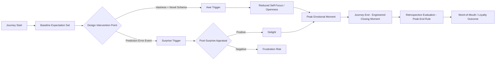

## Awe, Surprise, and Delight in Experience Design

### Overview and Distinction Between the Three Emotions

Awe, surprise, and delight are frequently conflated in applied marketing contexts but are distinct emotional states with different antecedents, physiological signatures, and behavioral consequences. Understanding their separation is essential for experience design because each emotion calls for different design levers.

- **Awe**: A self-transcendent emotion triggered by perceived vastness that requires cognitive accommodation — the sense that an existing mental framework is insufficient to process what is being experienced
- **Surprise**: A short-duration, high-arousal emotion triggered by an outcome that violates an expectation, independent of valence (surprise can be pleasant or unpleasant)
- **Delight**: A positive emotional response typically defined as the combination of unexpected positive surprise plus joy, often operationalized in service marketing as "positive disconfirmation of expectations"

### The Psychology of Awe

**Key Points**

- Keltner and Haidt's (2003) foundational model identifies two necessary conditions for awe: **perceived vastness** (something physically, conceptually, or socially larger than the self) and **need for accommodation** (the experience doesn't fit existing mental schemas)
- Awe is associated with a reduced sense of self-importance, sometimes called the "small self" effect, which has been linked to increased prosocial behavior and generosity in experimental settings
- Awe has been shown to alter time perception, with awe-inducing experiences causing people to feel they have more available time, which in turn can increase patience and reduce impulsivity in subsequent decisions [Inference: the magnitude of this time-expansion effect varies across studies and stimulus types]
- Awe reduces reliance on existing schemas, which can make consumers more receptive to novel product categories or brand narratives immediately following an awe-inducing experience

Awe is commonly leveraged in marketing through: vast visual scale (aerial drone footage, towering architecture), technological spectacle (product reveal events), narrative scope (brand purpose campaigns tied to large-scale causes), and sensory immersion (large-format retail installations, flagship store architecture).

### The Psychology of Surprise

Surprise operates on a **prediction-error mechanism**: it arises when an observed outcome diverges from an expected outcome, and its intensity scales with the magnitude of that divergence. Because surprise is valence-neutral at the moment of onset, its downstream effect depends entirely on what happens immediately after the surprising event — a phenomenon sometimes described through appraisal theory, where the interpretation of the surprising stimulus determines whether it becomes pleasant surprise (delight) or unpleasant surprise (frustration, anger).

**Key Points**

- Surprise has a very short physiological duration (often under a second at peak intensity) but can extend subjective emotional experience through subsequent appraisal and rumination
- In consumer contexts, surprise amplifies whatever emotion follows it — a mechanism known as **affect intensification** — meaning a surprising positive event feels more positive than the same event delivered without surprise
- Surprise increases attention allocation and memory encoding strength, which is why surprising marketing moments (unexpected packaging, unadvertised bonuses) are disproportionately well-recalled relative to their objective magnitude

### The Psychology of Delight

Delight is most rigorously modeled in the services marketing literature as a function of **expectation disconfirmation theory** (Oliver, 1980), extended to its positive extreme.

$$\text{Delight} = f(\text{Positive Surprise} \times \text{Arousal} \times \text{Joy})$$

Rust and Oliver (2000) argued that delight is qualitatively different from mere satisfaction: satisfaction is the fulfillment of expectations, while delight requires a positive surprise component that satisfaction alone does not produce. This distinction matters operationally because satisfaction-focused metrics (e.g., CSAT) can plateau even while opportunities for delight-driven loyalty remain untapped.

**Key Points**

- Delight has diminishing returns and habituation effects: a delight tactic repeated too often (e.g., a recurring "surprise" upgrade) is eventually expected, converting it into a baseline expectation and eliminating the surprise component required for delight
- Delight tends to be most durable and most talked-about (word-of-mouth generative) when it is unprompted, personalized, and low-cost-to-attribute-as-genuine — i.e., when the consumer cannot easily interpret the gesture as a calculated retention tactic
- Over-delivery that is entirely predictable (e.g., a loyalty program tier consumers know they will receive) produces satisfaction, not delight, because the surprise element is absent

### Comparative Framework

| Dimension | Awe | Surprise | Delight |
| --- | --- | --- | --- |
| Core trigger | Perceived vastness + schema mismatch | Expectation violation (any valence) | Positive expectation violation + joy |
| Duration | Can be sustained (seconds to minutes) | Very brief (sub-second peak) | Moderate, appraisal-dependent |
| Valence | Typically positive, can be mixed (awe can include fear) | Neutral until appraised | Positive by definition |
| Self-focus effect | Reduces self-salience ("small self") | Increases immediate attention | Increases positive brand association |
| Design lever | Scale, spectacle, narrative scope | Timing, pattern interruption, novelty | Personalization, unprompted generosity, timing |
| Habituation risk | Low (vastness is hard to normalize quickly) | Moderate (predictable "surprises" lose effect) | High (repeated gestures become expected) |

### Design Frameworks for Applying These Emotions

**Peak-End Rule Application**

Kahneman's peak-end rule states that people judge an experience largely based on how they felt at its most intense moment (the peak) and at its conclusion (the end), rather than the average of the entire experience. This has direct implications for sequencing awe, surprise, and delight within a customer journey:

- Place the highest-intensity emotional peak (often an awe or surprise moment) at a point in the journey with maximum attentional bandwidth, not necessarily at the very start
- Engineer the closing moments of an experience deliberately, since the ending disproportionately determines retrospective evaluation — a "surprise and delight" gesture positioned at the end of a service interaction has outsized influence on overall satisfaction recall

**The Delight Ladder (applied framework for service design)**

1. **Reliability** (table stakes): the service must first meet baseline functional expectations — delight cannot compensate for a broken core promise
2. **Ease**: friction reduction beyond expectation
3. **Personalization**: recognition of individual context or history
4. **Unprompted generosity**: a gesture the consumer did not request and could not have predicted
5. **Narrative resonance**: the gesture connects to something meaningful in the consumer's own story, maximizing shareability

### Practical Examples

**Example**

- **Awe**: A flagship retail store designed with a multi-story architectural atrium and large-scale kinetic art installation triggers vastness-based awe upon entry, priming customers for premium brand perception before any product interaction occurs
- **Surprise**: An e-commerce unboxing experience includes a hidden compartment with a handwritten note, which is not advertised anywhere in the purchase funnel, maximizing the prediction-error component
- **Delight**: A hotel upgrades a guest's room without prompting, timed to coincide with a life event mentioned in a prior interaction (e.g., an anniversary noted in a reservation comment), combining personalization, unprompted generosity, and positive surprise

### Measurement Approaches

- **Self-report scales**: adapted versions of the Positive and Negative Affect Schedule (PANAS) supplemented with awe-specific items (e.g., "I felt my sense of self was small") from the Dispositional Positive Emotions Scale
- **Behavioral proxies**: dwell time at experiential touchpoints, unprompted social sharing rate, spontaneous verbal or written mentions in reviews (particularly language indicating unexpectedness, such as "I didn't expect...")
- **Physiological measures**: skin conductance response (arousal spikes for surprise), and in some research, chills/goosebumps reporting (frisson) as a proxy for awe intensity [Unverified: frisson as an awe proxy is used inconsistently across studies and is not a universally validated measure]
- **NPS and word-of-mouth correlation**: delight-driven experiences show stronger correlation with unprompted advocacy behaviors than satisfaction-driven experiences, though causal attribution requires controlling for baseline service quality [Inference: this correlation strength is context-dependent and varies by industry and touchpoint type]

### Boundary Conditions and Risks

**Key Points**

- Awe that induces fear or excessive schema disruption (sometimes called "threat-based awe") can produce avoidance rather than approach behavior; the vastness must be framed as non-threatening to the consumer's identity or safety
- Surprise mechanics that consumers perceive as manipulative (e.g., dark-pattern "surprise" fees) generate negative affect intensification rather than delight, since the appraisal process interprets the surprise as adversarial
- Cultural variation exists in comfort with vastness-based awe and overt generosity gestures; what registers as delightful personalization in one market may register as surveillance-adjacent or intrusive in another [Inference: cross-cultural calibration is necessary and effect sizes for these emotions are not assumed to generalize uniformly across all consumer populations]
- Delight strategies have a cost-scaling problem: gestures that work at small scale (handwritten notes) often cannot be delivered consistently at enterprise scale without losing the authenticity that made them effective

### Experience Design Emotional Sequencing

### Emotional Trigger Comparison (svg_diagram)

<svg xmlns="http://www.w3.org/2000/svg" viewBox="0 0 820 300">
<text x="410" y="26" text-anchor="middle" font-size="18" font-weight="bold" fill="#1a1a1a">Emotional Trigger Comparison (svg_diagram)</text>
<line x1="60" y1="250" x2="770" y2="250" stroke="#333" stroke-width="1.5" />
<line x1="60" y1="250" x2="60" y2="60" stroke="#333" stroke-width="1.5" />
<text x="30" y="60" font-size="11" fill="#333">High</text>
<text x="30" y="255" font-size="11" fill="#333">Low</text>
<text x="15" y="150" font-size="11" fill="#333" transform="rotate(-90 15 150)">Arousal</text>
<text x="400" y="275" text-anchor="middle" font-size="11" fill="#333">Duration →</text>
<circle cx="150" cy="90" r="45" fill="#bbdefb" stroke="#1565c0" stroke-width="1.5" opacity="0.85" />
<text x="150" y="94" text-anchor="middle" font-size="13" fill="#0d47a1" font-weight="bold">Surprise</text>
<text x="150" y="150" text-anchor="middle" font-size="10" fill="#333">Sub-second peak</text>
<circle cx="420" cy="140" r="60" fill="#ffe0b2" stroke="#ef6c00" stroke-width="1.5" opacity="0.85" />
<text x="420" y="144" text-anchor="middle" font-size="13" fill="#e65100" font-weight="bold">Delight</text>
<text x="420" y="215" text-anchor="middle" font-size="10" fill="#333">Seconds to minutes</text>
<circle cx="650" cy="170" r="75" fill="#c8e6c9" stroke="#2e7d32" stroke-width="1.5" opacity="0.85" />
<text x="650" y="174" text-anchor="middle" font-size="13" fill="#1b5e20" font-weight="bold">Awe</text>
<text x="650" y="255" text-anchor="middle" font-size="10" fill="#333">Sustained, can extend post-experience</text>
</svg>

### Next Steps

- **Related Topics**:
  - Peak-end rule and journey mapping in service design
  - Expectation disconfirmation theory and customer satisfaction models
  - Self-transcendent emotions and prosocial consumer behavior
  - Sensory marketing and multisensory retail environments
  - Word-of-mouth and emotional virality mechanisms
  - Habituation and hedonic adaptation in loyalty program design
  - Cross-cultural variation in emotional response to marketing stimuli