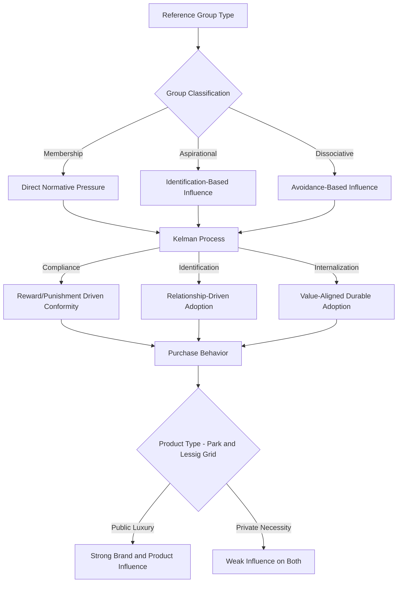

## Reference Groups and Normative Influence

### Definition and Theoretical Foundation

A reference group is any group, real or imagined, that an individual uses as a standard for evaluating their own attitudes, beliefs, and behaviors. The concept originates in sociology (Hyman, 1942) and was formalized for consumer behavior research through the work of Bourne (1957) and later Park and Lessig (1977), who established the taxonomy of reference group influence types still used in marketing research today.

Reference groups exert influence through three primary mechanisms, following Deutsch and Gerard's (1955) foundational distinction, later extended by Kelman's (1958) process-of-influence framework:

- **Normative influence**: Conformity driven by the desire to meet the expectations of others and gain social approval or avoid social rejection, independent of whether the individual privately believes the group's position is correct
- **Informational influence**: Acceptance of information from others as evidence about objective reality, particularly under conditions of ambiguity or uncertainty
- **Value-expressive (identification) influence**: Adoption of a group's attitudes or behaviors because they help the individual express or maintain a desired self-concept and connection to the group's identity

### Kelman's Three Processes of Social Influence

| Process | Mechanism | Consumer Behavior Manifestation | Durability |
| --- | --- | --- | --- |
| Compliance | Conformity for reward or to avoid punishment/rejection | Buying a product to fit in with a visible reference group | Low; reverses if surveillance/incentive removed |
| Identification | Adoption of behavior to establish or maintain a relationship with a valued group or person | Purchasing products associated with an aspirational group (e.g., a brand tied to a subculture) | Moderate; persists as long as the relationship/identity connection remains salient |
| Internalization | Acceptance of the group's values because they align with the individual's own value system | Committing to sustainable products because it aligns with an internalized environmental identity | High; persists independent of the group's continued presence or surveillance |

### Taxonomy of Reference Groups

**Key Points**

- **Membership groups**: Groups the individual formally belongs to (professional associations, family units, clubs)
- **Aspirational groups**: Groups the individual is not a member of but wishes to join or be associated with; particularly powerful for influencing symbolic and status-signaling purchases
- **Dissociative groups**: Groups the individual actively wishes to avoid being associated with; influence operates through avoidance rather than adoption of behaviors and products linked to that group
- **Primary groups**: Small, informal groups with frequent face-to-face interaction (family, close friends) — typically exert the strongest normative pressure due to relationship closeness and interaction frequency
- **Secondary groups**: Larger, more formal, less frequent-contact groups (professional organizations, alumni networks) — exert influence primarily through informational and identification pathways rather than direct normative pressure

### Park and Lessig's Product/Brand Susceptibility Framework

Park and Lessig (1977) demonstrated that reference group influence on purchase decisions is not uniform across product categories, but varies based on two dimensions:

1. **Conspicuousness of consumption**: whether the product/brand is visible to others during use (publicly consumed vs. privately consumed)
2. **Necessity vs. luxury**: whether the product is a necessity (which most people own regardless of social influence) or a luxury (where ownership itself signals group membership or aspiration)

This produces a well-known 2x2 categorization of reference group susceptibility:

|  | Necessity | Luxury |
| --- | --- | --- |
| **Publicly consumed** | Weak brand influence, weak product influence (e.g., a wristwatch as a basic timepiece) | Strong brand AND product influence (e.g., a luxury car, designer clothing) |
| **Privately consumed** | Weak influence on both brand and product (e.g., a mattress) | Strong brand influence only, weak product influence (e.g., a home entertainment system) |

### Normative Influence and Conformity Mechanisms

**Key Points**

- Asch's (1951) classical conformity experiments established that individuals will conform to an obviously incorrect group judgment under normative pressure, even in the absence of any explicit reward, demonstrating the power of normative influence independent of informational value
- Normative influence intensifies under conditions of group unanimity, group size (up to a point, typically plateauing around 3-5 members), and public (vs. private/anonymous) response conditions
- Consumers are more susceptible to normative influence for products that are socially visible and for decisions made in the physical or virtual presence of the reference group (e.g., group shopping trips, social media purchase disclosures)
- The **descriptive norm** (what most people actually do) and the **injunctive norm** (what is socially approved or disapproved of) are distinct levers; marketing messaging that conflates them (e.g., stating a behavior is common when it is not actually socially endorsed) can backfire — this is documented extensively in Cialdini's work on the "boomerang effect" of poorly designed normative messaging

### Social Proof as an Applied Mechanism

Social proof, as articulated by Cialdini (1984), is the applied marketing manifestation of informational and normative reference group influence: individuals look to the behavior of similar others as a heuristic for correct action, particularly under uncertainty. Common implementations include:

- Customer review counts and star ratings ("10,000+ five-star reviews")
- Real-time purchase notifications ("14 people are viewing this item")
- Bestseller and "most popular" labeling
- User-generated content aggregation displaying volume of adoption

**Similarity to the reference group matters**: social proof is most persuasive when the "similar others" are perceived as belonging to the observer's own relevant reference group (e.g., "customers in your area" outperforms generic "customers" framing for many product categories) [Inference: the magnitude of this similarity effect is category- and context-dependent and not universally documented at a fixed effect size].

### Reference Group Influence in Digital and Social Media Contexts

The rise of social media has expanded reference group influence beyond physical proximity groups:

- **Parasocial and micro-influencer effects**: influencers function as a hybrid reference group, combining aspirational-group characteristics with perceived intimacy typical of primary groups, despite lacking reciprocal relationships
- **Visible social metrics** (follower counts, like counts, share counts) function as quantified normative and informational cues, allowing normative influence to scale beyond groups with which the individual has direct contact
- **Algorithmic curation** effectively constructs synthetic reference groups by showing users content from people algorithmically determined to be similar to them, amplifying perceived descriptive norms within narrow subgroups (a mechanism related to filter bubble effects)

### Practical Applications in Marketing

**Example**

A fitness apparel brand targeting new gym-goers could apply reference group theory as follows:

- Use **aspirational group** imagery (athletes, established fitness community members) in brand campaigns to drive identification-based influence for symbolic purchases (apparel visible during workouts)
- Deploy **descriptive social proof** ("Join 500,000 members who tracked a workout this week") to reduce uncertainty for first-time users
- Avoid using **dissociative group** framing that could alienate the target segment (e.g., imagery associated with a group the target audience wishes to distance from, such as overly elite competitive athletes for a beginner-focused product line)
- Design onboarding to leverage **primary group** normative pressure by encouraging users to invite friends, since face-to-face/close-tie reference groups exert the strongest and most durable normative influence

### Measurement Approaches

- **Perceived Reference Group Influence Scale**: adapted survey instruments measuring perceived normative pressure, informational reliance, and value-expressive motivation separately, following the original Bearden, Netemeyer, and Teel (1989) Consumer Susceptibility to Interpersonal Influence (CSII) scale
- **Behavioral experiments**: manipulating visibility of consumption (public vs. private conditions) to isolate normative influence effects on brand choice
- **Social network analysis**: mapping actual influence pathways through purchase co-occurrence or referral data to identify which nodes function as de facto reference points within a customer base

### Boundary Conditions and Limitations

**Key Points**

- Reference group effects are moderated by the individual's **need for uniqueness**; consumers high in this trait may resist normative pressure precisely because a behavior is common, seeking dissociation from majority behavior for self-differentiation purposes
- Cultural dimensions matter substantially: collectivist cultures generally show stronger susceptibility to normative and informational reference group influence than individualist cultures, though this generalization has documented exceptions depending on product category and specific cultural context [Inference: cross-cultural effect sizes vary by study and cannot be treated as a fixed universal parameter]
- Reference group influence weakens as **product involvement and personal expertise increase**, since experienced/highly involved consumers rely more on internal evaluative criteria than external group cues
- Overreliance on visible social proof metrics can backfire if those metrics are perceived as inflated, purchased, or manipulated, triggering persuasion knowledge and skepticism rather than conformity

### Reference Group Influence Pathways

### Park-Lessig Susceptibility Grid (svg_diagram)

<svg xmlns="http://www.w3.org/2000/svg" viewBox="0 0 700 420">
<text x="350" y="28" text-anchor="middle" font-size="18" font-weight="bold" fill="#1a1a1a">Park-Lessig Susceptibility Grid (svg_diagram)</text>
<line x1="150" y1="70" x2="150" y2="370" stroke="#333" stroke-width="1.5" />
<line x1="150" y1="220" x2="620" y2="220" stroke="#333" stroke-width="1.5" />
<line x1="385" y1="70" x2="385" y2="370" stroke="#333" stroke-width="1" stroke-dasharray="4,3" />

<text x="267" y="60" text-anchor="middle" font-size="13" font-weight="bold" fill="#333">Necessity</text>

<text x="500" y="60" text-anchor="middle" font-size="13" font-weight="bold" fill="#333">Luxury</text>

<text x="100" y="145" text-anchor="middle" font-size="13" font-weight="bold" fill="#333" transform="rotate(-90 100 145)">Public</text>

<text x="100" y="295" text-anchor="middle" font-size="13" font-weight="bold" fill="#333" transform="rotate(-90 100 295)">Private</text>

<rect x="150" y="70" width="235" height="150" fill="#e3f2fd" stroke="#1565c0" />
<text x="267" y="150" text-anchor="middle" font-size="11" fill="#0d47a1">Weak Brand / Weak Product</text>
<text x="267" y="168" text-anchor="middle" font-size="10" fill="#0d47a1">e.g., basic wristwatch</text>
<rect x="385" y="70" width="235" height="150" fill="#c8e6c9" stroke="#2e7d32" />
<text x="500" y="150" text-anchor="middle" font-size="11" fill="#1b5e20">Strong Brand / Strong Product</text>
<text x="500" y="168" text-anchor="middle" font-size="10" fill="#1b5e20">e.g., luxury car</text>
<rect x="150" y="220" width="235" height="150" fill="#fff3e0" stroke="#ef6c00" />
<text x="267" y="300" text-anchor="middle" font-size="11" fill="#e65100">Weak Brand / Weak Product</text>
<text x="267" y="318" text-anchor="middle" font-size="10" fill="#e65100">e.g., mattress</text>
<rect x="385" y="220" width="235" height="150" fill="#f3e5f5" stroke="#6a1b9a" />
<text x="500" y="300" text-anchor="middle" font-size="11" fill="#4a148c">Strong Brand / Weak Product</text>
<text x="500" y="318" text-anchor="middle" font-size="10" fill="#4a148c">e.g., home theater system</text>
</svg>

### Next Steps

- **Related Topics**:
  - Social proof and conformity in digital commerce
  - Kelman's compliance, identification, and internalization framework in branding
  - Influencer marketing and parasocial reference groups
  - Cialdini's principles of persuasion in marketing design
  - Consumer susceptibility to interpersonal influence (CSII) measurement
  - Need for uniqueness and counter-conformity consumer segments
  - Cross-cultural variation in individualism/collectivism and consumer conformity