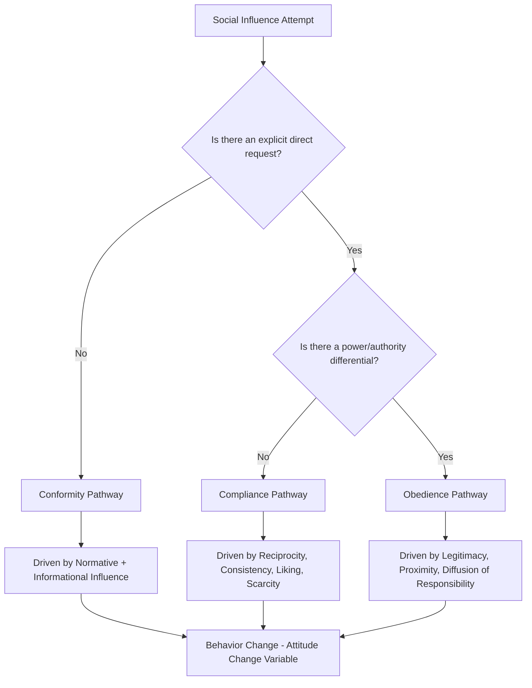

## Conformity, Compliance, and Obedience

### Definitions and Distinctions

Conformity, compliance, and obedience are three related but conceptually distinct forms of social influence, differentiated primarily by the presence and nature of an explicit request or authority relationship:

- **Conformity**: A change in behavior or belief as a result of real or imagined group pressure, in the absence of a direct request. The individual adjusts their behavior to align with perceived group norms or behavior
- **Compliance**: A change in behavior in response to a direct, explicit request from another person or entity, without any change in underlying private attitude and without a power/authority differential being the primary driver
- **Obedience**: A change in behavior in response to a direct command from a perceived authority figure, driven specifically by the power/status differential between the individual and the source of the command

The key distinguishing variable across the three is the **source and structure of the influence attempt**: conformity responds to a group's implicit norm, compliance responds to a peer or equal-status explicit request, and obedience responds to a hierarchically superior explicit command.

### Conformity: Theoretical Foundations

**Asch's Line Judgment Studies (1951, 1956)**

Solomon Asch's classic experiments demonstrated that individuals will conform to an obviously incorrect unanimous group judgment on an unambiguous perceptual task (judging line lengths) roughly one-third of the time across critical trials, with about three-quarters of participants conforming at least once. Key moderating findings from this line of research:

**Key Points**

- Conformity increases sharply with group size up to approximately three to five confederates, after which additional group members produce diminishing marginal increases in conformity
- The presence of even a single dissenter who breaks group unanimity dramatically reduces conformity rates, regardless of whether the dissenter's alternative answer is itself correct — this establishes that **unanimity**, not just group size, is the critical driver
- Conformity is higher when responses are given publicly rather than privately/anonymously, consistent with a strong normative influence component
- Task ambiguity increases conformity: as the correct answer becomes less objectively clear, informational influence compounds normative influence, increasing overall conformity rates

**Deutsch and Gerard's Dual-Process Model (1955)**

This framework, already introduced in the context of reference groups, provides the mechanistic explanation for Asch-type conformity: normative influence (wanting to be liked/accepted, avoiding standing out) and informational influence (using others as evidence about reality) operate simultaneously, with their relative weight shifting based on task ambiguity and stakes.

### Compliance: Theoretical Foundations and Techniques

Compliance research, most extensively developed by Cialdini, identifies specific behavioral techniques that increase the likelihood someone will agree to a direct request. These are foundational to sales and marketing tactics.

| Technique | Mechanism | Marketing Example |
| --- | --- | --- |
| **Foot-in-the-door** | Agreement to a small initial request increases likelihood of agreeing to a larger subsequent request, driven by self-perception and consistency motivation | Free trial sign-up followed by paid subscription upsell |
| **Door-in-the-face** | An initial large, likely-to-be-refused request is followed by a smaller "concession" request, which appears more reasonable by contrast and triggers reciprocity for the concession | Initial premium package pitch followed by a "just the basic plan" offer |
| **Low-ball technique** | An initial attractive offer is agreed to, then the terms are revealed to be less favorable after commitment, with compliance persisting due to commitment consistency | An advertised low price with fees/conditions revealed after purchase intent is established |
| **That's-not-all technique** | An initial offer is enhanced with an added bonus before the target can respond, increasing perceived value and reciprocity pressure | "But wait, there's more" infomercial structure |
| **Reciprocity-based compliance** | Providing something of value first (free sample, gift) creates an obligation to reciprocate, increasing compliance with a subsequent request | Free samples in retail environments preceding a purchase ask |

### Cialdini's Six (Later Seven) Principles of Persuasion

**Key Points**

- **Reciprocity**: obligation to return favors, gifts, or concessions
- **Commitment and consistency**: once a person commits to a position, verbally or in writing, they experience internal and interpersonal pressure to behave consistently with that commitment
- **Social proof**: reliance on others' behavior as a guide for one's own, especially under uncertainty (overlaps with informational influence in conformity theory)
- **Liking**: increased compliance with requests from people who are physically attractive, similar to the self, or who have paid compliments — commonly operationalized in marketing through relatable spokesperson selection
- **Authority**: increased compliance with requests from individuals perceived to hold legitimate expertise or status, even when that authority is merely symbolic (uniforms, titles, credentials)
- **Scarcity**: increased perceived value and compliance when a product or opportunity is framed as limited in availability or time
- **Unity** (added in later editions): compliance increases when the requester and target share an in-group identity, distinct from mere similarity (liking), based on shared identity categories such as family, community, or team

### Obedience: Theoretical Foundations

**Milgram's Obedience Experiments (1963, 1974)**

Stanley Milgram's studies demonstrated that a majority of ordinary participants would administer what they believed to be dangerous or lethal electric shocks to another person when instructed to do so by an authority figure in a lab coat, despite significant personal distress. While ethically controversial and not replicable in original form under current research ethics standards, the studies established foundational principles of obedience that remain influential:

**Key Points**

- Obedience decreases as **physical and psychological distance** from the victim increases, and increases as physical and psychological distance from the authority figure decreases
- Obedience decreases sharply when the authority figure is not physically present (e.g., giving instructions by phone rather than in person)
- The **legitimacy and perceived expertise of the authority** figure is a critical determinant; obedience drops substantially when the authority figure is perceived as lacking legitimate institutional backing
- Diffusion of responsibility plays a central role: individuals attribute moral responsibility for the outcome to the authority figure issuing the command rather than to themselves as the immediate agent, reducing the psychological cost of compliance
- The presence of peers who refuse to obey substantially reduces obedience rates, paralleling the dissenter effect found in Asch's conformity research

### Marketing Applications of Authority and Obedience Principles

Authority-based influence (a milder, everyday-commerce analog of obedience mechanisms) is extensively used in marketing without invoking the ethical concerns of Milgram-style command structures:

**Example**

- **Expert endorsement**: dermatologist-recommended skincare products leverage perceived authority/expertise to increase compliance with purchase suggestions
- **Institutional symbols**: certifications, awards, and professional titles displayed on packaging or websites function as authority heuristics, triggering compliance-like acceptance of claims without independent verification
- **Uniforms and professional framing**: service providers presented in professional attire or settings (a "lab-coat effect") are found to increase compliance with service recommendations, even when the recommendation's substantive quality is unchanged [Inference: the magnitude of the lab-coat effect varies depending on context and has produced mixed replication results in later studies]

### Comparative Summary Table

| Dimension | Conformity | Compliance | Obedience |
| --- | --- | --- | --- |
| Influence source | Implicit group norm | Explicit peer/equal request | Explicit authority command |
| Power differential required | No | No (or minimal) | Yes |
| Private attitude change | Sometimes (internalization) | Rarely (behavior only) | Rarely (behavior only) |
| Key moderator | Group unanimity, size, ambiguity | Technique sequencing (reciprocity, consistency) | Proximity to authority, legitimacy, diffusion of responsibility |
| Marketing analog | Social proof, bandwagon marketing | Sales scripting techniques (FITD, DITF) | Expert endorsement, authority cues, credentialing |

### Measurement and Research Approaches

- **Behavioral conformity paradigms**: modernized Asch-style designs using digital confederates or manipulated aggregate ratings to measure conformity to visible group opinion in online purchase contexts
- **Compliance rate tracking**: A/B testing of specific compliance techniques (e.g., measuring conversion lift from foot-in-the-door sequencing in onboarding flows) as a direct behavioral measure
- **Perceived authority/legitimacy scales**: survey instruments assessing perceived source credibility and expertise, used to predict compliance with recommendations from a given spokesperson or institution
- **Self-report vs. behavioral divergence**: researchers note that self-reported susceptibility to these influence tactics is typically lower than behaviorally observed susceptibility, since consumers underestimate their own responsiveness to social influence techniques [Inference: this self-report/behavior gap is a general pattern in social influence research and its precise magnitude varies by study design]

### Ethical Considerations in Applied Marketing

**Key Points**

- Compliance techniques such as low-balling and door-in-the-face carry meaningful ethical risk when they exploit commitment consistency to extract agreements consumers would not make with full initial information; regulatory bodies in several jurisdictions restrict specific applications (e.g., drip pricing regulation targeting low-ball-adjacent tactics)
- Authority-based marketing claims are subject to advertising regulation requiring substantiation of expertise or credential claims (e.g., FTC guidance in the United States on endorsements and testimonials)
- Overuse of scarcity and urgency tactics that are not genuinely accurate (false scarcity) risks triggering consumer skepticism and regulatory scrutiny once detected, undermining long-term trust even if short-term compliance increases

### Influence Type Decision Pathway

### Compliance Technique Sequencing (svg_diagram)

<svg xmlns="http://www.w3.org/2000/svg" viewBox="0 0 800 320">
<text x="400" y="26" text-anchor="middle" font-size="18" font-weight="bold" fill="#1a1a1a">Compliance Technique Sequencing (svg_diagram)</text>

<text x="140" y="60" text-anchor="middle" font-size="13" font-weight="bold" fill="`#0d47a1`">Foot-in-the-Door</text>

<rect x="40" y="80" width="120" height="50" rx="6" fill="`#e3f2fd`" stroke="`#1565c0`" />

<text x="100" y="110" text-anchor="middle" font-size="11" fill="`#0d47a1`">Small Request</text>

<line x1="160" y1="105" x2="210" y2="105" stroke="#333" stroke-width="1.5" marker-end="url(#a1)" />

<rect x="210" y="80" width="120" height="50" rx="6" fill="`#bbdefb`" stroke="`#1565c0`" />

<text x="270" y="110" text-anchor="middle" font-size="11" fill="`#0d47a1`">Larger Request</text>

<text x="590" y="60" text-anchor="middle" font-size="13" font-weight="bold" fill="`#e65100`">Door-in-the-Face</text>

<rect x="470" y="80" width="120" height="50" rx="6" fill="`#ffe0b2`" stroke="`#ef6c00`" />

<text x="530" y="102" text-anchor="middle" font-size="11" fill="`#e65100`">Large Request</text>

<text x="530" y="117" text-anchor="middle" font-size="10" fill="`#e65100`">(refused)</text>

<line x1="590" y1="105" x2="640" y2="105" stroke="#333" stroke-width="1.5" marker-end="url(#a1)" />

<rect x="640" y="80" width="120" height="50" rx="6" fill="`#ffcc80`" stroke="`#ef6c00`" />

<text x="700" y="110" text-anchor="middle" font-size="11" fill="`#e65100`">Smaller Ask</text>

<text x="140" y="190" text-anchor="middle" font-size="13" font-weight="bold" fill="`#1b5e20`">Low-Ball</text>

<rect x="40" y="210" width="120" height="50" rx="6" fill="`#c8e6c9`" stroke="`#2e7d32`" />

<text x="100" y="232" text-anchor="middle" font-size="11" fill="`#1b5e20`">Attractive Offer</text>

<text x="100" y="247" text-anchor="middle" font-size="10" fill="`#1b5e20`">(accepted)</text>

<line x1="160" y1="235" x2="210" y2="235" stroke="#333" stroke-width="1.5" marker-end="url(#a1)" />

<rect x="210" y="210" width="140" height="50" rx="6" fill="`#a5d6a7`" stroke="`#2e7d32`" />

<text x="280" y="232" text-anchor="middle" font-size="11" fill="`#1b5e20`">Terms Revealed</text>

<text x="280" y="247" text-anchor="middle" font-size="10" fill="`#1b5e20`">Commitment Persists</text>

</svg>

### Next Steps

- **Related Topics**:
  - Cialdini's principles of persuasion applied to digital marketing
  - Milgram obedience research and its ethical legacy in behavioral studies
  - Reference groups and normative influence
  - Cognitive dissonance and commitment-consistency in consumer decisions
  - Authority cues and credibility signaling in advertising
  - Scarcity and urgency tactics regulation in e-commerce
  - Bandwagon effects and digital social proof design