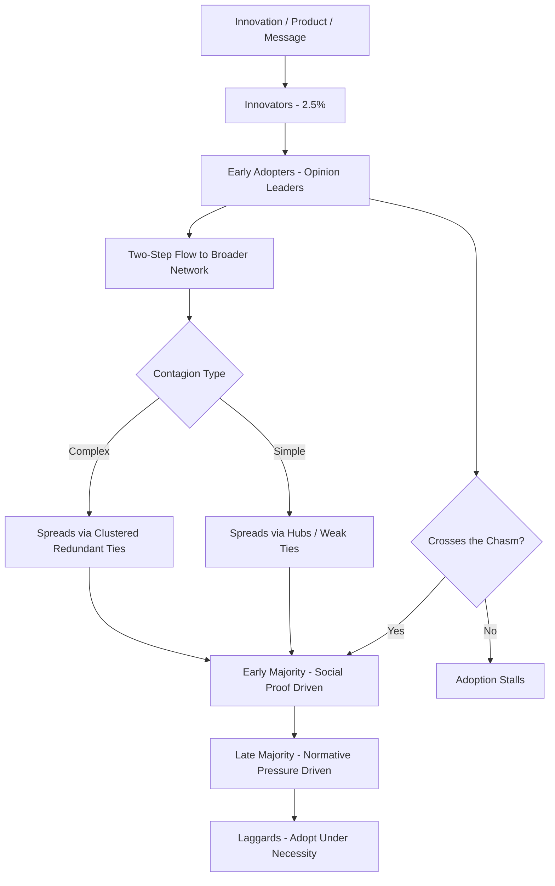

## Word-of-Mouth and Social Contagion

### Definitions and Scope

Word-of-mouth (WOM) refers to informal, person-to-person communication about products, services, or brands between individuals perceived as independent of commercial influence. Social contagion refers to the broader process by which behaviors, emotions, attitudes, or information spread through a social network via interpersonal exposure, of which WOM is one specific channel.

- **Word-of-mouth (WOM)**: Interpersonal communication about a brand, product, or service, occurring offline or online, between parties not acting in a commercial marketing capacity
- **Electronic word-of-mouth (eWOM)**: WOM occurring through digital channels (reviews, social media, forums), characterized by scalability, persistence, and searchability that offline WOM lacks
- **Social contagion**: The diffusion process itself, encompassing the mechanisms (imitation, emotional transfer, normative pressure, network structure) by which a behavior or belief spreads from one individual to others across a social network

### Why Word-of-Mouth Matters: Core Theoretical Rationale

**Key Points**

- WOM is generally perceived as higher in source credibility than firm-generated marketing communication because the communicator is assumed to have no commercial incentive, reducing the audience's activation of persuasion knowledge (per the Persuasion Knowledge Model)
- WOM functions simultaneously as **informational influence** (reducing perceived risk and uncertainty about product quality) and **normative influence** (signaling what similar others are doing or approve of), tying it directly to reference group theory
- Historical estimates (Trusov, Bucklin, and Pauwels, 2009, and related studies) consistently find WOM-acquired customers show higher retention and lifetime value than customers acquired through traditional paid advertising, though the precise multiplier varies substantially by study and industry [Inference: exact WOM value multipliers cited in marketing literature and practitioner sources vary widely and should not be treated as a fixed universal constant]

### The Diffusion of Innovations Framework (Rogers, 1962)

Word-of-mouth is the primary mechanism underlying Everett Rogers' Diffusion of Innovations model, which segments adopters based on their timing relative to the overall adoption curve:

| Segment | Approx. % of Population | Characteristics | Role in Contagion |
| --- | --- | --- | --- |
| Innovators | ~2.5% | Risk-tolerant, technically engaged, first to adopt | Seed the initial contagion, minimal social validation needed |
| Early Adopters | ~13.5% | Opinion leaders, socially connected, respected within their networks | Critical for legitimizing an innovation to the broader market |
| Early Majority | ~34% | Deliberate, adopt after seeing peer validation | Primary target of informational WOM/social proof |
| Late Majority | ~34% | Skeptical, adopt only after majority has already done so | Driven primarily by normative pressure and reduced perceived risk |
| Laggards | ~16% | Highly risk-averse, resistant to change | Often adopt only when the innovation becomes unavoidable/standard |

The **chasm** between early adopters and the early majority (popularized by Geoffrey Moore) represents the critical transition point where WOM must shift from being driven by novelty-seeking behavior to being driven by risk-reduction and social proof, a transition many products fail to make.

### Mechanisms of Social Contagion

**Key Points**

- **Simple contagion**: Requires only a single exposure to spread (e.g., awareness of a product's existence); modeled effectively using classic epidemiological SIR (Susceptible-Infected-Recovered) frameworks adapted to information spread
- **Complex contagion**: Requires reinforcement from multiple independent sources before adoption occurs, particularly relevant for behaviors carrying social risk or requiring behavior change (e.g., adopting a new health-related product or a costly lifestyle-signaling purchase); Centola and Macy's (2007) research demonstrated that complex contagions spread more effectively through clustered, redundant-tie networks than through networks optimized for simple contagion (wide-bridging, weak-tie-heavy networks)
- **Emotional contagion**: The transfer of affective states between individuals through exposure to emotional expression, operating both through conscious empathic processes and more automatic mimicry mechanisms; central to why emotionally charged content (particularly high-arousal emotions like awe, anger, or amusement) spreads more virally than low-arousal emotional content

### Berger and Milkman's STEPPS Framework for Virality

Jonah Berger's empirically-derived framework identifies six characteristics that increase the likelihood content or products generate contagious WOM:

1. **Social Currency**: sharing the content/product makes the sharer look good, knowledgeable, or "in the know"
2. **Triggers**: environmental cues that keep a product or idea top-of-mind, prompting spontaneous mention
3. **Emotion**: high-arousal emotions (positive: awe, amusement; negative: anger, anxiety) increase sharing far more than low-arousal emotions (contentment, sadness), because arousal itself drives the physiological urge to share and discuss
4. **Public**: observability of a behavior or product makes it easier for others to imitate, directly connecting to the conspicuousness dimension in the Park-Lessig reference group framework
5. **Practical Value**: genuinely useful information that helps others is shared to provide value and build social capital
6. **Stories**: information embedded in a narrative structure is more memorable and more easily transmitted than isolated facts, tying directly to narrative transportation theory

### Network Structure and Opinion Leadership

**Key Points**

- The **two-step flow model** (Katz and Lazarsfeld, 1955) proposed that mass communication influences opinion leaders first, who then relay and interpret that information to their broader social networks — a precursor to modern influencer marketing theory
- **Opinion leaders** are distinguished from general "influencers" by having genuine domain expertise and high engagement within a specific product category, rather than broad general social reach
- Granovetter's (1973) "strength of weak ties" theory demonstrated that novel information (including WOM about new products) more often reaches an individual through weak ties (acquaintances) than strong ties (close friends/family), because weak ties bridge otherwise disconnected network clusters and provide access to non-redundant information
- **Network hubs** (highly connected individuals) accelerate simple contagion substantially, but complex contagion (behaviors requiring social reinforcement) depends more on network clustering and tie redundancy than on the presence of hubs alone

### Valence and the Negativity Bias in WOM

- Negative WOM is generally found to have a disproportionately larger impact on brand perception and purchase intention relative to positive WOM of equivalent magnitude, consistent with the broader psychological negativity bias
- However, negative WOM's virality advantage depends heavily on the emotion driving it: high-arousal negative emotions (anger, outrage) increase sharing, while low-arousal negative emotions (sadness, disappointment) tend to suppress sharing behavior
- Service recovery research (the "service recovery paradox") suggests that a well-handled response to negative WOM can, under some conditions, result in higher subsequent satisfaction and advocacy than if no failure had occurred at all, though this effect is inconsistent across studies and should not be assumed as a reliable strategy [Inference: reliance on service failure as a deliberate strategy to trigger the recovery paradox is not empirically well-supported as a repeatable tactic]

### Electronic Word-of-Mouth (eWOM) Specific Dynamics

**Key Points**

- eWOM differs from offline WOM in **persistence** (reviews remain visible and influential long after posting), **scalability** (one review can reach thousands of prospective buyers), and **quantifiability** (star ratings, helpfulness votes, and volume metrics create new heuristic cues not present in offline WOM)
- **Review valence and volume** operate as distinct predictors of sales: volume signals popularity/awareness (informational value even absent quality signal), while valence (average rating) signals perceived quality; both contribute independently to purchase likelihood in most e-commerce contexts
- **Herding effects** occur in eWOM contexts, where early reviews disproportionately shape the trajectory of subsequent reviews and aggregate perception, sometimes called information cascades
- Detection and regulation of **fake or incentivized reviews** has become a significant area of both algorithmic detection research and regulatory attention (e.g., FTC rules in the U.S. targeting undisclosed incentivized reviews), since manipulated eWOM undermines the perceived independence that gives WOM its persuasive power

### Practical Applications

**Example**

A direct-to-consumer skincare brand seeking to generate organic WOM growth could apply this framework as follows:

- Design packaging with high **social currency** value (visually distinctive, "instagrammable" unboxing) to encourage voluntary sharing
- Identify category-specific **opinion leaders** (dermatology-adjacent micro-influencers with genuine domain credibility) rather than broad-reach celebrities, leveraging the two-step flow model
- Build a **referral incentive structure** that leverages weak-tie network bridging, since referrals through looser connections are more likely to reach genuinely new, non-redundant customer segments
- Actively monitor and respond to negative eWOM quickly, since response speed and quality substantially affect whether a negative review becomes a contained incident or a broader contagion event

### Measurement Approaches

- **Net Promoter Score (NPS)**: a widely used, if methodologically debated, proxy for WOM propensity, measuring self-reported likelihood to recommend
- **Share of voice and social listening metrics**: tracking volume and sentiment of brand mentions across social and review platforms as a direct measure of active WOM/eWOM volume
- **Network analysis and referral tracking**: using unique referral codes or links to map actual WOM-driven conversion pathways and identify high-value opinion leader nodes
- **Sentiment and emotion classification of eWOM content**: natural language processing techniques applied to reviews and social mentions to separate valence (positive/negative) from arousal (high/low), given that arousal is the stronger predictor of onward sharing per Berger's findings [Inference: while arousal's role in sharing behavior is well-documented, its predictive strength relative to valence varies by content category and platform]

### Boundary Conditions and Limitations

**Key Points**

- WOM effects are attenuated for low-involvement, low-differentiation product categories where consumers have limited motivation to seek or share information
- Manufactured or incentivized WOM programs (astroturfing) carry significant reputational and regulatory risk if disclosed improperly, and detection by consumers can trigger a stronger backlash than the absence of WOM activity altogether
- Network effects and contagion dynamics are highly platform-dependent; findings from one social media environment (e.g., a text-based forum) do not necessarily generalize to visually-driven or ephemeral-content platforms without independent validation [Inference: platform-specific contagion dynamics are an active and evolving area of research, and generalizations should be treated cautiously given how quickly platform algorithms and user behaviors change]

### Social Contagion Diffusion Pathway

### STEPPS Virality Framework (svg_diagram)

<svg xmlns="http://www.w3.org/2000/svg" viewBox="0 0 820 380">
<text x="410" y="26" text-anchor="middle" font-size="18" font-weight="bold" fill="#1a1a1a">STEPPS Virality Framework (svg_diagram)</text>
<circle cx="410" cy="200" r="55" fill="#37474f" opacity="0.9" />
<text x="410" y="196" text-anchor="middle" font-size="12" fill="#fff" font-weight="bold">Contagious</text>
<text x="410" y="212" text-anchor="middle" font-size="12" fill="#fff" font-weight="bold">Content</text>
<g>
<circle cx="410" cy="70" r="55" fill="#e3f2fd" stroke="#1565c0" stroke-width="1.5" />
<text x="410" y="66" text-anchor="middle" font-size="11" fill="#0d47a1" font-weight="bold">Social</text>
<text x="410" y="80" text-anchor="middle" font-size="11" fill="#0d47a1" font-weight="bold">Currency</text>
</g>
<g>
<circle cx="590" cy="120" r="55" fill="#fff3e0" stroke="#ef6c00" stroke-width="1.5" />
<text x="590" y="124" text-anchor="middle" font-size="12" fill="#e65100" font-weight="bold">Triggers</text>
</g>
<g>
<circle cx="620" cy="280" r="55" fill="#ffebee" stroke="#c62828" stroke-width="1.5" />
<text x="620" y="284" text-anchor="middle" font-size="12" fill="#b71c1c" font-weight="bold">Emotion</text>
</g>
<g>
<circle cx="460" cy="340" r="55" fill="#e8f5e9" stroke="#2e7d32" stroke-width="1.5" />
<text x="460" y="344" text-anchor="middle" font-size="12" fill="#1b5e20" font-weight="bold">Public</text>
</g>
<g>
<circle cx="220" cy="300" r="55" fill="#f3e5f5" stroke="#6a1b9a" stroke-width="1.5" />
<text x="220" y="296" text-anchor="middle" font-size="11" fill="#4a148c" font-weight="bold">Practical</text>
<text x="220" y="310" text-anchor="middle" font-size="11" fill="#4a148c" font-weight="bold">Value</text>
</g>
<g>
<circle cx="200" cy="130" r="55" fill="#fce4ec" stroke="#ad1457" stroke-width="1.5" />
<text x="200" y="134" text-anchor="middle" font-size="12" fill="#880e4f" font-weight="bold">Stories</text>
</g>
<line x1="410" y1="125" x2="410" y2="145" stroke="#999" stroke-width="1" />
<line x1="555" y1="150" x2="470" y2="180" stroke="#999" stroke-width="1" />
<line x1="575" y1="235" x2="450" y2="215" stroke="#999" stroke-width="1" />
<line x1="470" y1="290" x2="430" y2="245" stroke="#999" stroke-width="1" />
<line x1="260" y1="260" x2="370" y2="220" stroke="#999" stroke-width="1" />
<line x1="240" y1="170" x2="365" y2="190" stroke="#999" stroke-width="1" />
</svg>

### Next Steps

- **Related Topics**:
  - Diffusion of innovations and technology adoption lifecycle
  - Berger's STEPPS framework and viral content design
  - Narrative transportation and storytelling in shareable content
  - Reference groups and normative influence
  - Influencer marketing and the two-step flow model
  - Online review manipulation and eWOM authenticity regulation
  - Emotional arousal and content virality prediction models