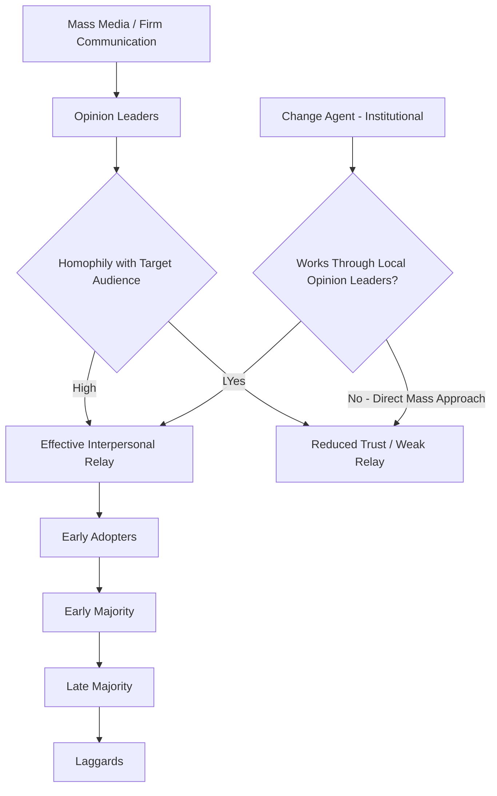

## Opinion Leadership and Diffusion Agents

### Definition and Theoretical Origins

Opinion leadership refers to the degree to which an individual informally influences the attitudes or behaviors of others in a desired direction, with relative frequency. The concept originates from Lazarsfeld, Berelson, and Gaudet's (1944) research on political communication, which found that mass media effects on voting behavior were substantially mediated by interpersonal influencers rather than acting directly on the mass audience. This finding was formalized into the **two-step flow model** by Katz and Lazarsfeld (1955): mass communication flows first to opinion leaders, who then interpret and relay that information to the broader public through interpersonal channels.

A **diffusion agent** (or change agent, in Rogers' terminology) is a related but distinct role: an individual who deliberately and often professionally works to influence the rate and direction of an innovation's adoption within a target population, as opposed to opinion leaders, who exert influence informally as a byproduct of their social position and credibility.

### Distinguishing Opinion Leaders from Related Roles

| Role | Defining Characteristic | Formality | Primary Basis of Influence |
| --- | --- | --- | --- |
| Opinion Leader | High informal social influence within a specific domain | Informal, emergent | Category expertise + social embeddedness |
| Diffusion/Change Agent | Deliberately works to accelerate adoption on behalf of an external entity | Formal, often professional | Institutional mandate + persuasive skill |
| Market Maven | Broad general marketplace knowledge, not necessarily domain-specific expertise | Informal | General information-sharing motivation |
| Influencer (modern digital usage) | Large parasocial reach via media platform | Semi-formal (often monetized) | Perceived authenticity + platform reach |
| Innovator (Rogers' typology) | First to adopt an innovation | Informal | Risk tolerance, not necessarily social influence |

**Key Points**

- Opinion leaders are typically **monomorphic**, exerting influence within a specific, bounded product or topic category, rather than being generally influential across unrelated domains — a person who is an opinion leader for home electronics is not automatically an opinion leader for skincare
- **Market mavens** (Feick and Price, 1987) are a distinct construct from opinion leaders: mavens possess broad marketplace knowledge and a general motivation to share information across many categories, driven by intrinsic enjoyment of information-sharing rather than domain expertise or social status within one category
- Not all innovators are opinion leaders; early adoption and social influence capacity are correlated but conceptually and empirically separable constructs

### Characteristics of Opinion Leaders

**Key Points**

- **Domain expertise**: greater objective and/or perceived knowledge in the specific product category relative to their social ties
- **Social embeddedness**: higher number of social ties and more central network position, though centrality alone is not sufficient without accompanying credibility
- **Innovativeness**: tend to be earlier adopters within the diffusion curve (though not necessarily the earliest "innovators," who may be too idiosyncratic to be broadly trusted)
- **Cosmopolitanism**: greater exposure to external information sources (media, professional networks) outside their immediate social circle, allowing them to import novel information into their local network
- **Accessibility and approachability**: perceived as available and willing to share knowledge, distinguishing them from experts who may be authoritative but socially distant

### Rogers' Change Agent Framework

Everett Rogers (Diffusion of Innovations, 1962) formalized the role of the change agent as a professional or institutional actor who facilitates adoption of an innovation, operating through seven sequential stages:

1. Developing a need for change in the client system
2. Establishing an information exchange relationship
3. Diagnosing the client's problem
4. Creating intent to change in the client
5. Translating intent into action
6. Stabilizing adoption and preventing discontinuance
7. Achieving a terminal relationship (the client becomes self-sufficient)

**Change agents typically operate through local opinion leaders** rather than attempting direct mass influence, since opinion leaders possess homophily (similarity) with the target population that the change agent, often an outsider, lacks. This principle — that influence transmission is more effective through homophilous ties than heterophilous ones — is one of the most consistently replicated findings in diffusion research.

### Homophily and the Limits of Opinion Leader Influence

- **Homophily** refers to the tendency of individuals to interact with and be influenced more strongly by others who are similar to themselves in beliefs, education, social status, or other relevant attributes
- Effective opinion leaders typically exhibit **moderate heterophily** relative to their followers: enough similarity to maintain trust and relatability, but enough difference (usually in expertise or external exposure) to provide genuinely novel information — a pattern sometimes termed the "optimal marginality" of opinion leaders
- Excessive heterophily (an opinion leader too dissimilar from the target audience) undermines the credibility and relatability that gives opinion leadership its persuasive power, which is a key reason purely reach-based celebrity endorsement often underperforms category-relevant micro-influencer campaigns for domain-specific products

### Methods for Identifying Opinion Leaders

**Key Points**

- **Sociometric methods**: directly asking individuals within a bounded network to nominate who they turn to for advice in a given category; considered the methodological gold standard but difficult to scale beyond small, bounded populations
- **Self-designating scales**: survey instruments (e.g., the King and Summers Opinion Leadership Scale) asking respondents to rate their own likelihood of being sought out for advice; more scalable but subject to self-report bias and social desirability effects
- **Key informant method**: asking a subset of knowledgeable community members to identify opinion leaders, rather than relying on the full population
- **Network/graph-based digital identification**: in digital contexts, identifying high-centrality nodes (measured via metrics such as betweenness centrality, eigenvector centrality, or PageRank-style algorithms) within a social graph, often combined with engagement and content-relevance filters to approximate domain-specific opinion leadership rather than pure reach

### Opinion Leadership in Digital and Influencer Marketing Contexts

The rise of social media has both operationalized and complicated opinion leadership theory:

- **Micro-influencers** are frequently framed as digital-era opinion leaders: smaller, more engaged, topically-focused audiences with higher perceived authenticity and category credibility than mega-influencers or celebrities, aligning with the "optimal marginality" and monomorphic-expertise principles from classical opinion leader theory
- **Algorithmic amplification** complicates the classical two-step flow model, since platform algorithms now mediate which content reaches which audiences independent of organic social ties, introducing a layer of influence (the algorithm itself) not present in Katz and Lazarsfeld's original formulation
- **Parasocial dynamics**: unlike classical opinion leaders who have direct, reciprocal social ties with those they influence, digital influencers often exert influence through one-directional parasocial relationships, which change the trust calculus in ways still being actively researched [Inference: the degree to which parasocial-based influence functions equivalently to traditional reciprocal-tie opinion leadership is an evolving research question without full consensus]

### Practical Applications in Marketing

**Example**

A B2B software company launching a new analytics platform could apply opinion leadership theory as follows:

- Identify **monomorphic domain experts** within the target industry (e.g., recognized analytics practitioners, not general tech celebrities) through sociometric-style community engagement (forums, conference speaker lists, professional association leadership)
- Recruit these individuals as **product advisory board members or early access partners**, functioning as informal opinion leaders whose credibility transfers through **homophilous** peer networks within the industry
- Deploy company-employed **change agents** (customer success or solutions engineering staff) to work directly through these identified opinion leaders during the adoption process, following Rogers' change agent stages rather than attempting direct mass-market persuasion
- Avoid over-indexing on broad-reach general tech influencers who lack the category-specific credibility that drives adoption in complex B2B purchase decisions

### Measurement Approaches

- **Opinion Leadership Scale (King and Summers, 1970)**: a widely used multi-item self-report measure assessing perceived likelihood of being consulted for product advice within specific categories
- **Network centrality analysis**: using social network analysis techniques (degree centrality, betweenness centrality) applied to both offline organizational networks and digital social graphs to identify structurally influential nodes
- **Content amplification tracking**: in digital contexts, tracking share/citation patterns to empirically identify which accounts function as genuine relay points for information diffusion, as distinct from accounts with high raw follower counts but low actual relay influence

### Boundary Conditions and Limitations

**Key Points**

- Opinion leadership is **category-specific and time-bound**; an individual's status as an opinion leader can erode quickly if their perceived expertise becomes outdated relative to the pace of category innovation
- Compensating or overtly commercializing an opinion leader's endorsement risks undermining the perceived independence that gave their opinion leadership its persuasive value in the first place, converting credible opinion leadership into discounted, persuasion-knowledge-triggering advertising
- Structural network position (centrality) alone is insufficient to predict influence; multiple studies have found content/message characteristics and existing relational trust are necessary complements to network position for actual behavior change to occur [Inference: the relative predictive weight of network centrality versus message and trust factors varies substantially across study contexts and platforms]
- Change agent effectiveness depends heavily on maintaining credibility as being aligned with the client system's interests rather than purely the sponsoring institution's interests; perceived agent bias reduces both trust and diffusion effectiveness

### Two-Step Flow and Diffusion Agent Pathway

### Opinion Leader vs. Market Maven vs. Influencer (svg_diagram)

<svg xmlns="http://www.w3.org/2000/svg" viewBox="0 0 780 340">
<text x="390" y="26" text-anchor="middle" font-size="18" font-weight="bold" fill="#1a1a1a">Opinion Leader vs. Market Maven vs. Influencer (svg_diagram)</text>
<line x1="80" y1="290" x2="700" y2="290" stroke="#333" stroke-width="1.5" />
<line x1="80" y1="290" x2="80" y2="60" stroke="#333" stroke-width="1.5" />
<text x="40" y="60" font-size="11" fill="#333">Narrow</text>
<text x="15" y="295" font-size="11" fill="#333">Broad</text>
<text x="10" y="180" font-size="11" fill="#333" transform="rotate(-90 10 180)">Category Scope</text>
<text x="390" y="315" text-anchor="middle" font-size="11" fill="#333">Social Reach →</text>
<circle cx="180" cy="110" r="50" fill="#e3f2fd" stroke="#1565c0" stroke-width="1.5" />
<text x="180" y="106" text-anchor="middle" font-size="12" fill="#0d47a1" font-weight="bold">Opinion</text>
<text x="180" y="122" text-anchor="middle" font-size="12" fill="#0d47a1" font-weight="bold">Leader</text>
<text x="180" y="175" text-anchor="middle" font-size="10" fill="#333">Narrow scope, moderate reach</text>
<circle cx="450" cy="230" r="55" fill="#fff3e0" stroke="#ef6c00" stroke-width="1.5" />
<text x="450" y="234" text-anchor="middle" font-size="12" fill="#e65100" font-weight="bold">Market Maven</text>
<text x="450" y="300" text-anchor="middle" font-size="10" fill="#333">Broad scope, moderate reach</text>
<circle cx="600" cy="120" r="60" fill="#f3e5f5" stroke="#6a1b9a" stroke-width="1.5" />
<text x="600" y="124" text-anchor="middle" font-size="12" fill="#4a148c" font-weight="bold">Influencer</text>
<text x="600" y="195" text-anchor="middle" font-size="10" fill="#333">Variable scope, high reach</text>
</svg>

### Next Steps

- **Related Topics**:
  - Diffusion of innovations and the adoption curve
  - Two-step flow model and modern algorithmic mediation
  - Word-of-mouth and social contagion
  - Micro-influencer marketing and homophily-based credibility
  - Reference groups and normative influence
  - Market maven identification and general information-sharing behavior
  - Social network analysis methods for marketing applications