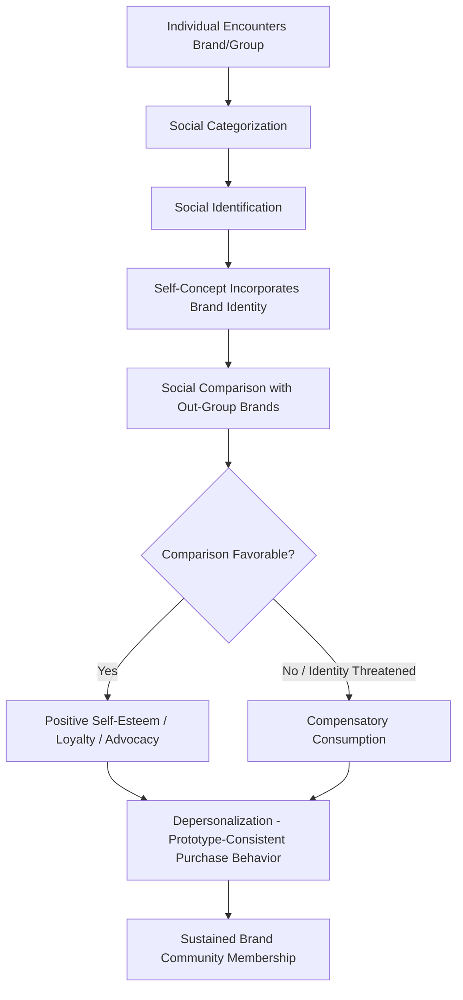

## Social Identity Theory and In-Group Consumption

### Theoretical Foundation

Social Identity Theory (SIT), developed by Henri Tajfel and John Turner (1979), proposes that part of an individual's self-concept is derived from their membership in social groups, and that individuals are motivated to achieve and maintain a positive social identity. This positive identity is achieved substantially through favorable comparisons between one's own group (the **in-group**) and other groups (**out-groups**), a process termed **social comparison**.

The theory rests on three sequential cognitive processes:

1. **Social categorization**: individuals mentally sort themselves and others into group categories (nationality, brand community, fan base, profession, etc.), which simplifies the social environment but inherently creates in-group/out-group distinctions
2. **Social identification**: individuals adopt the identity of the group they have categorized themselves into, aligning their self-concept and emotional investment with that group's fate and status
3. **Social comparison**: individuals compare their in-group favorably against relevant out-groups to maintain or enhance self-esteem, since group status is understood to reflect on personal identity

### The Minimal Group Paradigm

Tajfel's foundational experiments demonstrated that in-group favoritism emerges even when group membership is assigned on a trivial, arbitrary basis (e.g., random assignment to a group based on meaningless criteria such as a coin flip or preference for an abstract painting), with no prior history, interaction, or material stake between members. This finding established that the mere act of categorization, independent of any real functional basis for the group, is sufficient to generate in-group bias — a critical implication for marketing, where brand communities and consumer segments are often built on comparatively thin, constructed distinctions.

**Key Points**

- In-group favoritism manifests even absent any direct competition or conflict of interest between groups, undermining purely functionalist (resource-competition-based) explanations for group bias
- The strength of in-group bias increases with the perceived relevance of the categorization dimension to the individual's self-concept, meaning categories that feel identity-central (e.g., "I am a runner," "I am a Mac person") generate stronger bias than superficial or low-investment categorizations
- Self-esteem maintenance is the proposed underlying motivational driver: favorable in-group comparison provides a route to positive self-regard that does not require individual achievement

### Application to Brand Communities

Brand communities function as a direct commercial application of SIT: consumers who identify strongly with a brand incorporate that brand into their social identity, deriving self-esteem benefits from favorable comparisons between their brand (in-group) and competing brands (out-groups).

**Key Points**

- **Brand identification** (the degree to which a consumer's self-concept overlaps with a brand's perceived identity) is a distinct and stronger predictor of loyalty and advocacy than mere satisfaction, since identification implicates the consumer's self-esteem in the brand's success or failure
- Strong brand communities exhibit classic in-group/out-group markers: shared symbols and rituals (logos, community-specific terminology, member-only events), a sense of moral responsibility to fellow members, and explicit or implicit denigration of competing brand communities
- Muniz and O'Guinn's (2001) foundational brand community research identified three markers of true brand community: **consciousness of kind** (a shared sense of belonging distinct from non-members), **shared rituals and traditions**, and **a sense of moral responsibility** to the community and its continuity

### Out-Group Derogation and Competitive Brand Dynamics

- Consumers strongly identified with a brand often engage in **out-group derogation**: actively criticizing or diminishing competing brands, which serves the dual function of reinforcing in-group superiority and providing a psychological buffer against threats to brand identity
- This dynamic underlies notably intense brand rivalries (e.g., long-documented consumer tribalism in categories such as technology platforms, athletic brands, and automotive marques), where identification with one brand functions partly through opposition to a specific named rival rather than purely through independent brand evaluation
- Marketing that explicitly frames a brand in opposition to a rival (comparative advertising leveraging tribal identity rather than purely functional comparison) can strengthen in-group cohesion among existing loyalists, though it carries risk of appearing overtly adversarial to less-identified or undecided consumers [Inference: the net effect of tribal comparative marketing depends heavily on the existing strength and composition of the brand's identified consumer base]

### Self-Categorization Theory Extension

Turner's later Self-Categorization Theory (SCT) extended SIT by specifying the cognitive mechanism of **depersonalization**: when a social identity becomes salient, individuals perceive themselves less as unique individuals and more as interchangeable representatives of the group prototype, adjusting their attitudes and behaviors to match the perceived group norm. This has direct relevance to conformity-adjacent consumption behavior within brand communities and fan groups, where individual purchase decisions become partly an expression of prototypical group membership rather than purely individual preference.

### Identity Threat and Compensatory Consumption

**Key Points**

- When an individual's valued social identity is threatened (through group status decline, stigmatization, or direct out-group derogation), a common response is **compensatory consumption**: purchasing products that symbolically reaffirm the threatened identity or its associated status
- This mechanism underlies status-signaling consumption during periods of perceived group status threat, and has been documented in research on identity-based marketing responses to social and economic disruption [Inference: the specific magnitude and reliability of compensatory consumption effects vary across identity types, threat severity, and cultural context, and should not be generalized as a uniform response pattern]
- Marketing that helps consumers reaffirm a valued identity (rather than threatening a rival identity) can be an effective, lower-risk alternative to tribal/comparative approaches, particularly for brands without an already highly-identified loyalist base

### Comparative Table: SIT Constructs Applied to Marketing

| SIT Construct | Definition | Marketing Manifestation |
| --- | --- | --- |
| Social categorization | Sorting self/others into groups | Segment/community labeling (e.g., "Apple people," fitness brand tribes) |
| Social identification | Adopting group identity into self-concept | Brand identification, fan community membership |
| Social comparison | Favorable in-group vs. out-group evaluation | Comparative advertising, brand rivalry marketing |
| Minimal group effect | Bias from trivial categorization alone | Loyalty tiers and arbitrary membership badges generating in-group feeling |
| Depersonalization (SCT) | Behaving as a group prototype rather than an individual | Uniform consumption patterns within strong brand communities |
| Compensatory consumption | Identity-affirming purchase after identity threat | Status products marketed during periods of perceived status anxiety |

### Practical Applications in Marketing

**Example**

An athletic apparel brand building a runner-focused community could apply SIT as follows:

- Create **consciousness of kind** through community-exclusive branding (a distinct visual identifier worn by community members, functioning as an in-group marker recognizable to other members)
- Establish **shared rituals** (branded group runs, annual community events) that reinforce ongoing identification beyond the initial purchase transaction
- Frame external messaging around **identity affirmation** ("real runners choose...") rather than purely functional product claims, activating self-categorization processes
- Exercise caution with **out-group derogation** tactics (direct rival brand criticism) unless the existing community is already strongly identified, since premature tribal framing can alienate prospective members who have not yet formed brand identification

### Measurement Approaches

- **Brand identification scales**: adapted from organizational identification research (e.g., Mael and Ashforth's Organizational Identification Scale), measuring the degree of self-brand overlap using items such as perceived shared values and use of "we" language when discussing the brand
- **Implicit association measures**: reaction-time-based tests (e.g., adaptations of the Implicit Association Test) used to measure automatic in-group/out-group brand associations that may not be captured through explicit self-report
- **Community engagement metrics**: participation rates in brand-specific rituals, user-generated content volume, and community-specific language adoption as behavioral proxies for depersonalization and identification strength
- **Net Promoter Score decomposition**: distinguishing advocacy driven by functional satisfaction from advocacy driven by identity-based motivations, often through supplementary qualitative coding of open-ended NPS responses

### Boundary Conditions and Limitations

**Key Points**

- SIT-based effects are strongest for categories with high **symbolic and social visibility**; low-involvement, privately-consumed categories generate weaker identity-based dynamics, consistent with the conspicuousness dimension from the Park-Lessig reference group framework
- Individual differences in **need for group belonging** and **collective self-esteem orientation** moderate the strength of SIT effects; not all consumers derive equivalent self-esteem benefit from group-based identity, and some consumers actively resist strong brand community identification
- Overreliance on out-group derogation risks alienating the broader, less-identified market and can trigger negative associations if perceived as excessive or aggressive rather than playful/tribal
- Brand community identity effects can create switching costs that function as a retention mechanism, but this same mechanism can produce disproportionately intense backlash if the brand is perceived to violate community norms or values, since the perceived betrayal implicates the consumer's own identity, not merely their product satisfaction

### Social Identity Process in Consumption

### In-Group / Out-Group Comparison Dynamic (svg_diagram)

<svg xmlns="http://www.w3.org/2000/svg" viewBox="0 0 780 320">
<text x="390" y="26" text-anchor="middle" font-size="18" font-weight="bold" fill="#1a1a1a">In-Group / Out-Group Comparison Dynamic (svg_diagram)</text>
<circle cx="230" cy="170" r="110" fill="#e3f2fd" stroke="#1565c0" stroke-width="2" />
<text x="230" y="150" text-anchor="middle" font-size="14" font-weight="bold" fill="#0d47a1">In-Group</text>
<text x="230" y="172" text-anchor="middle" font-size="11" fill="#0d47a1">Brand Community</text>
<text x="230" y="192" text-anchor="middle" font-size="10" fill="#0d47a1">Consciousness of Kind</text>
<text x="230" y="208" text-anchor="middle" font-size="10" fill="#0d47a1">Shared Rituals</text>
<circle cx="550" cy="170" r="110" fill="#ffebee" stroke="#c62828" stroke-width="2" />
<text x="550" y="150" text-anchor="middle" font-size="14" font-weight="bold" fill="#b71c1c">Out-Group</text>
<text x="550" y="172" text-anchor="middle" font-size="11" fill="#b71c1c">Rival Brand</text>
<text x="550" y="192" text-anchor="middle" font-size="10" fill="#b71c1c">Derogation Target</text>
<line x1="340" y1="170" x2="440" y2="170" stroke="#333" stroke-width="2" marker-start="url(#ar1)" marker-end="url(#ar1)" />
<text x="390" y="155" text-anchor="middle" font-size="10" fill="#333">Social</text>
<text x="390" y="192" text-anchor="middle" font-size="10" fill="#333">Comparison</text>
</svg>

### Next Steps

- **Related Topics**:
  - Brand community theory and consciousness of kind
  - Compensatory consumption and identity threat responses
  - Reference groups and normative influence
  - Self-categorization theory and depersonalization in group behavior
  - Tribal marketing and comparative brand advertising
  - Status consumption and symbolic self-completion theory
  - Consumer-brand identification measurement scales