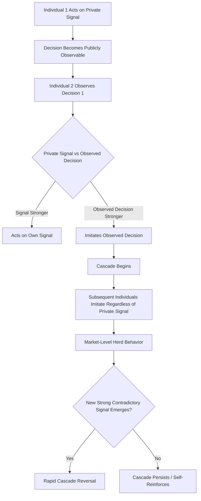

## Herd Behavior and Social Proof in Markets

### Definition and Theoretical Scope

Herd behavior refers to the tendency of individuals to align their decisions with the observed decisions of others, often at the expense of their own private information or judgment. In market contexts, this produces aggregate patterns of behavior (mass buying, selling, or adoption) that can diverge substantially from what independent, fully-informed individual decision-making would predict. Social proof, as previously discussed in the context of interpersonal influence, is the underlying psychological mechanism most directly responsible for herd behavior at the individual level; herd behavior is the aggregate, market-level manifestation of that mechanism operating across many individuals simultaneously.

### Rational vs. Irrational Herding: The Information Cascade Model

A critical theoretical distinction in this literature separates **rational herding** from purely psychological or irrational herding:

**Rational herding (information cascades)**: Bikhchandani, Hirshleifer, and Welch's (1992) formal model demonstrates that herding can be a *rational* response under conditions of sequential decision-making with imperfect private information. If each individual observes the decisions (but not the private information) of those who acted before them, it can be mathematically rational to disregard one's own weak private signal and instead imitate the majority, once enough prior decisions have accumulated in one direction. This produces an **information cascade**: a self-reinforcing pattern where subsequent individuals contribute no new information to the aggregate decision, having rationally chosen to imitate rather than act on their own signal.

**Key Points**

- Information cascades are fragile: because later participants are not acting on private information, the entire cascade can be reversed by a small amount of new, sufficiently strong contradictory public information, since it reveals that the earlier convergence was not actually built on an accumulation of independent evidence
- Cascades can form around an initially incorrect signal, meaning rational herding does not guarantee the market converges on an objectively correct outcome — it guarantees consensus, not necessarily accuracy
- **Psychological/irrational herding**, by contrast, involves individuals suppressing their private information due to reputational concerns, cognitive biases, or genuine belief updating toward the crowd, distinct from the purely informational Bayesian logic of the formal cascade model

### Comparison of Herding Mechanisms

| Mechanism | Driver | Rationality | Reversibility |
| --- | --- | --- | --- |
| Information cascade | Sequential observation of others' decisions under private information uncertainty | Rational (Bayesian) | High — sensitive to new contradictory public information |
| Reputational herding | Fear of being seen as wrong or an outlier (particularly documented among financial analysts and fund managers) | Rational at individual level, potentially costly in aggregate | Moderate |
| Social proof / normative herding | Desire for social approval, discomfort with deviating from perceived group consensus | Psychological/normative | Variable, often persistent absent explicit disconfirming information |
| Availability-driven herding | Overweighting easily recalled or highly visible recent examples of others' behavior | Cognitive bias (availability heuristic) | Moderate, fades as salience of triggering examples decays |

### Herd Behavior in Financial Markets

Herd behavior has been most extensively studied in financial markets, where it has been linked to asset bubbles, market crashes, and excess volatility that exceeds what fundamental value changes alone would predict.

**Key Points**

- Herding among institutional investors (fund managers, analysts) has been documented as partly reputational: underperforming while contrarian to consensus carries greater career risk than underperforming while aligned with consensus, since the latter is more easily attributed to broad market conditions rather than individual judgment failure
- Historical asset bubbles (documented across centuries and asset classes) exhibit common herding-consistent features: rapid price appreciation disconnected from fundamentals, widespread participation by relatively uninformed investors following visible market momentum, and abrupt reversal once a critical mass of participants begins to doubt the trend's sustainability [Inference: while herding is broadly recognized by economists as a contributing factor to historical bubbles, the precise causal weight of herding relative to other factors (leverage, monetary policy, structural market features) is actively debated and varies by specific historical episode]
- Retail investor herding has become increasingly visible and studied in the context of social-media-coordinated trading activity, where publicly visible trading sentiment and volume function as a large-scale, real-time social proof signal

### Consumer Market Applications of Herd Behavior

Beyond financial markets, herd behavior operates extensively in consumer purchase contexts, generally through the social proof mechanisms previously discussed:

- **Bestseller and popularity signaling**: displaying sales volume, "trending" status, or bestseller labels functions as a direct herd-behavior trigger, particularly effective under conditions of consumer uncertainty about product quality
- **Queue and scarcity-driven herding**: visible queues or "low stock" indicators function as observable proxies for others' revealed preference, triggering herd-consistent urgency independent of the observer's own private assessment of the product's value
- **Review volume as an informational cascade trigger**: early reviews disproportionately shape the trajectory of a product's perceived quality trend, since subsequent reviewers are influenced by the visible aggregate rating before forming or reporting their own independent assessment — directly paralleling the sequential-observation structure of the formal information cascade model
- **App store and platform ranking effects**: ranking algorithms that surface already-popular content or products create a self-reinforcing visibility loop, where initial popularity (however achieved) increases exposure, which increases further adoption, independent of underlying product quality differences [Inference: the degree to which platform ranking algorithms amplify herding versus reflect genuine quality signals is difficult to disentangle empirically and varies by platform design]

### The Fragility and Reversal of Herding

A defining characteristic of herd-driven market behavior, whether financial or consumer-facing, is its potential for rapid reversal once the underlying cascade is disrupted:

**Key Points**

- Because herd behavior (particularly the rational cascade variant) does not require underlying conviction, herds can dissolve rapidly once a credible signal contradicts the prevailing direction, producing the characteristic sharp reversals associated with market crashes, sudden shifts in consumer sentiment, or rapid brand reputation collapse
- **Bank runs** are a classic and extensively modeled example of herd-driven reversal: even a financially sound institution can face insolvency if depositors, observing others withdrawing funds, rationally conclude that early withdrawal is individually optimal regardless of the institution's actual solvency — a dynamic formalized in the Diamond-Dybvig (1983) banking model
- Reputational contagion (a firm's negative event triggering broad customer or investor exit) exhibits similar cascade dynamics, where the visible departure of some customers/investors is itself interpreted as a signal, independent of each subsequent departer's own direct assessment of the firm's underlying condition

### Practical Marketing Applications

**Example**

An e-commerce platform seeking to leverage social proof responsibly could apply herd behavior theory as follows:

- Display accurate, real-time popularity metrics (genuine bestseller rankings, honest "X people viewing this item" indicators) to trigger legitimate informational herding under conditions of genuine consumer uncertainty
- Sequence early customer exposure carefully, recognizing that **initial reviews and adoption patterns disproportionately shape the subsequent cascade trajectory** — meaning early-stage quality control and genuine review solicitation matter more than volume of later reviews
- Avoid manufacturing false scarcity or fabricated popularity signals, since detection of manipulated social proof can trigger a negative cascade of skepticism that is equally self-reinforcing and considerably more damaging to long-term trust than the absence of herding cues altogether
- Recognize the **fragility risk**: a brand that has benefited from positive herd-driven momentum should anticipate that a single credible negative signal (a public failure, a viral negative review) can trigger disproportionately rapid reversal, given the same cascade logic that drove the initial positive momentum

### Measurement Approaches

- **Sequential decision experiments**: laboratory paradigms replicating the Bikhchandani-Hirshleifer-Welch cascade structure, measuring the point at which participants abandon private signals in favor of observed group behavior
- **Trading volume and price co-movement analysis**: in financial market research, herding is often operationalized through statistical measures of cross-sectional return dispersion (e.g., the Christie-Huang and Chang-Cheng-Khorana measures), which detect whether individual asset returns cluster more tightly around the market return than fundamental-driven models would predict during periods of market stress
- **Review and rating trajectory analysis**: tracking how early review valence and volume statistically predict the trajectory of subsequent reviews, isolating cascade-consistent patterns from pure product-quality-driven consistency
- **Social media sentiment and trading correlation studies**: analyzing the relationship between publicly visible sentiment/volume signals and subsequent retail trading or purchase behavior as a real-time herding proxy

### Boundary Conditions and Limitations

**Key Points**

- Herding effects are attenuated when individuals possess strong, high-confidence private information or signals, since the formal cascade model predicts individuals will only abandon private information when their own signal confidence is sufficiently weak relative to the observed aggregate signal
- Herding is more pronounced under conditions of genuine uncertainty and high perceived decision stakes; low-stakes, low-uncertainty decisions show substantially reduced herd susceptibility
- Distinguishing genuine informational herding from confirmation of an independently correct majority view is methodologically difficult in observational (non-experimental) market data, since herding and legitimate consensus around accurate information can produce observationally similar aggregate patterns [Inference: this identification problem is a persistent and acknowledged limitation across empirical herding research, not fully resolved by any single measurement approach]
- Regulatory and platform integrity concerns arise when social proof signals are artificially manufactured (fake reviews, bot-driven trading signals, incentivized engagement), since manufactured herding cues exploit the same psychological mechanisms as genuine ones while providing no genuine informational value

### Information Cascade Formation and Reversal

### Herding Fragility Curve (svg_diagram)

<svg xmlns="http://www.w3.org/2000/svg" viewBox="0 0 780 320">
<text x="390" y="26" text-anchor="middle" font-size="18" font-weight="bold" fill="#1a1a1a">Herding Fragility Curve (svg_diagram)</text>
<line x1="70" y1="260" x2="720" y2="260" stroke="#333" stroke-width="1.5" />
<line x1="70" y1="260" x2="70" y2="50" stroke="#333" stroke-width="1.5" />
<text x="390" y="290" text-anchor="middle" font-size="11" fill="#333">Time / Sequential Decisions →</text>
<text x="25" y="150" text-anchor="middle" font-size="11" fill="#333" transform="rotate(-90 25 150)">Aggregate Adoption</text>
<path d="M 70 250 C 150 240, 200 200, 260 150 C 320 100, 400 70, 480 65" fill="none" stroke="#1565c0" stroke-width="2.5" />
<path d="M 480 65 C 520 62, 560 90, 570 140 C 585 200, 640 240, 720 250" fill="none" stroke="#c62828" stroke-width="2.5" />
<circle cx="480" cy="65" r="6" fill="#e65100" />
<text x="480" y="45" text-anchor="middle" font-size="11" fill="#e65100" font-weight="bold">Contradictory Signal</text>

<text x="270" y="130" text-anchor="middle" font-size="11" fill="`#0d47a1`" font-weight="bold">Cascade Building</text>

<text x="630" y="220" text-anchor="middle" font-size="11" fill="`#b71c1c`" font-weight="bold">Rapid Reversal</text>

</svg>

### Next Steps

- **Related Topics**:
  - Information cascade theory and Bayesian decision models
  - Word-of-mouth and social contagion
  - Reference groups and normative influence
  - Behavioral finance and asset bubble formation
  - Fake review detection and eWOM authenticity regulation
  - Scarcity marketing and manufactured urgency ethics
  - Reputational contagion and crisis communication strategy