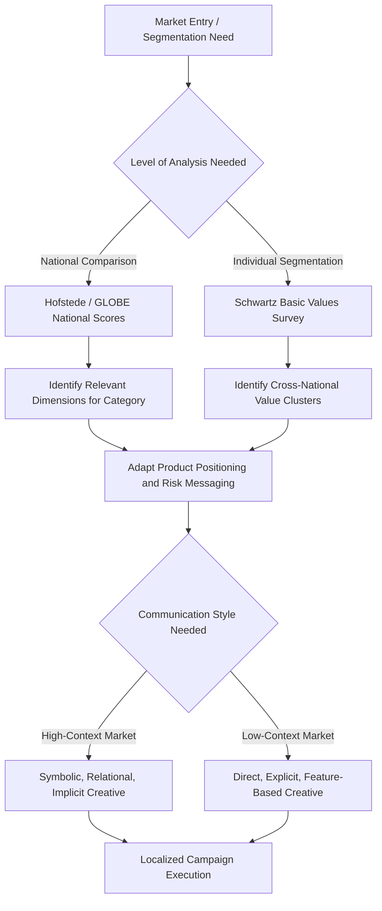

## Cultural Values Frameworks

### Definition and Purpose

Cultural values frameworks are systematic models developed to measure, compare, and predict how underlying cultural value orientations shape attitudes, decision-making, and consumption behavior across national and ethnic populations. These frameworks provide marketers with structured dimensions for adapting product design, messaging, and brand positioning across culturally distinct markets, replacing intuition-based cultural assumptions with empirically-derived comparative measures.

### Hofstede's Cultural Dimensions Theory

Geert Hofstede's framework, originally derived from a large-scale survey of IBM employees across dozens of countries (1980, later expanded), remains the most widely applied cultural values model in international marketing research. It identifies six dimensions along which national cultures reliably differ:

**Key Points**

- **Power Distance Index (PDI)**: the degree to which less powerful members of a society accept and expect unequal distribution of power. High PDI cultures show greater deference to authority and hierarchy in marketing communications (e.g., expert/authority-driven messaging performs well); low PDI cultures favor egalitarian, peer-to-peer framed messaging
- **Individualism vs. Collectivism (IDV)**: the degree to which individuals are integrated into groups. Individualist cultures respond more strongly to personal benefit and self-expression appeals; collectivist cultures respond more strongly to family, group harmony, and social belonging appeals
- **Masculinity vs. Femininity (MAS)**: the distribution of emotional roles between genders, extended to represent a society's orientation toward achievement/competition (masculine) versus care/quality-of-life (feminine) values. This dimension name is a legacy of the original research framing and is applied to broader value orientations rather than literal gender roles
- **Uncertainty Avoidance Index (UAI)**: the degree to which a culture tolerates ambiguity and unstructured situations. High UAI cultures favor detailed product information, warranties, and risk-reduction messaging; low UAI cultures are more receptive to novel, ambiguous, or experimental offerings
- **Long-Term vs. Short-Term Orientation (LTO)**: the degree to which a culture values persistence, thrift, and future reward versus tradition and immediate gratification. This dimension, added later based on Confucian-values research by Michael Bond, affects receptiveness to delayed-gratification financial products versus immediate-consumption appeals
- **Indulgence vs. Restraint (IVR)**: the degree to which a culture allows relatively free gratification of natural human desires related to enjoying life, versus suppressing gratification through strict social norms

### Comparative Table: Hofstede Dimensions and Marketing Implications

| Dimension | High End Marketing Implication | Low End Marketing Implication |
| --- | --- | --- |
| Power Distance | Authority/expert endorsement, hierarchical brand positioning | Peer recommendation, egalitarian tone |
| Individualism | Personal achievement, self-expression, "be yourself" messaging | Family/group harmony, belonging-oriented messaging |
| Masculinity | Competition, status, performance-driven claims | Quality of life, care, work-life balance framing |
| Uncertainty Avoidance | Detailed specifications, guarantees, risk-reduction cues | Novelty, experimentation, flexible/ambiguous offers |
| Long-Term Orientation | Thrift, delayed reward, long-term relationship framing | Tradition, immediate gratification, quick results framing |
| Indulgence | Leisure, fun, immediate enjoyment appeals | Restraint, moderation, duty-oriented framing |

### Limitations of Hofstede's Framework

**Key Points**

- The original data was collected from a single multinational corporation's employees, raising questions about representativeness of entire national populations, particularly given occupational and organizational culture confounds
- National-level scores necessarily obscure substantial within-country variation (regional, generational, socioeconomic, and individual differences), and applying national averages to individual consumer targeting risks ecological fallacy — inferring individual characteristics from group-level statistics
- The framework has faced methodological criticism regarding dimension stability over time and cross-validation using more recent survey waves, and scores for some countries have shifted or been contested in replication attempts [Inference: the degree to which specific national scores remain valid decades after original data collection is actively debated in cross-cultural research, and updated country scores should be checked against current published sources rather than assumed static]

### The GLOBE Study Framework

The Global Leadership and Organizational Behavior Effectiveness (GLOBE) study (House et al., 2004) extended and refined Hofstede's approach with several methodological improvements relevant to marketing application:

**Key Points**

- GLOBE measures both **cultural practices** ("as is" — how things actually are done) and **cultural values** ("as should be" — how people believe things ought to be done) as separate constructs, addressing a key ambiguity in single-score frameworks like Hofstede's original model
- GLOBE expands to nine dimensions, splitting some Hofstede constructs further: Performance Orientation, Assertiveness, Future Orientation, Humane Orientation, Institutional Collectivism, In-Group Collectivism, Gender Egalitarianism, Power Distance, and Uncertainty Avoidance
- The practices/values distinction is particularly useful in marketing when a brand wants to differentiate itself by appealing to aspirational cultural values that diverge from current cultural practice (e.g., promoting gender egalitarian messaging in a market where practiced gender roles remain more traditional, targeting the values-practices gap directly)

### Schwartz's Theory of Basic Human Values

Shalom Schwartz's framework (1992, refined through subsequent decades) takes a different theoretical approach, identifying values at the **individual level** organized into a circular structure of ten basic values (power, achievement, hedonism, stimulation, self-direction, universalism, benevolence, tradition, conformity, security), which are then aggregated to characterize cultures. The individual-level foundation makes this framework more directly applicable to psychographic segmentation than country-level frameworks.

**Key Points**

- Schwartz's values are structured along two orthogonal higher-order dimensions: **openness to change vs. conservation**, and **self-enhancement vs. self-transcendence**, providing a circular map where adjacent values are compatible and opposing values (across the circle) tend to conflict within an individual's motivational structure
- Because the framework operates at the individual level, it is more directly compatible with values-based psychographic segmentation than purely national-level frameworks, allowing marketers to identify value-consistent segments that cut across national boundaries
- Schwartz's model has been extensively validated cross-culturally using large international survey datasets (e.g., the European Social Survey's Portrait Values Questionnaire), giving it strong empirical grounding for both national comparison and individual segmentation use cases

### Hall's High-Context vs. Low-Context Communication Framework

Edward T. Hall's (1976) framework, while not a comprehensive values model, is widely used in marketing communications strategy for its direct implications on message design:

- **High-context cultures**: communication relies heavily on implicit, contextual, relational, and non-verbal cues; explicit verbal messaging carries relatively less weight, and meaning is often embedded in shared understanding, relationships, and situational context (commonly associated with many East Asian, Middle Eastern, and Latin American cultural contexts, though substantial within-region variation exists)
- **Low-context cultures**: communication relies heavily on explicit, direct verbal messaging; meaning is expected to be conveyed clearly and directly, with less reliance on implicit shared context (commonly associated with many Northern European, North American, and Germanic cultural contexts)

**Marketing implication**: advertising creative in high-context markets often favors symbolic imagery, mood, and relational storytelling over direct product claims; low-context market advertising often favors explicit feature comparison and direct claims. [Inference: while this directional pattern is widely cited in international marketing literature, individual campaign effectiveness depends on category, brand positioning, and specific market conditions beyond the high/low-context classification alone.]

### Comparative Summary of Major Frameworks

| Framework | Level of Analysis | Key Distinguishing Feature | Best Suited For |
| --- | --- | --- | --- |
| Hofstede | National | Six-dimension national scores, most widely available and applied | Broad cross-national market comparison and initial market entry assessment |
| GLOBE | National (organizational leadership derived) | Separates practices from values; nine dimensions | Understanding values-practice gaps for aspirational brand positioning |
| Schwartz | Individual | Circular structure of ten basic values with two higher-order axes | Values-based psychographic segmentation within or across markets |
| Hall (High/Low Context) | National/regional | Communication style rather than value content | Creative and messaging strategy adaptation |

### Practical Applications in Marketing

**Example**

A global financial services firm launching a retirement savings product across multiple markets could apply these frameworks as follows:

- In **high Uncertainty Avoidance, high Power Distance** markets (per Hofstede scoring for the specific target country, verified against current published data), emphasize institutional credibility, expert endorsement, and detailed guarantee structures
- In **high Long-Term Orientation** markets, lead messaging with thrift and delayed-reward framing consistent with existing cultural value alignment, requiring less persuasive effort to establish product relevance
- Use **Schwartz's security and conformity value clusters** to identify cross-national psychographic segments receptive to retirement security messaging, independent of national boundaries, supplementing the national-level Hofstede analysis with individual-level targeting precision
- Adapt creative execution using **Hall's context framework**: more symbolic, relationship-oriented storytelling in high-context markets; more direct, specification-driven messaging in low-context markets

### Measurement Approaches

- **Published national indices**: Hofstede's country scores and the GLOBE study's published national data provide ready-reference values for country-level market entry planning, though current published sources should always be consulted directly given periodic revisions
- **Individual-level values surveys**: instruments such as the Schwartz Portrait Values Questionnaire (PVQ) or Schwartz Value Survey (SVS) administered directly to target consumer segments for values-based segmentation independent of national assumptions
- **Content and communication style analysis**: coding existing successful advertising within a target market for high/low-context communication patterns as an empirical validation of Hall's framework predictions for that specific category and market

### Boundary Conditions and Limitations

**Key Points**

- All national-level cultural frameworks risk **ecological fallacy** when applied to individual consumer targeting; national averages describe central tendencies, not individual consumers, and within-country heterogeneity (regional, generational, urban/rural, socioeconomic) can exceed between-country differences for some dimensions and segments
- Globalization, migration, and digital media exposure are associated with observed convergence in some cultural value expressions over time, particularly among younger, urban, digitally-connected cohorts, meaning static national scores may understate contemporary within-country diversity [Inference: the pace and extent of value convergence versus persistence of distinct national cultural patterns is an active empirical debate without full consensus, and effects likely vary substantially by specific value dimension and cohort]
- Frameworks developed primarily through Western academic research traditions have faced critique regarding whether their dimensional structures fully capture value constructs salient in non-Western cultural contexts, an ongoing methodological consideration in cross-cultural marketing research
- Values frameworks describe general tendencies and probabilistic patterns, not deterministic rules; individual consumer behavior within any culture reflects the interaction of cultural values with personality, life stage, situational context, and product-specific involvement

### Cultural Values Framework Application Pathway

### Schwartz Circular Values Structure (svg_diagram)

<svg xmlns="http://www.w3.org/2000/svg" viewBox="0 0 700 700">
<text x="350" y="30" text-anchor="middle" font-size="18" font-weight="bold" fill="#1a1a1a">Schwartz Circular Values Structure (svg_diagram)</text>
<circle cx="350" cy="380" r="260" fill="none" stroke="#999" stroke-width="1" stroke-dasharray="3,3" />

<text x="350" y="90" text-anchor="middle" font-size="13" font-weight="bold" fill="`#1565c0`">Self-Direction</text>

<text x="530" y="140" text-anchor="middle" font-size="13" font-weight="bold" fill="`#1565c0`">Stimulation</text>

<text x="600" y="280" text-anchor="middle" font-size="13" font-weight="bold" fill="`#ef6c00`">Hedonism</text>

<text x="600" y="440" text-anchor="middle" font-size="13" font-weight="bold" fill="`#ef6c00`">Achievement</text>

<text x="530" y="580" text-anchor="middle" font-size="13" font-weight="bold" fill="`#c62828`">Power</text>

<text x="350" y="660" text-anchor="middle" font-size="13" font-weight="bold" fill="`#c62828`">Security</text>

<text x="170" y="580" text-anchor="middle" font-size="13" font-weight="bold" fill="`#2e7d32`">Conformity</text>

<text x="100" y="440" text-anchor="middle" font-size="13" font-weight="bold" fill="`#2e7d32`">Tradition</text>

<text x="100" y="280" text-anchor="middle" font-size="13" font-weight="bold" fill="`#6a1b9a`">Benevolence</text>

<text x="170" y="140" text-anchor="middle" font-size="13" font-weight="bold" fill="`#6a1b9a`">Universalism</text>

<line x1="350" y1="380" x2="350" y2="120" stroke="#ccc" stroke-width="1" />
<line x1="350" y1="380" x2="350" y2="640" stroke="#ccc" stroke-width="1" />
<line x1="350" y1="380" x2="130" y2="380" stroke="#ccc" stroke-width="1" />
<line x1="350" y1="380" x2="570" y2="380" stroke="#ccc" stroke-width="1" />

<text x="350" y="115" text-anchor="middle" font-size="11" fill="#555" font-style="italic">Openness to Change</text>

<text x="350" y="655" text-anchor="middle" font-size="11" fill="#555" font-style="italic">Conservation</text>

<text x="120" y="380" text-anchor="middle" font-size="11" fill="#555" font-style="italic" transform="rotate(-90 120 380)">Self-Transcendence</text>

<text x="580" y="380" text-anchor="middle" font-size="11" fill="#555" font-style="italic" transform="rotate(90 580 380)">Self-Enhancement</text>

</svg>

### Next Steps

- **Related Topics**:
  - Cross-cultural consumer behavior and market entry strategy
  - High-context vs. low-context advertising creative adaptation
  - Values-based psychographic segmentation
  - Acculturation and consumer identity in multicultural markets
  - Global brand standardization vs. localization strategy
  - Subculture and consumption communities
  - Cultural convergence and globalization effects on consumer values