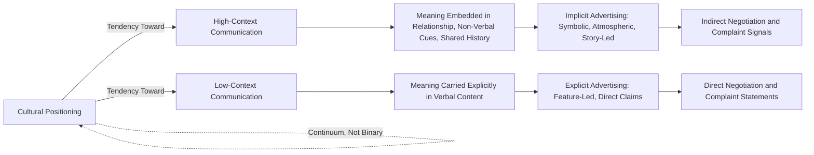

## High-Context versus Low-Context Communication

### Theoretical Foundation

The high-context/low-context communication framework was developed by anthropologist Edward T. Hall (1976) to describe systematic cultural differences in how meaning is encoded and transmitted in communication. The framework distinguishes cultures based on the degree to which meaning is carried by explicit verbal content versus implicit contextual, relational, and situational cues.

- **High-context communication**: meaning is conveyed substantially through context — shared history, relationships, non-verbal cues, tone, and situational understanding — with relatively less information carried explicitly in words themselves. Much of the message is "already in the person," requiring the receiver to actively infer meaning from context rather than relying solely on the literal content of the message
- **Low-context communication**: meaning is conveyed primarily through explicit, direct verbal content. Messages are expected to be self-contained, clear, and unambiguous, with minimal reliance on shared background context for correct interpretation

Hall proposed this as a continuum rather than a strict binary, with cultures positioned at varying points rather than falling cleanly into two discrete categories.

### Illustrative Cultural Positioning (with Important Caveats)

Hall's original and subsequent research commonly associates certain regions with tendencies toward higher or lower context communication:

- **Higher-context tendencies**: frequently associated with Japan, China, Korea, many Arab and Middle Eastern cultures, and numerous Latin American cultures
- **Lower-context tendencies**: frequently associated with the United States, Germany, Scandinavian countries, and Switzerland
- **Intermediate positioning**: frequently associated with the United Kingdom, France, and Italy, among others

**Key Points**

- These classifications describe **central tendencies observed in research**, not fixed or deterministic national traits; substantial within-country variation exists across region, generation, socioeconomic status, urban versus rural context, and individual communication style [Inference: applying a national classification to any specific individual or business counterpart risks stereotyping and should be treated as a probabilistic starting hypothesis rather than a reliable individual-level prediction]
- Context-orientation can vary by domain within the same culture — a society may exhibit high-context norms in interpersonal and family communication while exhibiting comparatively lower-context norms in certain formal business or legal documentation contexts
- The framework has faced academic critique regarding measurement rigor, since "context" itself is a less precisely operationalized construct compared to more recent, empirically validated dimensions such as those in Hofstede's or Schwartz's frameworks

### Communication Characteristics by Orientation

| Characteristic | High-Context | Low-Context |
| --- | --- | --- |
| Message explicitness | Implicit, relies on inference | Explicit, self-contained |
| Role of non-verbal cues | High reliance (tone, silence, gesture, facial expression) | Lower reliance, verbal content dominates |
| Directness of disagreement/refusal | Indirect, face-preserving, often communicated through hedging or silence | Direct, explicit statement of disagreement or refusal |
| Relationship vs. transaction focus | Relationship-building often precedes transactional content | Transactional content often precedes or substitutes for relationship-building |
| Contract and documentation reliance | Lower reliance on exhaustive written contracts; relationships and trust carry more weight | Higher reliance on detailed, exhaustive written agreements |
| Silence interpretation | Often meaningful and comfortable; may signal consideration or disagreement | Often perceived as awkward or a communication gap requiring resolution |

### Marketing and Advertising Implications

**Key Points**

- **Creative execution style**: high-context market advertising frequently favors symbolic imagery, mood, atmosphere, and implied meaning over explicit claims — the audience is expected to actively construct meaning from cues rather than receive it directly. Low-context market advertising frequently favors direct feature comparison, explicit claims, and clearly stated calls to action
- **Brand storytelling versus specification-led messaging**: narrative, emotionally evocative brand storytelling (connecting to narrative transportation theory) tends to be a more naturally compatible format for high-context markets, while low-context markets often show stronger receptiveness to direct comparative and specification-driven messaging, particularly for considered, functional purchases [Inference: this is a directional tendency documented in international marketing literature, not a rule that overrides category-specific or brand-specific creative strategy considerations]
- **Humor and indirect messaging**: high-context cultures often use and appreciate more indirect, layered humor requiring shared cultural or situational knowledge to interpret; direct translation of low-context humor (built on explicit wordplay or literal statements) frequently fails to transfer effectively
- **Endorsement and relationship signaling**: in high-context markets, the relationship and reputation of the endorser or spokesperson often carries more persuasive weight than the explicit content of their endorsement message, tying to the credibility mechanisms discussed in reference group and authority-based influence theory

### Negotiation, Sales, and Customer Service Implications

**Key Points**

- Sales and negotiation approaches effective in low-context settings — direct pitch of benefits, rapid movement to transactional terms, explicit closing techniques — can be perceived as premature, aggressive, or relationship-disrespecting in high-context settings, where relationship-building is often expected to precede substantive transactional discussion
- Customer complaint handling requires adaptation: direct, explicit dissatisfaction statements common in low-context service interactions may be replaced in high-context contexts with more indirect signals of dissatisfaction (e.g., reduced engagement, indirect language, third-party communication), requiring service design that can detect and respond to less explicit signals of customer concern
- Written contract and terms-of-service design may need to balance the explicit, exhaustive detail expected in low-context legal and commercial norms against the relationship-trust-oriented expectations in high-context commercial cultures, where excessive contractual detail can occasionally be perceived as signaling distrust rather than diligence [Inference: the specific balance point varies substantially by industry, transaction size, and specific market, and general framework guidance should not substitute for local legal and commercial expertise]

### Digital and Social Media Communication Considerations

- **User-generated content and review interpretation**: in high-context markets, online reviews may contain more indirect or hedged criticism, requiring more nuanced sentiment analysis approaches than keyword- or explicit-sentiment-based models calibrated on low-context language patterns [Inference: this affects the design and calibration of natural language processing and sentiment analysis tools intended for cross-market deployment, and off-the-shelf models trained primarily on low-context language data may underperform when applied without adaptation to high-context language patterns]
- **Visual-first platform performance**: platforms and content formats emphasizing visual, contextual, and atmosphere-driven communication (as opposed to text-heavy explicit content) may show differential engagement patterns across high- and low-context market audiences, though platform-specific and demographic factors also substantially influence this pattern
- **Community and forum communication norms**: brand community management approaches may need calibration, since direct confrontation of negative community sentiment (appropriate in some low-context contexts) may require a more indirect, face-preserving approach in high-context community management contexts

### Relationship to Other Cultural Frameworks

High-context/low-context communication style is conceptually related to, but distinct from, other cultural values dimensions:

- It correlates directionally with **collectivism** in Hofstede's framework (collectivist cultures often, though not universally, exhibit higher-context communication patterns, since shared group context is more readily available and relied upon), but the two constructs measure different things — one describes communication style, the other describes value orientation toward group versus individual — and the correlation is not perfect
- It has some conceptual overlap with **Uncertainty Avoidance**, since low-context cultures' preference for explicit, unambiguous communication can be viewed as a partial expression of discomfort with interpretive ambiguity, though this connection is more theoretically inferred than a formally established empirical relationship within Hall's original framework

### Practical Applications in Marketing

**Example**

A global consumer electronics brand adapting a single global product launch campaign across markets could apply this framework as follows:

- For a **higher-context market**, adapt the core creative to lead with atmospheric, lifestyle-oriented storytelling that implies rather than states the product's value proposition, allowing the specific product specification information to be available but secondary (e.g., accessible via a "learn more" layer rather than the primary creative message)
- For a **lower-context market**, adapt the same core creative to foreground explicit product specifications, direct comparative claims, and clear calls to action within the primary creative unit itself
- Adjust the **spokesperson and endorsement strategy** to weight relationship and reputational credibility more heavily in high-context market versions, while weighting explicit stated credentials and objective claims more heavily in low-context market versions
- Localize **customer service scripting and complaint-handling protocols** to detect and appropriately respond to more indirect dissatisfaction signals in high-context market service channels

### Measurement and Research Approaches

- **Content analysis of existing successful local advertising**: coding a market's own top-performing advertising for explicitness, symbolic density, and reliance on implied versus stated claims, providing an empirical, market-specific validation of context orientation rather than relying solely on Hall's original national classifications
- **Communication style surveys**: adapted instruments measuring individual or organizational preference for direct versus indirect communication, explicit versus implicit meaning-making, and comfort with ambiguity in professional and consumer contexts
- **Cross-cultural negotiation and service interaction studies**: observational and experimental research examining how negotiation outcomes and customer satisfaction vary when communication style is deliberately matched or mismatched to the counterpart's cultural context orientation

### Boundary Conditions and Limitations

**Key Points**

- The high/low-context distinction describes **general cultural tendencies observed in aggregate research**, not deterministic individual behavior; applying national classifications as a rigid script for individual business or consumer interactions risks both inaccuracy and stereotyping
- Globalization, international business exposure, and digital media consumption are associated with observed convergence in communication style among internationally-engaged and younger urban populations within traditionally high-context cultures, though traditional context-orientation patterns often persist in other segments of the same population [Inference: the extent and permanence of this convergence pattern is not fully established and likely varies by specific population segment, medium, and context]
- The framework provides directional guidance for creative and communication strategy but does not substitute for market-specific creative testing, since category norms, competitive context, and brand-specific positioning can override general cultural communication tendencies in specific execution decisions
- Bilingual and multicultural individuals frequently code-switch between higher- and lower-context communication styles depending on situational context and interlocutor, complicating any assumption of a single fixed communication style even at the individual level

### High-Context vs. Low-Context Communication Spectrum

### Communication Style Continuum (svg_diagram)

<svg xmlns="http://www.w3.org/2000/svg" viewBox="0 0 800 260">
<text x="400" y="26" text-anchor="middle" font-size="18" font-weight="bold" fill="#1a1a1a">Communication Style Continuum (svg_diagram)</text>
<rect x="60" y="100" width="680" height="50" rx="25" fill="url(#ctxgrad)" stroke="#333" stroke-width="1.5" />

<text x="120" y="90" text-anchor="middle" font-size="13" font-weight="bold" fill="`#1b5e20`">High-Context</text>

<text x="680" y="90" text-anchor="middle" font-size="13" font-weight="bold" fill="`#0d47a1`">Low-Context</text>

<circle cx="150" cy="125" r="7" fill="#1b5e20" />
<text x="150" y="175" text-anchor="middle" font-size="10" fill="#333">Japan, Korea</text>
<circle cx="320" cy="125" r="7" fill="#4a148c" />
<text x="320" y="175" text-anchor="middle" font-size="10" fill="#333">UK, France, Italy</text>
<circle cx="600" cy="125" r="7" fill="#0d47a1" />
<text x="600" y="175" text-anchor="middle" font-size="10" fill="#333">USA, Germany</text>

<text x="400" y="215" text-anchor="middle" font-size="11" font-style="italic" fill="#555">Positions are illustrative tendencies, not fixed classifications</text>

</svg>

### Next Steps

- **Related Topics**:
  - Cultural values frameworks (Hofstede, GLOBE, Schwartz)
  - Cross-cultural advertising creative adaptation strategy
  - Global brand standardization vs. localization
  - Narrative transportation and storytelling
  - Cross-cultural service design and complaint handling
  - Non-verbal communication in international marketing
  - Localization of natural language processing for sentiment analysis