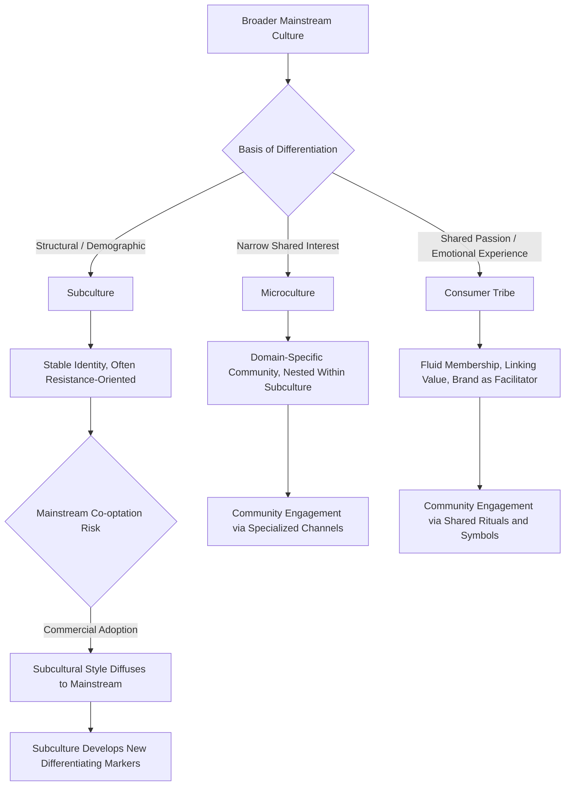

## Subcultures, Microcultures, and Consumer Tribes

### Definitions and Conceptual Distinctions

Subcultures, microcultures, and consumer tribes represent progressively more granular and fluid units of shared meaning and identity within a broader culture, each with distinct implications for marketing strategy.

- **Subculture**: a distinct segment of a larger culture whose members share a set of values, beliefs, and behavioral norms that differentiate them from the mainstream culture, typically organized around a relatively stable shared characteristic such as ethnicity, religion, age cohort, region, or a strongly held lifestyle affiliation
- **Microculture**: a smaller, more specific cultural grouping, often nested within a subculture, organized around a narrower and more specific shared interest, activity, or identity marker; the term emphasizes scale and specificity rather than a fundamentally different theoretical mechanism from subculture
- **Consumer tribe**: a concept developed primarily by Bernard Cova and colleagues, describing a network of consumers, often heterogeneous in traditional demographic terms, linked by a shared passion, emotional connection, or lifestyle practice rather than by traditional socio-demographic similarity; tribal membership is typically more fluid, self-selected, and identity-performative than traditional subcultural membership

### Theoretical Foundations: From Subculture to Tribe

**Classical subculture theory** (rooted in sociology, particularly the Birmingham School's work on youth subcultures) emphasized subcultures as relatively coherent, often resistant or oppositional groupings formed partly in response to structural social conditions (class, generational conflict, marginalization). This tradition treats subcultural style and consumption as a form of symbolic resistance or identity assertion against mainstream norms.

**Consumer tribe theory** (Cova and Cova, 2002) represents a postmodern reframing, emphasizing:

**Key Points**

- Tribal membership is driven by **shared emotional experience and passion** (a shared practice, interest, or aesthetic) rather than fixed demographic or structural social position, meaning a single individual may hold membership in multiple, sometimes contradictory, consumer tribes simultaneously
- Tribes are characterized by **linking value**: the social bonds and sense of connection generated by shared consumption experience often matter more to members than the functional utility of the product or service itself, meaning the product frequently serves as a totem or vehicle for social connection rather than being valued purely for its use function
- Tribal identity is more **fluid and performative** than classical subcultural identity, consistent with broader postmodern consumer culture theory emphasizing fragmented, situational, and multiple selfhood rather than a single coherent identity
- Brands can occupy an **active facilitating role** within tribal formation (providing shared symbols, spaces, and rituals) rather than being purely external objects consumed by a pre-existing group, distinguishing tribal marketing from simple subcultural targeting

### Comparative Table

| Dimension | Subculture | Microculture | Consumer Tribe |
| --- | --- | --- | --- |
| Basis of membership | Structural/demographic (ethnicity, religion, generation) or strong lifestyle affiliation | Narrow specific interest or activity, often nested within a subculture | Shared passion, emotional experience, or aesthetic practice |
| Stability of membership | Relatively stable, often tied to identity fundamentals | Moderate, tied to specific interest persistence | Fluid, situational, often multiple simultaneous memberships |
| Theoretical origin | Sociology (Birmingham School, structural theory) | Extension/refinement of subculture concept for scale | Postmodern consumer culture theory (Cova) |
| Relationship to mainstream culture | Often defined partly through contrast/resistance to mainstream | Typically less oppositional, more interest-specific | Not necessarily oppositional; can be entirely commercially embedded |
| Role of the brand/product | External object consumed by the group | External object consumed by the narrower group | Active facilitator of the social bond (linking value) |
| Marketing approach | Cultural sensitivity, targeted representation | Niche community engagement | Community facilitation, ritual and symbol co-creation |

### Subcultures of Consumption

Schouten and McAlexander's (1995) influential ethnographic study of Harley-Davidson owners introduced the concept of a **subculture of consumption**: a distinctive subgroup of society that self-selects on the basis of shared commitment to a particular product class, brand, or consumption activity, developing a hierarchical social structure, shared beliefs and values, unique jargon, and characteristic rituals and modes of symbolic expression.

**Key Points**

- Subcultures of consumption differ from traditional demographic subcultures in that membership is achieved through consumption commitment and practice rather than ascribed at birth or through fixed social category
- These subcultures typically exhibit an internal social hierarchy based on depth of commitment and demonstrated authenticity (e.g., long-term ownership, participation in community rituals, symbolic markers of investment), creating status differentiation within the group itself
- Brand community theory (Muniz and O'Guinn, discussed in the context of social identity theory) is closely related to and substantially overlaps with the subculture-of-consumption concept, though subcultures of consumption typically imply a more encompassing lifestyle identity than brand community membership alone

### Youth Subcultures and Style-Based Identity

Classical youth subculture research (punk, hip-hop, skateboarding, gaming, and numerous other style-based groupings) demonstrates a recurring pattern relevant to marketing:

**Key Points**

- Youth subcultures frequently originate with a strong element of **symbolic resistance** to mainstream commercial culture, developing distinctive stylistic markers (dress, music, language, aesthetic) partly to establish differentiation from mainstream, often commercially-driven, norms
- **Co-optation** (or "mainstreaming") is a well-documented recurring dynamic: as subcultural style gains visibility, commercial brands adopt and market subcultural aesthetics to a broader mainstream audience, which can trigger the original subculture to develop new differentiating markers to maintain distinction — a cyclical pattern sometimes discussed in relation to Fred Davis's and Georg Simmel's earlier work on fashion diffusion and status distinction-seeking
- Marketing that engages a subculture too overtly or commercially can trigger authenticity concerns among core subcultural members, who may perceive commercial co-optation as diluting or exploiting the subculture's original meaning; this risk is a central strategic tension for brands seeking to engage subcultural communities

### Marketing Applications: Distinguishing Targeting Approaches

**Example**

A specialty coffee brand could apply these concepts differently depending on the target grouping:

- **Subculture targeting** (e.g., a specific regional or heritage-based coffee-drinking tradition): requires deep cultural competence, accurate representation, and long-term community relationship-building given the demographic and identity-rooted nature of subcultural belonging
- **Microculture targeting** (e.g., specialty pour-over brewing enthusiasts): requires domain-specific technical credibility and engagement through specialized channels (dedicated forums, technique-focused content) relevant to the narrower shared interest
- **Tribal marketing** (e.g., a broader "slow living" or "third wave coffee ritual" community that cuts across traditional demographics): requires facilitating shared rituals and symbolic spaces (a distinctive café aesthetic, community events, shareable ritual objects) that generate linking value among members who may otherwise have little in common demographically

### Digital and Online Community Formation

**Key Points**

- Online platforms have substantially accelerated tribal formation by removing geographic constraints on shared-interest community formation, enabling niche microcultures and tribes to achieve critical mass that would be impossible within a single physical locality
- Algorithmic content curation on social platforms can both facilitate tribal discovery (connecting individuals with shared niche interests they might not encounter offline) and, in some documented cases, contribute to more insular or polarized community formation, an area of ongoing research and platform design concern [Inference: the net effect of algorithmic curation on tribal community health and inclusivity versus insularity is actively studied and contested, and specific outcomes vary by platform design and community context]
- Digital tribal markers (shared hashtags, meme formats, platform-specific jargon, visual aesthetic conventions) function analogously to the physical stylistic markers of classical subcultures, serving both in-group signaling and out-group differentiation functions

### Measurement and Research Approaches

- **Ethnographic and netnographic methods**: Robert Kozinets' netnography methodology adapts traditional ethnographic fieldwork techniques to online community contexts, allowing researchers to study tribal and subcultural dynamics as they naturally occur in digital community spaces
- **Social network analysis**: mapping community structure, influence patterns, and boundary definition within online tribal and subcultural communities to identify core members, peripheral participants, and community structure
- **Symbolic and linguistic analysis**: coding community-specific jargon, ritual practices, and symbolic markers as indicators of subcultural or tribal coherence and boundary-maintenance
- **Depth interviews and participant observation**: given the identity-central and often emotionally significant nature of subcultural and tribal membership, qualitative depth methods are frequently favored over purely quantitative survey approaches to capture the meaning-making processes involved

### Boundary Conditions and Limitations

**Key Points**

- Overly commercial or inauthentic engagement with a subculture or tribe risks significant backlash, since these communities often place high value on authenticity and organic, non-commercially-driven origin; perceived exploitation can generate active resistance and reputational damage rather than the intended positive engagement
- Not all shared-interest groupings meet the theoretical criteria for subculture, microculture, or tribe status; the frameworks require genuine shared identity, values, and social bonding, which is distinct from a simple market segment defined by shared purchase behavior without accompanying identity or community dimension
- Tribal and subcultural boundaries are frequently contested from within the community itself (debates over "authentic" versus "poser" membership), meaning marketers should expect internal community heterogeneity and disagreement rather than treating any subculture or tribe as a fully homogeneous target
- The fluid, multiple-membership nature of tribal identity (as opposed to classical subcultural identity) means individuals may move in and out of tribal engagement situationally, complicating simple segment-based targeting approaches that assume stable, exclusive group membership

### Subculture-to-Tribe Formation Pathway

### Subculture vs. Tribe Membership Structure (svg_diagram)

<svg xmlns="http://www.w3.org/2000/svg" viewBox="0 0 780 340">
<text x="390" y="26" text-anchor="middle" font-size="18" font-weight="bold" fill="#1a1a1a">Subculture vs. Tribe Membership Structure (svg_diagram)</text>

<text x="190" y="60" text-anchor="middle" font-size="13" font-weight="bold" fill="`#1565c0`">Subculture (Stable)</text>

<circle cx="190" cy="180" r="90" fill="`#e3f2fd`" stroke="`#1565c0`" stroke-width="2" />

<circle cx="150" cy="150" r="10" fill="`#0d47a1`" />

<circle cx="220" cy="140" r="10" fill="`#0d47a1`" />

<circle cx="240" cy="200" r="10" fill="`#0d47a1`" />

<circle cx="160" cy="220" r="10" fill="`#0d47a1`" />

<text x="190" y="290" text-anchor="middle" font-size="10" fill="#333">Fixed membership, single identity anchor</text>

<text x="590" y="60" text-anchor="middle" font-size="13" font-weight="bold" fill="`#e65100`">Consumer Tribe (Fluid)</text>

<circle cx="590" cy="180" r="90" fill="`#fff3e0`" stroke="`#ef6c00`" stroke-width="2" stroke-dasharray="6,4" />

<circle cx="540" cy="140" r="10" fill="`#e65100`" />

<circle cx="630" cy="130" r="10" fill="`#e65100`" />

<circle cx="650" cy="210" r="10" fill="`#e65100`" />

<circle cx="550" cy="230" r="10" fill="`#e65100`" />

<line x1="540" y1="140" x2="480" y2="100" stroke="`#e65100`" stroke-width="1" stroke-dasharray="3,2" />

<line x1="650" y1="210" x2="710" y2="250" stroke="`#e65100`" stroke-width="1" stroke-dasharray="3,2" />

<text x="590" y="290" text-anchor="middle" font-size="10" fill="#333">Overlapping, situational, multiple memberships</text>

</svg>

### Next Steps

- **Related Topics**:
  - Brand communities and subcultures of consumption
  - Social identity theory and in-group consumption
  - Netnography and digital ethnographic research methods
  - Youth culture co-optation and authenticity in brand marketing
  - Cultural values frameworks in cross-cultural segmentation
  - Postmodern consumer culture theory
  - Ritual and symbolic consumption in community formation