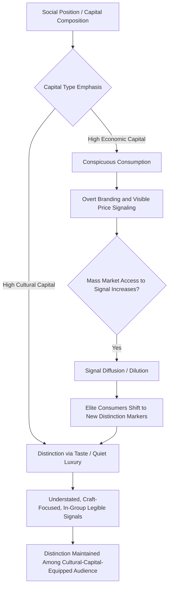

## Social Class and Status Consumption

### Definition and Theoretical Foundation

Social class refers to a relatively stable hierarchical division within a society, based on a combination of economic resources, occupational prestige, education, and cultural capital, that shapes shared values, lifestyles, and consumption patterns among its members. Status consumption refers specifically to the purchase and display of goods and services motivated primarily by their capacity to signal social position, prestige, or distinction to others, rather than by their functional utility alone.

While social class is often treated in economics primarily as an income-based stratification, consumer behavior research draws heavily on sociological traditions (particularly Weber, Bourdieu, and Veblen) that treat class as a multidimensional construct encompassing economic capital, but also social and cultural capital, each with distinct consumption implications.

### Veblen and Conspicuous Consumption

Thorstein Veblen's foundational work (*The Theory of the Leisure Class*, 1899) introduced the concept of **conspicuous consumption**: the acquisition and visible display of goods explicitly to demonstrate wealth and social status to others, rather than for the goods' functional use value.

**Key Points**

- Veblen also introduced **conspicuous leisure**: the visible demonstration of freedom from productive labor as a status marker, historically associated with elite classes who could afford to display non-productive time use
- A defining feature of Veblen goods (a term derived from this theory) is that demand can counterintuitively increase as price increases, since higher price itself functions as a status signal rather than purely a cost to be minimized — this stands in direct contrast to standard demand theory for conventional goods
- Veblen's framework has been extensively applied to luxury goods marketing, where scarcity, high price positioning, and exclusivity are deliberately maintained as core elements of the value proposition rather than treated as constraints to be minimized

### Bourdieu's Theory of Capital and Distinction

Pierre Bourdieu's sociological framework (*Distinction*, 1979) substantially extended class-based consumption theory by identifying multiple forms of capital that jointly determine social position and consumption taste:

**Key Points**

- **Economic capital**: financial and material resources, the most straightforward and traditionally measured dimension of class
- **Cultural capital**: education, knowledge, taste, and cultural competencies that are recognized and valued within a given social field; can be embodied (dispositions and tastes acquired over time), objectified (cultural goods such as art or books), or institutionalized (formal credentials)
- **Social capital**: the network of relationships and group memberships an individual can mobilize for advantage
- **Habitus**: a durable, largely unconscious system of dispositions, taste, and perception acquired through socialization within one's class position, which generates seemingly "natural" preferences that are, in Bourdieu's framework, substantially shaped by class-based upbringing and education rather than being purely individual or innate
- **Distinction**: the process by which taste and consumption choices function to differentiate one's social position from other classes, often through subtle markers of cultivated taste rather than overt display, particularly among higher cultural-capital groups

Bourdieu's framework is particularly influential in explaining why consumption taste is not simply a function of income: individuals with high cultural capital but comparatively modest economic capital (e.g., some academics, artists) often display consumption patterns and taste markers distinct from those with high economic capital but lower cultural capital, even at similar income levels.

### Traditional Social Class Segmentation Models

Classical marketing segmentation models (e.g., the historically influential Warner and Coleman social class frameworks used in mid-20th century American marketing research) typically identified multiple class tiers (variously labeled upper-upper, lower-upper, upper-middle, lower-middle, upper-lower, lower-lower, or similar gradations) based on combined measures of occupation, education, income, and residential area.

**Key Points**

- These classical segmentation frameworks have faced substantial critique for their historical basis in specific national (often American) social structures at a particular historical period, limiting their direct cross-cultural or contemporary applicability without significant adaptation [Inference: while the underlying logic of multi-tiered class segmentation remains conceptually useful, the specific tier definitions and criteria from mid-20th-century frameworks require substantial updating to reflect contemporary economic structures, occupational categories, and social mobility patterns]
- Contemporary approaches increasingly favor multidimensional socioeconomic status (SES) measures combining income, education, and occupational prestige, often supplemented with Bourdieu-influenced cultural capital indicators, rather than relying on a single classical class-tier model
- Class-based consumption research increasingly emphasizes that **class boundaries have become more permeable and less predictive of specific consumption patterns** in many contemporary markets compared to mid-20th-century assumptions, given increased social mobility, changing occupational structures, and the influence of the trends discussed below

### Status Consumption Motivations

**Key Points**

- Status consumption is theoretically distinguished from mere conspicuous consumption by its motivational specificity: it is defined by the consumer's underlying **desire to enhance social standing through visible consumption**, whereas conspicuous consumption describes the visible display behavior itself, which may or may not be driven primarily by status motivation in every instance
- Individual differences in status consumption motivation have been measured through validated scales (e.g., Eastman, Goldsmith, and Flynn's Status Consumption Scale), which treat status motivation as a relatively stable individual trait that predicts consumption behavior across categories, independent of objective social class position
- Status consumption motivation correlates with, but is conceptually distinct from, related constructs including materialism (valuing possessions generally) and susceptibility to normative interpersonal influence (discussed in the context of reference group theory), though these constructs frequently co-occur and interact

### Parody Display and Inconspicuous Consumption

More recent research has documented a countervailing trend among some higher-status and higher-cultural-capital consumers toward **inconspicuous consumption** or "quiet luxury": deliberately understated, logo-minimal consumption that signals status specifically to those with sufficient cultural capital and category knowledge to recognize subtle quality and craftsmanship markers, while remaining illegible as a status signal to the broader mass market.

**Key Points**

- This pattern is theoretically explained through Bourdieu's distinction framework: as overt luxury branding becomes accessible to a broader market (through counterfeit availability, diffusion lines, or genuine broader affluence), the highest-status consumers seek new, less easily replicated distinction markers, shifting toward signals legible primarily to an in-group with the cultural capital to decode them
- This dynamic parallels the mainstreaming/co-optation cycle discussed in subculture theory: status signals diffuse toward the mainstream over time, prompting elite redefinition of what constitutes a genuine distinction marker
- Research on this trend (sometimes discussed under terms including "parody display" or "countersignaling") suggests status signaling strategy is not static but responds dynamically to the changing accessibility and legibility of existing status markers [Inference: the precise conditions under which conspicuous versus inconspicuous consumption strategies dominate within a given market segment are actively researched and likely depend on category-specific counterfeit prevalence, market maturity, and cultural context]

### Comparative Table: Status Signaling Strategies

| Strategy | Mechanism | Target Audience for Signal | Risk |
| --- | --- | --- | --- |
| Conspicuous consumption (Veblen) | Overt display of high-price, visibly branded goods | Broad, including those without category expertise | Diffusion/dilution as broader market gains access |
| Parody display / quiet luxury | Understated, logo-minimal but high-craft consumption | Narrow, cultural-capital-equipped in-group | Requires audience with specific decoding knowledge; less broadly legible |
| Countersignaling | Deliberately avoiding obvious status markers to signal confidence in one's status | Sophisticated observers who recognize the signal-avoidance itself as a signal | Can be misread by audiences unfamiliar with the signaling convention |
| Aspirational/accessible luxury | Entry-level luxury products (e.g., diffusion lines, accessible price points within a luxury brand) | Aspiring consumers seeking partial status affiliation | Can dilute the parent brand's exclusivity perception among core luxury consumers |

### Practical Applications in Marketing

**Example**

A luxury accessories brand deciding on product line strategy could apply this framework as follows:

- Maintain a **flagship, highly conspicuous line** with clear branding for markets and segments where overt status signaling remains the dominant consumption motivation, consistent with Veblen-goods pricing dynamics
- Develop a **quiet luxury line** with minimal external branding but superior material quality and craftsmanship detail, targeting a cultural-capital-rich segment seeking distinction from the broader luxury-consuming market, consistent with Bourdieu's distinction dynamics
- Calibrate **accessible/diffusion line strategy** carefully, recognizing the tension between revenue expansion through broader accessibility and potential dilution of exclusivity perception among the brand's highest-status core consumers
- Use **Status Consumption Scale-informed segmentation** to identify which specific customer segments are most motivated by status signaling versus other purchase motivations (craftsmanship appreciation, personal aesthetic preference), allowing differentiated messaging across segments

### Measurement Approaches

- **Status Consumption Scale (Eastman, Goldsmith, and Flynn)**: a validated multi-item self-report scale measuring individual status consumption motivation, widely used in consumer behavior research to predict luxury and status-signaling purchase behavior
- **Socioeconomic status composite measures**: combining income, education, and occupational prestige indicators, often supplemented with cultural capital proxies (cultural participation, aesthetic knowledge indicators) for a more Bourdieu-consistent multidimensional class measure than income alone
- **Brand logo prominence and price-demand curve analysis**: empirical testing of Veblen-good demand patterns by observing purchase behavior across varying price points and branding prominence levels within a category
- **Qualitative and ethnographic research on taste and distinction**: in-depth interviews and observational research examining how consumers describe and justify their consumption choices, often revealing implicit class-based distinction processes that are not consciously articulated by respondents in direct self-report

### Boundary Conditions and Limitations

**Key Points**

- Status consumption motivation and effects vary substantially by product category, being strongest for publicly visible, symbolically-loaded categories and much weaker for privately consumed or low-symbolic-value categories, consistent with the conspicuousness dimension previously discussed in the Park-Lessig reference group framework
- Cross-cultural variation in the specific expression and social acceptability of overt status signaling is substantial; norms around appropriate conspicuous consumption differ across cultures with different collectivism/individualism orientations and different historical relationships to class visibility [Inference: while status consumption motivation appears to be a broadly cross-culturally observed phenomenon, its specific behavioral expression and social sanctioning vary by cultural context and should not be assumed uniform]
- Social class and status consumption research must account for generational and cohort effects, since younger cohorts in some markets show documented shifts toward experiential consumption and quiet-luxury preferences relative to older cohort patterns, though the durability and universality of these generational shifts remains an active area of study [Inference: generational shifts in status consumption preference are documented directionally in various studies but effect sizes and persistence over the life course are not yet fully established]
- Overreliance on income alone as a proxy for social class consumption behavior risks missing substantial variation explained by cultural capital and habitus factors, per Bourdieu's critique of purely economic class measures

### Status Consumption Signaling Dynamics

### Bourdieu's Capital Framework (svg_diagram)

<svg xmlns="http://www.w3.org/2000/svg" viewBox="0 0 780 340">
<text x="390" y="26" text-anchor="middle" font-size="18" font-weight="bold" fill="#1a1a1a">Bourdieu's Capital Framework (svg_diagram)</text>
<circle cx="390" cy="190" r="60" fill="#37474f" />
<text x="390" y="186" text-anchor="middle" font-size="12" fill="#fff" font-weight="bold">Habitus /</text>
<text x="390" y="202" text-anchor="middle" font-size="12" fill="#fff" font-weight="bold">Taste</text>
<circle cx="220" cy="120" r="70" fill="#e3f2fd" stroke="#1565c0" stroke-width="1.5" />
<text x="220" y="116" text-anchor="middle" font-size="12" fill="#0d47a1" font-weight="bold">Economic</text>
<text x="220" y="132" text-anchor="middle" font-size="12" fill="#0d47a1" font-weight="bold">Capital</text>
<circle cx="560" cy="120" r="70" fill="#fff3e0" stroke="#ef6c00" stroke-width="1.5" />
<text x="560" y="116" text-anchor="middle" font-size="12" fill="#e65100" font-weight="bold">Cultural</text>
<text x="560" y="132" text-anchor="middle" font-size="12" fill="#e65100" font-weight="bold">Capital</text>
<circle cx="390" cy="290" r="70" fill="#e8f5e9" stroke="#2e7d32" stroke-width="1.5" />
<text x="390" y="286" text-anchor="middle" font-size="12" fill="#1b5e20" font-weight="bold">Social</text>
<text x="390" y="302" text-anchor="middle" font-size="12" fill="#1b5e20" font-weight="bold">Capital</text>
<line x1="280" y1="150" x2="340" y2="175" stroke="#333" stroke-width="1.5" />
<line x1="500" y1="150" x2="440" y2="175" stroke="#333" stroke-width="1.5" />
<line x1="390" y1="250" x2="390" y2="230" stroke="#333" stroke-width="1.5" />
</svg>

### Next Steps

- **Related Topics**:
  - Veblen goods and luxury pricing strategy
  - Bourdieu's theory of distinction and cultural capital
  - Subcultures of consumption and brand community
  - Reference groups and normative influence
  - Materialism and possession-based identity
  - Quiet luxury and countersignaling in contemporary branding
  - Generational cohort shifts in status consumption behavior